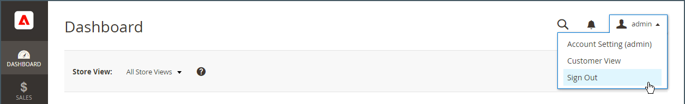
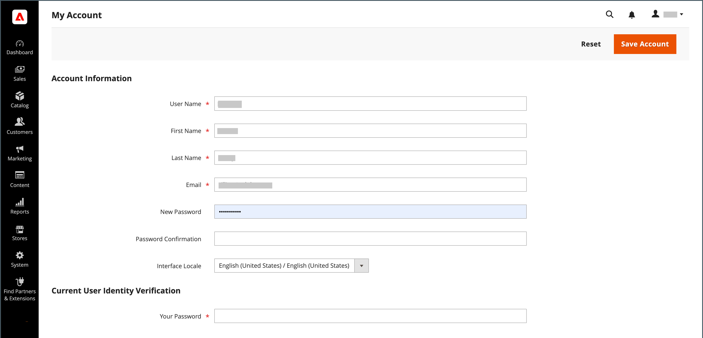
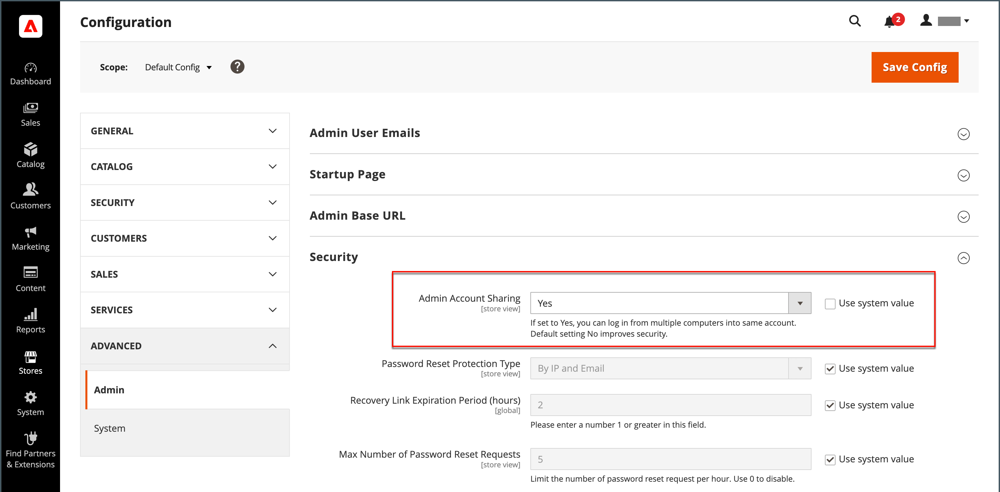

# 管理者アカウント

プライマリ管理者アカウントは、インストール時に最初に設定されたもので、初期プレースホルダー情報やサンプルデータ情報が含まれている場合があります。 このアカウントの所有者は、ユーザー名とパスワードをパーソナライズし、姓、名、およびメールアドレスをいつでも更新できます。 このアカウントは、デフォルトですべての権限を持つ _スーパーユーザー_ であり、通常はビジネスに必要な管理者ユーザーアカウントを作成します。

- ユーザーの追加または編集については、[&#x200B; ユーザーの作成 &#x200B;](../systems/permissions-users-all.md#create-a-user) を参照してください。

- 管理者およびユーザーの役割について詳しくは、[&#x200B; 権限 &#x200B;](../systems/permissions.md) および [&#x200B; ユーザーの役割 &#x200B;](../systems/permissions-user-roles.md) を参照してください。

{{ims-admin-note}}

## 管理者によるログイン

[!DNL Commerce]_管理者_ は、店舗、注文、顧客データへの不正アクセスを防ぐための複数のセキュリティ対策レイヤーで保護されています。 _管理者_ に初めてログインするときは、ユーザー名とパスワードを入力し、[&#x200B; 二要素認証 &#x200B;](../systems/security-two-factor-authentication.md) （2FA）を設定する必要があります。

ストアの設定によっては、一連のキーボード文字の入力、パズルの解決、共通のテーマを持つ一連の画像のクリックなど、解決すべき [CAPTCHA](../systems/security-google-recaptcha.md) 課題が生じる場合があります。 これらのテストは、自動ボットではなく、人間として識別されるように設計されています。

セキュリティを強化するために、各ユーザーがアクセスできる _権限_ を持つ [&#x200B; 管理者 &#x200B;](../systems/permissions.md) 部分を決定したり、[&#x200B; ログイン試行 &#x200B;](../configuration-reference/advanced/admin.md) 数を制限したりできます。 デフォルトでは、6 回試行するとアカウントがロックされるので、ユーザーは数分待ってから再試行する必要があります。 [&#x200B; ロックされたアカウント &#x200B;](../systems/permissions-users-all.md#locked-users) は、_管理者_ からもリセットできます。

>[!NOTE]
>
>_管理者_ に初めてログインすると、_管理者の使用状況データ収集を許可_ するように求められます。 詳しくは、[&#x200B; 使用状況データの収集 &#x200B;](admin.md#usage-data-collection) を参照してください。

{width="400"}

### 手順 1：二要素認証の設定

ストアの _管理者_ にログインする前に、2 要素認証ソリューションを設定し、使用できる状態にしておく必要があります。 各ソリューションで使用される認証プロセスについて詳しくは、[&#x200B; 二要素認証の使用 &#x200B;](../systems/security-two-factor-authentication-use.md) を参照してください。 デフォルトで、[!DNL Commerce] は、[Google Authenticator](https://play.google.com/store/apps/details?id=com.google.android.apps.authenticator2&hl=en_US) をサポートします。

ストアでサポートされている 2FA ソリューションを [!DNL Commerce] システム管理者に問い合わせてください。 次に、プロバイダーの指示に従って、お好みの 2FA ソリューションの設定を完了します。

### 手順 2：管理者にログインする

1. _のインストール時に指定した_ 管理者 [!DNL Commerce] URL を入力します。

   デフォルトの _管理者_ URL は `https://www.yourdomain.com/your-custom-admin-domain` のようになります。

   >[!NOTE]
   >
   >このドキュメントでは、ほとんどの例でベース URL として `admin` を使用していますが、ストアの [&#x200B; 管理者 &#x200B;](../stores-purchase/store-urls.md) に対して、一意で推測しにくい _カスタム URL_ を選択することをお勧めします。

   ページのブックマークを追加したり、デスクトップにショートカットを保存して簡単にアクセスしたりできます。

1. _Admin_ **[!UICONTROL Username]** と **[!UICONTROL Password]** を入力します。

1. （オプション）ストアで CAPTCHA が有効になっている場合は、画面の指示に従って課題を解決します。

   詳しくは、[CAPTCHA](../systems/security-captcha.md) および [reCAPTCHA](../systems/security-google-recaptcha.md) を参照してください。

1. 「**[!UICONTROL Sign in]**」をクリックします。

   アカウントから _管理者_ に初めてログインした場合は、設定手順へのリンクが記載されたメールが届きます。

### 手順 3:2FA 設定の完了

次の例は、_管理者_ アカウントをGoogle Authenticator とペアにする方法を示しています。

1. QR コードが表示されたら、次のいずれかの方法を使用してコードを取得し、Google Authenticator と _Admin_ アカウントをペアにします。

   {width="400"}

   - スマートフォンでの QR コード取得

     スマートフォンで、Google Authenticator を起動します。 アプリの右上隅にある _プラス記号_ （+）をタップします。 次に、画面の下部にある **[!UICONTROL Scan Barcode]** をタップして、QR コードの写真を撮ります。

   - ブラウザーから QR コードを取得

     Google Authenticator がブラウザーに拡張機能としてインストールされている場合は、ツールバーの **Authenticator** アイコンをクリックしてページをキャプチャします。

   - QR コードを手動で入力

     QR コードの下のテキスト文字列をコピーします。 スマートフォンまたはブラウザーでGoogle Authenticator を起動し、プラス記号（+）をクリックします。 次に、「**[!UICONTROL Manual Entry]**」を選択します。 「**[!UICONTROL Account]**」の下に、_管理者_ アカウントに関連付けられているメールアドレスを入力し、QR コード文字列を「**[!UICONTROL Key]**」フィールドに貼り付けます。

1. 二要素認証を使用して _Admin_ にログインするには、Google Authenticator で生成された 6 桁のコードを「**[!UICONTROL Authenticator code]**」フィールドに入力し、「**[!UICONTROL Confirm]**」をクリックします。

   {width="400"}

## パスワードをリセット

アカウントに割り当てられた最後の 4 つのパスワードの再利用は許可されていません。

1. **[!UICONTROL Email Address]** Admin _アカウントに関連付けられている_ を入力します。

   {width="400"}

1. 「**[!UICONTROL Retrieve Password]**」をクリックします。

   アカウントがメールアドレスに関連付けられている場合、パスワードをリセットするためのメールが送信されます。

   >[!NOTE]
   >
   >_Admin_ パスワードは 7 文字以上で、文字と数字の両方を含める必要があります。 パスワードオプションについて詳しくは、[&#x200B; 管理者 _セキュリティの設定_ を参照してください &#x200B;](../systems/security-admin.md)。

## 管理者からサインアウト

1. 右上隅にある「_アカウント_ （）」アイコンをクリックします。

1. 「**[!UICONTROL Sign Out]**」をクリックします。

   {width="700" zoomable="yes"}

_[!UICONTROL Sign In]_&#x200B;ページには、ログアウト済みのメッセージが表示されます。 コンピューターを無人のままにするときは、常に_ Admin _からサインアウトします。

## アカウント情報の編集

1. _アカウント_ （）アイコンをクリックします。

1. 「**[!UICONTROL Account Setting]**」をクリックします。

   {width="700" zoomable="yes"}

1. アカウント情報に必要な変更を加えます。

   ログイン資格情報を変更する場合は、必ず安全な場所に保存してください。

1. 現在のアカウントのパスワードを入力します。

1. 「**[!UICONTROL Save Account]**」をクリックします。

## 複数の管理者ログインを許可

管理者は、注文、顧客、製品、配送、支払いの各機能を管理するためのアクセス権を提供します。 デフォルトの設定では、セキュリティのベストプラクティスとして、管理者ユーザーアカウントに対して複数のログインを許可しないように設定されています。 ただし、この設定を変更して、管理者ユーザーが複数のデバイスからログインして、ビジネスワークフローに対応できるようにすることができます。

1. _管理者_ サイドバーで、**[!UICONTROL Stores]**/_[!UICONTROL Settings]_/**[!UICONTROL Configuration]**&#x200B;に移動します。

1. 左側のナビゲーションパネルで **[!UICONTROL Advanced]** を展開し、「**[!UICONTROL Admin]**」を選択します。

1. 「」を展開し、「**[!UICONTROL Security]**」セクションを展開します。

1. **管理者アカウントの共有** については、「`Yes`」を選択します。

   {width="700" zoomable="yes"}

1. 「**[!UICONTROL Save Config]**」をクリックします。

## 管理者ユーザーのログイン名で大文字と小文字を区別するように設定

1. _管理者_ サイドバーで、**[!UICONTROL Stores]**/_[!UICONTROL Settings]_/**[!UICONTROL Configuration]**&#x200B;に移動します。

1. 左側のナビゲーションパネルで **[!UICONTROL Advanced]** を展開し、「**[!UICONTROL Admin]**」を選択します。

1. 「」を展開し、「**[!UICONTROL Security]**」セクションを展開します。

1. **[!UICONTROL Login is Case Sensitive]** フィールドを `Yes` に設定します。

1. 「**[!UICONTROL Save Config]**」をクリックします。

## 管理者への安全なアクセスの維持

管理者のセキュリティを確保するために、管理者アクセス権を持つユーザーおよび役割を定期的に監査します。

さらに、[&#x200B; 管理ベース URL 設定の更新 &#x200B;](https://experienceleague.adobe.com/ja/docs/commerce-admin/config/advanced/admin#admin-base-url) を検討して、デフォルトの `/admin` エンドポイントをカスタムパスに変更します。 カスタムパスを設定すると、次のようなセキュリティ上の利点があります。

**セキュリティの強化**：デフォルトの「管理者」パスは広く知られており、ブルートフォース攻撃を試みる悪意のあるアクターによってターゲットにされることがよくあります。 一意のカスタム値に変更することで、未承認のアクセス試行のリスクを大幅に軽減できます。

**脆弱性の軽減**：自動ボットは、「管理者」などの一般的なパスを頻繁にスキャンして、脆弱性を悪用します。 カスタムパスを使用すると、これらのボットが管理者ログインページを見つけるのが難しくなり、攻撃の可能性が低くなります。

**プライバシーの向上**：カスタム管理パスを使用すると、隠ぺいのレイヤーが追加され、潜在的な攻撃者が管理者のログインページを特定してターゲットにするのが難しくなります。

**ベストプラクティスへの準拠**：管理パスのカスタマイズなどのセキュリティのベストプラクティスに従うと、e コマースサイトと顧客データを保護するためのプロアクティブなアプローチが示されます。

>[!NOTE]
>
>違反が疑われる場合は、不明なすべての管理者ユーザーを削除し、すべての管理者パスワードをリセットして、[&#x200B; セキュリティアクションプラン &#x200B;](https://experienceleague.adobe.com/ja/docs/commerce-admin/systems/security/security) を確認して、さらに手順を進めてください。
