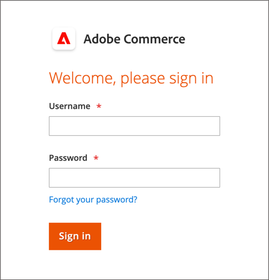
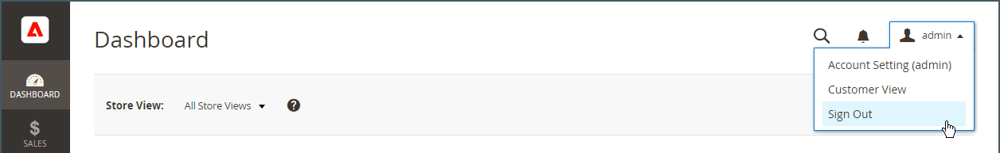

# 管理者アカウント

プライマリ管理者アカウントは、インストール中に最初に設定され、初期プレースホルダー情報やサンプルデータ情報が含まれる場合があります。 このアカウントの指定された所有者は、ユーザー名とパスワードをパーソナライズし、名前、姓、電子メールアドレスをいつでも更新できます。 このアカウントは、デフォルトですべての権限を持つ&#x200B;_スーパーユーザー_&#x200B;で、通常、ビジネスに必要な管理者ユーザーアカウントを作成します。

- ユーザーの追加または編集について詳しくは、[ ユーザーの作成](../systems/permissions-users-all.md#create-a-user)を参照してください。

- 管理者とユーザーの役割について詳しくは、[権限](../systems/permissions.md)および[ ユーザーの役割](../systems/permissions-user-roles.md)を参照してください。

{{ims-admin-note}}

## 管理者ログイン

[!DNL Commerce] _管理者_&#x200B;は、ストア、注文、顧客データへの不正アクセスを防ぐために、複数のレイヤーのセキュリティ対策によって保護されています。 _管理者_&#x200B;に初めてログインする場合は、ユーザー名とパスワードを入力し、[二段階認証](../systems/security-two-factor-authentication.md) （2FA）を設定する必要があります。

ストアの構成によっては、一連のキーボード文字の入力、パズルの解決、共通のテーマを持つ一連の画像のクリックなど、[CAPTCHA](../systems/security-google-recaptcha.md)の課題を解決する場合があります。 これらのテストは、自動化されたボットではなく、人間であることを識別するように設計されています。

セキュリティを強化するために、各ユーザーが[権限](../systems/permissions.md)を持つ&#x200B;_管理者_&#x200B;のどの部分にアクセス権があるかを判断できます。また、[ ログイン試行回数](../configuration-reference/advanced/admin.md)を制限することもできます。 デフォルトでは、6回試行するとアカウントがロックされ、ユーザーは数分待ってから再試行する必要があります。 [ ロックされたアカウント ](../systems/permissions-users-all.md#locked-users)は、_管理者_&#x200B;からもリセットできます。

>[!NOTE]
>
>_管理者_&#x200B;に初めてログインすると、_管理者使用状況データの収集を許可_&#x200B;するように求められます。 詳しくは、[使用状況データ収集](admin.md#usage-data-collection)を参照してください。

{width="400"}

### 手順1：二段階認証の設定

ストアの&#x200B;_管理者_&#x200B;にログインするには、2要素認証ソリューションを設定して使用する準備が整っている必要があります。 各ソリューションで使用される認証プロセスについて詳しくは、[2要素認証の使用](../systems/security-two-factor-authentication-use.md)を参照してください。 デフォルトでは、[!DNL Commerce]は[Google Authenticator](https://play.google.com/store/apps/details?id=com.google.android.apps.authenticator2&hl=en_US)をサポートしています。

ストアでサポートされている2FA ソリューションを[!DNL Commerce] システム管理者に確認します。 次に、プロバイダーの指示に従って、希望する2FA ソリューションのセットアップを完了します。

### 手順2：管理者にログインする

1. [!DNL Commerce]のインストール中に指定された&#x200B;_管理者_ URLを入力します。

   デフォルトの&#x200B;_管理者_ URLは`https://www.yourdomain.com/your-custom-admin-domain`のようです。

   >[!NOTE]
   >
   >このドキュメントでは、ほとんどの例でベース URLとして`admin`を使用していますが、ストアの&#x200B;_管理者_&#x200B;に対して、一意で推測が困難な[ カスタム URL](../stores-purchase/store-urls.md)を選択することをお勧めします。

   ページのブックマークを追加したり、デスクトップにショートカットを保存したりして、簡単にアクセスできます。

1. _管理者_ **[!UICONTROL Username]**&#x200B;と&#x200B;**[!UICONTROL Password]**&#x200B;を入力します。

1. （オプション）ストアでCAPTCHAが有効になっている場合は、画面の指示に従って課題を解決します。

   詳しくは、[CAPTCHA](../systems/security-captcha.md)および[reCAPTCHA](../systems/security-google-recaptcha.md)を参照してください。

1. **[!UICONTROL Sign in]**&#x200B;をクリックします。

   アカウントから&#x200B;_Admin_&#x200B;に初めてログインした場合は、設定手順へのリンクが記載されたメールが届きます。

### 手順3:2FA設定を完了する

次の例は、_Admin_ アカウントをGoogle Authenticatorとペアリングする方法を示しています。

1. QR コードが表示されたら、次のいずれかの方法を使用してコードをキャプチャし、Google Authenticatorを&#x200B;_管理者_ アカウントとペアリングします。

   {width="400"}

   - スマートフォンでQR コードをキャプチャする

     スマートフォンでGoogle Authenticatorを起動します。 アプリの右上隅にある&#x200B;_プラス記号_ （+）をタップします。 次に、画面下部の「**[!UICONTROL Scan Barcode]**」をタップして、QR コードの写真を撮影します。

   - ブラウザーからQR コードをキャプチャ

     Google Authenticatorがブラウザーの拡張機能としてインストールされている場合は、ツールバーの&#x200B;**Authenticator** アイコンをクリックしてページをキャプチャします。

   - QR コードを手動で入力

     QR コードの下のテキストの文字列をコピーします。 スマートフォンまたはブラウザーでGoogle Authenticatorを起動し、プラス記号（+）をクリックします。 次に、**[!UICONTROL Manual Entry]**&#x200B;を選択します。 **[!UICONTROL Account]**&#x200B;で、_管理者_ アカウントに関連付けられている電子メールアドレスを入力し、QR コード文字列を&#x200B;**[!UICONTROL Key]** フィールドに貼り付けます。

1. 2段階認証で&#x200B;_管理者_&#x200B;にログインするには、Google Authenticatorで生成された6桁のコードを&#x200B;**[!UICONTROL Authenticator code]** フィールドに入力し、**[!UICONTROL Confirm]**&#x200B;をクリックします。

   {width="400"}

## パスワードのリセット

アカウントに割り当てられた最後の4つのパスワードの再利用は許可されていません。

1. _管理者_ アカウントに関連付けられている&#x200B;**[!UICONTROL Email Address]**&#x200B;を入力します。

   {width="400"}

1. **[!UICONTROL Retrieve Password]**&#x200B;をクリックします。

   アカウントがメールアドレスに関連付けられている場合は、パスワードをリセットするためのメールが送信されます。

   >[!NOTE]
   >
   >_管理者_&#x200B;のパスワードは、7文字以上（デフォルト）で、文字と数字の両方を含める必要があります。 パスワードの最小長は、管理者セキュリティ設定で設定できます。 パスワードのオプションについて詳しくは、[管理者&#x200B;_セキュリティの設定](../systems/security-admin.md)を参照してください。_

## 管理者からログアウト

1. 右上隅にある&#x200B;_アカウント_ （）アイコンをクリックします。

1. **[!UICONTROL Sign Out]**&#x200B;をクリックします。

   {width="700" zoomable="yes"}

_[!UICONTROL Sign In]_ページには、ログアウト済みのメッセージが表示されます。 コンピューターを無人のままにするたびに、_&#x200B;管理者&#x200B;_からログアウトします。

## アカウント情報を編集

1. _アカウント_ （）アイコンをクリックします。

1. **[!UICONTROL Account Setting]**&#x200B;をクリックします。

   {width="700" zoomable="yes"}

1. アカウント情報に必要な変更を加えます。

   ログイン資格情報を変更する場合は、それらを安全な場所に保存してください。

1. 現在のアカウントのパスワードを入力します。

1. **[!UICONTROL Save Account]**&#x200B;をクリックします。

## 複数の管理者ログインを許可

管理者は、注文、顧客、製品、配送、支払い機能を管理するためのアクセス権を提供します。 デフォルトの設定は、セキュリティのベストプラクティスとして、管理者ユーザーアカウントに対する複数のログインを許可しないように設定されています。 ただし、この設定を変更して、ビジネスワークフローに対応するために複数のデバイスから管理者ユーザーをログインできるようにすることができます。

1. _管理者_ サイドバーで、**[!UICONTROL Stores]** > _[!UICONTROL Settings]_>**[!UICONTROL Configuration]**に移動します。

1. 左側のナビゲーションパネルで、**[!UICONTROL Advanced]**&#x200B;を展開し、**[!UICONTROL Admin]**&#x200B;を選択します。

1. **[!UICONTROL Security]** セクションのを展開します。

1. **管理者アカウント共有**&#x200B;の場合は、`Yes`を選択します。

   {width="700" zoomable="yes"}

1. **[!UICONTROL Save Config]**&#x200B;をクリックします。

## 大文字と小文字を区別する管理者ユーザーログイン名を設定する

1. _管理者_ サイドバーで、**[!UICONTROL Stores]** > _[!UICONTROL Settings]_>**[!UICONTROL Configuration]**に移動します。

1. 左側のナビゲーションパネルで、**[!UICONTROL Advanced]**&#x200B;を展開し、**[!UICONTROL Admin]**&#x200B;を選択します。

1. **[!UICONTROL Security]** セクションのを展開します。

1. **[!UICONTROL Login is Case Sensitive]** フィールドを`Yes`に設定します。

1. **[!UICONTROL Save Config]**&#x200B;をクリックします。

## 管理者への安全なアクセスの維持

管理者のセキュリティを確保するには、管理者アクセス権を持つユーザーと役割を定期的に監査します。

さらに、デフォルトの`/admin` エンドポイントをカスタムパスに変更するには、[管理者ベース URL設定](https://experienceleague.adobe.com/en/docs/commerce-admin/config/advanced/admin#admin-base-url)の更新を検討してください。 カスタムパスを設定すると、次のセキュリティ上のメリットが得られます。

**セキュリティ強化**: デフォルトの「管理者」パスは広く知られており、ブルートフォース攻撃を試みる悪意のある攻撃者によってターゲットにされることが多いです。 独自のカスタム値に変更することで、不正アクセスのリスクを大幅に軽減できます。

**脆弱性の軽減**：自動化されたボットは、脆弱性を悪用するために、「管理者」などの一般的なパスを頻繁にスキャンします。 カスタムパスを使用すると、これらのボットが管理者ログインページを見つけることが難しくなり、攻撃の可能性が低下します。

**プライバシーの改善**: カスタム管理パスでは、不明瞭なレイヤーが追加され、潜在的な攻撃者が管理者ログインページを特定してターゲットにすることが難しくなります。

**ベストプラクティスへの準拠**：管理者パスのカスタマイズなどのセキュリティのベストプラクティスに従うことで、e コマースサイトと顧客データの保護に対するプロアクティブなアプローチを示します。

>[!NOTE]
>
>セキュリティ侵害が疑われる場合は、不明な管理者ユーザーをすべて削除し、すべての管理者パスワードをリセットして、[ セキュリティアクションプラン ](https://experienceleague.adobe.com/en/docs/commerce-admin/systems/security/security)を確認してください。
