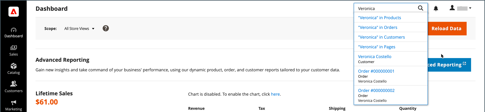

# 管理ツールとワークスペース

管理ワークスペースから、ストアの実行に使用するすべてのツール、データおよびコンテンツにアクセスできます。 デフォルトの起動ページは設定で設定できます。 多くの管理ページには、セクションのデータを一覧表示するグリッドがあり、一連のツールを使用して、アクションの検索、並べ替え、フィルタリング、選択および適用をおこなえます。 デフォルトでは、 [ダッシュボード](admin-dashboard.md) は、管理者の起動ページです。 ただし、ログイン時に起動ページとして表示する他のページを選択することもできます。 管理者のサイドバーにあるロゴをクリックして、管理者の起動ページに戻ることができます。

{zoomable=&quot;yes&quot;}

## Workspace のコントロール

| 制御 | 説明 |
|--- |--- |
| [!UICONTROL Global Search] | 右上の検索アイコンを使用して、製品、顧客、注文レコードなど、データベース内の任意の値を検索できます。 |
| [!UICONTROL Grid Search] | グリッドの上の検索ボックスを使用すると、レコード内のキーワードに基づいて、グリッドの表示をすばやくフィルタリングできます。 |
| [!UICONTROL Sort] | 各列のヘッダーを使用して、リストを昇順または降順で並べ替えることができます。 |
| [!UICONTROL Filters] | グリッドに表示されるレコードを決定する一連の検索パラメータを定義します。 また、一部の列のヘッダーのフィルターを使用して、リストを特定の値に制限できます。 一部のフィルターには、リストボックスから選択できる追加のオプションがあります。 |
| [!UICONTROL Default View] | グリッドの既定の列レイアウトを決定します。 |
| [!UICONTROL Columns] | 選択を決定します。 [列](admin-grid-controls.md) グリッドでの順序 列のレイアウトは、 _表示_. デフォルトでは、列の一部のみがグリッドに含まれます。 |
| [!UICONTROL Paginate] | ページネーションコントロールは、結果の追加のページを表示するために使用されます。 |
| [!UICONTROL Actions] | [ アクション ] コントロールは、選択したすべてのレコードに操作を適用します。 |
| [!UICONTROL Select] | Select コントロールは、アクションの対象となる複数のレコードを選択する場合に使用します。 オプション： `Select All` / `Deselect All` |

{style="table-layout:auto"}

## Workspace での検索

データベース内のレコードを検索するには、 _管理者_. 結果には、顧客、製品、注文、または関連する属性が含まれます。 例えば、顧客名を入力した場合、結果には、顧客レコードと、その名前に関連付けられた注文が含まれる場合があります。

{width="700" zoomable="yes"}

1. ヘッダーで、 _検索_ () アイコンをクリックして、検索ボックスを開きます。

1. 次のいずれかの操作を行います。

   - 近い一致を検索するには、検索する文字の最初の数文字を入力します。
   - 完全一致を検索するには、検索する単語を 1 つ以上入力します。

1. 表示された検索結果で、任意の項目をクリックしてレコードを開きます。

## 管理起動ページの変更

The [dashboard](admin-workspace.md#the-dashboard) は、別のスタートアップページを構成できますが、管理者のデフォルトのスタートアップページです。

1. 次の日： _管理者_ サイドバー、移動 **[!UICONTROL Stores]** > _[!UICONTROL Settings]_>**[!UICONTROL Configuration]**.

1. 左側のナビゲーションパネルで、 **[!UICONTROL Advanced]**&#x200B;を選択します。 **[!UICONTROL Admin]**.

1. 展開  の **[!UICONTROL Startup Page]** 」セクションに入力します。

   {width="600"}

1. 設定 **[!UICONTROL Startup Page]** 管理者にログインした後の最初の表示ページに移動します。

   すべての管理オプションの詳細なリストについては、 [管理者](../configuration-reference/advanced/admin.md) （内） _設定リファレンス_.

1. 完了したら、「 **[!UICONTROL Save Config]**.
