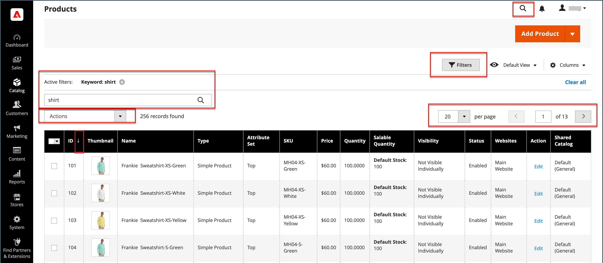
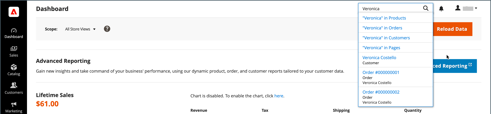

# 管理者ツールとワークスペース

管理ワークスペースでは、ストアの実行に使用されるすべてのツール、データ、コンテンツにアクセスできます。 デフォルトのスタートアップページは、設定で設定できます。 多くの管理ページには、セクションのデータをリストするグリッドがあり、アクションの検索、並べ替え、フィルタリング、選択、適用のためのツールのセットが用意されています。 デフォルトでは、[&#x200B; ダッシュボード &#x200B;](admin-dashboard.md)は管理者のスタートアップページです。 ただし、ログイン時にスタートアップページとして表示する他のページを選択できます。 管理者サイドバーのロゴをクリックして、管理者起動ページに戻ることができます。

{zoomable="yes"}

## Workspaceコントロール

| 制御 | 説明 |
|--- |--- |
| [!UICONTROL Global Search] | 右上の検索アイコンを使用すると、商品、顧客、注文レコードなど、データベース内の任意の値を検索できます。 |
| [!UICONTROL Grid Search] | グリッドの上にある検索ボックスを使用すると、レコード内のキーワードに基づいてグリッド表示をすばやくフィルタリングできます。 |
| [!UICONTROL Sort] | 各列のヘッダーを使用して、リストを昇順または降順で並べ替えることができます。 |
| [!UICONTROL Filters] | グリッドに表示されるレコードを決定する検索パラメーターのセットを定義します。 さらに、一部の列のヘッダーのフィルターを使用して、リストを特定の値に制限できます。 一部のフィルターには、リストボックスから選択できる追加のオプションがあります。 |
| [!UICONTROL Default View] | グリッドのデフォルトの列レイアウトを指定します。 |
| [!UICONTROL Columns] | [列](admin-grid-controls.md)の選択範囲とグリッド内での順序を決定します。 列レイアウトを変更し、_ビュー_&#x200B;として保存できます。 デフォルトでは、グリッドに含まれるのは一部の列のみです。 |
| [!UICONTROL Paginate] | ページネーション コントロールを使用して、結果の追加ページを表示します。 |
| [!UICONTROL Actions] | アクション コントロールは、選択したすべてのレコードに操作を適用します。 |
| [!UICONTROL Select] | 選択コントロールは、アクションの対象となる複数のレコードを選択するために使用されます。 オプション：`Select All` / `Deselect All` |

{style="table-layout:auto"}

## Workspace検索

データベース内の任意のレコードを検索するには、_管理者_&#x200B;のヘッダーにある虫眼鏡アイコンを使用します。 結果には、顧客、製品、注文、または関連する属性が含まれます。 例えば、顧客名を入力すると、顧客レコードと、その名前に関連付けられている注文が結果に含まれる場合があります。

{width="700" zoomable="yes"}

1. ヘッダーで、_検索_ （）アイコンをクリックして検索ボックスを開きます。

1. 次のいずれかの操作を行います。

   - 近い一致を見つけるには、見つけたいものの最初の数文字を入力します。
   - 完全一致を検索するには、検索する単語または複数の単語を入力します。

1. 表示された検索結果で、任意の項目をクリックしてレコードを開きます。

## 管理者起動ページの変更

[&#x200B; ダッシュボード &#x200B;](admin-workspace.md#the-dashboard)は、管理者のデフォルトのスタートアップページですが、別のスタートアップページを設定できます。

1. _管理者_ サイドバーで、**[!UICONTROL Stores]** > _[!UICONTROL Settings]_>**[!UICONTROL Configuration]**&#x200B;に移動します。

1. **[!UICONTROL Advanced]**&#x200B;の下の左側のナビゲーションパネルで、**[!UICONTROL Admin]**&#x200B;を選択します。

1. **[!UICONTROL Startup Page]** セクションのを展開します。

   {width="600"}

1. 管理者にログインした後、最初に表示するページに&#x200B;**[!UICONTROL Startup Page]**&#x200B;を設定します。

   すべての管理者オプションの詳細なリストについては、_設定リファレンス_&#x200B;の[管理者](../configuration-reference/advanced/admin.md)を参照してください。

1. 完了したら、**[!UICONTROL Save Config]**&#x200B;をクリックします。
