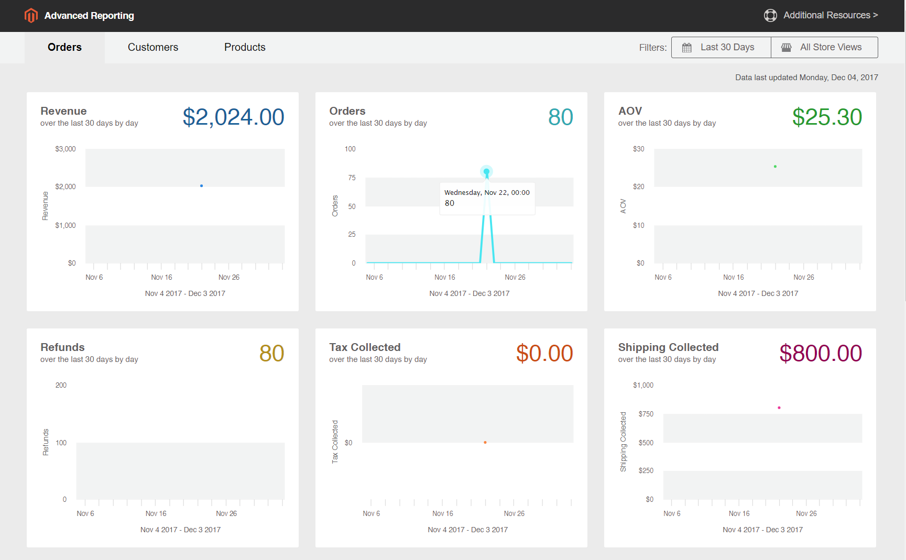
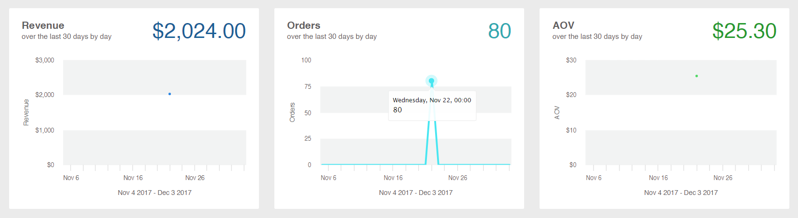
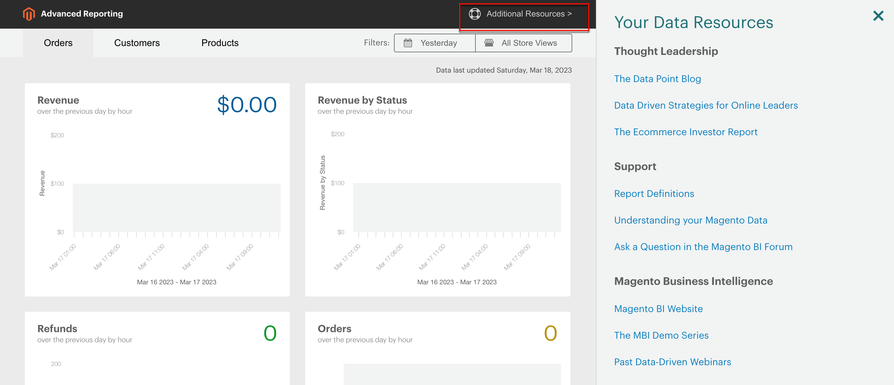
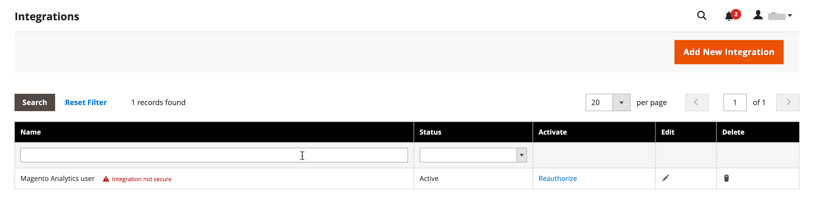
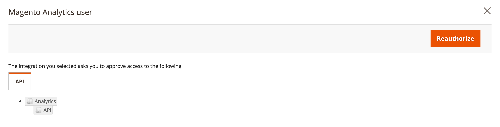
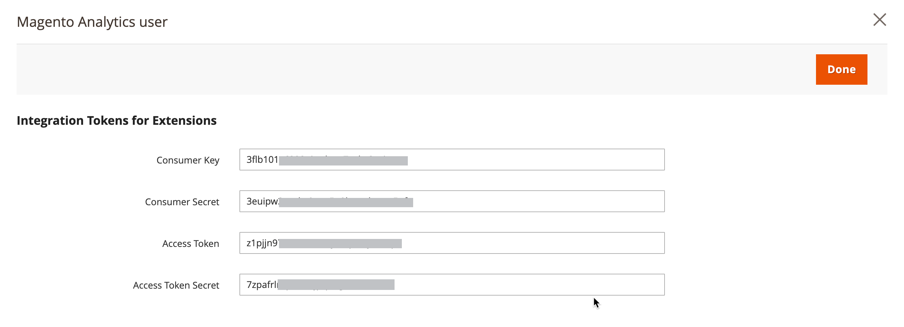

# [!DNL Commerce Intelligence]個のツール

Commerce Intelligence製品を利用して、ビジネス上の的確な意思決定を下すために利用するinsightを手に入れましょう。

## [!DNL Commerce Intelligence] アカウント

Adobeを通じて[!DNL Commerce Intelligence] アカウントをアクティブ化すると、約70件のレポートを含む5つのダッシュボードにアクセスできます。 これらのレポートは、データに関するインサイトを提供し、「注文が前月比でどのように増加しているか」、「最もロイヤルティの高い顧客は誰か」、「クーポン戦略は機能しているか？」などの質問に回答することを目的としています。 このツールセットについて詳しくは、[Commerce Intelligence ユーザーガイド ](https://experienceleague.adobe.com/docs/commerce-business-intelligence/mbi/guide-overview.html)を参照してください。

## [!DNL Advanced Reporting]

[!DNL Advanced Reporting]はAdobe CommerceおよびMagento Open Sourceに含まれています。 この機能により、商品、注文、顧客データに基づく一連の動的なレポートにアクセスし、ビジネスニーズに合わせてパーソナライズされたダッシュボードを使用できます。 [!DNL Advanced Reporting]はAnalyticsに[!DNL Commerce Intelligence]を使用していますが、[!DNL Advanced Reporting]を使用するにはCommerce Intelligence アカウントは必要ありません。

技術情報については、開発者用ドキュメントの[[!DNL Advanced Reporting]](https://developer.adobe.com/commerce/php/development/advanced-reporting/){:target="_blank"} トピックを参照してください。

>[!NOTE]
>
>[!DNL Adobe Commerce Intelligence]との互換性の問題により、Commerceは[!DNL Commerce Intelligence]のソースデータファイルのメディアとしてAWS S3 バケットを使用する高度なレポートを一時的にサポートできません。

{width="700"}

### 要件定義

* Web サイトはパブリック Web サーバー上で実行する必要があります。

* ドメインには、有効なセキュリティ（SSL）証明書が必要です。

* エラーなしで[!DNL Commerce]が正常にインストールまたはアップグレードされている必要があります。

* [ ストア URL](../stores-purchase/store-urls.md)の[!DNL Commerce]設定では、ストアビューの&#x200B;**[!UICONTROL Base URL (Secure)]**&#x200B;設定がセキュア URLを指している必要があります。 例：`https://yourdomain.com`。

* ストア URLの[!DNL Commerce]設定では、**[!UICONTROL Use Secure URLs on Storefront]**&#x200B;と&#x200B;**[!UICONTROL Use Secure URLs in Admin]**&#x200B;を`Yes`に設定する必要があります。

* [[!DNL Commerce] crontab](https://experienceleague.adobe.com/docs/commerce-operations/configuration-guide/cli/configure-cron-jobs.html)が作成され、インストールされたサーバーでcron ジョブが実行されています。

>[!NOTE]
>
>[!DNL Advanced Reporting]は、1つの[基本通貨](../stores-purchase/currency-configuration.md)を継続的に使用している[!DNL Commerce]のインストールでのみ使用できます。


### 手順1: [!DNL Advanced Reporting]を有効にする

[!DNL Commerce]設定では、[[!DNL Advanced Reporting]](../configuration-reference/general/advanced-reporting.md)はデフォルトで有効になっており、cronが[設定](../configuration-reference/advanced/system.md)で実行されている場合は自動的に開始されます。 サブスクリプションを確立する試みは、成功するまで、次の24時間にわたって各時間の開始時に開始されます。 サブスクリプションが正常に確立されるまで、サブスクリプションのステータスは「保留中」です。

1. _管理者_ サイドバーで、**[!UICONTROL Stores]** > _[!UICONTROL Settings]_>**[!UICONTROL Configuration]**に移動します。

1. **[!UICONTROL General]**&#x200B;が展開されている左側のナビゲーションパネルで、**[!UICONTROL Advanced Reporting]**&#x200B;を選択し、次の操作を行います。

   * **[!UICONTROL Advanced Reporting Service]**&#x200B;が`Enable`に設定されていることを確認します（デフォルト設定）。

   * 24時間の時刻に従って、**[!UICONTROL Time of day to send data]**&#x200B;を時間、分、秒に設定し、サービスがストアから更新されたデータを受信できるようにします。 デフォルトでは、データは午前2:00時に送信されます。

   * **[!UICONTROL Industry Data]**&#x200B;で、自社に最も適した&#x200B;**[!UICONTROL Industry]**&#x200B;を選択します。

   {width="400"}

1. 完了したら、**[!UICONTROL Save Config]**&#x200B;をクリックします。

1. メッセージが表示されたら、ページの上部にあるメッセージの&#x200B;**[[!UICONTROL Cache Management]](../systems/cache-management.md)**&#x200B;をクリックし、無効なキャッシュを更新します。

1. 毎晩、または次に予定されている更新時間の後まで待ちます。 次に、サブスクリプションのステータスを確認します。 ステータスがまだ&#x200B;_保留中_&#x200B;の場合は、インストールがすべての要件を満たしていることを確認してください。

### 手順2: [!DNL Advanced Reporting]へのアクセス

1. 次のいずれかの操作を行います。

   * _管理者_ サイドバーで、**[!UICONTROL Dashboard]**&#x200B;を選択します。 次に、**[!UICONTROL Go to Advanced Reporting]**&#x200B;をクリックします。
   * _管理者_ サイドバーで、**[!UICONTROL Reports]** > _[!UICONTROL Business Intelligence]_>**[!UICONTROL Advanced Reporting]**に移動します。

   [!DNL Advanced Reporting] ダッシュボードには、注文、顧客、製品の簡単な概要が表示されます。 下にスクロールして、完全なダッシュボードを表示します。

1. データをより詳細に把握するには、右上隅の&#x200B;**[!UICONTROL Filters]**&#x200B;を、レポートに含める期間とストアビューに設定します。 次に、次の操作を行います。

   * 任意のデータポイントにカーソルを合わせると、詳細が表示されます。
   * すべてのダッシュボードレポートを表示するには、各タブをクリックします。

   {width="600" zoomable="yes"}

## [!DNL Advanced Reporting]個のデータ リソースへのアクセス

詳細レポート ダッシュボードの右上隅にある「**[!UICONTROL Additional Resources]**」をクリックします。

{width="600" zoomable="yes"}

## トラブルシューティング

404 「ページが見つかりません」というメッセージが表示された場合は、ストアが[!DNL Advanced Reporting]の要件を満たしていることを確認してください。 次に、指示に従って、統合がインストールされていることを確認します。

### 統合がアクティブであることを確認します

1. _管理者_ サイドバーで、**[!UICONTROL System]** > _[!UICONTROL Extensions]_>**[!UICONTROL Integration]**に移動します。

1. **[!UICONTROL Magento Analytics user]**&#x200B;統合がリストに表示され、**[!UICONTROL Status]**&#x200B;が`Active`であることを確認します。

1. ユーザーを再確立するには、**[!UICONTROL Reauthorize]**&#x200B;をクリックし、次の操作を行います。

   {width="600"}

   * プロンプトが表示されたら、**[!UICONTROL Reauthorize]**&#x200B;をクリックして、API リソースへのアクセスを承認します。

     {width="600"}

   * 拡張機能の統合トークンのリストが完了していることを確認します。 次に、**完了**&#x200B;をクリックします。

     {width="600"}

1. 統合`Magento Analytics user`が再承認されたことを示すメッセージを探します。

1. 一晩または次のスケジュールされた更新の時間の後まで待ちます。

### 単一の基本通貨の確認

[!DNL Advanced Reporting]は、インストール時から[基本通貨](../stores-purchase/currency-configuration.md)を1つしか使用していない[!DNL Commerce] インストールでのみ使用できます。 その結果、履歴では、すべての注文で同じ基本通貨が使用されます。 [!DNL Advanced Reporting]は、いつでも基本通貨を変更し、異なる基本通貨で処理された注文が履歴にある場合は機能しません。

ストアに複数の基本通貨があるかどうかを判断するには、次のMySQLの例を使用して、コマンドラインから[!DNL Commerce] データベースをクエリできます。 データ構造に合わせてテーブル名を変更する必要がある場合があります。

```sql
select distinct base_currency_code from sales_order;
```

### データの不一致

`Data last updated...` キャプションに昨日の日付が表示され、今日の日付が表示されない場合は、高度なレポートの更新で最大1日の遅延が発生する可能性があります。 この遅延は、予想されるキューサイズよりも大きいことが原因です。

## ダッシュボードレポート

**[!UICONTROL Orders]**

| フィールド | 説明 |
|--- |--- |
| [!UICONTROL Revenue] | 定義された期間にストアビューで受け取ったすべての収益を表示します。 |
| [!UICONTROL Orders] | 定義された期間内にストアビューを通じて行われたすべての注文を表示します。 |
| [!UICONTROL AOV] | 定義された期間内にストアビューに配置された平均注文額を表示します。 |
| [!UICONTROL Refunds] | 定義された期間内にストアビューを通じて処理されたすべての返金を表示します。 |
| [!UICONTROL Tax Collected] | 定義済みの期間にストアビューを通じて収集されたすべての税金を表示します。 |
| [!UICONTROL Shipping Collected] | 定義された期間中にストアビューを通じて収集されたすべての配送料を表示します。 |
| [!UICONTROL Orders by Status] | 定義された期間中のストアビューについて、ステータス別の注文数を表示します。 |
| [!UICONTROL Orders by Status] | ステータス別の注文数の概要を一覧表示します。 |
| [!UICONTROL Coupon Usage] | 定義された期間内にストアビューを通じて引き換えられたすべてのクーポンコードとそれぞれのユーザー数が一覧表示されます。 |
| [!UICONTROL Orders and Revenue by Billing Region] | 定義された期間中のストアビューの地域ごとの注文数と収益を一覧表示します。 |
| [!UICONTROL Tax Collected by Billing Region] | 定義済み期間中にストアビューの地域別に収集された税額を一覧表示します。 |
| [!UICONTROL Shipping Fees Collected by Shipping Region] | 定義された期間内にストアビューの地域ごとに収集された配送料を一覧表示します。 |

{style="table-layout:auto"}

**[!UICONTROL Customers]**

| フィールド | 説明 |
|--- |--- |
| [!UICONTROL Unique Customers] | 定義された期間内にストアビューに関連付けられた一意の顧客アカウントの数を表示します。 |
| [!UICONTROL New Registered Accounts] | 定義された期間にストアビューに登録された新しい顧客アカウントの数を表示します。 |
| [!UICONTROL Top Coupon Users] | お客様ID別の上位のクーポンユーザーと、定義された期間中にストアビューのクーポンが適用された注文数が一覧表示されます。 |
| [!UICONTROL Customer KPI Table] | 定義された期間中のストアビューの顧客IDごとに、注文数、収益、平均注文額を一覧表示します。 |

{style="table-layout:auto"}

**[!UICONTROL Products]**

| フィールド | 説明 |
|--- |--- |
| [!UICONTROL Quantity of Products Sold] | 定義された期間中にストアビューを通じて販売された製品の数を表示します。 |
| [!UICONTROL Products Added to Wishlists] | 定義された期間内にストアビューを通じてウィッシュリストに追加されたすべての製品を一覧表示します。 |
| [!UICONTROL Best Selling Products by Quantity] | 定義された期間内にストアビューで販売されたベストセラー商品と数量を一覧表示します。 |
| [!UICONTROL Best Selling Products by Revenue] | 定義された期間中にストアビューを通じて製品を販売することで生成されたベストセラー製品と収益を一覧表示します。 |

{style="table-layout:auto"}
