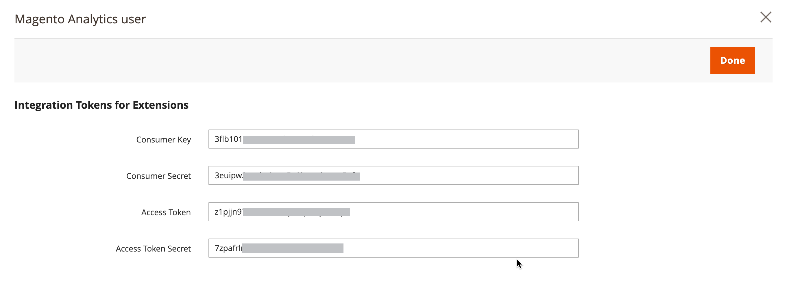

# [!DNL Commerce Intelligence] ツール

Commerce Intelligence ツールを使用して、ビジネス上の健全な意思決定に使用されるinsightを取得します。

## [!DNL Commerce Intelligence] アカウント

Adobeを通じて [!DNL Commerce Intelligence] アカウントをアクティブ化すると、5 つのダッシュボードに約 70 件のレポートでアクセスできます。 これらのレポートは、データに関するインサイトを提供し、「注文が前月比でどのように増加しているか」、「最も常連客は誰か」、「クーポン戦略は機能しているか」などの質問に回答するように設計されています。 このツールセットについて詳しくは、[Commerce Intelligenceユーザーガイド ][1] を参照してください。

## [!DNL Advanced Reporting]

[!DNL Advanced Reporting] はAdobe CommerceおよびMagento Open Sourceに含まれています。 この機能を使用すると、製品、注文、顧客データに基づく動的レポートスイートにアクセスでき、ビジネスニーズに合わせてパーソナライズされたダッシュボードが提供されます。 [!DNL Advanced Reporting] は Analytics に [!DNL Commerce Intelligence] を使用しますが、[!DNL Advanced Reporting] を使用するためにCommerce Intelligence アカウントを持っている必要はありません。

技術情報については、開発者向けドキュメントの [[!DNL Advanced Reporting]][2]{:target="_blank"} のトピックを参照してください。

>[!NOTE]
>
>[!DNL Adobe Commerce Intelligence] との互換性の問題により、Commerceは一時的に、[!DNL Commerce Intelligence] のソースデータファイルのメディアとしてAWS S3 バケットを使用した高度なレポートをサポートできません。

{width="700"}

### 要件

* Web サイトは、公開 web サーバー上で実行する必要があります。

* ドメインには有効なセキュリティ（SSL）証明書が必要です。

* [!DNL Commerce] は、エラーなく正常にインストールまたはアップグレードされている必要があります。

* [!DNL Commerce] ストア URL[ の ](../stores-purchase/store-urls.md) 設定では、ストア表示の **[!UICONTROL Base URL (Secure)]** 設定はセキュア URL を指している必要があります。 例：`https://yourdomain.com`。

* ストア URL の [!DNL Commerce] 設定では、**[!UICONTROL Use Secure URLs on Storefront]** と **[!UICONTROL Use Secure URLs in Admin]** を `Yes` に設定する必要があります。

* [[!DNL Commerce] crontab][3] が作成され、インストールされたサーバーで cron ジョブが実行されます。

>[!NOTE]
>
>[!DNL Advanced Reporting] は、単一の [!DNL Commerce] 基本通貨 [ を継続的に使用している ](../stores-purchase/currency-configuration.md) インストールでのみ使用できます。


### 手順 1:[!DNL Advanced Reporting] を有効にする

[!DNL Commerce] の設定では、[[!DNL Advanced Reporting]](../configuration-reference/general/advanced-reporting.md) はデフォルトで有効になっており、cron が [ 設定 ](../configuration-reference/advanced/system.md) および実行されている場合に自動的に起動します。 サブスクリプションを確立する試みは、成功するまで、次の 24 時間にわたって各時間の初めに開始されます。 購読のステータスは、購読が正常に確立されるまで「保留中」です。

1. _管理者_ サイドバーで、**[!UICONTROL Stores]**/_[!UICONTROL Settings]_/**[!UICONTROL Configuration]**&#x200B;に移動します。

1. **[!UICONTROL General]** が展開されている左側のナビゲーションパネルで「**[!UICONTROL Advanced Reporting]**」を選択し、以下の手順を実行します。

   * **[!UICONTROL Advanced Reporting Service]** が `Enable` （デフォルト設定）に設定されていることを確認します。

   * ストアから更新されたデータをサービスで受信する **[!UICONTROL Time of day to send data]** を、24 時間制に従って、時、分、秒に設定します。 デフォルトでは、データは午前 2:00 に送信されます。

   * [**[!UICONTROL Industry Data]**] で、ビジネスに最も適した **[!UICONTROL Industry]** を選択します。

   {width="400"}

1. 完了したら、「**[!UICONTROL Save Config]**」をクリックします。

1. プロンプトが表示されたら、ページ上部のメッセージの **[[!UICONTROL Cache Management]](../systems/cache-management.md)** をクリックし、無効なキャッシュを更新します。

1. 夜間または次にスケジュールされた更新の時間が過ぎるまで待ちます。 次に、サブスクリプションのステータスを確認します。 ステータスが引き続き _保留中_ の場合は、インストール環境がすべての要件を満たしていることを確認します。

### 手順 2:[!DNL Advanced Reporting] へのアクセス

1. 次のいずれかの操作を行います。

   * _管理者_ サイドバーで「**[!UICONTROL Dashboard]**」を選択します。 次に、「**[!UICONTROL Go to Advanced Reporting]**」をクリックします。
   * _管理者_ サイドバーで、**[!UICONTROL Reports]**/_[!UICONTROL Business Intelligence]_/**[!UICONTROL Advanced Reporting]**&#x200B;に移動します。

   [!DNL Advanced Reporting] ダッシュボードには、注文、顧客、製品の概要が表示されます。 ダッシュボード全体を表示するには、必ず下にスクロールします。

1. データをわかりやすく表示するには、右上隅の **[!UICONTROL Filters]** をレポートに含める期間とストア表示に設定します。 次に、以下の手順を実行します。

   * 詳しくは、任意のデータポイントにポインタを合わせます。
   * すべてのダッシュボードレポートを表示するには、各タブをクリックします。

   {width="600" zoomable="yes"}

## [!DNL Advanced Reporting] データリソースへのアクセス

詳細レポート ダッシュボードの右上隅にある [**[!UICONTROL Additional Resources]**] をクリックします。

{width="600" zoomable="yes"}

## トラブルシューティング

404 「Page Not Found」というメッセージが表示された場合は、ストアが [!DNL Advanced Reporting] の要件を満たしていることを確認します。 次に、指示に従って統合がインストールされていることを確認します。

### 統合がアクティブであることを確認

1. _管理者_ サイドバーで、**[!UICONTROL System]**/_[!UICONTROL Extensions]_/**[!UICONTROL Integration]**&#x200B;に移動します。

1. **[!UICONTROL Magento Analytics user]** 統合がリストに表示され、**[!UICONTROL Status]** が `Active` しいことを確認します。

1. ユーザーを再確立するには、「**[!UICONTROL Reauthorize]**」をクリックし、次の手順を実行します。

   {width="600"}

   * プロンプトが表示されたら、「**[!UICONTROL Reauthorize]**」をクリックして、API リソースへのアクセスを承認します。

     {width="600"}

   * 拡張機能の統合トークンのリストが完了していることを確認します。 次に、「完了 **をクリックし** す。

     {width="600"}

1. 統合 `Magento Analytics user` ーザーが再認証されていることを示すメッセージを探します。

1. 夜間または次にスケジュールされた更新の時間が過ぎるまで待ちます。

### 単一の基本通貨を検証

[!DNL Advanced Reporting] は、インストール時から単一の [!DNL Commerce] 基本通貨 [ のみを使用していた ](../stores-purchase/currency-configuration.md) インストールでのみ使用できます。 その結果、履歴では、すべての注文が同じ基本通貨を使用します。 [!DNL Advanced Reporting] の場合、基本通貨を変更し、履歴の中に異なる基本通貨で処理された注文がある場合は、機能しません。

ストアに複数の基本通貨があるかどうかを判断するには、次の MySQL の例を使用して、コマンドラインから [!DNL Commerce] データベースにクエリを実行します。 場合によっては、データ構造に合わせてテーブル名を変更する必要があります。

```sql
select distinct base_currency_code from sales_order;
```

### データの不一致

`Data last updated...` のキャプションに今日ではなく昨日の日付が表示されていることに気付いた場合は、詳細レポートの更新で最大 1 日の遅延が発生する可能性があります。 この遅延は、予想されるキューサイズよりも大きいことが原因です。

## ダッシュボードレポート

**[!UICONTROL Orders]**

| フィールド | 説明 |
|--- |--- |
| [!UICONTROL Revenue] | 定義された期間にストア表示で受け取ったすべての収益を表示します。 |
| [!UICONTROL Orders] | 定義された期間にストア ビューを通じて行われたすべての注文を表示します。 |
| [!UICONTROL AOV] | 定義された期間にストア ビューを通じて注文された平均注文額を表示します。 |
| [!UICONTROL Refunds] | 定義された期間にストア表示を通じて処理されたすべての払戻を表示します。 |
| [!UICONTROL Tax Collected] | 定義された期間にストア表示で徴収されたすべての税金を表示します。 |
| [!UICONTROL Shipping Collected] | 定義された期間にストア表示を通じて収集されたすべての配送料を表示します。 |
| [!UICONTROL Orders by Status] | 定義された期間における店舗表示の注文数をステータス別に表示します。 |
| [!UICONTROL Orders by Status] | 注文数の概要をステータス別にリストします。 |
| [!UICONTROL Coupon Usage] | 定義された期間にストア表示を通じて引き換えられるすべてのクーポンコードと各ユーザー数を一覧表示します。 |
| [!UICONTROL Orders and Revenue by Billing Region] | 定義された期間における店舗表示の注文数と売上高を地域別にリストします。 |
| [!UICONTROL Tax Collected by Billing Region] | 定義された期間にストア表示でリージョン別に徴収された税額をリストします。 |
| [!UICONTROL Shipping Fees Collected by Shipping Region] | 定義された期間にストア ビューでリージョンごとに収集された配送料の一覧が表示されます。 |

{style="table-layout:auto"}

**[!UICONTROL Customers]**

| フィールド | 説明 |
|--- |--- |
| [!UICONTROL Unique Customers] | 定義された期間にストア表示に関連付けられた一意の顧客アカウントの数を表示します。 |
| [!UICONTROL New Registered Accounts] | 定義された期間にストア表示に登録された新しい顧客アカウントの数を表示します。 |
| [!UICONTROL Top Coupon Users] | 顧客 ID 別の上位のクーポンユーザーおよび定義された期間内にストア表示のクーポンで発注された注文数をリストします。 |
| [!UICONTROL Customer KPI Table] | 定義された期間における店舗表示の注文数、売上高、および平均注文額を顧客 ID 別にリストします。 |

{style="table-layout:auto"}

**[!UICONTROL Products]**

| フィールド | 説明 |
|--- |--- |
| [!UICONTROL Quantity of Products Sold] | 定義された期間にストア ビューを通じて販売された商品の数を表示します。 |
| [!UICONTROL Products Added to Wishlists] | 定義された期間にストア表示を通じてウィッシュリストに追加されたすべての製品をリストします。 |
| [!UICONTROL Best Selling Products by Quantity] | 定義された期間にストア表示を通じて販売された最も売れた商品および数量をリストします。 |
| [!UICONTROL Best Selling Products by Revenue] | 定義された期間内にストア表示を介した商品の販売によって生成された、最も売れた商品と収益を一覧表示します。 |

{style="table-layout:auto"}


[1]: https://experienceleague.adobe.com/docs/commerce-business-intelligence/mbi/guide-overview.html
[2]: https://developer.adobe.com/commerce/php/development/advanced-reporting/
[3]: https://experienceleague.adobe.com/docs/commerce-operations/configuration-guide/cli/configure-cron-jobs.html
