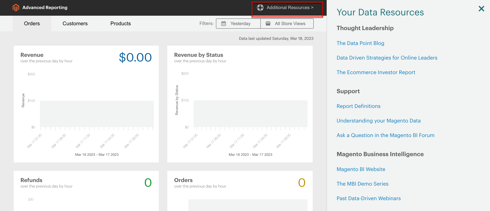

# [!DNL Commerce Intelligence] ツール

コマースインテリジェンスツールを使用して、健全なビジネス上の意思決定に使用するインサイトを得ます。

## [!DNL Commerce Intelligence] アカウント

次をアクティブ化する場合： [!DNL Commerce Intelligence] Adobeを通じて、約 70 個のレポートを持つ 5 つのダッシュボードにアクセスできます。 これらのレポートは、データに関するインサイトを提供し、「前月比で増加する注文の量」、「最も常連的な顧客は誰ですか」、「クーポン戦略は機能していますか」などの質問に答えるように設計されています。 このツールセットについて詳しくは、 [Commerce Intelligence ユーザーガイド][1].

## [!DNL Advanced Reporting]

[!DNL Advanced Reporting] は、Adobe CommerceおよびMagento Open Sourceに含まれています。 この機能を使用すると、製品、注文、顧客データに基づく一連の動的レポートにアクセスし、ビジネスニーズに合わせてカスタマイズされたパーソナライズ済みダッシュボードを使用できます。 While [!DNL Advanced Reporting] uses [!DNL Commerce Intelligence] analytics の場合、使用する Commerce Intelligence アカウントは不要です。 [!DNL Advanced Reporting].

技術情報については、 [[!DNL Advanced Reporting]][2]開発者向けドキュメントの {:target=&quot;_blank&quot;} トピック。

>[!NOTE]
>
>[!DNL Commerce Intelligence] アカウントは、 [!DNL Advanced Reporting] 機能。

{width="700"}

### 要件

* Web サイトは、パブリック Web サーバー上で実行する必要があります。

* ドメインには有効なセキュリティ (SSL) 証明書が必要です。

* [!DNL Commerce] は、エラーなく正常にインストールまたはアップグレードされた必要があります。

* Adobe Analytics の [!DNL Commerce] の設定 [ストア URL](../stores-purchase/store-urls.md)、 **[!UICONTROL Base URL (Secure)]** ストア表示の設定は、セキュア URL を指している必要があります。 例： `https://yourdomain.com`.

* Adobe Analytics の [!DNL Commerce] ストア URL の設定 **[!UICONTROL Use Secure URLs on Storefront]** および **[!UICONTROL Use Secure URLs in Admin]** は、次のように設定する必要があります `Yes`.

* [[!DNL Commerce] crontab][3] が作成され、インストールされたサーバーで cron ジョブが実行されている。

>[!NOTE]
>
>[!DNL Advanced Reporting] はと一緒にのみ使用できます [!DNL Commerce] 継続的に単一の [基準通貨](../stores-purchase/currency-configuration.md).


### 手順 1：有効にする [!DNL Advanced Reporting]

Adobe Analytics の [!DNL Commerce] 設定 [[!DNL Advanced Reporting]](../configuration-reference/general/advanced-reporting.md) はデフォルトで有効になっており、cron がに設定されている場合は自動的に開始します。 [設定済み](../configuration-reference/advanced/system.md) と実行中。 サブスクリプションの確立の試みは、成功するまで、24 時間以内に各時間の初めに開始されます。 サブスクリプションが正常に確立されるまで、サブスクリプションステータスは「保留」です。

1. 次の日： _管理者_ サイドバー、移動 **[!UICONTROL Stores]** > _[!UICONTROL Settings]_>**[!UICONTROL Configuration]**.

1. 左側のナビゲーションパネルで **[!UICONTROL General]** は展開済みで、「 **[!UICONTROL Advanced Reporting]** 次の操作を実行します。

   * を確認します。 **[!UICONTROL Advanced Reporting Service]** が `Enable` （デフォルト設定）。

   * を設定します。 **[!UICONTROL Time of day to send data]** 24 時間制の時刻に従い、ストアから更新されたデータをサービスが受け取る時間、分、秒を指定します。 デフォルトでは、データは午前 2 時に送信されます。

   * の下 **[!UICONTROL Industry Data]**、選択 **[!UICONTROL Industry]** それがあなたのビジネスを最もよく表しています。

   {width="400"}

1. 完了したら、「 **[!UICONTROL Save Config]**.

1. プロンプトが表示されたら、「 **[[!UICONTROL Cache Management]](../systems/cache-management.md)** ページの上部にあるメッセージで、無効なキャッシュを更新します。

1. 一晩、または次にスケジュールされた更新の時間が経過した後まで待ちます。 次に、サブスクリプションのステータスを確認します。 ステータスがまだの場合 _保留中_&#x200B;を使用する場合は、インストールがすべての要件を満たしていることを確認します。

### 手順 2：アクセス [!DNL Advanced Reporting]

1. 次のいずれかの操作を行います。

   * 次の日： _管理者_ サイドバー、選択 **[!UICONTROL Dashboard]**. 次に、「 **[!UICONTROL Go to Advanced Reporting]**.
   * 次の日： _管理者_ サイドバー、移動 **[!UICONTROL Reports]** > _[!UICONTROL Business Intelligence]_>**[!UICONTROL Advanced Reporting]**.

   The [!DNL Advanced Reporting] ダッシュボードには、注文、顧客、製品の概要が表示されます。 必ず下にスクロールして、ダッシュボード全体を表示します。

1. データの表示を改善するには、 **[!UICONTROL Filters]** をクリックします。 次に、以下の手順を実行します。

   * データポイントにカーソルを合わせると、詳細が表示されます。
   * すべてのダッシュボードレポートを表示するには、各タブをクリックします。

   {width="600" zoomable="yes"}

## アクセス [!DNL Advanced Reporting] データリソース

「高度なレポート」ダッシュボードの右上隅で、 **[!UICONTROL Additional Resources]**.

{width="600" zoomable="yes"}

## トラブルシューティング

404 の「Page Not Found」メッセージが表示された場合は、ストアが [!DNL Advanced Reporting]. 次に、指示に従って統合がインストールされていることを確認します。

### 統合がアクティブであることを確認します。

1. 次の日： _管理者_ サイドバー、移動 **[!UICONTROL System]** > _[!UICONTROL Extensions]_>**[!UICONTROL Integration]**.

1. 次を確認します。 **[!UICONTROL Magento Analytics user]** 統合がリストに表示され、 **[!UICONTROL Status]** 次に該当 `Active`.

1. ユーザーを再確立するには、 **[!UICONTROL Reauthorize]** 次の操作を実行します。

   {width="600"}

   * プロンプトが表示されたら、「 **[!UICONTROL Reauthorize]** をクリックして、API リソースへのアクセスを承認します。

     {width="600"}

   * 拡張機能の統合トークンのリストが完了していることを確認します。 次に、「 **完了**.

     {width="600"}

1. 統合を示すメッセージを探します。 `Magento Analytics user` が再認証されました。

1. 次にスケジュールされた更新の時間が経過した後、一晩またはまで待ちます。

### 単一のベース通貨を検証

[!DNL Advanced Reporting] はと一緒にのみ使用できます [!DNL Commerce] 1 つのみを使用したインストール [基準通貨](../stores-purchase/currency-configuration.md) インストール時から。 結果として、履歴では、すべての注文で同じ基準通貨が使用されます。 [!DNL Advanced Reporting] は、ベース通貨を変更した後、履歴に異なるベース通貨で処理された注文がある場合は機能しません。

ストアに複数の基本通貨があるかどうかを判断するには、 [!DNL Commerce] 次の MySQL の例を使用して、コマンドラインからデータベースを作成します。 データ構造に合わせてテーブル名を変更する必要が生じる場合があります。

```sql
select distinct base_currency_code from sales_order;
```

### データの不一致

もし `Data last updated...` キャプションには、今日ではなく昨日の日付が表示されます。高度なレポート機能の更新では、最大 1 日の遅延が生じる可能性があります。 この遅延は、予想されるキューサイズより大きいことが原因です。

## ダッシュボードレポート

**[!UICONTROL Orders]**

| フィールド | 説明 |
|--- |--- |
| [!UICONTROL Revenue] | 定義された期間にストア表示で受け取ったすべての売上高を表示します。 |
| [!UICONTROL Orders] | 定義された期間にストア表示で行われたすべての注文を表示します。 |
| [!UICONTROL AOV] | 定義された期間にストア表示で配置された平均注文額を表示します。 |
| [!UICONTROL Refunds] | 定義した期間にストア表示で処理されたすべての払い戻しが表示されます。 |
| [!UICONTROL Tax Collected] | 定義された期間にストア表示で収集されたすべての税金を表示します。 |
| [!UICONTROL Shipping Collected] | 定義された期間にストア表示で収集されたすべての送料を表示します。 |
| [!UICONTROL Orders by Status] | 定義された期間のストア表示に関する、ステータス別の注文数を表示します。 |
| [!UICONTROL Orders by Status] | ステータス別の注文件数の概要を表示します。 |
| [!UICONTROL Coupon Usage] | 定義した期間にストア表示で交換された、すべてのクーポンコードと各のユーザー数が表示されます。 |
| [!UICONTROL Orders and Revenue by Billing Region] | 定義した期間内のストア表示の、地域別の注文件数と売上高が表示されます。 |
| [!UICONTROL Tax Collected by Billing Region] | 定義した期間内の店舗表示に関して、地域別に収集された税金額が表示されます。 |
| [!UICONTROL Shipping Fees Collected by Shipping Region] | 定義した期間の店舗表示で、地域別に収集された配送料を一覧表示します。 |

{style="table-layout:auto"}

**[!UICONTROL Customers]**

| フィールド | 説明 |
|--- |--- |
| [!UICONTROL Unique Customers] | 定義された期間内にストア表示に関連付けられた一意の顧客アカウントの数を表示します。 |
| [!UICONTROL New Registered Accounts] | 定義された期間にストア表示で登録された新規顧客アカウントの数を示します。 |
| [!UICONTROL Top Coupon Users] | 定義された期間に、店舗表示でクーポンを付けた注文件数と顧客 ID 別の上位のクーポンユーザーを表示します。 |
| [!UICONTROL Customer KPI Table] | 定義した期間のストア表示での注文件数、売上高、平均注文額が顧客 ID 別に表示されます。 |

{style="table-layout:auto"}

**[!UICONTROL Products]**

| フィールド | 説明 |
|--- |--- |
| [!UICONTROL Quantity of Products Sold] | 定義された期間内にストア表示で販売された製品の数を示します。 |
| [!UICONTROL Products Added to Wishlists] | 定義された期間に、ストア表示でウィッシュリストに追加されたすべての製品のリストを表示します。 |
| [!UICONTROL Best Selling Products by Quantity] | 定義した期間内に店舗表示で販売された最良の製品と数量が表示されます。 |
| [!UICONTROL Best Selling Products by Revenue] | 定義した期間内に、ストア表示を通じて商品が販売されたことによって生じた、ベストセラーの製品と売上高を表示します。 |

{style="table-layout:auto"}


[1]: https://experienceleague.adobe.com/docs/commerce-business-intelligence/mbi/guide-overview.html
[2]: https://developer.adobe.com/commerce/php/development/advanced-reporting/
[3]: https://experienceleague.adobe.com/docs/commerce-operations/configuration-guide/cli/configure-cron-jobs.html
