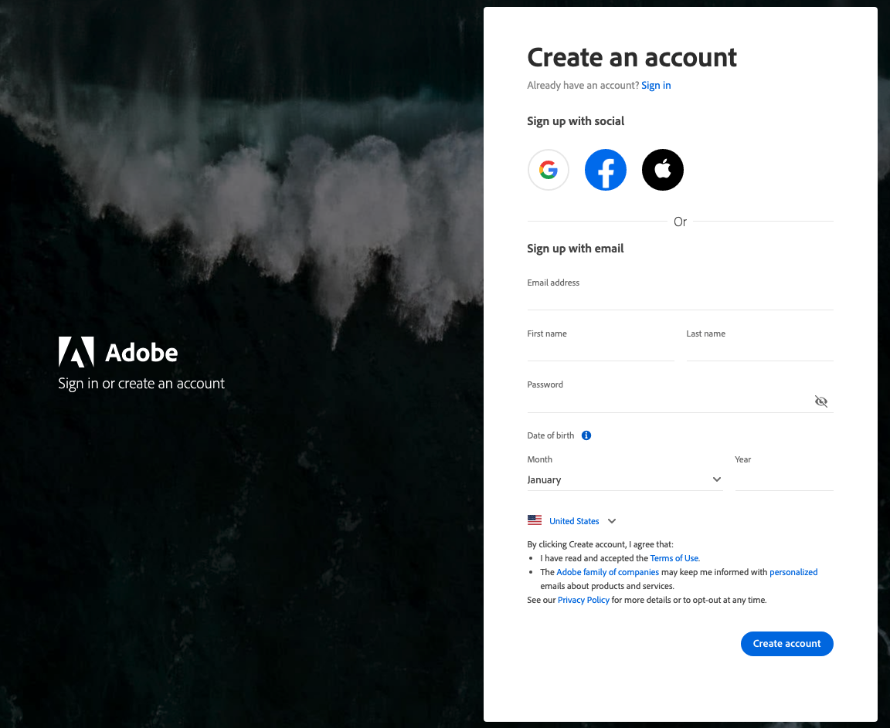

# [!DNL Commerce] アカウントへのアクセス

[!DNL Commerce] アカウントは、クラウドインフラストラクチャまたはオンプレミスにデプロイされたAdobe Commerce プロジェクト用のAdobe Commerce サービスを管理するための中央アクセスポイントです。 アカウントダッシュボードでは、サブスクリプションの表示、Commerce サービス API キーの管理、過去の請求情報の確認、組織内の他のユーザーとの共同作業を行うことができます。

特定のストアフロント内で作業するのではなく [&#128279;](https://experienceleague.adobe.com/en/docs/commerce-knowledge-base/kb/help-center-guide/magento-help-center-user-guide#support-case) 最初のチケットを送信する」か、Adobe Commerceの関係を管理する必要がある場合は、まず [!DNL Commerce] アカウントを作成するか、アクセスします。

[&#x200B; 最初のサポートチケットを送信する &#x200B;](https://experienceleague.adobe.com/en/docs/commerce-knowledge-base/kb/help-center-guide/magento-help-center-user-guide#support-case) か、特定のストアフロントの外部でAdobe Commerceの関係を処理する必要がある場合は、まず [!DNL Commerce] アカウントを作成またはアクセスします。

[!DNL Commerce] の web サイトから [!DNL Commerce] アカウントにアクセスできます。 アカウントダッシュボードでは、購入した製品およびサービスに関連する情報を表示し、他のユーザーに [&#x200B; 共有アクセス &#x200B;](https://experienceleague.adobe.com/en/docs/support-resources/adobe-support-tools-guide/adobe-commerce-support/adobe-commerce-help-center-user-guide#provide-shared-access) を提供できます。 Commerce サービス API キーなどの一部の情報は、ライセンス所有者にのみ表示されます。

>[!NOTE]
>
>**[!UICONTROL Billing History]** アカウント ページの [[!DNL Commerce]] セクションには、請求システムの更新前に作成された請求書のみが表示されます。
>
>新しい請求書が一覧にない場合は、新しいシステムに移行されており、このページからアクセスできません。

![[!DNL Commerce] アカウント &#x200B;](./assets/home-acct.png){width="700"}

[!DNL Commerce] アカウントのログインは、ストアの管理者ログインとは別のものです。 通常は、それぞれに異なる資格情報を使用し、各システムへのアクセスは個別に管理されます。

ただし、Adobe CommerceおよびAdobe Business 製品へのログインを効率化したい場合は、[Commerceの IMS 統合ガイド &#x200B;](https://experienceleague.adobe.com/en/docs/commerce-admin/start/admin/ims/adobe-ims-config) のストア管理者（*CommerceとのAdobe ID管理者統合の設定* にログインするようにAdobe IDを設定できます。

>[!NOTE]
>
>アカウントを作成したら、二要素認証（TFA）を使用して [&#x200B; アカウントを保護 &#x200B;](commerce-account-secure.md) することをお勧めします。

## [!DNL Commerce] アカウントにログインします

[!DNL Commerce] アカウントにアクセスするには、Adobe IDが必要です。 既存の [!DNL Commerce] アカウントを持っていて、2022 年 8 月以降ログインしていない場合、ログインプロセス中にAdobe IDを作成する必要があります。 アカウントにログインするには、この手順を完了する必要があります。

>[!WARNING]
>
>Adobe Commerceの送信時にCommerce組織が見つからない場合 [&#x200B; サポートケース &#x200B;](https://experienceleague.adobe.com/en/docs/support-resources/adobe-support-tools-guide/adobe-commerce-support/adobe-commerce-help-center-user-guide#support-case)、通常は、アカウントオーナーがAdobe IDを作成していない、またはAdobe IDが存在するがCommerce アカウントにリンクされていない、のいずれかを意味します。

1. [[!DNL Commerce]](https://account.magento.com/customer/account/login/) サイトに移動します。

1. 「**[!UICONTROL Sign in with Adobe ID]**」をクリックします。

   {width="700"}

1. メールアドレスを入力し、「**[!UICONTROL Continue]**」をクリックします。

   >[!TIP]
   >
   >既存のCommerce アカウントの MAGEID に関連付けられているメールアドレスを使用した場合は、ログインプロセスによってメールアドレスがAdobe IDに自動的にリンクされます。

## [!DNL Commerce] アカウントの作成

誰でも無料の [!DNL Commerce] アカウントを作成できます。 使用するメールアドレスは、1 つのCommerce アカウントにのみ関連付けることができます。

>[!NOTE]
>
>Adobe IDを使用して、Commerce アカウントを作成し、アクセスします。
>- Commerce アカウントがない場合は、新規登録プロセス中に作成できます。
>- 既にCommerce アカウントを持っていてもAdobe IDがない場合は、[Commerce アカウントへのログイン &#x200B;](#log-in-to-your-dnl-commerce-account) を参照してください。

1. [[!DNL Commerce]  サイト &#x200B;](https://account.magento.com/customer/account/login/) に移動します。

1. 「**[!UICONTROL Sign in with Adobe ID]**」をクリックします。

1. Adobe IDがない場合は、「**[!UICONTROL Create an account]**」をクリックします。 それ以外の場合は、手順 7 に進みます。

   {width="700"}

1. サインアップフォームに入力します。

   {width="700"}

1. 「**[!UICONTROL Create account]**」をクリックします。

1. メールアドレスに送信した確認コードを入力します。

   {width="700"}

1. Adobe IDを作成および検証したら、https://account.magento.com/に戻ります。 画像 ID が生成され、Adobe IDに自動的にリンクされます。

## パスワードをリセット

1. [[!DNL Commerce]  サイト &#x200B;](https://account.magento.com/customer/account/login/) に移動します。

1. 「**[!UICONTROL Sign in with Adobe ID]**」をクリックします。

1. 「**[!UICONTROL Get help signing in]**」をクリックします。

   {width="700"}

1. 「**[!UICONTROL Reset your password]**」をクリックします。

   {width="700"}

1. メールアドレスを入力します。

1. 「**[!UICONTROL Continue]**」をクリックします。

## Commerce アカウントへの共有アクセスの提供

共有アクセスを使用すると、同僚、パートナー、管理者などの信頼できるユーザーに、自分の個人用ログインを使用せずに、自分の代わりにAdobe Commerceの関係を管理する権限を付与できます。 これには、他のユーザーがサポートケースを開始および追跡することも含まれます。

共有アカウントの設定手順について詳しくは、『Adobe Commerce入門ガイド』の [Commerce アカウントの共有 &#x200B;](https://experienceleague.adobe.com/en/docs/commerce-admin/start/commerce-account/commerce-account-share?lang=en) の節を参照してください。

Commerce サポートケースの送信方法について詳しくは、[Adobe Commerce ヘルプセンターユーザーガイド &#x200B;](https://experienceleague.adobe.com/en/docs/support-resources/adobe-support-tools-guide/adobe-commerce-support/adobe-commerce-help-center-user-guide#support-case) を参照してください。
