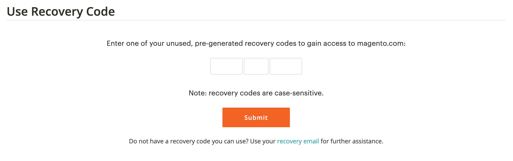

# [!DNL Commerce] アカウントを保護する

2 要素認証（TFA または 2FA）は、[!DNL Commerce] アカウントを不正アクセスからより適切に保護するためのセキュリティの追加レイヤーです。 ログイン プロセスを完了するには、標準のユーザー名とパスワードの資格情報に加えて _2 番目の要素_ が必要です。 この 2 番目の要因は、モバイル デバイスにインストールされた TFA アプリケーションによって継続的に生成され、[!DNL Commerce] アカウントとペアになる一時検証コードの形式を取ります。

TFA を有効にすると、アカウントの安全性が向上します。 権限のないユーザーは、ユーザー名とパスワードの両方の資格情報（第 1 の要因）、および個人デバイス上の TFA アプリケーションからの有効な確認コード（第 2 の要因）を持っていない限り、ログインできません。

>[!NOTE]
>
>ストアの _管理者_ を保護する二要素認証には、別の設定があります。 詳しくは、[ 二要素認証 ](../systems/security-two-factor-authentication.md) を参照してください。

## 始める前に

TFA を使用するには、TFA アプリケーションがパーソナルデバイス（スマートフォン、タブレット、コンピュータなど）にインストールされている必要があります。 利用可能なオプションは多数ありますが、一般的で無料のオプションには次のものがあります。

- Google Authenticator （iOS、Android™、BlackBerry®）

- Authy （iOS、Android™）

- Microsoft® Authenticator （iOS、Android™、Windows Phone）

## 二要素認証を有効にする

1. [[!DNL Commerce]  アカウント ](https://account.magento.com/customer/account/login){:target="_blank"} にログインします。

1. 左側のナビゲーション ウィンドウで、[**[!UICONTROL Account Settings]**] を選択し、[**[!UICONTROL Two-factor Authentication]**] を選択します。

   {width="600" zoomable="yes"}

1. **[!UICONTROL Enable]** を選択して、二要素認証の設定プロセスを開始します。

1. メールに送信した **[!UICONTROL Verification Code]** を入力し、「**[!UICONTROL Verify Code]**」を選択して続行します。

   {width="400"}

1. ダウンロードしてパーソナルデバイスにインストールした 2 要素認証アプリケーションを開きます。

1. [!UICONTROL SETUP TWO-FACTOR AUTHENTICATION] フォームで、**[!UICONTROL Setup Code]** を使用して、Adobe Commerceを TFA アプリケーションに追加します。

   {width="400"}

   TFA アプリケーションを使用して QR コードをスキャンするか、手動で入力して、コードを追加できます。 このコードは、TFA アプリケーションと [!DNL Commerce] アカウントをペアにし、アクセス権で TFA アプリを生成してアカウントへの安全なアクセスを確保するための確認コードを生成できるようにします。

1. 設定を完了します。

   - [!UICONTROL SETUP TWO FACTOR-AUTHENTICATION] フォームで、二要素認証アプリケーションの検証コードを入力します。

   - 「**[!UICONTROL Verify Code]**」を選択します。

   >[!NOTE]
   >
   >セキュリティのため、TFA アプリケーションの検証コードは継続的に期限切れになり、再生成されます。 **_常に_** 現在表示されているコードを使用します。

1. 安全でアクセス可能な場所に提示された **[!UICONTROL Recovery Codes]** を保存します。

   {width="400"}

   [!DNL Commerce] アカウントにログインしたときに確認コードを入力できない場合は、回復コードを使用してアカウントへのアクセスを回復する必要があります。

   各リカバリコードは 1 回だけ使用できますが、新しいコードを [ 生成 ](#generate-new-recovery-codes) できます。 リカバリ・コードでは大文字と小文字が区別されます。

1. 「確認」チェックボックスをオンにし、「**[!UICONTROL Submit]**」を選択して続行します。

1. アカウントへのアクセスを確実に復元するには、**[!UICONTROL Recovery Email]** を入力してください。

   この電子メール アドレスは、2 要素認証アプリケーションから確認コードを生成できず、未使用の事前生成済み回復コードにアクセスできない場合に必要です。

   24 時間に 1 回、一時的な復旧コードを生成して、指定の復旧メールアドレスに送信できます。 このコードを使用して、アカウントへのアクセスを取り戻します。

   >[!IMPORTANT]
   >
   >回復メールアカウントへのアクセスを維持します。 そうしないと、そのアカウントに送信された一時的な回復コードを使用できません。

   {width="400"}

1. 「確認」チェックボックスをオンにし、「**[!UICONTROL Submit]**」を選択して 2 要素認証の設定プロセスを完了します。

   - [!DNL Commerce] アカウントに関連付けられているメールアドレスに、2 要素認証が正常に有効になったことを確認する通知が送信されます。

   - 設定を確認する通知が回復メールアカウントに送信されます。

>[!TIP]
>
>個人デバイスを紛失したり、新しいデバイスを入手したりした場合は、[ 二要素認証アプリを変更 ](#change-your-two-factor-authentication-application) して、新しいリカバリコードを生成できます。

## 確認コードを使用してログインします

1. [!DNL Commerce] [ アカウントログイン ](https://account.magento.com/customer/account/login){:target="_blank"} に移動します。

1. ユーザー名とパスワードの資格情報を入力し、「**[!UICONTROL Login]**」を選択します。

1. プロンプトが表示されたら、2 要素認証アプリケーションに表示される **[!UICONTROL Verification Code]** を入力します。

   {width="600"}

1. 「**[!UICONTROL Submit]**」を選択して、ログインプロセスを完了します。

## 回復コードを使用してログインします

1. [!DNL Commerce] [ アカウントログイン ](https://account.magento.com/customer/account/login){:target="_blank"} に移動します。

1. ユーザー名とパスワードの資格情報を入力し、「**[!UICONTROL Login]**」を選択します。

1. 確認コードのプロンプトをバイパスするには、「**[!UICONTROL Use recovery code]**」を選択します。

1. プロンプトが表示されたら、未使用の **[!UICONTROL Recovery Code]** を入力します。

   {width="600"}

1. 「**[!UICONTROL Submit]**」を選択して、ログインプロセスを完了します。

## 回復メールを使用してログイン

1. [[!DNL Commerce]  アカウント ](https://account.magento.com/customer/account/login){:target="_blank"} にログインします。

1. ユーザー名とパスワードの資格情報を入力し、「**[!UICONTROL Login]**」を選択します。

1. 確認コードのプロンプトをバイパスするには、「**[!UICONTROL Use recovery code]**」を選択します。

1. メールで一時的な回復コードを取得するには、**[!UICONTROL recovery email]** のリンクを選択します。

   {width="600"}

1. 回復メールアカウントを開いて一時コードを取得し、指定されたフィールドにコードを入力します。

1. 「**[!UICONTROL Submit]**」を選択して、ログインプロセスを完了します。

一時的なリカバリコードを使用してアカウントにアクセスした後、[ 新しいリカバリコードを生成 ](#generate-new-recovery-codes) して保存し、アカウントへのアクセスに関するさらなる問題を防ぎます。

## 回復コードの表示

1. [!DNL Commerce] [ アカウントログイン ](https://account.magento.com/customer/account/login){:target="_blank"} に移動します。

1. ユーザー名とパスワードの資格情報を入力し、「**[!UICONTROL Login]**」を選択します。

1. 前述の 2 要素認証方式のいずれかを使用して、ログインプロセスを完了します。

1. 左側のナビゲーション ウィンドウで、[**[!UICONTROL Account Settings]**] を選択し、[**[!UICONTROL Two-factor Authentication]**] を選択します。

   {width="600" zoomable="yes"}

1. 事前生成された回復コードを表示するには、[**回復コードの表示**] を選択します。

1. メールに送信した **[!UICONTROL Verification Code]** を入力し、「**[!UICONTROL Verify Code]**」を選択して続行します。

   {width="400"}

1. 安全でアクセス可能な場所に提示された **リカバリコード** を保存します。

   [!DNL Commerce] アカウントにログインするための確認コードを提供できない場合は、アカウントのアクセスを回復する唯一の方法は回復コードを使用することです。

   各リカバリコードは 1 回限りで使用されますが、いつでも新しいコードを [ 生成 ](#generate-new-recovery-codes) できます。 リカバリ・コードでは大文字と小文字が区別されます。

   {width="400"}

1. 確認チェックボックスをオンにし、「**[!UICONTROL Submit]**」を選択してダイアログを閉じます。

## 新しい回復コードの生成

1. [!DNL Commerce] [ アカウントログイン ](https://account.magento.com/customer/account/login){:target="_blank"} に移動します。

1. ユーザー名とパスワードの資格情報を入力し、「**[!UICONTROL Login]**」を選択します。

1. 前述の 2 要素認証方式のいずれかを使用して、ログインプロセスを完了します。

1. 左側のナビゲーション ウィンドウで、[**[!UICONTROL Account Settings]**] を選択し、[**[!UICONTROL Two-factor Authentication]**] を選択します。

1. 新しい事前生成済み回復コードを生成するには、[**新しい回復コードの生成**] を選択します。

1. メールに送信した **[!UICONTROL Verification Code]** を入力し、「**[!UICONTROL Verify Code]**」を選択して続行します。

1. 安全でアクセス可能な場所に提示された **リカバリコード** を保存します。

   [!DNL Commerce] アカウントにログインしたときに確認コードを入力できない場合は、アカウントへのアクセスを回復する方法として回復コードを使用する以外に方法はありません。

   以前に生成されたすべてのリカバリ・コードが無効になり、破棄される必要があります（生成されたリカバリ・コードの現在のセットのみが機能します）。 リカバリ・コードでは大文字と小文字が区別されます。

1. 確認チェックボックスをオンにし、「**[!UICONTROL Submit]**」を選択してダイアログを閉じます。

## 回復 E メールを変更する

1. [!DNL Commerce] [ アカウントログイン ](https://account.magento.com/customer/account/login){:target="_blank"} に移動します。

1. ユーザー名とパスワードの資格情報を入力し、「**[!UICONTROL Login]**」を選択します。

1. 前述の 2 要素認証方式のいずれかを使用して、ログインプロセスを完了します。

1. 左側のナビゲーション ウィンドウで、[**[!UICONTROL Account Settings]**] を選択し、[**[!UICONTROL Two-factor Authentication]**] を選択します。

1. **復元メールを変更** を選択して、アカウントのファイルの復元メールを変更します。

1. メールに送信した **[!UICONTROL Verification Code]** を入力し、「**[!UICONTROL Verify Code]**」を選択して続行します。

1. アカウントへのアクセスを確実に回復するには、**回復メール** を入力してください。

   この電子メール アドレスは、2 要素認証アプリケーションから確認コードを生成できず、未使用の事前生成済み回復コードにアクセスできない場合に必要です。

   24 時間に 1 回、一時的な復旧コードを生成して、指定の復旧メールアドレスに送信できます。 このコードを使用して、アカウントへのアクセスを取り戻すことができます。

   >[!IMPORTANT]
   >
   >回復メールアカウントへのアクセスを維持します。 そうしないと、そのアカウントに送信された一時的な回復コードを使用できません。

1. 確認チェックボックスをオンにし、「**[!UICONTROL Submit]**」を選択してダイアログを閉じます。

   システムは、指定したリカバリ・メールにメール通知を送信します。このメール・アドレスが、一時的なリカバリ・コードを受信するためのリカバリ・メールとしてファイルに含まれていることを確認します。

## 二要素認証アプリケーションの変更

1. [!DNL Commerce] [ アカウントログイン ](https://account.magento.com/customer/account/login){:target="_blank"} に移動します。

1. ユーザー名とパスワードの資格情報を入力し、「**[!UICONTROL Login]**」を選択します。

1. 前述の 2 要素認証方式のいずれかを使用して、ログインプロセスを完了します。

1. 左側のナビゲーション ウィンドウで、[**[!UICONTROL Account Settings]**] を選択し、[**[!UICONTROL Two-factor Authentication]**] を選択します。

1. magento.com アカウントで別の TFA アプリケーションを使用するには、[**TFA アプリケーションを変更**] を選択します。

1. メールに送信した **[!UICONTROL Verification Code]** を入力し、「**[!UICONTROL Verify Code]**」を選択して続行します。

1. パーソナルデバイスで 2 要素認証アプリケーションを開きます。

1. 二要素認証アプリケーションに **設定コード** を入力します。

   TFA アプリケーションを使用して QR コードをスキャンするか、手動で入力して、コードを追加できます。 このコードは、TFA アプリケーションと [!DNL Commerce] アカウントをペアにし、TFA アプリの権限を有効にして、アカウントへの安全なアクセスを確保するための確認コードを生成します。

   >[!NOTE]
   >
   >セキュリティのため、TFA アプリケーションの検証コードは継続的に期限切れになり、再生成されます。 **_常に_** 現在表示されているコードを使用します。

1. TFA アプリケーションが [!DNL Commerce] アカウントとペアになった状態で、TFA アプリケーションに表示される **[!UICONTROL Verification Code]** を入力し、[**[!UICONTROL Verify Code]**] を選択して続行します。

1. 安全でアクセス可能な場所に提示された **リカバリコード** を保存します。

   [!DNL Commerce] アカウントにログインしたときに確認コードを入力できない場合は、アカウントのアクセスを取り戻す唯一の方法は回復コードを使用することです。

   各リカバリコードは 1 回限りで使用されますが、いつでも新しいコードを [ 生成 ](#generate-new-recovery-codes) できます。 リカバリ・コードでは大文字と小文字が区別されます。 リカバリ・コードでは大文字と小文字が区別されます。

1. チェックボックスを選択して確定し、「**[!UICONTROL Submit]**」を選択して続行します。

1. アカウントへのアクセスを確実に回復するには、**回復メール** を入力してください。

   この電子メール アドレスは、2 要素認証アプリケーションから確認コードを生成できず、未使用の事前生成済み回復コードにアクセスできない場合に必要です。

   24 時間に 1 回、一時的な復旧コードを生成して、指定の復旧メールアドレスに送信できます。 このコードを使用して、アカウントへのアクセスを取り戻します。

   >[!IMPORTANT]
   >
   >回復メールアカウントへのアクセスを維持します。 そうしないと、そのアカウントに送信された一時的な回復コードを使用できません。

1. 「確認」チェックボックスをオンにし、「**[!UICONTROL Submit]**」を選択して 2 要素認証の設定プロセスを完了します。

   一時的な復旧コードを受信するための復旧メールとして、特定のメールアドレスがファイルに含まれていることを確認するメール通知が復旧メールに送信されます。

## 二要素認証を無効にする

>[!IMPORTANT]
>
>組織のセキュリティポリシーでAdobe Commerce アカウントに多要素認証が必要な場合、2 要素認証を無効にすることはできません。

1. [!DNL Commerce] [ アカウントログイン ](https://account.magento.com/customer/account/login){:target="_blank"} に移動します。

1. ユーザー名とパスワードの資格情報を入力し、「**[!UICONTROL Login]**」を選択します。

1. 前述の 2 要素認証方式のいずれかを使用して、ログインプロセスを完了します。

1. 左側のナビゲーションペインで「**[!UICONTROL Account Settings]**」を選択し、その下の「**[!UICONTROL Two-factor Authentication]**」を選択します。

1. **[!UICONTROL Disable]** を選択して、TFA の非アクティブ化プロセスを開始します。

1. メールに送信した **[!UICONTROL Verification Code]** を入力し、「**[!UICONTROL Verify Code]**」を選択して続行します。

1. 「確認」チェックボックスをオンにし、「**[!UICONTROL Submit]**」を選択して、二要素認証の非アクティブ化を完了します。

   お使いの [!DNL Commerce] アカウントで TFA が無効になっていることを示す確認メールが送信されます。

   {width="400"}
