# [!DNL Commerce] アカウントを保護する

2要素認証（TFAまたは2FA）は、[!DNL Commerce] アカウントを不正アクセスからより適切に保護するためのセキュリティの追加レイヤーです。 ログインプロセスを完了するには、TFAでは、標準のユーザー名とパスワードの資格情報に加えて&#x200B;_秒の要素_&#x200B;が必要です。 この2つ目の要素は、モバイルデバイスにインストールされ、[!DNL Commerce] アカウントと組み合わされたTFA アプリケーションによって継続的に生成される一時的な検証コードの形式です。

TFAを有効にすると、アカウントのセキュリティが向上します。 権限のないユーザーは、ユーザー名とパスワードの両方の資格情報（最初の要素）と、個人デバイス上のTFA アプリケーションの有効な確認コード（2番目の要素）を持っていない限り、ログインできません。

>[!NOTE]
>
>ストアの&#x200B;_管理者_&#x200B;を保護する2要素認証には、別の設定があります。 詳しくは、[2要素認証](../systems/security-two-factor-authentication.md)を参照してください。

## 始める前に

TFAを使用するには、個人用デバイス（スマートフォン、タブレット、コンピューターなど）にTFA アプリケーションがインストールされている必要があります。 多くの選択肢がありますが、人気のある無料機能の中には次のようなものがあります。

- Google Authenticator （iOS、Android™、BlackBerry®）

- Authy （iOS、Android™）

- Microsoft® Authenticator （iOS、Android™、Windows Phone）

## 二段階認証を有効にする

1. [[!DNL Commerce]  アカウント &#x200B;](https://account.magento.com/customer/account/login){:target="_blank"}にログインします。

1. 左側のナビゲーション ウィンドウで、**[!UICONTROL Account Settings]**&#x200B;を選択し、**[!UICONTROL Two-factor Authentication]**&#x200B;を選択します。

   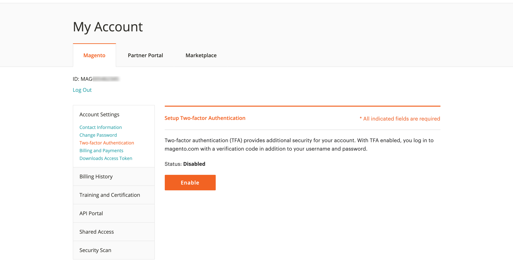{width="600" zoomable="yes"}

1. **[!UICONTROL Enable]**&#x200B;を選択して、二段階認証の設定プロセスを開始します。

1. 電子メールに送信された&#x200B;**[!UICONTROL Verification Code]**&#x200B;を入力し、**[!UICONTROL Verify Code]**&#x200B;を選択して続行します。

   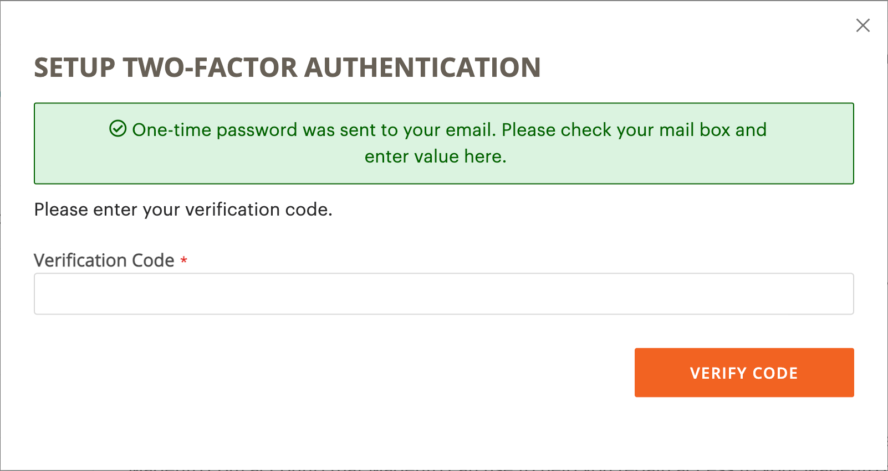{width="400"}

1. 個人デバイスにダウンロードしてインストールした2要素認証アプリケーションを開きます。

1. [!UICONTROL SETUP TWO-FACTOR AUTHENTICATION] フォームで、**[!UICONTROL Setup Code]**&#x200B;を使用してAdobe CommerceをTFA アプリケーションに追加します。

   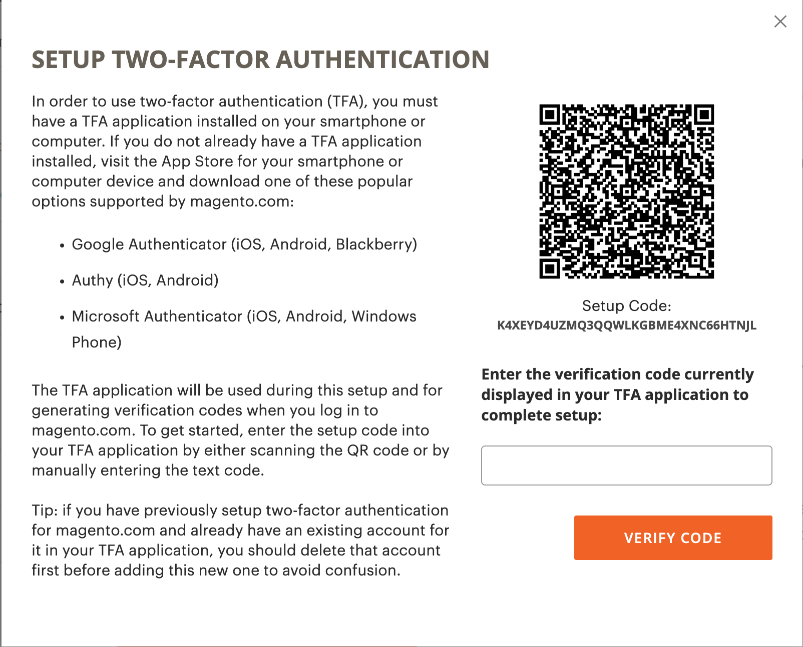{width="400"}

   コードを追加するには、TFA アプリケーションを使用してQR コードをスキャンするか、手動で入力します。 このコードは、TFA アプリケーションと[!DNL Commerce] アカウントを組み合わせ、権限がTFA アプリを生成して、安全なアカウント アクセス用の確認コードを生成できるようにします。

1. 設定を完了します。

   - [!UICONTROL SETUP TWO FACTOR-AUTHENTICATION] フォームで、2段階認証アプリケーションの認証コードを入力します。

   - **[!UICONTROL Verify Code]**&#x200B;を選択します。

   >[!NOTE]
   >
   >セキュリティのため、TFA アプリケーションの検証コードは継続的に期限切れになり、再生成されます。 **_常に_**&#x200B;は、現在表示されているコードを使用します。

1. 安全でアクセスしやすい場所に表示されている&#x200B;**[!UICONTROL Recovery Codes]**&#x200B;を保存します。

   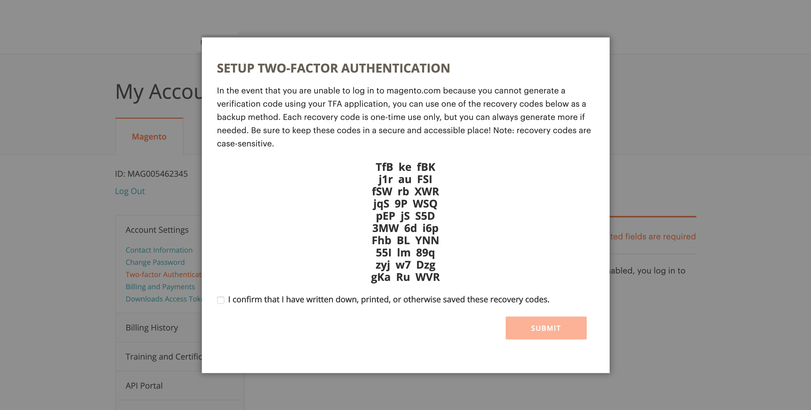{width="400"}

   [!DNL Commerce] アカウントにログインする際に確認コードを提供できない場合は、アカウントへのアクセスを回復するために回復用コードを使用する必要があります。

   各リカバリーコードは1回のみ使用できますが、新しいリカバリーコードを[生成](#generate-new-recovery-codes)できます。 リカバリーコードでは、大文字と小文字が区別されます。

1. 確認チェックボックスを選択し、**[!UICONTROL Submit]**&#x200B;を選択して続行します。

1. アカウントへのアクセス権を回復できるように、**[!UICONTROL Recovery Email]**&#x200B;を入力してください。

   このメールアドレスは、2段階認証アプリケーションから認証コードを生成できず、未使用の事前生成された回復用コードにアクセスできない場合に必要です。

   24時間ごとに1回、指定した回復用メールアドレスに一時的な回復用コードを生成して送信できます。 このコードを使用して、アカウントへのアクセスを取り戻します。

   >[!IMPORTANT]
   >
   >回復用メールアカウントへのアクセスを維持します。 それ以外の場合は、そのアカウントに送信された一時的な回復用コードを使用することはできません。

   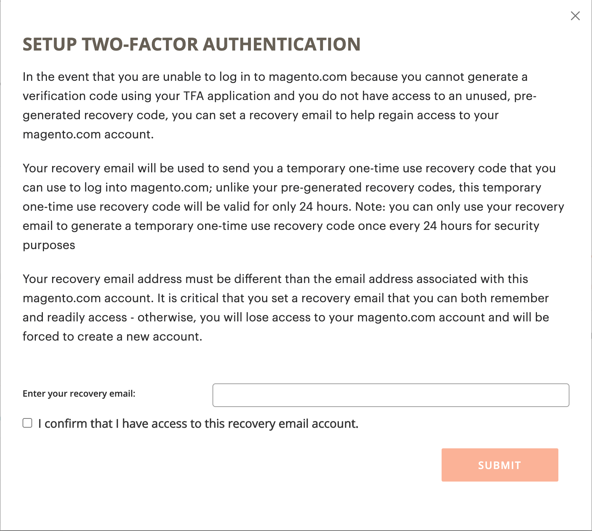{width="400"}

1. 確認チェックボックスを選択し、**[!UICONTROL Submit]**&#x200B;を選択して2要素認証の設定プロセスを完了します。

   - 2段階認証が正常に有効になったことを確認する通知が[!DNL Commerce] アカウントに関連付けられている電子メールアドレスに送信されます。

   - 設定を確認するための通知が回復用メールアカウントに送信されます。

>[!TIP]
>
>個人用デバイスを紛失したり、新しいデバイスを入手したりした場合は、[二段階認証アプリ &#x200B;](#change-your-two-factor-authentication-application)を変更して、新しい回復用コードを生成できます。

## 確認コードを使ってログイン

1. [!DNL Commerce] [&#x200B; アカウントログイン &#x200B;](https://account.magento.com/customer/account/login){:target="_blank"}に移動します。

1. ユーザー名とパスワードの資格情報を入力し、**[!UICONTROL Login]**&#x200B;を選択します。

1. プロンプトが表示されたら、2段階認証アプリケーションに表示される&#x200B;**[!UICONTROL Verification Code]**&#x200B;を入力します。

   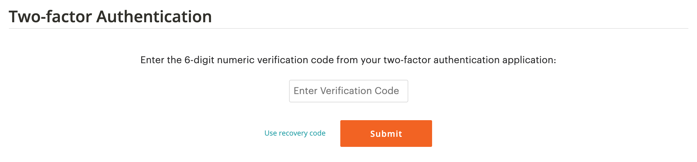{width="600"}

1. **[!UICONTROL Submit]**&#x200B;を選択してログインプロセスを完了します。

## 回復用コードでログイン

1. [!DNL Commerce] [&#x200B; アカウントログイン &#x200B;](https://account.magento.com/customer/account/login){:target="_blank"}に移動します。

1. ユーザー名とパスワードの資格情報を入力し、**[!UICONTROL Login]**&#x200B;を選択します。

1. **[!UICONTROL Use recovery code]**&#x200B;を選択して、確認コード プロンプトを無視します。

1. プロンプトが表示されたら、未使用の&#x200B;**[!UICONTROL Recovery Code]**&#x200B;を入力します。

   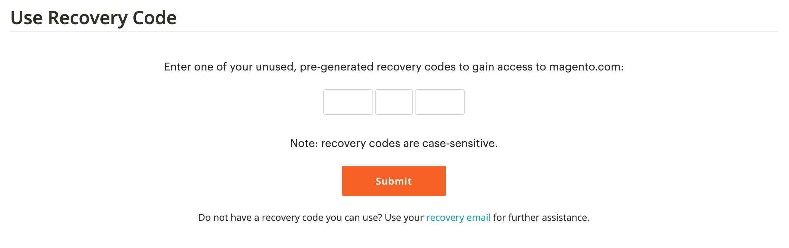{width="600"}

1. **[!UICONTROL Submit]**&#x200B;を選択してログインプロセスを完了します。

## 回復用メールアドレスでログイン

1. [[!DNL Commerce]  アカウント &#x200B;](https://account.magento.com/customer/account/login){:target="_blank"}にログインします。

1. ユーザー名とパスワードの資格情報を入力し、**[!UICONTROL Login]**&#x200B;を選択します。

1. **[!UICONTROL Use recovery code]**&#x200B;を選択して、確認コード プロンプトを無視します。

1. 電子メールで一時的な回復用コードを取得するには、**[!UICONTROL recovery email]** リンクを選択します。

   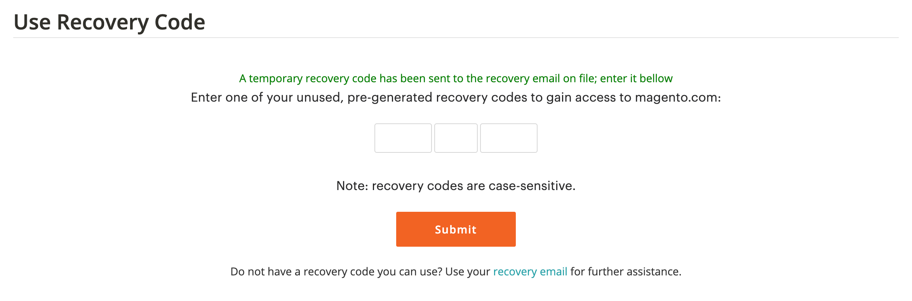{width="600"}

1. 回復用の電子メールアカウントを開いて一時コードを取得し、指定したフィールドにコードを入力します。

1. **[!UICONTROL Submit]**&#x200B;を選択してログインプロセスを完了します。

一時的な回復用コードを使用してアカウントにアクセスした後、[新しい回復用コードを生成](#generate-new-recovery-codes)して保存し、アカウントへのアクセスに関する問題が発生するのを防ぎます。

## 回復用コードを表示

1. [!DNL Commerce] [&#x200B; アカウントログイン &#x200B;](https://account.magento.com/customer/account/login){:target="_blank"}に移動します。

1. ユーザー名とパスワードの資格情報を入力し、**[!UICONTROL Login]**&#x200B;を選択します。

1. 前述の2要素認証方法のいずれかを使用して、ログインプロセスを完了します。

1. 左側のナビゲーション ウィンドウで、**[!UICONTROL Account Settings]**&#x200B;を選択し、**[!UICONTROL Two-factor Authentication]**&#x200B;を選択します。

   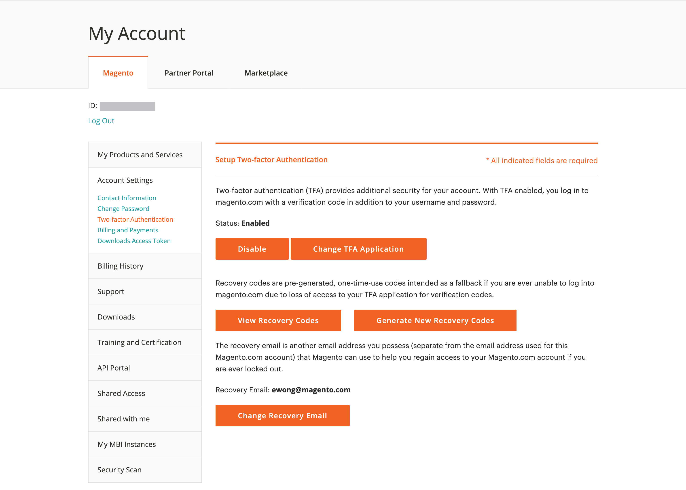{width="600" zoomable="yes"}

1. 事前生成された回復用コードを表示するには、**回復用コードを表示**&#x200B;を選択します。

1. 電子メールに送信された&#x200B;**[!UICONTROL Verification Code]**&#x200B;を入力し、**[!UICONTROL Verify Code]**&#x200B;を選択して続行します。

   {width="400"}

1. 安全でアクセスしやすい場所に表示されている&#x200B;**回復用コード**&#x200B;を保存します。

   [!DNL Commerce] アカウントにログインするための確認コードを提供できない場合は、回復用コードを使用することがアカウントへのアクセスを回復する唯一の方法です。

   各リカバリーコードは1回限りの使用のみですが、常に[新しいコードを](#generate-new-recovery-codes)生成できます。 リカバリーコードでは、大文字と小文字が区別されます。

   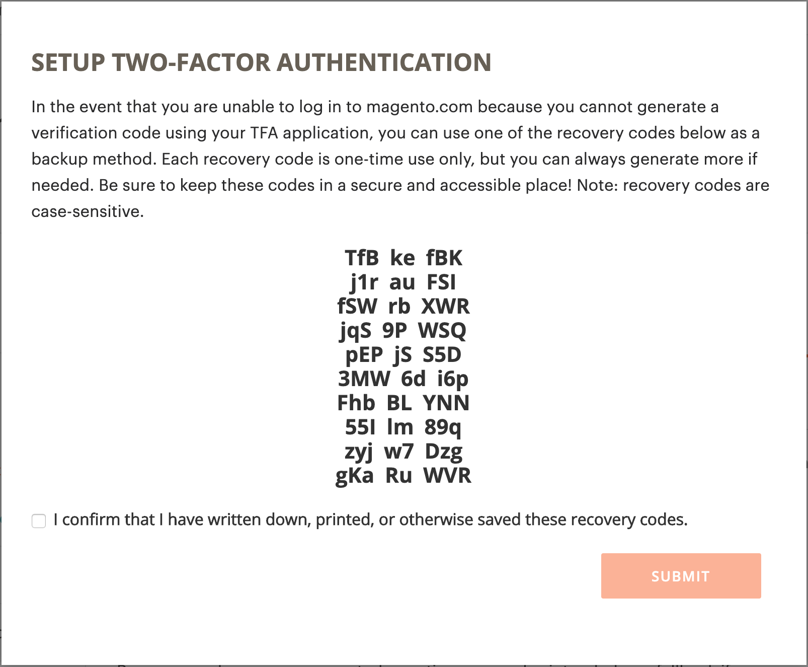{width="400"}

1. 確認チェックボックスを選択し、**[!UICONTROL Submit]**&#x200B;を選択してダイアログを閉じます。

## 新しい回復用コードを生成

1. [!DNL Commerce] [&#x200B; アカウントログイン &#x200B;](https://account.magento.com/customer/account/login){:target="_blank"}に移動します。

1. ユーザー名とパスワードの資格情報を入力し、**[!UICONTROL Login]**&#x200B;を選択します。

1. 前述の2要素認証方法のいずれかを使用して、ログインプロセスを完了します。

1. 左側のナビゲーション ウィンドウで、**[!UICONTROL Account Settings]**&#x200B;を選択し、**[!UICONTROL Two-factor Authentication]**&#x200B;を選択します。

1. 新しい事前生成された回復用コードを生成するには、**新しい回復用コードを生成**&#x200B;を選択します。

1. 電子メールに送信された&#x200B;**[!UICONTROL Verification Code]**&#x200B;を入力し、**[!UICONTROL Verify Code]**&#x200B;を選択して続行します。

1. 安全でアクセスしやすい場所に表示されている&#x200B;**回復用コード**&#x200B;を保存します。

   [!DNL Commerce] アカウントにログインするときに確認コードを提供できない場合は、回復用コードを使用することがアカウントへのアクセスを回復する唯一の方法です。

   以前に生成したすべての回復用コードが無効になり、破棄されます（現在の生成された回復用コードのセットのみが機能します）。 リカバリーコードでは、大文字と小文字が区別されます。

1. 確認チェックボックスを選択し、**[!UICONTROL Submit]**&#x200B;を選択してダイアログを閉じます。

## 回復用メールアドレスを変更

1. [!DNL Commerce] [&#x200B; アカウントログイン &#x200B;](https://account.magento.com/customer/account/login){:target="_blank"}に移動します。

1. ユーザー名とパスワードの資格情報を入力し、**[!UICONTROL Login]**&#x200B;を選択します。

1. 前述の2要素認証方法のいずれかを使用して、ログインプロセスを完了します。

1. 左側のナビゲーション ウィンドウで、**[!UICONTROL Account Settings]**&#x200B;を選択し、**[!UICONTROL Two-factor Authentication]**&#x200B;を選択します。

1. 「**回復用メールの変更**」を選択して、アカウントのファイルの回復用メールを変更します。

1. 電子メールに送信された&#x200B;**[!UICONTROL Verification Code]**&#x200B;を入力し、**[!UICONTROL Verify Code]**&#x200B;を選択して続行します。

1. アカウントへのアクセスを回復できるように、**回復用メール**&#x200B;を入力してください。

   このメールアドレスは、2段階認証アプリケーションから認証コードを生成できず、未使用の事前生成された回復用コードにアクセスできない場合に必要です。

   24時間ごとに1回、指定した回復用メールアドレスに一時的な回復用コードを生成して送信できます。 このコードを使用して、アカウントへのアクセスを取り戻すことができます。

   >[!IMPORTANT]
   >
   >回復用メールアカウントへのアクセスを維持します。 それ以外の場合は、そのアカウントに送信された一時的な回復用コードを使用することはできません。

1. 確認チェックボックスを選択し、**[!UICONTROL Submit]**&#x200B;を選択してダイアログを閉じます。

   システムは、特定のメールアドレスが一時的な回復用コードを受信するための回復用メールとしてファイルに登録されていることを確認するために指定した回復用メールにメール通知を送信します。

## 二段階認証アプリケーションの変更

1. [!DNL Commerce] [&#x200B; アカウントログイン &#x200B;](https://account.magento.com/customer/account/login){:target="_blank"}に移動します。

1. ユーザー名とパスワードの資格情報を入力し、**[!UICONTROL Login]**&#x200B;を選択します。

1. 前述の2要素認証方法のいずれかを使用して、ログインプロセスを完了します。

1. 左側のナビゲーション ウィンドウで、**[!UICONTROL Account Settings]**&#x200B;を選択し、**[!UICONTROL Two-factor Authentication]**&#x200B;を選択します。

1. 「**TFA アプリケーションを変更**」を選択して、magento.com アカウントで別のTFA アプリケーションを使用します。

1. 電子メールに送信された&#x200B;**[!UICONTROL Verification Code]**&#x200B;を入力し、**[!UICONTROL Verify Code]**&#x200B;を選択して続行します。

1. 個人用デバイスで2段階認証アプリケーションを開きます。

1. 二段階認証アプリケーションに&#x200B;**設定コード**&#x200B;を入力します。

   TFA アプリケーションを使用してQR コードをスキャンするか、手動で入力することで、コードを追加できます。 このコードは、TFA アプリケーションと[!DNL Commerce] アカウントを組み合わせ、TFA アプリの権限がアカウントに安全にアクセスするための確認コードを生成できるようにします。

   >[!NOTE]
   >
   >セキュリティのため、TFA アプリケーションの検証コードは継続的に期限切れになり、再生成されます。 **_常に_**&#x200B;は、現在表示されているコードを使用します。

1. TFA アプリケーションを[!DNL Commerce] アカウントとペアリングした状態で、TFA アプリケーションに表示されている&#x200B;**[!UICONTROL Verification Code]**&#x200B;を入力し、**[!UICONTROL Verify Code]**&#x200B;を選択して続行します。

1. 安全でアクセスしやすい場所に表示されている&#x200B;**回復用コード**&#x200B;を保存します。

   [!DNL Commerce] アカウントにログインするときに確認コードを提供できない場合、アカウントへのアクセスを回復する唯一の方法は、回復コードを使用することです。

   各リカバリーコードは1回限りの使用のみですが、常に[新しいコードを](#generate-new-recovery-codes)生成できます。 リカバリーコードでは、大文字と小文字が区別されます。 リカバリーコードでは、大文字と小文字が区別されます。

1. チェックボックスを選択して確定し、**[!UICONTROL Submit]**&#x200B;を選択して続行します。

1. アカウントへのアクセスを回復できるように、**回復用メール**&#x200B;を入力してください。

   このメールアドレスは、2段階認証アプリケーションから認証コードを生成できず、未使用の事前生成された回復用コードにアクセスできない場合に必要です。

   24時間ごとに1回、指定した回復用メールアドレスに一時的な回復用コードを生成して送信できます。 このコードを使用して、アカウントへのアクセスを取り戻します。

   >[!IMPORTANT]
   >
   >回復用メールアカウントへのアクセスを維持します。 それ以外の場合は、そのアカウントに送信された一時的な回復用コードを使用することはできません。

1. 確認チェックボックスを選択し、**[!UICONTROL Submit]**&#x200B;を選択して2要素認証の設定プロセスを完了します。

   特定のメールアドレスが一時的なリカバリコードを受信するためのリカバリメールとしてファイルに登録されていることを確認するために、指定したリカバリメールにメール通知が送信されます。

## 二段階認証を無効にする

>[!IMPORTANT]
>
>組織のセキュリティポリシーでAdobe Commerce アカウントに多要素認証が必要な場合は、二要素認証を無効にすることはできません。

1. [!DNL Commerce] [&#x200B; アカウントログイン &#x200B;](https://account.magento.com/customer/account/login){:target="_blank"}に移動します。

1. ユーザー名とパスワードの資格情報を入力し、**[!UICONTROL Login]**&#x200B;を選択します。

1. 前述の2要素認証方法のいずれかを使用して、ログインプロセスを完了します。

1. 左側のナビゲーションパネルで、**[!UICONTROL Account Settings]**&#x200B;を選択し、下の&#x200B;**[!UICONTROL Two-factor Authentication]**&#x200B;を選択します。

1. 「**[!UICONTROL Disable]**」を選択して、TFAの非アクティブ化プロセスを開始します。

1. 電子メールに送信された&#x200B;**[!UICONTROL Verification Code]**&#x200B;を入力し、**[!UICONTROL Verify Code]**&#x200B;を選択して続行します。

1. 確認チェックボックスを選択し、**[!UICONTROL Submit]**&#x200B;を選択して、二段階認証の非アクティブ化を完了します。

   TFAが[!DNL Commerce] アカウントで無効になったことを示す確認メールがシステムから送信されます。

   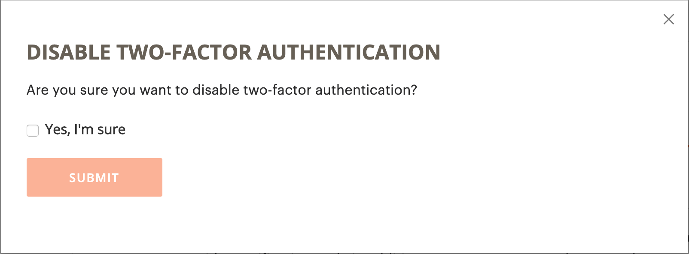{width="400"}
