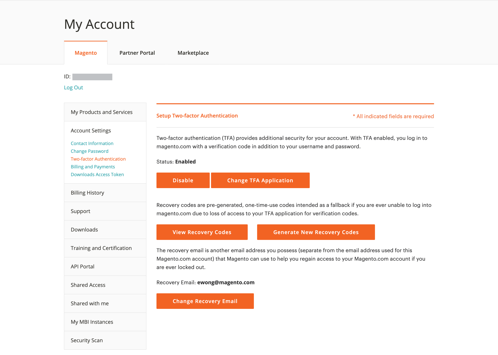

# の保護 [!DNL Commerce] アカウント

2 要素認証（TFA または 2FA）は、セキュリティの追加レイヤーで、お客様のセキュリティを強化します。 [!DNL Commerce] 未認証のアクセスからアカウントします。 ログイン プロセスを完了するには、TFA で _第 2 因子_ 標準のユーザー名とパスワードの資格情報に加えて。 この 2 番目の要因は、モバイル デバイスにインストールされた TFA アプリケーションによって継続的に生成され、お使いのデバイスとペアになる一時検証コードの形式を取ります [!DNL Commerce] アカウント。

TFA を有効にすると、アカウントの安全性が向上します。 権限のないユーザーは、ユーザー名とパスワードの両方の資格情報（第 1 の要因）、および個人デバイス上の TFA アプリケーションからの有効な確認コード（第 2 の要因）を持っていない限り、ログインできません。

>[!NOTE]
>
>を保護する 2 要素認証 _Admin_ ストアのは別個の設定を持ちます。 詳しくは、 [二要素認証](../systems/security-two-factor-authentication.md).

## 始める前に

TFA を使用するには、TFA アプリケーションがパーソナルデバイス（スマートフォン、タブレット、コンピュータなど）にインストールされている必要があります。 利用可能なオプションは多数ありますが、一般的で無料のオプションには次のものがあります。

- Google Authenticator （iOS、Android™、BlackBerry®）

- Authy （iOS、Android™）

- Microsoft® Authenticator （iOS、Android™、Windows Phone）

## 二要素認証を有効にする

1. にログイン [[!DNL Commerce] アカウント][1]{:target=&quot;_blank&quot;}。

1. 左側のナビゲーションウィンドウで、を選択します。 **[!UICONTROL Account Settings]**&#x200B;を選択してから、 **[!UICONTROL Two-factor Authentication]**.

   {width="600" zoomable="yes"}

1. を選択 **[!UICONTROL Enable]** 二要素認証設定プロセスを開始します。

1. を入力 **[!UICONTROL Verification Code]** 電子メールに送信済み **[!UICONTROL Verify Code]** 続行します。

   {width="400"}

1. ダウンロードしてパーソナルデバイスにインストールした 2 要素認証アプリケーションを開きます。

1. 日 [!UICONTROL SETUP TWO-FACTOR AUTHENTICATION] フォーム、を使用する **[!UICONTROL Setup Code]** Adobe Commerceを TFA アプリケーションに追加する場合。

   {width="400"}

   TFA アプリケーションを使用して QR コードをスキャンするか、手動で入力して、コードを追加できます。 このコードは、TFA アプリケーションを [!DNL Commerce] アカウントを作成し、TFA アプリを生成する権限を有効にして、安全なアカウントアクセスのための確認コードを生成します。

1. 設定を完了します。

   - 日 [!UICONTROL SETUP TWO FACTOR-AUTHENTICATION] フォームに、二要素認証アプリケーションの確認コードを入力します。

   - を選択 **[!UICONTROL Verify Code]**.

   >[!NOTE]
   >
   >セキュリティのため、TFA アプリケーションの検証コードは継続的に期限切れになり、再生成されます。 **_Always_** 現在表示されているコードを使用します。

1. を保存します **[!UICONTROL Recovery Codes]** 安全でアクセス可能な場所に提示。

   {width="400"}

   にログインしたときに確認コードを提供できない場合 [!DNL Commerce] アカウントにアクセスするには、回復コードを使用する必要があります。

   各リカバリコードは 1 回だけ使用できますが、 [generate](#generate-new-recovery-codes) 新しいもの。 リカバリ・コードでは大文字と小文字が区別されます。

1. 「確認」チェックボックスをオンにし、 **[!UICONTROL Submit]** 続行します。

1. アカウントへのアクセスを確実に復元するには、 **[!UICONTROL Recovery Email]**.

   この電子メール アドレスは、2 要素認証アプリケーションから確認コードを生成できず、未使用の事前生成済み回復コードにアクセスできない場合に必要です。

   24 時間に 1 回、一時的な復旧コードを生成して、指定の復旧メールアドレスに送信できます。 このコードを使用して、アカウントへのアクセスを取り戻します。

   >[!IMPORTANT]
   >
   >回復メールアカウントへのアクセスを維持します。 そうしないと、そのアカウントに送信された一時的な回復コードを使用できません。

   {width="400"}

1. 「確認」チェックボックスをオンにし、 **[!UICONTROL Submit]** 二要素認証設定プロセスを完了します。

   - 通知が、に関連付けられたメールアドレスに送信されます [!DNL Commerce] アカウント :2 要素認証が正常に有効になったことを確認します。

   - 設定を確認する通知が回復メールアカウントに送信されます。

>[!TIP]
>
>個人用デバイスを失ったり、新しいデバイスを取得した場合は、次の操作を行うことができます [二要素認証アプリの変更](#change-your-two-factor-authentication-application) 新しい回復コードを生成します。

## 確認コードを使用してログインします

1. に移動します [!DNL Commerce] [アカウントのログイン][1]{:target=&quot;_blank&quot;}。

1. ユーザー名とパスワードの認証情報を入力し、 **[!UICONTROL Login]**.

1. を入力 **[!UICONTROL Verification Code]** プロンプトが表示されたら、2 要素認証アプリケーションに表示されます。

   {width="600"}

1. を選択 **[!UICONTROL Submit]** に移動してログインプロセスを完了します。

## 回復コードを使用してログインします

1. に移動します [!DNL Commerce] [アカウントのログイン][1]{:target=&quot;_blank&quot;}。

1. ユーザー名とパスワードの認証情報を入力し、 **[!UICONTROL Login]**.

1. を選択 **[!UICONTROL Use recovery code]** 確認コードのプロンプトをバイパスします。

1. 未使用のを入力 **[!UICONTROL Recovery Code]** プロンプトが表示されたら、

   {width="600"}

1. を選択 **[!UICONTROL Submit]** に移動してログインプロセスを完了します。

## 回復メールを使用してログイン

1. にログイン [[!DNL Commerce] アカウント][1]{:target=&quot;_blank&quot;}。

1. ユーザー名とパスワードの認証情報を入力し、 **[!UICONTROL Login]**.

1. を選択 **[!UICONTROL Use recovery code]** 確認コードのプロンプトをバイパスします。

1. 一時的な回復コードをメールで取得するには、 **[!UICONTROL recovery email]** リンク。

   {width="600"}

1. 回復メールアカウントを開いて一時コードを取得し、指定されたフィールドにコードを入力します。

1. を選択 **[!UICONTROL Submit]** に移動してログインプロセスを完了します。

一時的な復元コードを使用してアカウントにアクセスした後、 [新しい回復コードの生成](#generate-new-recovery-codes) 保存して、アカウントアクセスの問題が再発しないようにします。

## 回復コードの表示

1. に移動します [!DNL Commerce] [アカウントのログイン][1]{:target=&quot;_blank&quot;}。

1. ユーザー名とパスワードの認証情報を入力し、 **[!UICONTROL Login]**.

1. 前述の 2 要素認証方式のいずれかを使用して、ログインプロセスを完了します。

1. 左側のナビゲーションウィンドウで、を選択します。 **[!UICONTROL Account Settings]**&#x200B;を選択してから、 **[!UICONTROL Two-factor Authentication]**.

   {width="600" zoomable="yes"}

1. 事前生成済みの回復コードを表示するには、次を選択します **回復コードの表示**.

1. を入力 **[!UICONTROL Verification Code]** 電子メールに送信済み **[!UICONTROL Verify Code]** 続行します。

   {width="400"}

1. を保存します **リカバリコード** 安全でアクセス可能な場所に提示。

   確認コードを入力してにログインできない場合 [!DNL Commerce] アカウント、リカバリコードを使用することは、アカウントへのアクセスを取り戻す唯一の方法です。

   各リカバリコードは 1 回限りの使用ですが、いつでも使用できます [generate](#generate-new-recovery-codes) 新しいもの。 リカバリ・コードでは大文字と小文字が区別されます。

   {width="400"}

1. 「確認」チェックボックスをオンにし、 **[!UICONTROL Submit]** をクリックしてダイアログを閉じます。

## 新しい回復コードの生成

1. に移動します [!DNL Commerce] [アカウントのログイン][1]{:target=&quot;_blank&quot;}。

1. ユーザー名とパスワードの認証情報を入力し、 **[!UICONTROL Login]**.

1. 前述の 2 要素認証方式のいずれかを使用して、ログインプロセスを完了します。

1. 左側のナビゲーションウィンドウで、を選択します。 **[!UICONTROL Account Settings]**&#x200B;を選択してから、 **[!UICONTROL Two-factor Authentication]**.

1. 新しい事前生成済みリカバリ・コードを生成するには、次のオプションを選択します **新しい回復コードの生成**.

1. を入力 **[!UICONTROL Verification Code]** 電子メールに送信済み **[!UICONTROL Verify Code]** 続行します。

1. を保存します **リカバリコード** 安全でアクセス可能な場所に提示。

   にログインしたときに確認コードを提供できない場合 [!DNL Commerce] アカウント、リカバリコードを使用することは、アカウントへのアクセスを取り戻す唯一の方法です。

   以前に生成されたすべてのリカバリ・コードが無効になり、破棄される必要があります（生成されたリカバリ・コードの現在のセットのみが機能します）。 リカバリ・コードでは大文字と小文字が区別されます。

1. 「確認」チェックボックスをオンにし、 **[!UICONTROL Submit]** をクリックしてダイアログを閉じます。

## 回復 E メールを変更する

1. に移動します [!DNL Commerce] [アカウントのログイン][1]{:target=&quot;_blank&quot;}。

1. ユーザー名とパスワードの認証情報を入力し、 **[!UICONTROL Login]**.

1. 前述の 2 要素認証方式のいずれかを使用して、ログインプロセスを完了します。

1. 左側のナビゲーションウィンドウで、を選択します。 **[!UICONTROL Account Settings]**&#x200B;を選択してから、 **[!UICONTROL Two-factor Authentication]**.

1. を選択 **リカバリ用メールの変更** でアカウントのファイルの回復メールを変更します。

1. を入力 **[!UICONTROL Verification Code]** 電子メールに送信済み **[!UICONTROL Verify Code]** 続行します。

1. アカウントへのアクセスを確実に回復するには、 **回復用 E メール**.

   この電子メール アドレスは、2 要素認証アプリケーションから確認コードを生成できず、未使用の事前生成済み回復コードにアクセスできない場合に必要です。

   24 時間に 1 回、一時的な復旧コードを生成して、指定の復旧メールアドレスに送信できます。 このコードを使用して、アカウントへのアクセスを取り戻すことができます。

   >[!IMPORTANT]
   >
   >回復メールアカウントへのアクセスを維持します。 そうしないと、そのアカウントに送信された一時的な回復コードを使用できません。

1. 「確認」チェックボックスをオンにし、 **[!UICONTROL Submit]** をクリックしてダイアログを閉じます。

   システムは、指定したリカバリ・メールにメール通知を送信します。このメール・アドレスが、一時的なリカバリ・コードを受信するためのリカバリ・メールとしてファイルに含まれていることを確認します。

## 二要素認証アプリケーションの変更

1. に移動します [!DNL Commerce] [アカウントのログイン][1]{:target=&quot;_blank&quot;}。

1. ユーザー名とパスワードの認証情報を入力し、 **[!UICONTROL Login]**.

1. 前述の 2 要素認証方式のいずれかを使用して、ログインプロセスを完了します。

1. 左側のナビゲーションウィンドウで、を選択します。 **[!UICONTROL Account Settings]**&#x200B;を選択してから、 **[!UICONTROL Two-factor Authentication]**.

1. を選択 **TFA アプリケーションの変更** magento.com アカウントで別の TFA アプリケーションを使用するには

1. を入力 **[!UICONTROL Verification Code]** 電子メールに送信済み **[!UICONTROL Verify Code]** 続行します。

1. パーソナルデバイスで 2 要素認証アプリケーションを開きます。

1. を入力 **設定コード** を 2 要素認証アプリケーションに追加します。

   TFA アプリケーションを使用して QR コードをスキャンするか、手動で入力して、コードを追加できます。 このコードは、TFA アプリケーションを [!DNL Commerce] アカウントを作成し、TFA アプリのアクセス許可を有効にして、安全なアカウント アクセスのための確認コードを生成します。

   >[!NOTE]
   >
   >セキュリティのため、TFA アプリケーションの検証コードは継続的に期限切れになり、再生成されます。 **_Always_** 現在表示されているコードを使用します。

1. これで、TFA アプリケーションがユーザのアプリケーションとペアリングされました [!DNL Commerce] アカウント、を入力 **[!UICONTROL Verification Code]** TFA アプリケーションに表示し、を選択します。 **[!UICONTROL Verify Code]** 続行します。

1. を保存します **リカバリコード** 安全でアクセス可能な場所に提示。

   にログインしたときに確認コードを提供できない場合 [!DNL Commerce] アカウント、アカウントへのアクセスを取り戻す唯一の方法は、リカバリコードを使用することです。

   各リカバリコードは 1 回限りの使用ですが、いつでも使用できます [generate](#generate-new-recovery-codes) 新しいもの。 リカバリ・コードでは大文字と小文字が区別されます。 リカバリ・コードでは大文字と小文字が区別されます。

1. 確認するチェックボックスを選択し、次を選択します **[!UICONTROL Submit]** 続行します。

1. アカウントへのアクセスを確実に回復するには、 **回復用 E メール**.

   この電子メール アドレスは、2 要素認証アプリケーションから確認コードを生成できず、未使用の事前生成済み回復コードにアクセスできない場合に必要です。

   24 時間に 1 回、一時的な復旧コードを生成して、指定の復旧メールアドレスに送信できます。 このコードを使用して、アカウントへのアクセスを取り戻します。

   >[!IMPORTANT]
   >
   >回復メールアカウントへのアクセスを維持します。 そうしないと、そのアカウントに送信された一時的な回復コードを使用できません。

1. 「確認」チェックボックスをオンにし、 **[!UICONTROL Submit]** 二要素認証設定プロセスを完了します。

   一時的な復旧コードを受信するための復旧メールとして、特定のメールアドレスがファイルに含まれていることを確認するメール通知が復旧メールに送信されます。

## 二要素認証を無効にする

>[!IMPORTANT]
>
>組織のセキュリティポリシーでAdobe Commerce アカウントに多要素認証が必要な場合、2 要素認証を無効にすることはできません。

1. に移動します [!DNL Commerce] [アカウントのログイン][1]{:target=&quot;_blank&quot;}。

1. ユーザー名とパスワードの認証情報を入力し、 **[!UICONTROL Login]**.

1. 前述の 2 要素認証方式のいずれかを使用して、ログインプロセスを完了します。

1. 左側のナビゲーションウィンドウで、を選択します。 **[!UICONTROL Account Settings]** を選択して、 **[!UICONTROL Two-factor Authentication]** その下に。

1. を選択 **[!UICONTROL Disable]** TFA の非アクティブ化プロセスを開始します。

1. を入力 **[!UICONTROL Verification Code]** 電子メールに送信済み **[!UICONTROL Verify Code]** 続行します。

1. 「確認」チェックボックスをオンにし、 **[!UICONTROL Submit]** 二要素認証の非アクティブ化を完了します。

   システムから、で TFA が無効化されたことを示す確認メールが送信されます [!DNL Commerce] アカウント。

   {width="400"}

[1]: https://account.magento.com/customer/account/login
