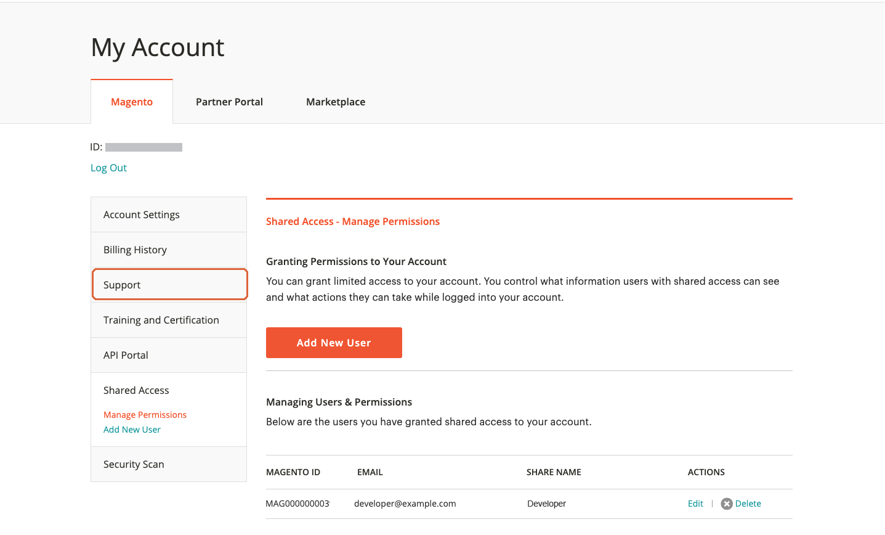

# を共有 [!DNL Commerce] アカウント

あなたの [!DNL Commerce] アカウントには、サイトの管理を支援する信頼できる従業員やサービスプロバイダーが利用できる情報が含まれています。 プライマリアカウント所有者は、他のユーザーに対して制限付きアクセスを許可する権限を持ちます [!DNL Commerce] 口座名義人。 共有アクセスは取り消すことはできますが、あるユーザーから別のユーザーに転送することはできません。

この [!DNL Commerce] サポートチームはアカウントにアクセスできず、共有アクセスを設定できません。 共有アクセスを設定できるのは、適切な権限を持つプライマリアカウント所有者のみです。 アカウントアクセスを共有すると、請求履歴やクレジットカード情報などの機密情報はすべて保護されたままになり、他のユーザーは使用できなくなります。

>[!NOTE]
>
>共有アクセスを持つユーザーが実行するすべてのアクションは、プライマリアカウント所有者の唯一の責任です。 Adobeは、お客様のアカウントに対して共通のアクセス権を持つユーザーが行うすべてのアクションに対して責任を負いません。

{width="600" zoomable="yes"}

## 共有アカウントの設定

1. 開始する前に、から次の情報を取得します [!DNL Commerce] のアカウント **新しい共有アクセス権限**:

   - ユーザーは、account.adobe.comで既にアカウントに登録されており、account.magento.comでログインしている必要があります。
   - この `MAGE ID/Account ID (MAG00XXXXXXX)` は、の左上隅に表示されます。 _[!UICONTROL Magento]_タブで、すぐ上&#x200B;**ログアウト**リンク。
   - この `Email` アカウントに関連付けられているアドレス。

1. にログイン [[!DNL Commerce] アカウント](commerce-account-create.md).

1. 左側のナビゲーションパネルで、 **[!UICONTROL Shared Access]**.

1. クリック **[!UICONTROL Add New User]**.

   {width="600" zoomable="yes"}

1. 次の下 [!UICONTROL _New User Information]_、次の手順を実行します。

   - を入力 **[!UICONTROL Account ID]** 新しいユーザーの [!DNL Commerce] アカウント。
   - を入力 **[!UICONTROL Email]** 新しいユーザーのに関連付けられているアドレス [!DNL Commerce] アカウント。

   {width="600"}

1. 次の下 _[!UICONTROL Shared Information]_、次の手順を実行します。

   - 共有アカウントを識別するには、 **[!UICONTROL Share Name]**. この名前は内部参照用であり、自分とアカウントを共有する相手にのみ表示されます。

     ベストプラクティスは、組織名をとして使用することです [!UICONTROL Share Name]. で始まる名前は使用しないでください `CLOUD SHARED ACCESS FROM MAG XYX`.
   - 新しいユーザーと個人の連絡先情報を共有する場合は、次のように入力します **[!UICONTROL Your Email]** および **[!UICONTROL Your Phone]**.

1. 次の下 _[!UICONTROL Grant Account Permissions]_各チェックボックスをオンにします [!DNL Commerce] 共有する製品とサービス。

   {width="600"}

1. クリック **[!UICONTROL Create Shared Access]**.

   新しいユーザー情報がに表示されます _[!UICONTROL Manage Permissions]_共有アクセスページの「」セクションと、共有アカウントへのアクセス手順を記載した電子メール招待状が新しいユーザーに送信されます。

   {width="600" zoomable="yes"}

## 共有アカウントへのアクセス

以下の手順は、共有アカウントへの招待を受けた共有ユーザーの視点で記述されています。

1. 共有アカウントへの招待メールを受け取ったら、メールに記載されている手順に従って自分のアカウントにログインします [!DNL Commerce] アカウント。

   アカウントの左側のナビゲーションパネルに新しいが表示されます _[!UICONTROL Shared with me]_タブ。 この_[!UICONTROL Switch Accounts]_ 右上隅のコントロールには、次のオプションがあります `My Account` と共有アカウントの名前。

   {width="600" zoomable="yes"}

1. 共有アカウントへのアクセス権を取得するには、を設定します **[!UICONTROL Switch Accounts]** を共有アカウントの名前に変更します。

   {width="600" zoomable="yes"}

   共有アカウントには、ようこそメッセージと連絡先情報が表示されます。 左側のナビゲーションパネルには、使用権限のある項目のみが表示されます。

1. 共有アカウントをヘルプセンターに接続するには、 **[!UICONTROL Support]** 共有アカウントの左側のナビゲーションパネル

   {width="600" zoomable="yes"}

   を使用できます [Adobe Commerceヘルプセンター](https://experienceleague.adobe.com/en/docs/commerce-knowledge-base/kb/overview.html) 共有アカウントから、記事とトラブルシューティング情報の検索、既知の問題のパッチの検索、サポートチケットの作成を行います。

   >[!NOTE]
   >
   >共有アクセスを受け取った後、ユーザーはにログインする必要があります [[!DNL Commerce] アカウント](https://account.magento.com/customer/account/login)に移動します。 _共有アクセス_&#x200B;を選択し、 **[!UICONTROL Support]** タブ。 このアクションが初めて必要になるのは、 [Adobe Commerce サポートナレッジベース](https://experienceleague.adobe.com/en/docs/commerce-knowledge-base/kb/overview.html) は、を通じて適切に設定されます。 `SSO` を呼び出します。

1. 自分のアカウントに戻るには、 **戻る** ブラウザーのコントロールと設定 **[!UICONTROL Switch Accounts]** 対象： `My Account`.

## 共有アクセスの取り消し

1. Commerce アカウントにログインします。

1. 左側のナビゲーションパネルで、 **[!UICONTROL Shared Access]**.

1. 失効させるアカウントを検索します _[!UICONTROL Managing Users & Permissions]_をクリックして、**[!UICONTROL Delete]**.

   >[!NOTE]
   >
   > 次の場合  **[!UICONTROL Delete]** が表示されない場合は、 **[!UICONTROL Share Name]** 次で始まる `Cloud Shared Access from MAG XYZ`. そのアカウントを持つアカウントは削除できません [命名パターン](https://experienceleague.adobe.com/en/docs/commerce-knowledge-base/kb/help-center-guide/magento-help-center-user-guide#remove-cloud-shared-access-users).
   > 
   > その場合は、アカウント所有者に共有アクセス アカウントを変更して、アカウントの権限をクリアするように依頼します。 その更新後は、ユーザーはアカウントリソースにアクセスできません。
   >
   > さらに、メール通知を受信しないように、ユーザーがプロジェクトから削除されていることを確認します。 [以前のチームメンバーには、Adobe Commerce クラウド通知メールが届きます](https://experienceleague.adobe.com/en/docs/commerce-knowledge-base/kb/troubleshooting/miscellaneous/former-teammembers-receive-cloud-notification-emails.html)

1. 確認を求められたら、 **[!UICONTROL Delete User]**.

>[!NOTE]
>
>共有名が「」のユーザーは削除できません _MAG からのクラウド共有アクセス[XYZ]_ このインターフェイスで確認します。 参照： [クラウドプロジェクトを介して共有アクセス権を付与されたユーザーを削除する方法を教えてください。](https://experienceleague.adobe.com/en/docs/commerce-knowledge-base/kb/help-center-guide/magento-help-center-user-guide.html?lang=en#remove-cloud-shared-access-users).
