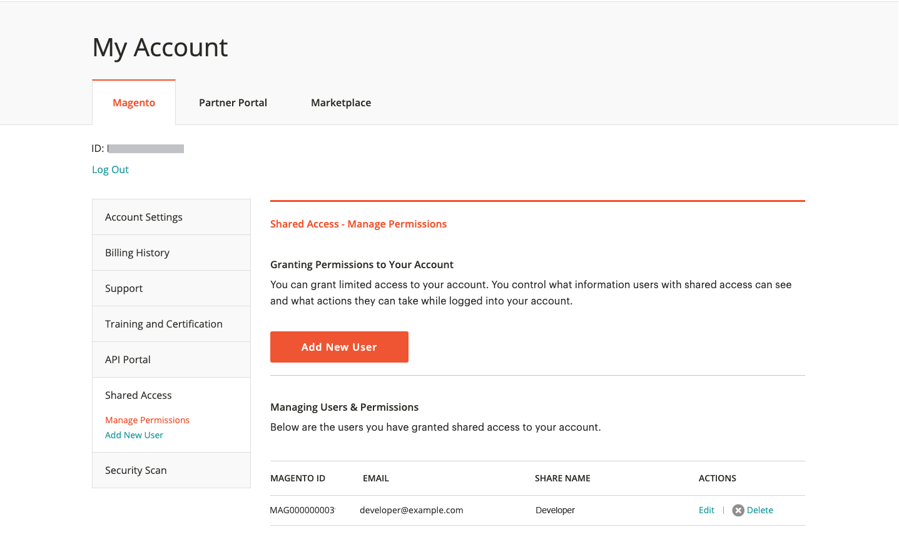

# [!DNL Commerce] アカウントの共有

[!DNL Commerce] アカウントには、サイト管理を支援する信頼できる従業員やサービス プロバイダに提供できる情報が含まれています。 プライマリアカウント所有者は、他のプライマリアカウント所有者に対して制限付きアクセスを許可する権限を持 [!DNL Commerce] ます。 共有アクセスは取り消すことはできますが、あるユーザーから別のユーザーに転送することはできません。

[!DNL Commerce] サポートチームはアカウントにアクセスできず、共有アクセスを設定できません。 共有アクセスを設定できるのは、適切な権限を持つプライマリアカウント所有者のみです。 アカウントアクセスを共有すると、請求履歴やクレジットカード情報などの機密情報はすべて保護されたままになり、他のユーザーは使用できなくなります。

>[!NOTE]
>
>共有アクセスを持つユーザーが実行するすべてのアクションは、プライマリアカウント所有者の唯一の責任です。 Adobeは、お客様のアカウントに対する共有アクセス権を持つユーザーが実行するいかなるアクションについても責任を負いません。

{width="600" zoomable="yes"}

## 共有アカウントの設定

1. 開始する前に、**新しい共有アクセス権限** の [!DNL Commerce] アカウントから次の情報を取得します。

   - ユーザーは、account.adobe.comで既にアカウントに登録されており、account.magento.comでログインしている必要があります。 詳しくは [Commerce アカウントの作成 ](https://experienceleague.adobe.com/ja/docs/commerce-admin/start/commerce-account/commerce-account-create#create-a-commerce-account) を参照してください。
   - この `MAGE ID/Account ID (MAG00XXXXXXX)` は、「ログアウ _[!UICONTROL Magento]_&#x200B;**リンクのすぐ上の「**&#x200B;ログアウト」タブの左上隅に表示されます。
   - アカウントに関連付けられている `Email` アドレス。

1. [[!DNL Commerce]  アカウント ](commerce-account-create.md) にログインします。

1. 左側のナビゲーションパネルで、「**[!UICONTROL Shared Access]**」をクリックします。

1. 「**[!UICONTROL Add New User]**」をクリックします。

   {width="600" zoomable="yes"}

1. [!UICONTROL _New User Information]_で次の操作を行います。

   - 新しいユーザーの [!DNL Commerce] アカウントの **[!UICONTROL Account ID]** を入力します。
   - 新しいユーザーの [!DNL Commerce] アカウントに関連付けられている **[!UICONTROL Email]** アドレスを入力します。

   {width="600"}

1. [_[!UICONTROL Shared Information]_] で、次の操作を行います。

   - 共有アカウントを識別するには、**[!UICONTROL Share Name]** を入力します。 この名前は内部参照用であり、自分とアカウントを共有する相手にのみ表示されます。

     ベストプラクティスは、組織名を [!UICONTROL Share Name] として使用することです。 `CLOUD SHARED ACCESS FROM MAG XYX` で始まる名前は使用しないでください。
   - 新しいユーザーと個人の連絡先情報を共有する場合は、**[!UICONTROL Your Email]** と **[!UICONTROL Your Phone]** を入力します。

1. _[!UICONTROL Grant Account Permissions]_&#x200B;の下で、共有する各 [!DNL Commerce] 製品およびサービスのチェックボックスをオンにします。

   {width="600"}

1. 「**[!UICONTROL Create Shared Access]**」をクリックします。

   新しいユーザー情報が共有アクセス ページの _[!UICONTROL Manage Permissions]_&#x200B;セクションに表示され、共有アカウントへのアクセス手順を記載した電子メールの招待状が新しいユーザーに送信されます。

   {width="600" zoomable="yes"}

>[!NOTE]
>
>_[!UICONTROL Security Tool]_&#x200B;へのアクセスを共有する必要はありません。MAGE ID を持つユーザーは誰でも、自分のアカウントでセキュリティスキャンツールを設定できます。 サイトに変更を加えたり、いずれかの [ 必須メソッド）を使用してドメインの所有権を検証したりするために必要な権限 ](https://experienceleague.adobe.com/ja/docs/commerce-admin/systems/security/security-scan) 必要なだけです。

## 共有アカウントへのアクセス

以下の手順は、共有アカウントへの招待を受けた共有ユーザーの視点で記述されています。

1. 共有アカウントへの招待メールを受け取ったら、そのメールに記載されている手順に従って、自分の [!DNL Commerce] アカウントにログインします。

   アカウントの左側のナビゲーションパネルには、新しい「_[!UICONTROL Shared with me]_」タブが追加されました。 右上隅の&#x200B;_[!UICONTROL Switch Accounts]_ コントロールには、`My Account` と共有アカウントの名前のオプションがあります。

   {width="600" zoomable="yes"}

   >[!NOTE]
   >
   >   _[!UICONTROL Switch Accounts]_&#x200B;コントロールが表示されない場合は、プライマリアカウントの所有者に連絡し、正しい [ アカウント情報 ](#set-up-a-shared-account) が入力されていることを確認します。

1. 共有アカウントにアクセスするには、**[!UICONTROL Switch Accounts]** を共有アカウントの名前に設定します。

   {width="600" zoomable="yes"}

   共有アカウントには、ようこそメッセージと連絡先情報が表示されます。 左側のナビゲーションパネルには、使用権限のある項目のみが表示されます。

1. 共有アカウントをヘルプセンターに接続するには、共有アカウントの左側のナビゲーションパネルで「**[!UICONTROL Support]**」をクリックします。

   {width="600" zoomable="yes"}

   共有アカウントから [Adobe Commerce ヘルプセンター ](https://experienceleague.adobe.com/ja/docs/commerce-knowledge-base/kb/overview) を使用して、記事とトラブルシューティング情報の検索、既知の問題のパッチの検索、サポートチケットの作成を行うことができます。

   >[!NOTE]
   >
   >共有アクセスを受け取ったら、Experience Leagueで [ サポートケースを送信 ](https://experienceleague.adobe.com/ja/docs/commerce-knowledge-base/kb/help-center-guide/magento-help-center-user-guide#support-case) するには、まず左の列で「（[!DNL Commerce]）」で終わる組織名を選択していることを確認します。

1. 自分のアカウントに戻るには、ブラウザーコントロールで **戻る** をクリックし、**[!UICONTROL Switch Accounts]** を `My Account` に設定します。

## 共有アクセスの取り消し

1. Commerce アカウントにログインします。

1. 左側のナビゲーションパネルで、「**[!UICONTROL Shared Access]**」をクリックします。

1. _[!UICONTROL Managing Users & Permissions]_&#x200B;の下で失効させるアカウントを見つけて、「**[!UICONTROL Delete]**」をクリックします。

   >[!NOTE]
   >
   > **[!UICONTROL Delete]** が表示されない場合は、**[!UICONTROL Share Name]** に命名パターン `Cloud Shared Access from MAG0XYZ` が含まれているかどうかを確認します。 アカウントに [ 命名パターンがあり、削除できない ](https://experienceleague.adobe.com/ja/docs/commerce-knowledge-base/kb/help-center-guide/magento-help-center-user-guide#remove-cloud-shared-access-users) 場合、共有アクセスが [Commerce アカウントから直接作成されるのではなく、API によって作成されたた ](https://account.magento.com/) です。
   > 
   > 削除できない場合は、アカウント所有者に共有アクセス・アカウントを変更してもらい、「Grant Account Permissions （アカウント権限の付与）」で各項目のチェックを外します。 その更新後、ユーザーはアカウントリソースにアクセスできなくなります。
   > 
   >
   > さらに、メール通知を受信しないように、ユーザーがプロジェクトから削除されていることを確認してください。[ 以前のチームメンバーには、Adobe Commerce Cloud Notification のメールが届きます ](https://experienceleague.adobe.com/ja/docs/commerce-knowledge-base/kb/troubleshooting/miscellaneous/former-teammembers-receive-cloud-notification-emails)

1. 確認を求めるメッセージが表示されたら、「**[!UICONTROL Delete User]**」をクリックします。

>[!NOTE]
>
>このインターフェイスでは、共有名が _Cloud Shared Access のユーザーを MAG[XYZ]_ から削除することはできません。 [ クラウドプロジェクトを介した共有アクセス権を付与されたユーザーを削除する方法 ](https://experienceleague.adobe.com/ja/docs/commerce-knowledge-base/kb/help-center-guide/magento-help-center-user-guide#remove-cloud-shared-access-users) を参照してください。

## 関連資料

[ 共有アクセスのトラブルシューティング ](https://experienceleague.adobe.com/ja/docs/commerce-knowledge-base/kb/troubleshooting/miscellaneous/shared-access-troubleshooting)

