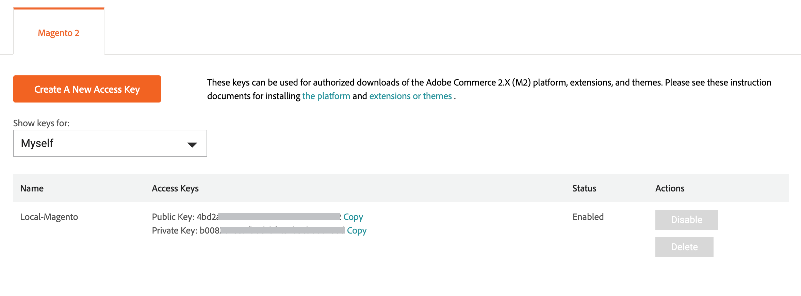
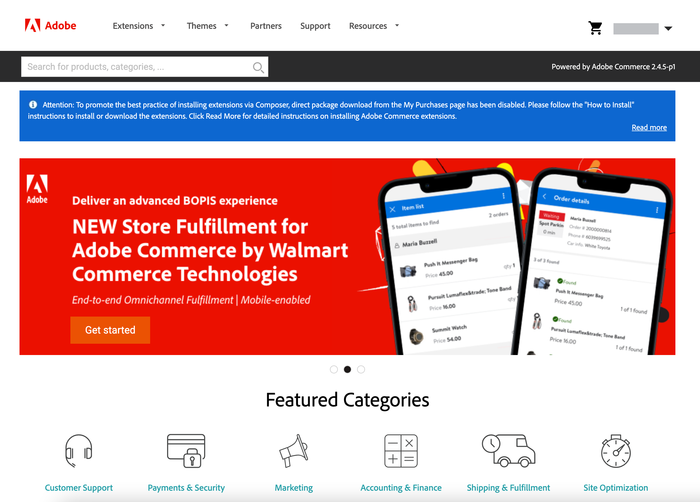

# Adobe Commerce Marketplace

[Adobe Commerce Marketplace](https://marketplace.magento.com/)は、マーチャントに厳選されたソリューションのセレクションを提供するアプリケーションストアです。適格な開発者に、ビジネスを成功させるためのツール、プラットフォーム、主要な場所を提供します。 [!DNL Commerce Marketplace]は、無料で利用できる拡張機能や、その他の販売用の拡張機能を提供しています。 購入はクレジットカードまたは[PayPal](https://www.paypal.com/us/home)でお支払いいただけます。

[!DNL Commerce Marketplace]で利用可能なすべての拡張機能が広範なレビューに合格しました。 [拡張品質プログラム ](https://developer.adobe.com/commerce/marketplace/guides/sellers/extension-quality-program) （EQP）は、[!DNL Commerce]の専門知識、開発ガイドライン、検証ツールを組み合わせて、Commerce Marketplaceのすべての拡張機能がコーディング標準とベストプラクティスを満たしていることを確認します。 レビュープロセスには、自動チェックと手動QA レビューの両方が含まれます。 その過程で、それぞれの拡張機能の構造とコードを調べ、ウイルス/マルウェア感染の証拠と盗用の兆候を調べます。 このレビューには、[!DNL Commerce] エンジニアが実施した詳細な技術調査とサニティーチェックが含まれており、ドキュメント、コーディング構造、パフォーマンス、スケーラビリティ、セキュリティ、[!DNL Commerce] コアとの互換性に重点を置いています。

他のソースから拡張機能を購入することはできますが、[!DNL Commerce Marketplace]で利用可能な拡張機能のみが、拡張機能の品質プログラム内の広範な技術的およびマーケティング的レビューを通じて検証されます。

## アプリリソース

開発者は従来、PHPを使用して、Adobe Commerceに機能、サービス、統合を追加するインプロセス拡張機能を作成していました。 拡張機能ではなく、プロセス外の拡張性を持つアプリを作成することで、互換性の問題を回避できます。

次のリソースは、新規採用者がアプリに慣れ親しむための出発点となります。

### Commerceの業界トレンド

- [Adobe CommerceのI/O イベントの設定](https://developer.adobe.com/commerce/extensibility/events/)
- [Adobe Commerceのイベントの設定](https://developer.adobe.com/commerce/extensibility/events/configure-commerce/)
- [Admin UI SDKの設定](https://developer.adobe.com/commerce/extensibility/admin-ui-sdk/)
- [拡張機能のアプリへの変換](https://developer.adobe.com/commerce/extensibility/app-development/#how-do-i-port-an-extension-into-an-app)

### App Builderの業界トレンド

- [Commerce App Builderの概要](https://developer.adobe.com/commerce/extensibility/app-development/)
- [Adobe Developer App Builder用API Meshの設定](https://developer.adobe.com/graphql-mesh-gateway/gateway/getting-started/)
- [App Builder アプリのデプロイ](https://developer.adobe.com/app-builder/docs/guides/deployment/)
- [APP BUILDER アプリケーション用のCI/CD](https://developer.adobe.com/app-builder/docs/guides/deployment/ci_cd_for_firefly_apps/)
- App Builder/Developer Consoleの概要
   - [App Builderの導入方法](https://developer.adobe.com/app-builder/docs/getting_started/)
   - [プロジェクトとワークスペースについて](https://developer.adobe.com/app-builder/docs/resources/videos/exploring/projects-and-workspaces/)

## [!DNL Marketplace]資格情報

[!DNL Commerce Marketplace]から購入した拡張機能をインストールする前に、[!DNL Commerce] アカウントにサインインし、アクティブなアクセスキーがあることを確認してください。 [[!DNL Marketplace]](https://marketplace.magento.com/)または[Magento.com](https://business.adobe.com/products/magento/magento-commerce.html)のヘッダーから[!DNL Commerce] アカウントにログインできます。

アクセスキーは、[!DNL Commerce] インストールを[!DNL Commerce] アカウントと同期し、資格情報を確認するために使用される公開鍵と秘密鍵のセットです。 アカウントが同期されたら、Commerce Marketplaceから拡張機能またはモジュールをインストールするか、[!DNL Commerce] インストールをアップグレードするたびに秘密鍵を入力する必要があります。

異なる目的のために複数のアクセスキーを作成し、必要に応じてそれらを有効または無効にできます。 ただし、[!DNL Commerce] ソフトウェアのインストールに使用したのと同じアクセス キーを使用する必要があります。 例えば、Magento Open Source アクセスキーを使用してAdobe Commerceを更新またはアップグレードしたり、逆に使用することはできません。 また、別のユーザーまたは[共有アカウント ](commerce-account-share.md)のユーザーに属するアクセスキーを使用することはできません。

### アクセスキーの作成

1. [!DNL Commerce] アカウントにログインします。

1. _[!UICONTROL My Account]_ページで、「**[!UICONTROL Marketplace]**」タブを選択します。

1. 名前の横の右上隅にある下向き矢印をクリックし、**[!UICONTROL My Profile]**&#x200B;を選択します。

   ![あなたの[!DNL Marketplace] プロファイル ](./assets/marketplace-profile.png){width="600"}

1. _[!UICONTROL My Products]_の「_[!UICONTROL Marketplace]_」タブで、「**[!UICONTROL Access Keys]**」をクリックし、次のいずれかの操作を行います。

   - Marketplaceで購入用のアクセスキーが既に用意されているかどうか確認してください。 異なる目的のために、複数のアクセスキーのセットを作成できます。

   {width="600"}

   - **[!UICONTROL Create a New Access Key]**&#x200B;をクリックします。 新しいキーペアの名前を入力し、**[!UICONTROL OK]**&#x200B;をクリックします。 有効な文字には、スペースの代わりに大文字と小文字およびハイフンが含まれます。

1. 完了したら、**[!UICONTROL OK]**&#x200B;をクリックします。

   新しいアクセスキーが有効になり、リストに表示されます。

   公開鍵と秘密鍵の後に&#x200B;_Copy_ リンクを表示します。 次のステップでは、これらの値をコピーして貼り付け、ストアをCommerce Marketplaceと同期させます。

## インストールプロセス

>[!IMPORTANT]
>
>Adobe CommerceとMagento Open Source 2.4.0以降、Web セットアップ ウィザードは削除され、コマンドラインを使用してインスタンスを[ インストール ](https://experienceleague.adobe.com/docs/commerce-operations/installation-guide/advanced.html)または[ アップグレード ](https://experienceleague.adobe.com/docs/commerce-operations/upgrade-guide/implementation/perform-upgrade.html)する必要があります。 この要件には、[ モジュール ](https://experienceleague.adobe.com/docs/commerce-operations/upgrade-guide/modules/upgrade.html)と[拡張機能](https://experienceleague.adobe.com/docs/commerce-operations/installation-guide/tutorials/extensions.html)も含まれます。

[!DNL Marketplace]購入のインストールプロセスは、Commerceの&#x200B;_オンプレミス_ インストールと、[Adobe Cloud Architecture](https://www.adobe.com/commerce/magento/enterprise.html)でホストされているインストールでは異なります。

{width="600"}

## サポート

拡張機能のインストールや使用に関するサポートが必要な場合は、拡張機能に付属するドキュメントを最初に参照してください。 質問に対する回答が見つからない場合は、拡張機能リストの連絡先情報を使用して、開発者に直接連絡してください。 Marketplaceで購入した商品がお客様のニーズに合わない場合は、購入日から25日以内に[返金をリクエスト ](#refund-requests)できます。 Adobeはすべての払い戻しリクエストを確認し、（承認された場合）適切な払い戻しを発行します。 Commerce Marketplaceに関連する問題の場合：

方法1: [Adobe Commerce Marketplace - Contact Us](https://commercemarketplace.adobe.com/contact-us/) フォームからサポートリクエストを送信します。

方法2: [電子メールサポート ](mailto:commercemarketplacesupport@adobe.com)。

### チェックアウトの問題

マーケットプレイス購入システムで確認するには、アカウントプロファイルのアドレスフィールドに入力する必要があります。

1. Marketplace アカウントプロファイルにアドレスフィールドを追加します。
1. 更新したプロファイルを保存します。
1. チェックアウトを続行します。

### ログインに関する問題

ログインの問題は、通常、アカウントデータベース内のMAGEIDとメールアドレスの不一致に関連しています。 Marketplace サポートにお問い合わせください。

>[!INFO]
>
>アプリと拡張機能の購入を[新しいアカウントに転送](#purchase-transfers)することはできません。

### オープンソースの質問

Marketplace サポートチームは、[commercemarketplace.adobe.com/](https://commercemarketplace.adobe.com/)および[commercedeveloper.adobe.com/](https://commercedeveloper.adobe.com/) サイトのみに関する問題を解決します。 Magento Open Sourceに関するご質問は、[ コミュニティフォーラム ](https://community.magento.com/)または[Magento Open Sourceのサポートを受けられるパートナー](https://business.adobe.com/products/magento/partners.html)にお問い合わせください。

### 返金リクエスト

Marketplaceでの購入に対する返金をリクエストするには、アカウントにログインして、次の手順に従います。

1. [!UICONTROL **マイプロファイル**]/[!UICONTROL **購入履歴**]&#x200B;をクリックします。
1. 購入を探し、[!UICONTROL **返金をリクエスト**]&#x200B;をクリックします。
1. 返金注文フォームに記入してください。

Marketplace サポートは、返金要求が生成された後、情報を要求します。 払い戻しオプションは、購入日から25日間利用できます。 [Marketplace顧客契約書](https://www.adobe.com/legal/terms/enterprise-licensing/magento-legacy-terms.html)を参照してください。

### 注文請求書

注文請求書は、Marketplace アカウントの&#x200B;[!UICONTROL **購入履歴**]&#x200B;からダウンロードできます。 請求書は、現時点ではマーケットプレイスの要件ではないため、売り手のVATまたは住所を提供しません。

Marketplaceで購入した注文請求書をダウンロードするには、Marketplace アカウントにログインして、次の手順に従います。

1. [!UICONTROL **マイプロファイル**]/[!UICONTROL **購入履歴**]&#x200B;をクリックします。
1. 購入の場所を特定。
1. 注文の右上隅にあるプリンターアイコンをクリックします。

### 購入の転送

マーケットプレイスサポートチームには、購入した商品を別のアカウントに引き継ぐ機能はありません。 インストールとデプロイメントの問題を回避するには、プライマリ Commerce アカウントの下にあるすべてのアプリと拡張機能を購入する必要があります。 Adobe Commerceには、1つの一意のIDを取得する権利があります。 Composerはインストールに使用されるため、プライマリアカウントに関連付けられた[ アクセスキー](#create-an-access-key)の1つのセットのみを使用できます。 利用可能な唯一のソリューションは、[Marketplaceの購入者アカウントから返金をリクエスト ](#refund-requests)することです（Adobe Commerceの返金ポリシーで許可されている場合）。

プライマリアカウントを通じてCommerce インスタンスを[共有](commerce-account-share.md)できます。 共有アクセスは、プライマリアカウントから下位アカウントに特別な権限を付与します。 共有アクセスポイントは、プライマリアカウントから生成されます。 プライマリアカウントは、Commerceのアカウント、メインマーチャントのアカウント、または組織内で共有されるアカウントです。

これらの特別な権限を付与すると、Adobe Commerceではプライマリと同じレベルのアクセス権が付与されますが、Adobe Commerce MarketplaceやDeveloper Portalには引き継がれません。 つまり、Marketplaceの下位アカウントから拡張機能を購入すると、プライマリアカウントと共有できません。 共有アクセスは一方向の通り（プライマリアカウントから部下まで）です。 従属アカウントがプライマリに共有しようとすると、機能しません。
