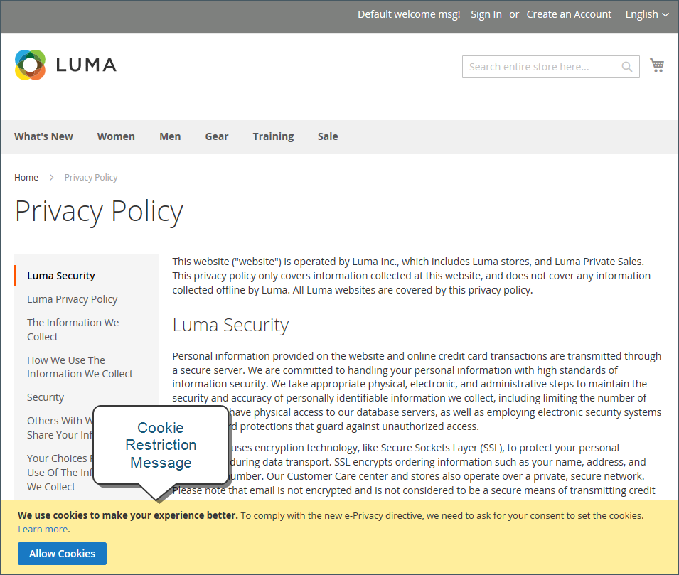
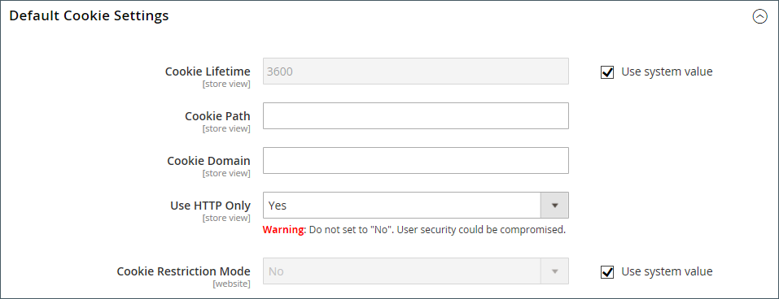

# Cookie 法への準拠

Cookie は、サイトへの各訪問者のコンピューターに保存される小さなファイルで、情報の一時的な保持場所として使用されます。 Cookie に保存される情報は、ショッピングエクスペリエンスのパーソナライズ、訪問者の買い物かごへのリンク、トラフィックパターンの測定、プロモーションの有効性の向上に使用されます。 Cookie の使用に関する多くの国の法律に対応するために、Adobe CommerceとMagento Open Sourceでは、マーチャントに対して、お客様の同意を得るための選択肢を提供しています。 Adobe CommerceおよびMagento Open Sourceのデフォルト cookie のリストについては、[Cookie リファレンス &#x200B;](#default-cookies) を参照してください。

>[!NOTE]
>
>[EU 一般データ保護規則 &#x200B;](../merchandising-promotions/google-tools.md#google-privacy-settings) に準拠するためにデフォルトの [0&rbrace;Google プライバシー設定 &rbrace; を変更する場合、Google Analytics Cookie の使用に関するユーザーの同意を得る必要はありません。](compliance-gdpr.md)

## cookie 制限モード

cookie 制限モードが有効になっている場合、ストアを訪問した訪問者には、フル機能の操作に cookie が必要であることを通知されます。 テーマに応じて、メッセージはヘッダーの上、フッターの下、またはページ上の別の場所に表示される場合があります。 このメッセージは、詳細情報を提供するプライバシーポリシーにリンクしており、訪問者が「許可」ボタンをクリックして同意を付与するよう促しています。 同意が得られると、メッセージは消えます。

[&#x200B; プライバシーポリシー &#x200B;](privacy-policy.md)）には、ストアの名前と連絡先情報を含め、ストアで使用される各 Cookie の目的を説明する必要があります。 詳しくは、[Cookie リファレンス &#x200B;](#default-cookies) を参照してください。

>[!NOTE]
>
>プライバシーポリシーの URL キーを変更する場合は、新しい URL キーにトラフィックをリダイレクトするようにカスタム URL 書き換えを作成する必要もあります。 それ以外の場合は、Cookie 制限モード メッセージ内のリンクは `404 Page Not Found` を返します。

{width="600"}

### 手順 1:cookie 制限モードを有効にする

1. _管理者_ サイドバーで、**[!UICONTROL Stores]**/_[!UICONTROL Settings]_/**[!UICONTROL Configuration]**&#x200B;に移動します。

1. 左側のナビゲーションパネルの **[!UICONTROL General]** の下で、「**[!UICONTROL Web]**」を選択します。

1. 「**[!UICONTROL Default Cookie Settings]**」セクションを展開し、次の操作を実行します。

   {width="600"}

   - **[!UICONTROL Cookie Lifetime]** を秒単位で入力します。

   - 他のフォルダーで Cookie を使用できるようにする場合は、**[!UICONTROL Cookie Path]** を入力します。 サイトの任意の場所で cookie を使用できるようにするには、スラッシュ（`/`）を入力します。 この値には、cookie パスのみを含めることができ、その他の cookie パラメーターを含めることはで **_ません_**。

   - サブドメインで cookie を使用できるようにするには、「**[!UICONTROL Cookie Domain]**」フィールド（`subdomain.yourdomain.com`）にサブドメイン名を入力します。 すべてのサブドメインで cookie を使用できるようにするには、ドメイン名の前にピリオド（`.yourdomain.com`）を入力します。 この値には、cookie ドメインのみを含めることができ、その他の cookie パラメーターを含めること **_できません_**。

   - JavaScriptなどのスクリプト言語が Cookie にアクセスしないようにするには、**HTTP のみを使用** が `Yes` に設定されていることを確認します。

   - **[!UICONTROL Cookie Restriction Mode]** を `Yes` に設定します。

     必要に応じて、チェックボックスをオフにし、「**[!UICONTROL OK]**」をクリックして範囲の切り替えを確定します。

1. 完了したら、「**[!UICONTROL Save Config]**」をクリックします。

1. キャッシュを更新するように求められたら、システムメッセージの **[!UICONTROL Cache Management]** リンクをクリックして、無効な各キャッシュを更新します。

### 手順 2：プライバシーポリシーを更新する

会社が収集する情報とその使用方法が反映されるように [&#x200B; プライバシーポリシー &#x200B;](privacy-policy.md) を更新します。

## デフォルトの Cookie

Adobe CommerceとMagento Open Sourceのデフォルトの Cookie は、マーチャントが [GDPR](compliance-gdpr.md) などのプライバシー規制の要件を満たすのに役立つように、免除/非免除に分類されています。 マーチャントは、この情報を参考にして、法的アドバイザーに相談して、包括的なプライバシー規制コンプライアンス戦略の一環としてプライバシーと Cookie ポリシーを更新する必要があります。

次の Cookie は [!DNL Commerce] オンプレミスおよびクラウドのインストール用に「標準」で使用されます。 これらの Cookie は、お客様から明示的にリクエストされた機能で必要になる場合があります。 セッション Cookie の有効期間について詳しくは、[&#x200B; セッションの有効期間 &#x200B;](../customers/customer-online-options.md) を参照してください。

これらの Cookie の一部では、必要に応じて、有効/無効を含む設定オプションが提供される場合があります。

### リクエストされた機能の Cookie （除外）

#### `add_to_cart`

 （Adobe Commerceのみ）買い物かごから削除された商品 SKU、名前、価格および数量をキャプチャします。 商品が買い物かごに追加された日時をGoogle Analyticsが把握できるようにします。

#### `guest-view`

ゲストのアカウントがないため、ゲストの注文をゲストにリンクします。 システムの安定性を維持するために、この cookie を無効にしないでください。

#### `login_redirect`

ログインとユーザー登録に成功した場合に、ユーザーをルーティングするリダイレクト URL を保存します。 ログイン前にユーザーがいたページを保存します（ログイン後に戻る場所を判断するために）。

#### `mage-banners-cache-storage`

 （Adobe Commerceのみ）バナー機能用のローカルストレージ。 パフォーマンスを向上させるために、バナーコンテンツをローカルに保存します。 バナーコンテンツには、買い物客に情報を表示する一般的な web サイトアセットが含まれます。 システムの安定性を維持するために、この cookie を無効にしないでください。

#### `mage-messages`

Cookie 同意メッセージ、様々なエラーメッセージなど、ユーザーに表示されるエラーメッセージやその他の通知をトラッキングします。 メッセージは、買い物客に表示された後、Cookie から削除されます。 この cookie を無効にするオプションはありません。 エラーメッセージなど、1 回限りの情報がユーザーに伝わる方法です。 システムの安定性を維持するために、この cookie を無効にしないでください。

#### `product_data_storage` （ローカルストレージ）

「最近閲覧された」関数および「製品を比較」関数を使用するために使用される製品データの設定を格納します。 ユーザーの特定の設定を格納します（例えば、ユーザーが最近製品を閲覧したり、製品を比較した場合）。 システムの安定性を維持するために、この cookie を無効にしないでください。

#### `recently_compared_product` （ローカルストレージ）

最近比較した製品の製品 ID を格納します。 システムの安定性を維持するために、この cookie を無効にしないでください。

#### `recently_compared_product_previous` （ローカルストレージ）

前に比較した製品の製品 ID を保存してナビゲーションを容易にします。 システムの安定性を維持するために、この cookie を無効にしないでください。

#### `recently_viewed_product` （ローカルストレージ）

最近閲覧した製品の製品 ID を保存して、ナビゲーションを簡単にします。 システムの安定性を維持するために、この cookie を無効にしないでください。

#### `recently_viewed_product_previous` （ローカルストレージ）

最近閲覧した製品の製品 ID を保存して、ナビゲーションを簡単にします。 システムの安定性を維持するために、この cookie を無効にしないでください。

#### `remove_from_cart`

 （Adobe Commerceのみ）商品が買い物かごから削除された日時をGoogle Analyticsに通知します。

#### `stf`

SendFriend （[Email a Friend](../stores-purchase/email-a-friend.md)） モジュールによってメッセージが送信された時間を記録します。 買い物客が製品にリンクを送信すると、この cookie はタイムスタンプを記録し、カウントを保持します。

#### `X-Magento-Vary`

新しいバージョンのページをキャッシュから提供する必要がある場合に指定します。 Web サイトのパフォーマンスをサポートします。 システムの安定性を維持するために、この cookie を無効にしないでください。

#### `form_key`

要求が正規の発信元によるものか不正なアクターによるものかを判断するために役立つことで、クロスサイト要求偽造攻撃（CSRF）を防ぐためにランダムに生成された値を保持するセキュリティ メカニズム。 これは、CSRF 攻撃を防ぐための業界標準の手法です。 システムの安定性を維持するために、この cookie を無効にしないでください。

#### `mage-cache-sessid`

セッションの有効期限が切れた後、ブラウザーでローカルストレージをクリーンアップするタイミングを決定する際に役立ちます。 これは、ローカルストレージをクリーンアップする必要があるかどうかを判断するために使用されます。 この cookie がないと、ローカルストレージのクリーンアップがトリガーされます。 システムの安定性を維持するために、この cookie を無効にしないでください。

#### `mage-cache-storage`

e コマース機能を有効にする訪問者固有のコンテンツのローカルストレージ。 デフォルトでは未使用ですが、使用すると、チェックアウトを迅速化するために使用されるので、ユーザーが移動して戻ったときに基本的なユーザー情報を利用できます。 システムの安定性を維持するために、この cookie を無効にしないでください。

#### `mage-cache-storage-section-invalidation`

無効化および削除する必要があるページのセクションに関連する情報を格納します。 システムの安定性を維持するために、この cookie を無効にしないでください。

#### `persistent_shopping_cart`

永続的な買い物かごのキー ID を格納して、匿名の買い物客が買い物かごを復元できるようにします。 システムの安定性を維持するために、この cookie を無効にしないでください。

#### `private_content_version`

顧客コンテンツを含んだページにランダムな一意の番号と時間を追加して、ページがサーバー上にキャッシュされないようにします。 PHP では、JavaScript as a cookie で、JavaScriptでは、ローカルストレージに対して、複数の場所で設定されます。 システムの安定性を維持するために、この cookie を無効にしないでください。

#### `section_data_ids`

買い物客が開始したアクションに関連する、顧客固有の情報を格納します（ウィッシュリストの表示やチェックアウト情報など）。 システムの安定性を維持するために、この cookie を無効にしないでください。

#### `store`

買い物客が選択した特定のストアの表示/ロケールをトラッキングします。 システムの安定性を維持するために、この cookie を無効にしないでください。

#### `PHPSESSID`

ストアフロントでのユーザーセッションをトラッキングします。 これは、最終製品を使用する買い物客です。 システムの安定性を維持するために、この cookie を無効にしないでください。

#### `admin`

管理者側のユーザーセッションをトラッキングします。 システムの安定性を維持するために、この cookie を無効にしないでください。

#### `loggedOutReasonCode`

管理者ユーザーが一定回数パスワードの試行に失敗した後でロックアウトされる際に設定します。

#### `section_data_clean`

ユーザーがストア表示を切り替えたときに設定します。 この cookie が存在する場合、JavaScriptはページの特定のセクションを再読み込みして、正しいストア表示を反映させるトリガーがあります。 システムの安定性を維持するために、この cookie を無効にしないでください。

#### `lang`

Admin Analytics モジュールによって間接的に設定されます。 店舗の管理区域内でのみ使用すること。 買い物客には適用されません。 システムの安定性を維持するために、この cookie を無効にしないでください。

#### `s_fid`

Admin Analytics モジュールによって間接的に設定されます。 フォールバックのユニーク訪問者 ID の時刻/日付スタンプ。 サードパーティ cookie の制限が原因で標準 `s_vi` cookie が使用できない場合に、ユニーク訪問者を識別するために使用されます。 店舗の管理区域内でのみ使用すること。 買い物客には適用されません。 システムの安定性を維持するために、この cookie を無効にしないでください。

#### `s_cc`

Admin Analytics モジュールによって間接的に設定されます。 cookie が有効になっているかどうかを判断するために、JavaScript コードによって設定され、読み取られます。 店舗の管理区域内でのみ使用すること。 買い物客には適用されません。 システムの安定性を維持するために、この cookie を無効にしないでください。

#### `apt.sid`

Admin Analytics モジュールで間接的に使用される Gainsight PX ライブラリによって設定されます。 この cookie の目的は、製品のトップレベルドメインで永続的なセッション ID のトラッキングを許可し、アクティブなセッションへの参照 ID として使用することです。 店舗の管理区域内でのみ使用すること。 買い物客には適用されません。 システムの安定性を維持するために、この cookie を無効にしないでください。

#### `apt.uid`

Admin Analytics モジュールで間接的に使用される Gainsight PX ライブラリによって設定されます。 この cookie の目的は、製品のトップレベルドメインで永続的な ID のトラッキングを許可し、ユーザーエンティティへの参照 ID として使用することです。 店舗の管理区域内でのみ使用すること。 買い物客には適用されません。 システムの安定性を維持するために、この cookie を無効にしないでください。

#### `s_sq`

Admin Analytics モジュールによって間接的に設定されます。 ClickMap機能で、訪問者のクリック場所とクリック内容に関するデータを収集するために使用されます。 各クリックからの情報を格納します。 店舗の管理区域内でのみ使用すること。 買い物客には適用されません。 システムの安定性を維持するために、この cookie を無効にしないでください。

#### `pagebuilder_modal_dismissed`

ページビルダーモジュールで設定されます。 管理者が以前に明示的に却下した場合に、特定のアクションを開かないように管理者に確認するプロンプトを以降から表示しないようにするフラグが含まれます。 店舗の管理区域内でのみ使用すること。 買い物客には適用されません。

#### `pagebuilder_template_apply_confirm`

ページビルダーモジュールで設定されます。 管理者が以前に明示的に却下した場合に、特定のアクションを開かないように管理者に確認するプロンプトを以降から表示しないようにするフラグが含まれます。 店舗の管理区域内でのみ使用すること。 買い物客には適用されません。

#### `accordion-&lbrace;VARIABLE&rbrace;-&lbrace;VARIABLE&rbrace;`

タブ機能の実装の一部として使用されるのは、ストアの管理領域のみです。 買い物客には適用されません。

## Product Recommendations の cookie

 （Adobe Commerceのみ）次の Cookie がAdobe Commerceのお客様向けの Product Recommendations で使用されます。 これらの Cookie は [DataServices モジュール &#x200B;](https://experienceleague.adobe.com/en/docs/commerce/product-recommendations/getting-started/install-configure) と共にインストールされます。

- `mg_dnt`：サイトで cookie の同意を管理するカスタムコードがある場合は、[Adobe Commerce データ収集を制限 &#x200B;](https://experienceleague.adobe.com/en/docs/commerce/product-recommendations/developer/setting-cookie) できます。
- `user_allowed_save_cookie`: [cookie 制限モード &#x200B;](#cookie-restriction-mode) に使用されます。
- `authentication_flag`：買い物客がサインインまたはログアウトしたかどうかを示します。 この cookie は、`dataservices_customer_id` cookie と同時に更新されます。
- `dataservices_customer_id`：買い物客がサインインまたはログアウトしたかどうかを示します。 この cookie には、システム内の顧客の一意の ID が含まれます。
- `dataservices_customer_group`：顧客のグループを示します。 この cookie は、顧客のグループ ID の [sha1](https://en.wikipedia.org/wiki/SHA-1) チェックサムとして保存されます。
- `dataservices_cart_id`：買い物客の買い物かごアクションを識別します。 この cookie には、システム内のお客様の一意の買い物かご ID が含まれています。
- `dataservices_product_context`：買い物客の製品インタラクションを識別します。 この Cookie には、システム内の顧客の一意の見積もり ID が含まれています。

### Product Recommendations ローカルストレージデータ

Live Search または Product Recommendations がインストールされている場合、Luma テーマを使用して、次のデータがストアのローカルストレージに保存されます。

- `ds-cart`:Luma 固有の機能の買い物かご情報を保存します
- `ds-cart-order`：買い物かご機能の注文情報を保存します
- `ds-purchase-history`：顧客の購入履歴をトラッキングします
- `ds-view-history-time-decay`：製品の表示履歴を時間ベースの減衰と共に保存します
- `ds-logged-in`：顧客のログインステータスを示します。 このデータは、顧客がログイン時にのみ存在し、cookie 制限モードが有効になっている場合でも保存されます。 これは、ユーザーの同意ステータスに関係なく、cookie 制限モードが有効になっている場合にCommerceによってローカルストレージに保存される唯一のデータです。

## その他の cookie

 （Adobe Commerceのみ） Adobe Commerceのお客様向けに設定されている Cookie は次のとおりです。 これらの Cookie は [DataServices モジュール &#x200B;](https://experienceleague.adobe.com/en/docs/commerce/product-recommendations/getting-started/install-configure) と共にインストールされます。

- `mg`: Snowplow JavaScript トラッカーによって設定されます。 詳しくは、[Snowplow ドキュメント &#x200B;](https://docs.snowplow.io/docs/sources/trackers/javascript-trackers/web-tracker/tracker-setup/initialization-options/) を参照してください。
- `com.adobe.alloy.getTld`：現在の web ページのホスト名では、https://publicsuffix.orgで説明されているように、「パブリックサフィックス」ではない最上位のドメインになります。 基本的に、これは Cookie を受け入れられる最上位のドメインです。 この Cookie は [Alloy Web SDK](https://github.com/adobe/alloy) の一部です。
- `aep-segments-membership`：買い物客が属するセグメントなど、[&#x200B; オーディエンス情報 &#x200B;](https://experienceleague.adobe.com/en/docs/commerce-admin/customers/audience-activation) が含まれます。

[1]: https://developers.google.com/analytics/devguides/collection/analyticsjs/cookie-usage
[2]: https://support.google.com/adwords/answer/7521212
