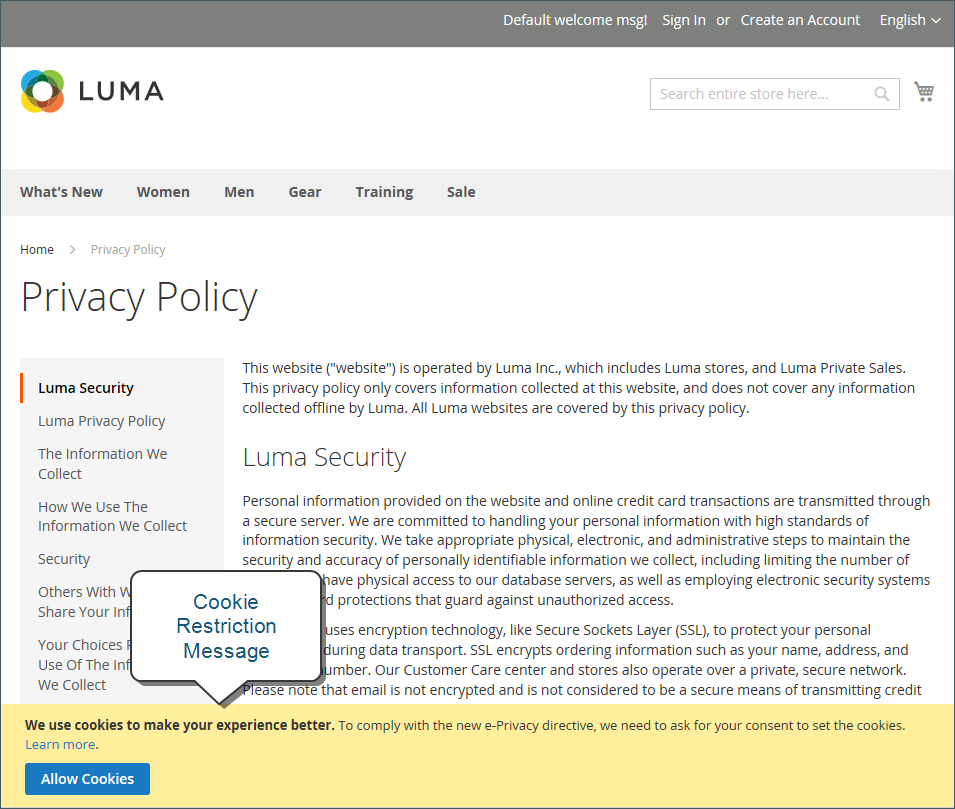

# Cookie法のコンプライアンス

Cookieとは、サイトへの各訪問者のコンピューターに保存され、情報の一時的な保管場所として使用される小さなファイルです。 Cookieに保存された情報は、ショッピング体験のパーソナライズ、訪問者のショッピングカートへのリンク、トラフィックパターンの測定、プロモーションの有効性の向上に使用されます。 Cookieの使用に関する多くの国の法律に対応するために、Adobe CommerceとMagento Open Sourceはマーチャントに顧客の同意を得るための選択肢を提供しています。 Adobe CommerceおよびMagento Open Sourceのデフォルト Cookieの一覧については、[Cookie リファレンス &#x200B;](#default-cookies)を参照してください。

>[!NOTE]
>
>[一般データ保護規則](compliance-gdpr.md)に準拠するように、デフォルトの[Google プライバシー設定](../merchandising-promotions/google-tools.md#google-privacy-settings)を変更した場合、Google Analytics Cookieの使用に関するユーザーの同意を得る必要はありません。

## Cookie制限モード

Cookie制限モードが有効になっている場合、ストアへの訪問者には、フル機能の操作にCookieが必要であることが通知されます。 テーマに応じて、メッセージはヘッダーの上、フッターの下、またはページの他の場所に表示されます。 このメッセージは、プライバシーポリシーにリンクして詳細を確認し、「許可」ボタンをクリックして同意を得ることを訪問者に促します。 同意が与えられると、メッセージは消えます。

[&#x200B; プライバシーポリシー](privacy-policy.md)には、ストアの名前と連絡先情報を記載し、ストアで使用される各Cookieの目的を説明する必要があります。 詳しくは、[Cookie リファレンス &#x200B;](#default-cookies)を参照してください。

>[!NOTE]
>
>プライバシーポリシーのURL キーを変更する場合は、新しいURL キーにトラフィックをリダイレクトするためのカスタム URL書き換えも作成する必要があります。 それ以外の場合、Cookie制限モード メッセージのリンクは`404 Page Not Found`を返します。

{width="600"}

### 手順1:Cookie制限モードを有効にする

1. _管理者_ サイドバーで、**[!UICONTROL Stores]** > _[!UICONTROL Settings]_>**[!UICONTROL Configuration]**&#x200B;に移動します。

1. **[!UICONTROL General]**&#x200B;の下の左側のナビゲーションパネルで、**[!UICONTROL Web]**&#x200B;を選択します。

1. **[!UICONTROL Default Cookie Settings]** セクションを展開し、次の操作を行います。

   {width="600"}

   - **[!UICONTROL Cookie Lifetime]**&#x200B;を秒単位で入力します。

   - 他のフォルダーでCookieを利用できるようにする場合は、**[!UICONTROL Cookie Path]**&#x200B;を入力します。 サイト内の任意の場所でCookieを利用できるようにするには、スラッシュ （`/`）を入力します。 この値にはcookie パスのみを含めることができ、**_には他のcookie パラメーターを含めることはできません。_**

   - サブドメインでCookieを使用できるようにするには、**[!UICONTROL Cookie Domain]** フィールド （`subdomain.yourdomain.com`）にサブドメイン名を入力します。 すべてのサブドメインでCookieを使用できるようにするには、ピリオド （`.yourdomain.com`）が先頭に付いたドメイン名を入力します。 この値にはcookie ドメインのみを含めることができ、**_には他のcookie パラメーターを含めることはできません。_**

   - JavaScriptなどのスクリプト言語がCookieにアクセスできないようにするには、**Use HTTP Only**&#x200B;が`Yes`に設定されていることを確認してください。

   - **[!UICONTROL Cookie Restriction Mode]**&#x200B;を`Yes`に設定します。

     必要に応じて、チェックボックスをオフにし、**[!UICONTROL OK]**&#x200B;をクリックしてスコープの切り替えを確認します。

1. 完了したら、**[!UICONTROL Save Config]**&#x200B;をクリックします。

1. キャッシュの更新を求めるメッセージが表示されたら、システムメッセージの&#x200B;**[!UICONTROL Cache Management]** リンクをクリックし、無効なキャッシュごとに更新します。

### 手順2：プライバシーポリシーの更新

会社が収集する情報とその使用方法を反映するように、[&#x200B; プライバシーポリシー](privacy-policy.md)を更新します。

## デフォルト Cookie

Adobe CommerceおよびMagento Open SourceのデフォルトのCookieは、販売者が[GDPR](compliance-gdpr.md)などのプライバシー規制の要件を満たすのに役立つように、「免除/非免除」に分類されます。 顧客はこの情報をガイドとして利用し、法律顧問と相談して、包括的なプライバシー規制コンプライアンス戦略の一環として、プライバシーおよびCookie ポリシーを更新する必要があります。

オンプレミスおよびクラウドのインストールには、次のCookieが[!DNL Commerce]によって「標準装備」で使用されます。 これらのCookieは、お客様が明示的に要求する機能によって必要になる場合があります。 セッション Cookieの有効期間について詳しくは、[&#x200B; セッションの有効期間](../customers/customer-online-options.md)を参照してください。

これらのCookieの一部は、必要に応じて有効/無効などの設定オプションを提供する場合があります。

### リクエストされた機能Cookie （免除）

| 名前 | タイプ | 説明 |
| ------ | ------ | ------------- |
| **`add_to_cart`** | Cookie |  （Adobe Commerceのみ）商品のSKU、名前、価格、数量を買い物かごから削除します。 商品がカートに追加されたことをGoogle Analyticsが把握できるようにします。 |
| **`guest-view`** | Cookie | ゲスト注文をゲストにリンクします（ゲストのアカウントがないため）。 システムの安定性を維持するため、このCookieを無効にしないでください。 |
| **`login_redirect`** | Cookie | ログインとユーザー登録が成功した場合に、ユーザーをルーティングするためのリダイレクト URLを保存します。 ユーザーがログインする前に使用していたページを保存します（ログイン後に戻る場所を決定します）。 |
| **`mage-banners-cache-storage`** | ローカルストレージ |  （Adobe Commerceのみ）バナー機能のローカルストレージ。 バナーコンテンツをローカルに保存し、パフォーマンスを向上できます。 バナーコンテンツには、買い物客に情報を表示する一般的なweb サイトアセットが含まれます。 システムの安定性を維持するため、このCookieを無効にしないでください。 |
| **`mage-messages`** | Cookie | Cookie同意メッセージや様々なエラーメッセージなど、ユーザーに表示されるエラーメッセージやその他の通知を追跡します。 メッセージは、買い物客に表示された後、Cookieから削除されます。 このCookieを無効にするオプションはありません。 1回限りの情報がエラーメッセージなどのユーザーに伝えられます。 システムの安定性を維持するため、このCookieを無効にしないでください。 |
| **`product_data_storage`** | ローカルストレージ | 「最近表示された」機能と「製品の比較」機能を使用するために使用される製品データの設定を保存します。 ユーザーの特定の設定を保存します（例えば、最近製品を閲覧したり、製品を比較したりした場合）。 システムの安定性を維持するため、このCookieを無効にしないでください。 |
| **`recently_compared_product`** | ローカルストレージ | 最近比較した商品の商品IDを保存します。 システムの安定性を維持するため、このCookieを無効にしないでください。 |
| **`recently_compared_product_previous`** | ローカルストレージ | 以前に比較した商品の商品IDを保存して、簡単に操作できるようにします。 システムの安定性を維持するため、このCookieを無効にしないでください。 |
| **`recently_viewed_product`** | ローカルストレージ | 最近閲覧した商品の商品IDを保存して、簡単にナビゲーションできるようにします。 システムの安定性を維持するため、このCookieを無効にしないでください。 |
| **`recently_viewed_product_previous`** | ローカルストレージ | 最近閲覧した商品の商品IDを保存して、簡単にナビゲーションできるようにします。 システムの安定性を維持するため、このCookieを無効にしないでください。 |
| **`remove_from_cart`** | Cookie |  （Adobe Commerceのみ）商品がカートから削除されたことをGoogle Analyticsに知らせます。 |
| **`stf`** | Cookie | SendFriend （[Email a Friend](../stores-purchase/email-a-friend.md)） モジュールによってメッセージが送信された時間を記録します。 買い物客が商品にリンクを送信すると、このCookieはタイムスタンプを記録し、カウントを維持します。 |
| **`X-Magento-Vary`** | Cookie | 新しいバージョンのページをキャッシュから提供する必要がある場合を示します。 web サイトのパフォーマンスをサポート： システムの安定性を維持するため、このCookieを無効にしないでください。 |
| **`form_key`** | Cookie | クロスサイトリクエストフォージェリー攻撃（CSRF）を防ぐためにランダムに生成された値を保持するセキュリティメカニズムで、リクエストが本物のソースによるものか不正なアクターによるものかを判断するのに役立ちます。 これは、CSRF攻撃を防ぐための業界標準のプラクティスです。 システムの安定性を維持するため、このCookieを無効にしないでください。 |
| **`mage-cache-sessid`** | Cookie | セッションの有効期限が切れた後、ブラウザーのローカルストレージをクリーニングするタイミングを決定するのに便利です。 これは、ローカルストレージをクリーニングする必要があるかどうかを判断するために使用されます。 このCookieが存在しないと、ローカルストレージのクリーンアップがトリガーされます。 システムの安定性を維持するため、このCookieを無効にしないでください。 |
| **`mage-cache-storage`** | ローカルストレージ | e コマース機能を有効にする、訪問者固有のコンテンツのローカルストレージ。 デフォルトでは使用されていませんが、使用する場合は、チェックアウトを迅速化するために使用され、退出して戻ったときに基本的なユーザー情報が利用可能になります。 システムの安定性を維持するため、このCookieを無効にしないでください。 |
| **`mage-cache-storage-section-invalidation`** | ローカルストレージ | ページのどのセクションを無効化および削除する必要があるかに関する情報を保存します。 システムの安定性を維持するため、このCookieを無効にしないでください。 |
| **`mage-cache-timeout`** | ローカルストレージ | 顧客関連のデータをブラウザーにキャッシュする時間を制御します。 タイムアウトが切れると、Magentoはキャッシュされたお客様のセクション（買い物かご、ウィッシュリスト、お客様データなど）を消去して再読み込みします。 こうした行動は、クライアント側のパフォーマンスのバランスを取りながら、データの正確性とプライバシーを維持するのに役立ちます。 タイムアウト値は、設定されたCookieの有効期間と一致し、サーバーサイドのセッション管理との一貫性を維持します。 |
| **`persistent_shopping_cart`** | Cookie | 永続的なカートのキーIDを保存して、匿名の買い物客のカートを復元できるようにします。 システムの安定性を維持するため、このCookieを無効にしないでください。 |
| **`private_content_version`** | Cookie | 顧客コンテンツを含むページに、ランダムで一意の番号と時間を追加して、サーバーにキャッシュされないようにします。 PHP、JavaScript as a Cookie、JavaScript to local storageなど、複数の場所に設定されます。 システムの安定性を維持するため、このCookieを無効にしないでください。 |
| **`section_data_ids`** | Cookie | ウィッシュリストの表示やチェックアウト情報など、買い物客が開始したアクションに関連する顧客固有の情報を保存します。 システムの安定性を維持するため、このCookieを無効にしないでください。 |
| **`store`** | Cookie | 買い物客が選択した特定のストアビュー/ロケールを追跡します。 システムの安定性を維持するため、このCookieを無効にしないでください。 |
| **`PHPSESSID`** | Cookie | ストアフロントでユーザーセッションを追跡します。 これは、最終製品を使用する買い物客です。 システムの安定性を維持するため、このCookieを無効にしないでください。 |
| **`admin`** | Cookie | 管理者側でユーザーセッションを追跡します。 システムの安定性を維持するため、このCookieを無効にしないでください。 |
| **`loggedOutReasonCode`** | Cookie | 一定数のパスワード試行が失敗した後に管理者ユーザーがロックアウトされるタイミングを設定します。 |
| **`section_data_clean`** | Cookie | 利用者がストアビューを切り替えるタイミングを設定します。 このCookieが存在すると、JavaScriptがトリガーされ、ページ上の特定のセクションをリロードして、正しいストアビューを反映させることができます。 システムの安定性を維持するため、このCookieを無効にしないでください。 |
| **`lang`** | Cookie | Admin Analytics モジュールで間接的に設定します。 店舗の管理区域でのみ使用すること。 買い物客には適用できない。 システムの安定性を維持するため、このCookieを無効にしないでください。 |
| **`s_fid`** | Cookie | Admin Analytics モジュールで間接的に設定します。 フォールバックのユニーク訪問者ID時間/日付スタンプ。 サードパーティ Cookieの制限により、標準の`s_vi` Cookieが使用できない場合、一意の訪問者を識別するために使用されます。 店舗の管理区域でのみ使用すること。 買い物客には適用できない。 システムの安定性を維持するため、このCookieを無効にしないでください。 |
| **`s_cc`** | Cookie | Admin Analytics モジュールで間接的に設定します。 Cookieが有効かどうかを判断するために、JavaScript コードによって設定および読み取られます。 店舗の管理区域でのみ使用すること。 買い物客には適用できない。 システムの安定性を維持するため、このCookieを無効にしないでください。 |
| **`apt.sid`** | Cookie | Admin Analytics モジュールで間接的に使用されるGainsight PX ライブラリによって設定されます。 このCookieの目的は、製品のトップレベルドメインで永続的なセッション ID トラッキングを許可し、アクティブなセッションへの参照IDとして使用することです。 店舗の管理区域でのみ使用すること。 買い物客には適用できない。 システムの安定性を維持するため、このCookieを無効にしないでください。 |
| **`apt.uid`** | Cookie | Admin Analytics モジュールで間接的に使用されるGainsight PX ライブラリによって設定されます。 このCookieの目的は、製品のトップレベルドメインで永続的なID追跡を許可することであり、ユーザーエンティティへの参照IDとして使用されます。 店舗の管理区域でのみ使用すること。 買い物客には適用できない。 システムの安定性を維持するため、このCookieを無効にしないでください。 |
| **`s_sq`** | Cookie | Admin Analytics モジュールで間接的に設定します。 ClickMapの機能で、訪問者がクリックした場所とクリックした内容に関するデータを収集するために使用されます。 各クリックの情報を保存します。 店舗の管理区域でのみ使用すること。 買い物客には適用できない。 システムの安定性を維持するため、このCookieを無効にしないでください。 |
| **`pagebuilder_modal_dismissed`** | Cookie | ページビルダーモジュールで設定します。 管理者が以前に特定のアクションを明示的に却下した場合に、管理者に特定のアクションを開くことを確認するように求める後続のプロンプトを表示しないフラグが含まれます。 店舗の管理区域でのみ使用すること。 買い物客には適用できない。 |
| **`pagebuilder_template_apply_confirm`** | Cookie | ページビルダーモジュールで設定します。 管理者が以前に特定のアクションを明示的に却下した場合に、管理者に特定のアクションを開くことを確認するように求める後続のプロンプトを表示しないフラグが含まれます。 店舗の管理区域でのみ使用すること。 買い物客には適用できない。 |
| **`accordion-{VARIABLE}-{VARIABLE}`** | Cookie | タブ機能の実装の一部として、ストアの管理領域でのみ使用されます。 買い物客には適用できない。 |

{style="table-layout:auto"}

## 商品レコメンデーション Cookie

 （Adobe Commerceのみ）以下のCookieは、Adobe Commerceのお客様に対する商品レコメンデーションで使用されます。 これらのCookieは、[DataServices モジュール &#x200B;](https://experienceleague.adobe.com/en/docs/commerce/product-recommendations/getting-started/install-configure)と共にインストールされます。

- `mg_dnt`: サイトでCookieの同意を管理するためのカスタムコードがある場合、[Adobe Commerce データ収集を制限](https://experienceleague.adobe.com/en/docs/commerce/product-recommendations/developer/setting-cookie)できます。
- `user_allowed_save_cookie`: [cookie制限モード &#x200B;](#cookie-restriction-mode)に使用されます。
- `authentication_flag`：買い物客がサインインしているか、ログアウトしているかを示します。 このCookieは、`dataservices_customer_id` Cookieと同時に更新されます。
- `dataservices_customer_id`：買い物客がサインインしているか、ログアウトしているかを示します。 このCookieは、システム内の顧客の一意のIDを含みます。
- `dataservices_customer_group`：顧客のグループを示します。 このCookieは、お客様のグループ IDの[sha1](https://en.wikipedia.org/wiki/SHA-1) チェックサムとして保存されます。
- `dataservices_cart_id`：買い物客の買い物かごのアクションを特定します。 このCookieには、システム内のお客様の一意のカート IDが含まれています。
- `dataservices_product_context`：買い物客の商品インタラクションを特定します。 このCookieには、システム内のお客様の一意の見積もりIDが含まれています。

### 商品レコメンデーション ローカルストレージデータ

ライブサーチまたは商品レコメンデーションがインストールされている場合、以下のデータはLuma テーマを使用してストアのローカルストレージに保存されます。

- `ds-cart`: Luma固有の機能のカート情報を保存します
- `ds-cart-order`: カート機能の注文情報を保存します
- `ds-purchase-history`：顧客の購入履歴を追跡します
- `ds-view-history-time-decay`：時間ベースの減衰で製品ビュー履歴を保存します
- `ds-logged-in`：顧客のログインステータスを示します。 このデータは、お客様がログインしている場合にのみ存在し、Cookie制限モードが有効になっている場合でも保存されます。 Cookie制限モードが有効になっている場合、ユーザーの同意ステータスに関係なく、Commerceがローカルストレージに保存するのは、これだけです。

## その他のCookie

 （Adobe Commerceのみ）Adobe Commerceのお客様には次のCookieが設定されています。 これらのCookieは、[DataServices モジュール &#x200B;](https://experienceleague.adobe.com/en/docs/commerce/product-recommendations/getting-started/install-configure)と共にインストールされます。

- `mg`: Snowplow JavaScript トラッカーで設定します。 詳細については、[Snowplowのドキュメント &#x200B;](https://docs.snowplow.io/docs/sources/trackers/javascript-trackers/web-tracker/tracker-setup/initialization-options/)を参照してください。
- `com.adobe.alloy.getTld`：現在のweb ページのホスト名を指定すると、これはhttps://publicsuffix.orgで説明されているように「公開サフィックス」ではない最上位のドメインです。 基本的に、これはCookieを受け入れることができる最も上のドメインです。 このCookieは[Alloy Web SDK](https://github.com/adobe/alloy)の一部です。
- `aep-segments-membership`：買い物客がどのセグメントに属しているかなど、[&#x200B; オーディエンス情報](https://experienceleague.adobe.com/en/docs/commerce-admin/customers/audience-activation)が含まれます。
