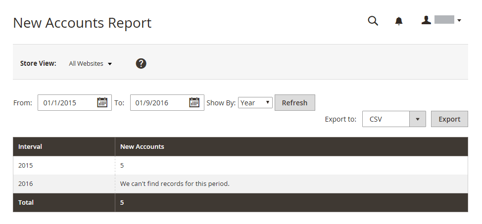

# 顧客レポート

顧客レポートは、指定した期間または日付範囲の顧客アクティビティに対するinsightを提供します。

## [!UICONTROL Order Total Report]

[!UICONTROL Order Total Report] は、指定した時間間隔または日付範囲での顧客の注文を表示します。 レポートには、顧客あたりの注文数、平均注文額、合計金額が含まれます。

_管理者_ サイドバーで、**[!UICONTROL Reports]**/_[!UICONTROL Customers]_/**[!UICONTROL Order Total]**&#x200B;に移動します。

{width="600"}

### Workspaceの制御

| 制御 | 説明 |
|--- |--- |
| [!UICONTROL From / To] | 開始日と終了日に基づいて注文の検索を定義するために使用します。 |
| [!UICONTROL Show By] | 注文レコード分割の精度を定義します。 オプション：`Month`/`Day`/`Year` |
| [!UICONTROL Refresh] | 指定したフィルターにグリッドを更新します。 |
| [!UICONTROL Export] | 選択したレコードを CSV または Excel XML ファイルとしてエクスポートします。 |
| [!UICONTROL Scope] | レポートの生成対象となるサイトまたはストアを設定するために使用されます。 |

{style="table-layout:auto"}

### 列の説明

| 列 | 説明 |
|--- |--- |
| [!UICONTROL Interval] | 注文の合計間隔（`Month`/`Day`/`Year`）。 |
| [!UICONTROL Customer] | 注文を行った顧客の名前。 |
| [!UICONTROL Orders] | 指定した期間の注文数。 |
| [!UICONTROL Average] | 平均注文額。 カタログの製品価格、注文の小計、注文の合計に税金が含まれている場合でも、この金額は常に製品価格 **税を除く** に対して計算されます。 その結果、このレポートに表示される金額は、受注合計に税金が含まれる場合の受注詳細に表示される金額とは異なります。 |
| [!UICONTROL Total] | 期間のすべての注文の合計。 カタログの製品価格、注文の小計、注文の合計に税金が含まれている場合でも、この金額は常に製品価格 **税を除く** に対して計算されます。 その結果、このレポートに表示される合計額は、受注合計に税金が含まれる場合の受注詳細に表示される金額とは異なります。 |

{style="table-layout:auto"}

## [!UICONTROL Order Count Report]

[!UICONTROL Order Count Report] は、指定した時間間隔または日付範囲での、顧客ごとの注文数を示します。 レポートには、顧客あたりの注文数、平均注文額、合計金額が含まれます。

_管理者_ サイドバーで、**[!UICONTROL Reports]**/_[!UICONTROL Customers]_/**[!UICONTROL Order Count]**&#x200B;に移動します。

{width="600"}

### Workspaceの制御

| 制御 | 説明 |
|--- |--- |
| [!UICONTROL From / To] | 開始日と終了日に基づいて注文の検索を定義するために使用します。 |
| [!UICONTROL Show By] | 注文レコード分割の精度を定義します。 オプション：`Month`/`Day`/`Year` |
| [!UICONTROL Refresh] | 指定したフィルターにグリッドを更新します。 |
| [!UICONTROL Export] | 選択したレコードを CSV または Excel XML ファイルとしてエクスポートします。 |
| [!UICONTROL Scope] | レポートの生成対象となるサイトまたはストアを設定するために使用されます。 |

{style="table-layout:auto"}

### 列の説明

| 列 | 説明 |
|--- |--- |
| [!UICONTROL Interval] | 注文数の間隔（`Month`/`Day`/`Year`）。 |
| [!UICONTROL Customer] | 注文を行った顧客。 |
| [!UICONTROL Orders] | 指定した期間の注文数。 |
| [!UICONTROL Average] | 平均注文額。 カタログの製品価格、注文の小計、注文の合計に税金が含まれている場合でも、この金額は常に製品価格 **税を除く** に対して計算されます。 その結果、このレポートに表示される金額は、受注合計に税金が含まれる場合の受注詳細に表示される金額とは異なります。 |
| [!UICONTROL Total] | 期間のすべての注文の合計。 カタログの製品価格、注文の小計、注文の合計に税金が含まれている場合でも、この金額は常に製品価格 **税を除く** に対して計算されます。 その結果、注文合計にタグが含まれている場合、レポートに表示される合計は注文の詳細に表示される金額とは異なります。 |

{style="table-layout:auto"}

## [!UICONTROL New Accounts Report]

[!UICONTROL New Accounts Report] は、指定した時間間隔または日付範囲で開設された新規の顧客アカウント数を示します。

_管理者_ サイドバーで、**[!UICONTROL Reports]**/_[!UICONTROL Customers]_/**[!UICONTROL New]**&#x200B;に移動します。

{width="600"}

### Workspaceの制御

| 制御 | 説明 |
|--- |--- |
| [!UICONTROL From / To] | 開始日と終了日に基づいて新しいアカウントの検索を定義するために使用します。 |
| [!UICONTROL Show By] | 注文レコード分割の精度を定義します。 オプション：月/日/年 |
| [!UICONTROL Refresh] | 指定したフィルターにグリッドを更新します。 |
| [!UICONTROL Export] | 選択したレコードを CSV または Excel XML ファイルとしてエクスポートします。 |
| [!UICONTROL Scope] | レポートの生成対象となるサイトまたはストアを設定するために使用されます。 |

{style="table-layout:auto"}

### 列の説明

| 列 | 説明 |
|--- |--- |
| [!UICONTROL Interval] | 新規アカウントの作成間隔（月/日/年別）。 |
| [!UICONTROL New Accounts] | 特定の間隔で作成された新しいアカウントの数。 |

{style="table-layout:auto"}

## [!UICONTROL Customer Wish List Report]

 （Adobe Commerceのみ）

[!UICONTROL Customer Wish List Report] は、お客様のウィッシュリストに関する情報を提供します。

_管理者_ サイドバーで、**[!UICONTROL Reports]**/_[!UICONTROL Customers]_/**[!UICONTROL Wish Lists]**&#x200B;に移動します。

{width="600"}

### Workspaceの制御

| 制御 | 説明 |
|--- |--- |
| [!UICONTROL Scope] | レポートの生成対象となるサイトまたはストアを設定するために使用されます。 |
| [!UICONTROL Search] | 指定されたパラメータによる検索を開始します。 |
| [!UICONTROL Reset Filter] | すべての検索パラメーターのリセットを開始します。 |
| [!UICONTROL Per Page] | 1 つのページに表示されるレコードの数を設定します。 |
| [!UICONTROL Export] | 選択したレコードを CSV または Excel XML ファイルとしてエクスポートします。 |
| [!UICONTROL From / To] | 開始日と終了日に基づいてウィッシュリストの検索を定義するために使用されます。 |
| [!UICONTROL Wishlist] | 名前によるウィッシュリスト検索を開始します。 |
| [!UICONTROL Status] | ウィッシュリストのステータス。 オプション：`Private` / `Public` |
| [!UICONTROL Comment] | ウィッシュリストのコメントのテキストで検索を開始します。 |

{style="table-layout:auto"}

### 列の説明

| 列 | 説明 |
|--- |--- |
| [!UICONTROL Added] | ウィッシュリストが作成された日付。 |
| [!UICONTROL Customer] | ウィッシュリストを作成した顧客の姓と名 |
| [!UICONTROL Wishlist] | ウィッシュリストの名前。 |
| [!UICONTROL Status] | ウィッシュリストのステータス。 オプション：`Private` / `Public` |
| [!UICONTROL Product] | ウィッシュリストに追加された商品の名前。 |
| [!UICONTROL SKU] | ウィッシュリストに追加された商品の SKU。 |
| [!UICONTROL Comment] | ウィッシュリストの作成時に入力されたコメントテキスト。 |

{style="table-layout:auto"}

## [!UICONTROL Customer Segment Report]

 （Adobe Commerceのみ）

[!UICONTROL Customer Segment Report] は、各セグメントの顧客数に関する情報を提供します。

_管理者_ サイドバーで、**[!UICONTROL Reports]**/_[!UICONTROL Customers]_/**[!UICONTROL Segments]**&#x200B;に移動します。

{width="600"}

### Workspaceの制御

| 制御 | 説明 |
|--- |--- |
| [!UICONTROL Search] | 指定されたパラメータによる検索を開始します。 |
| [!UICONTROL Reset Filter] | すべての検索パラメーターのリセットを開始します。 |
| [!UICONTROL Action] | セグメントの表示をパラメーターで開始します。 オプション：`Action` / `View Combined Report` |
| [!UICONTROL Per Page] | 1 つのページに表示されるレコードの数を設定します。 |

{style="table-layout:auto"}

### 列の説明

| 列 | 説明 |
|--- |--- |
| [!UICONTROL ID] | 各セグメントに割り当てられる一意の数値識別子。 |
| [!UICONTROL Segment] | セグメント名。 |
| [!UICONTROL Status] | セグメントステータス。 オプション：`Active` / `Inactive` |
| [!UICONTROL Website] | セグメントが割り当てられている web サイト。 |
| [!UICONTROL Customers] | セグメントに割り当てられた顧客の数。 |

{style="table-layout:auto"}
