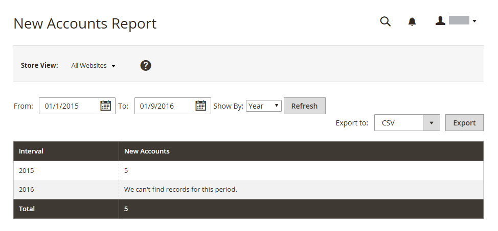

# 顧客レポート

お客様レポートは、指定された期間または日付範囲の間に、お客様のアクティビティにinsightを提供します。

## [!UICONTROL Order Total Report]

[!UICONTROL Order Total Report]には、指定された時間間隔または日付範囲の顧客の注文が表示されます。 このレポートには、顧客あたりの注文数、平均注文額、合計金額が含まれます。

_管理者_ サイドバーで、**[!UICONTROL Reports]** > _[!UICONTROL Customers]_>**[!UICONTROL Order Total]**&#x200B;に移動します。

{width="600"}

### Workspaceコントロール

| 制御 | 説明 |
|--- |--- |
| [!UICONTROL From / To] | 開始日と終了日に基づいて注文の検索を定義するために使用します。 |
| [!UICONTROL Show By] | 注文レコードの分割の精度を定義します。 オプション：`Month` / `Day` / `Year` |
| [!UICONTROL Refresh] | 指定したフィルターにグリッドを更新します。 |
| [!UICONTROL Export] | 選択したレコードをCSVまたはExcel XML ファイルとして書き出します。 |
| [!UICONTROL Scope] | レポートを生成するサイトまたはストアの設定に使用します。 |

{style="table-layout:auto"}

### 列の説明

| 列 | 説明 |
|--- |--- |
| [!UICONTROL Interval] | 注文合計間隔（`Month` / `Day` / `Year`）。 |
| [!UICONTROL Customer] | 注文を行った顧客の名前。 |
| [!UICONTROL Orders] | 指定した期間の注文数。 |
| [!UICONTROL Average] | 平均注文額： この金額は、カタログ商品価格、注文小計、注文総額に税金が含まれている場合でも、商品価格&#x200B;**税抜**&#x200B;で常に計算されます。 その結果、注文合計に税金が含まれる場合、報告書に表示される金額が注文詳細に表示される金額と異なります。 |
| [!UICONTROL Total] | 期間中のすべての注文の合計。 この金額は、カタログ商品価格、注文小計、注文総額に税金が含まれている場合でも、商品価格&#x200B;**税抜**&#x200B;で常に計算されます。 その結果、報告書に記載されている合計は、注文合計に税金が含まれる場合は、注文詳細に記載されている金額とは異なります。 |

{style="table-layout:auto"}

## [!UICONTROL Order Count Report]

[!UICONTROL Order Count Report]は、指定された時間間隔または日付範囲の顧客ごとの注文数を表示します。 このレポートには、顧客あたりの注文数、平均注文額、合計金額が含まれます。

_管理者_ サイドバーで、**[!UICONTROL Reports]** > _[!UICONTROL Customers]_>**[!UICONTROL Order Count]**&#x200B;に移動します。

{width="600"}

### Workspaceコントロール

| 制御 | 説明 |
|--- |--- |
| [!UICONTROL From / To] | 開始日と終了日に基づいて注文の検索を定義するために使用します。 |
| [!UICONTROL Show By] | 注文レコードの分割の精度を定義します。 オプション：`Month` / `Day` / `Year` |
| [!UICONTROL Refresh] | 指定したフィルターにグリッドを更新します。 |
| [!UICONTROL Export] | 選択したレコードをCSVまたはExcel XML ファイルとして書き出します。 |
| [!UICONTROL Scope] | レポートを生成するサイトまたはストアの設定に使用します。 |

{style="table-layout:auto"}

### 列の説明

| 列 | 説明 |
|--- |--- |
| [!UICONTROL Interval] | 注文数の間隔（`Month` / `Day` / `Year`）。 |
| [!UICONTROL Customer] | 注文した顧客。 |
| [!UICONTROL Orders] | 指定した期間の注文数。 |
| [!UICONTROL Average] | 平均注文額： この金額は、カタログ商品価格、注文小計、注文総額に税金が含まれている場合でも、商品価格&#x200B;**税抜**&#x200B;で常に計算されます。 その結果、注文合計に税金が含まれる場合、報告書に表示される金額が注文詳細に表示される金額と異なります。 |
| [!UICONTROL Total] | 期間中のすべての注文の合計。 この金額は、カタログ商品価格、注文小計、注文総額に税金が含まれている場合でも、商品価格&#x200B;**税抜**&#x200B;で常に計算されます。 その結果、注文合計にタスが含まれる場合、報告書に表示される合計金額が注文詳細に表示される金額と異なります。 |

{style="table-layout:auto"}

## [!UICONTROL New Accounts Report]

[!UICONTROL New Accounts Report]には、指定された時間間隔または日付範囲で開かれた新しい顧客アカウントの数が表示されます。

_管理者_ サイドバーで、**[!UICONTROL Reports]** > _[!UICONTROL Customers]_>**[!UICONTROL New]**&#x200B;に移動します。

{width="600"}

### Workspaceコントロール

| 制御 | 説明 |
|--- |--- |
| [!UICONTROL From / To] | 開始日と終了日に基づいて、新しいアカウントの検索を定義するために使用します。 |
| [!UICONTROL Show By] | 注文レコードの分割の精度を定義します。 オプション：月/日/年 |
| [!UICONTROL Refresh] | 指定したフィルターにグリッドを更新します。 |
| [!UICONTROL Export] | 選択したレコードをCSVまたはExcel XML ファイルとして書き出します。 |
| [!UICONTROL Scope] | レポートを生成するサイトまたはストアの設定に使用します。 |

{style="table-layout:auto"}

### 列の説明

| 列 | 説明 |
|--- |--- |
| [!UICONTROL Interval] | 月/日/年ごとの新しいアカウント作成間隔。 |
| [!UICONTROL New Accounts] | 特定の間隔で作成された新規アカウントの数。 |

{style="table-layout:auto"}

## [!UICONTROL Customer Wish List Report]

[!BADGE PaaSのみ]{type=Informative url="https://experienceleague.adobe.com/ja/docs/commerce/user-guides/product-solutions" tooltip="Adobe Commerce on Cloud プロジェクト（Adobeで管理されるPaaS インフラストラクチャ）とオンプレミス プロジェクトにのみ適用されます。"}

 （Adobe Commerceのみ）

[!UICONTROL Customer Wish List Report]は、お客様の要望リストに関する情報を提供します。

_管理者_ サイドバーで、**[!UICONTROL Reports]** > _[!UICONTROL Customers]_>**[!UICONTROL Wish Lists]**&#x200B;に移動します。

{width="600"}

### Workspaceコントロール

| 制御 | 説明 |
|--- |--- |
| [!UICONTROL Scope] | レポートを生成するサイトまたはストアの設定に使用します。 |
| [!UICONTROL Search] | 指定したパラメーターによる検索を開始します。 |
| [!UICONTROL Reset Filter] | すべての検索パラメーターのリセットを開始します。 |
| [!UICONTROL Per Page] | 1つのページに表示されるレコードの数を設定します。 |
| [!UICONTROL Export] | 選択したレコードをCSVまたはExcel XML ファイルとして書き出します。 |
| [!UICONTROL From / To] | 開始日と終了日に基づいてウィッシュリストの検索を定義するために使用します。 |
| [!UICONTROL Wishlist] | 名前でウィッシュリスト検索を開始します。 |
| [!UICONTROL Status] | ウィッシュリストのステータス。 オプション：`Private` / `Public` |
| [!UICONTROL Comment] | ウィッシュリストのコメント内のテキストによる検索を開始します。 |

{style="table-layout:auto"}

### 列の説明

| 列 | 説明 |
|--- |--- |
| [!UICONTROL Added] | ウィッシュリストの作成日。 |
| [!UICONTROL Customer] | ウィッシュリストを作成した顧客の姓と名。 |
| [!UICONTROL Wishlist] | ウィッシュリストの名前。 |
| [!UICONTROL Status] | ウィッシュリストのステータス。 オプション：`Private` / `Public` |
| [!UICONTROL Product] | ウィッシュリストに追加された製品の名前。 |
| [!UICONTROL SKU] | ウィッシュリストに追加された製品のSKU。 |
| [!UICONTROL Comment] | ウィッシュリストの作成時に入力されたコメントテキスト。 |

{style="table-layout:auto"}

## [!UICONTROL Customer Segment Report]

 （Adobe Commerceのみ）

[!UICONTROL Customer Segment Report]は、各セグメントの顧客数に関する情報を提供します。

_管理者_ サイドバーで、**[!UICONTROL Reports]** > _[!UICONTROL Customers]_>**[!UICONTROL Segments]**&#x200B;に移動します。

{width="600"}

### Workspaceコントロール

| 制御 | 説明 |
|--- |--- |
| [!UICONTROL Search] | 指定したパラメーターによる検索を開始します。 |
| [!UICONTROL Reset Filter] | すべての検索パラメーターのリセットを開始します。 |
| [!UICONTROL Action] | パラメーターによるセグメントの表示を開始します。 オプション：`Action` / `View Combined Report` |
| [!UICONTROL Per Page] | 1つのページに表示されるレコードの数を設定します。 |

{style="table-layout:auto"}

### 列の説明

| 列 | 説明 |
|--- |--- |
| [!UICONTROL ID] | 各セグメントに割り当てられる一意の数値識別子。 |
| [!UICONTROL Segment] | セグメント名： |
| [!UICONTROL Status] | セグメントステータス： オプション：`Active` / `Inactive` |
| [!UICONTROL Website] | セグメントが割り当てられているWeb サイト。 |
| [!UICONTROL Customers] | セグメントに割り当てられた顧客の数。 |

{style="table-layout:auto"}
