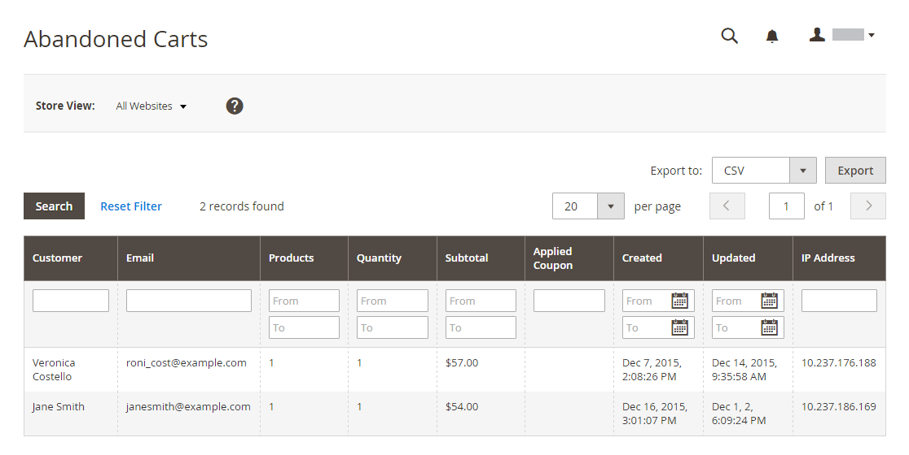

# マーケティングレポート

マーケティングレポートでは、ショッピングカートの状況、検索語の使用状況、ニュースレターの送信に関する情報が提供されます。

## [!UICONTROL Products in Cart]

[!UICONTROL Products in Cart] レポートには、現在ショッピングカートに入っているすべての製品のリストが表示されます。 これには、各商品の名前と価格、商品が入ったカートの数、各商品の注文回数が含まれます。

{width="600"}

## [!UICONTROL Search Terms Report]

[!BADGE PaaSのみ]{type=Informative url="https://experienceleague.adobe.com/en/docs/commerce/user-guides/product-solutions" tooltip="Adobe Commerce on Cloud プロジェクト（Adobeで管理されるPaaS インフラストラクチャ）とオンプレミス プロジェクトにのみ適用されます。"}

[検索語](../catalog/search-terms.md#search-terms-report) レポートには、各店舗の表示で顧客が求めているものが表示されます。 このレポートには、カタログ内で見つかった一致するアイテムの数と、検索語が使用された回数が含まれます。

{width="600"}

## [!UICONTROL Abandoned Carts]

[!UICONTROL Abandoned Carts] レポートには、まだ期限切れになっていないカートを放棄したすべての登録済み顧客が一覧表示されます。 レポートには、顧客名と電子メールアドレス、カート内の商品数と小計、作成日、最終更新日が含まれます。

{width="600"}

## [!UICONTROL Newsletter Problems Report]

[!BADGE PaaSのみ]{type=Informative url="https://experienceleague.adobe.com/en/docs/commerce/user-guides/product-solutions" tooltip="Adobe Commerce on Cloud プロジェクト（Adobeで管理されるPaaS インフラストラクチャ）とオンプレミス プロジェクトにのみ適用されます。"}

[!UICONTROL Newsletter Problems Report]には、正常に送信できなかったニュースレターキューに関する情報が含まれています。 レポートには、各購読者の名前、キューの日付と件名、エラーに関する情報が含まれます。

{width="600"}
