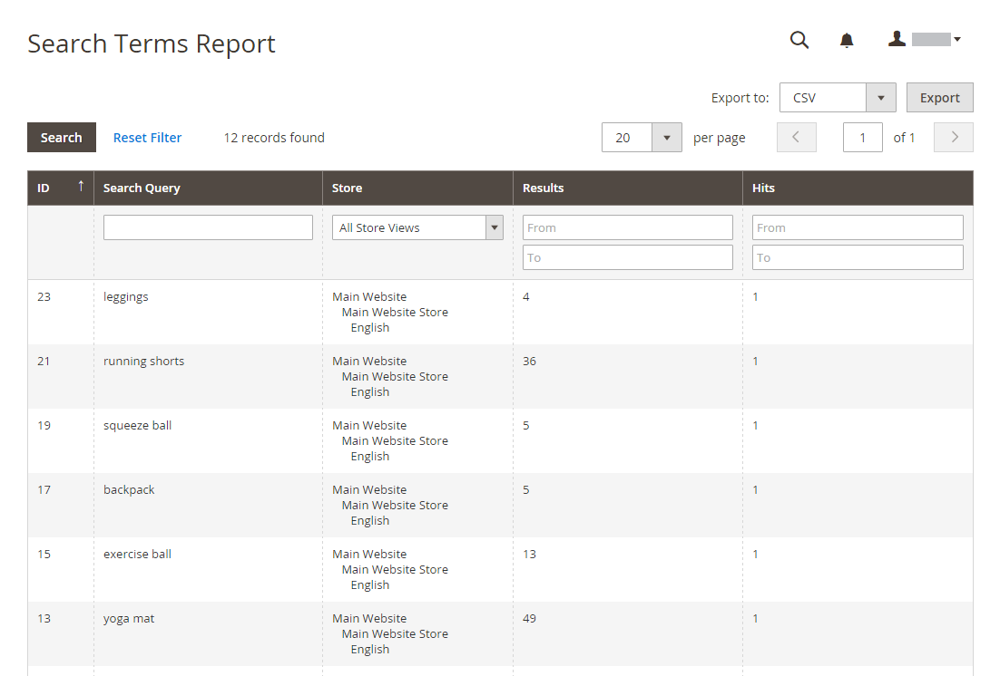
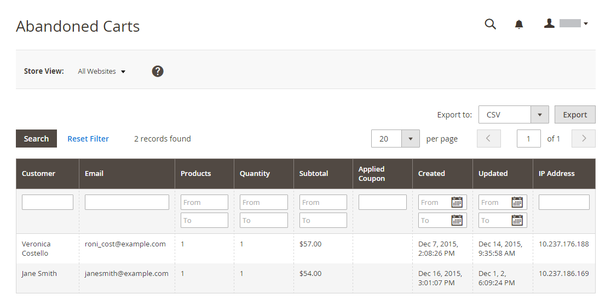

# マーケティングレポート

マーケティングレポートは、買い物かごのステータス、検索語句の使用およびニュースレターの送信に関する情報を提供します。

## [!UICONTROL Products in Cart]

[!UICONTROL Products in Cart] レポートは、現在ショッピングカートに入っているすべての商品のリストを提供します。 各品目の名前と価格、品目を含む買い物かごの数、各品目の注文回数が含まれます。

{width="600"}

## [!UICONTROL Search Terms Report]

[ 検索語句 ](../catalog/search-terms.md#search-terms-report) レポートには、各ストア表示で顧客が何を探しているかが表示されます。 レポートには、カタログ内で見つかった一致する項目の数と、検索語句の使用回数が含まれます。

{width="600"}

## [!UICONTROL Abandoned Carts]

[!UICONTROL Abandoned Carts] レポートには、まだ有効期限が切れていない放棄された買い物かごを持つすべての登録済み顧客がリストされます。 レポートには、顧客名とメールアドレス、買い物かごに入っている商品の数と小計、作成日、最終更新日が含まれます。

{width="600"}

## [!UICONTROL Newsletter Problems Report]

[!UICONTROL Newsletter Problems Report] には、正常に送信されなかったニュースレターキューに関する情報が含まれます。 レポートには、各購読者の名前、キューの日付と件名、エラーに関する情報が含まれます。

{width="600"}
