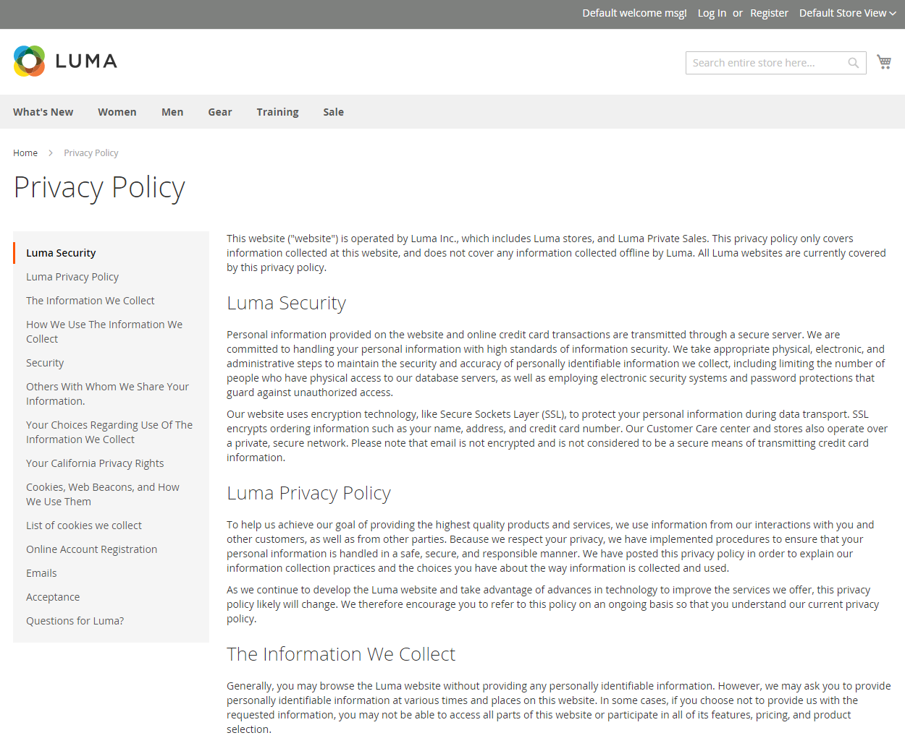

# プライバシーポリシーを保存

ストアには、サンプルのプライバシーポリシーが含まれており、独自の情報で更新する必要があります。 プライバシーポリシーでは、企業が収集する情報の種類とその使用方法を説明する必要があります。 また、ストアを訪問するユーザーのコンピューターに配置されている[cookie](compliance-cookie-law.md#default-cookies)のファイル名もリストする必要があります。 サードパーティの拡張機能やアドオンに関連する追加のCookieは、リストに含める必要があります。

## 個人データ

個人情報には、PIとPIIという2つのカテゴリーがあります。 Luma サンプルデータのプライバシーポリシーの例は、個人情報（PII）を指します。 さらに、これらの定義には、さまざまな国、地域、州の法的規制に関連する多くのバリエーションがあります。 この一般的な議論では、次の定義を使用できます。

### 個人情報（PI）

直接的または間接的に個人を識別するために合理的に識別または使用できる情報。 個人情報は、顧客、雇用主、ベンダー、請負業者などの個人に関連する場合があります。

### 個人情報（PII）

情報が適用される個人の身元を許可する情報の表現は、直接的または間接的な手段によって合理的に推測されます。 PIIとは、個人を直接識別する情報（名前、住所、社会保障番号、その他の識別番号など）と定義されます。 また、エージェンシーが特定の個人を他のデータ要素で識別しようとする情報でもある（間接識別）。 これらのデータ要素には、性別、人種、生年月日、地理的指標、その他の記述子の組み合わせが含まれます。 また、特定の個人の物理的またはオンラインでの接触が個人を特定できる情報と同じであることを許可する情報も含まれます。 この情報は、紙、電子またはその他のメディアで保持できます。

{width="600" zoomable="yes"}

## プライバシーポリシーを編集

>[!TIP]
>
>Luma サンプルデータには、使用のために変更できるサンプルプライバシーポリシーが含まれています。

1. _管理者_ サイドバーで、**[!UICONTROL Content]** > _[!UICONTROL Elements]_>**[!UICONTROL Pages]**&#x200B;に移動します。

1. グリッドで、**[!UICONTROL Privacy Policy]**&#x200B;を見つけます。 次に、_[!UICONTROL Action]_&#x200B;列で、**[!UICONTROL Select]**&#x200B;をクリックし、**[!UICONTROL Edit]**&#x200B;を選択します。

   >[!NOTE]
   >
   >プライバシーポリシーページのURL キーを変更する場合は、トラフィックを新しいURL キーにリダイレクトするために、[&#x200B; カスタム URL書き換え](../merchandising-promotions/url-rewrite-custom.md)も作成する必要があります。 それ以外の場合、フッターのリンクは`404 Page Not Found`を返します。

1. 「**[!UICONTROL Content]**」セクションを展開し、コンテンツに必要な変更を加えます。

   ページコンテンツツールの使用について詳しくは、_コンテンツおよびデザインガイド_&#x200B;の「[&#x200B; コンテンツを完成させる](../content-design/page-add.md#step-2-complete-the-content)」を参照してください。

   {width="600" zoomable="yes"}

1. 完了したら、**[!UICONTROL Save Page]**&#x200B;をクリックします。
