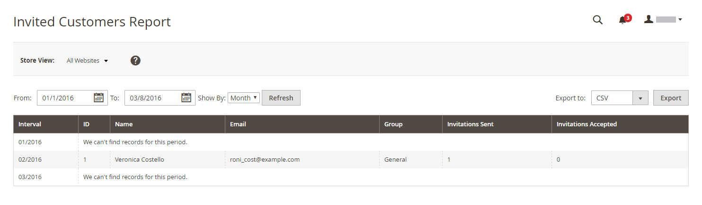

# プライベートセールスレポート

{{ee-feature}}

非公開の販売レポートは、次の情報を提供します： [イベントとプライベートセールス](../merchandising-promotions/events-private-sales.md).

## [!UICONTROL Invitations Report]

The [!UICONTROL Invitations Report] の数を示します。 [招待状](../merchandising-promotions/invitations.md) 指定された期間に送信され、その数は受け入れられ、破棄されました。

次の日： _管理者_ サイドバー、移動 **[!UICONTROL Reports]** > _[!UICONTROL Private Sales]_>**[!UICONTROL Invitations]**.

{width="600"}

## [!UICONTROL Invited Customers Report]

The [!UICONTROL Invited Customers Report] プライベートセールまたはイベントへの招待を送信したすべての顧客を表示します。 これには、名前、E メールアドレス、顧客グループ、送信された招待の数、許可された数が含まれます。

次の日： _管理者_ サイドバー、移動 **[!UICONTROL Reports]** > _[!UICONTROL Private Sales]_>**[!UICONTROL Invited Customers]**.

{width="600"}

## [!UICONTROL Conversion Rate Report]

The [!UICONTROL Conversion Rate Report] 送信および許可された招待の数、購入につながった招待の数、コンバージョン率をパーセンテージで示します。

次の日： _管理者_ サイドバー、移動 **[!UICONTROL Reports]** > _[!UICONTROL Private Sales]_>**[!UICONTROL Conversions]**.

{width="600"}
