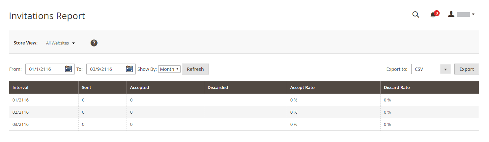
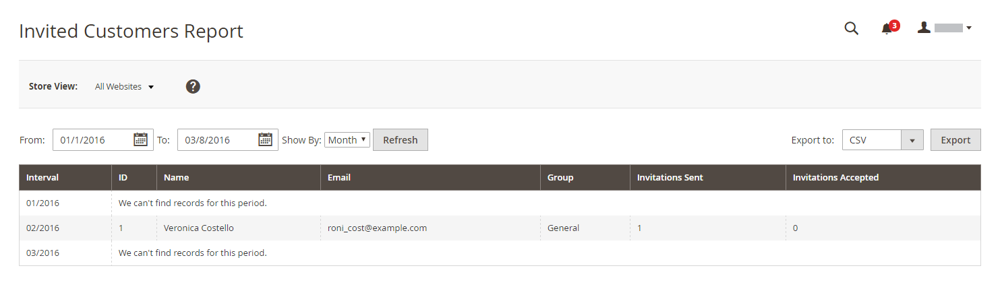

# プライベートセールスレポート

{{ee-feature}}

個人向け販売レポートには、[件のイベントと個人向け販売](../merchandising-promotions/events-private-sales.md)に関する情報が記載されています。

## [!UICONTROL Invitations Report]

[!UICONTROL Invitations Report]には、指定された期間に送信された[招待状](../merchandising-promotions/invitations.md)の数、および許可され、破棄された数が表示されます。

_管理者_ サイドバーで、**[!UICONTROL Reports]** > _[!UICONTROL Private Sales]_>**[!UICONTROL Invitations]**に移動します。

{width="600"}

## [!UICONTROL Invited Customers Report]

[!UICONTROL Invited Customers Report]には、プライベート セールまたはイベントへの招待を送信されたすべての顧客が表示されます。 名前と電子メールアドレス、顧客グループ、送信済みの招待状の数と受け入れられた数が含まれます。

_管理者_ サイドバーで、**[!UICONTROL Reports]** > _[!UICONTROL Private Sales]_>**[!UICONTROL Invited Customers]**に移動します。

{width="600"}

## [!UICONTROL Conversion Rate Report]

[!UICONTROL Conversion Rate Report]には、送信および承認された招待の数、購入に至った招待の数、コンバージョン率がパーセンテージで表示されます。

_管理者_ サイドバーで、**[!UICONTROL Reports]** > _[!UICONTROL Private Sales]_>**[!UICONTROL Conversions]**に移動します。

{width="600"}
