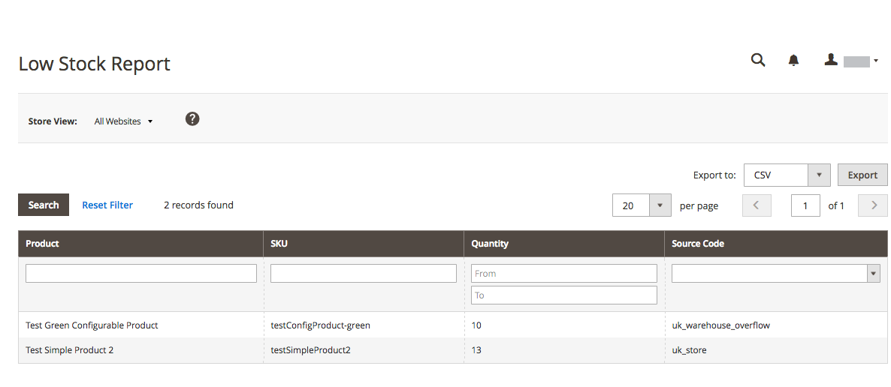

# 製品レポート

製品レポートでは、表示および注文された製品、ベストセラー、在庫レベル、ダウンロードに関するインサイトを確認できます。

## [!UICONTROL Product Views Report]

The [!UICONTROL Product Views Report] には、ある期間または日付範囲で閲覧された製品が表示されます。 レポートには、製品名、価格、表示回数が含まれます。

次の日： _管理者_ サイドバー、移動 **[!UICONTROL Reports]** > _[!UICONTROL Products]_>**[!UICONTROL Views]**.

{width="600"}

## [!UICONTROL Bestsellers Report]

The [!UICONTROL Bestsellers Report] ある期間または日付範囲でのトップセル 5 件のが表示されます。 このレポートには、製品名、価格、注文数量が含まれます。

次の日： _管理者_ サイドバー、移動 **[!UICONTROL Reports]** > _[!UICONTROL Products]_>**[!UICONTROL Bestsellers]**.

{width="600"}

## [!UICONTROL Low Stock Report]

The [!UICONTROL Low Stock Report] 指定した範囲内の在庫レベルを持つすべての製品をリストします。 を使用 [[!DNL Inventory Management]](../inventory-management/introduction.md) 有効にすると、レポートには、ソースごとの在庫が少なく、ソースコードが一覧表示されます。

次の日： _管理者_ サイドバー、移動 **[!UICONTROL Reports]** > _[!UICONTROL Products]_>**[!UICONTROL Low Stock]**.

{width="600"}

## [!UICONTROL Ordered Products Report]

The [!UICONTROL Ordered Products Report] 指定した期間または日付範囲で注文されたすべての製品の一覧を表示します。 このレポートには、製品名と注文された数量が含まれます。

次の日： _管理者_ サイドバー、移動 **[!UICONTROL Reports]** > _[!UICONTROL Products]_>**[!UICONTROL Ordered]**.

{width="600"}

## [!UICONTROL Downloads Report]

The [!UICONTROL Downloads Report] に、指定した期間または日付範囲のすべてのダウンロードの一覧を示します。 このレポートには、製品名、ダウンロードリンク、SKU と、購入数およびダウンロード数が含まれます。

次の日： _管理者_ サイドバー、移動 **[!UICONTROL Reports]** > _[!UICONTROL Products]_>**[!UICONTROL Downloaded]**.

{width="600"}
