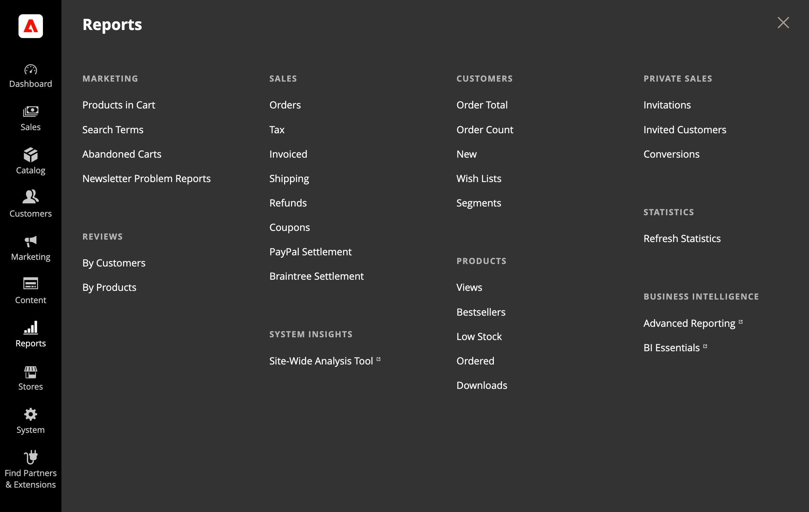

# [!UICONTROL Reports] メニュー

Adobe Commerceでは、マーケティング施策、セールス施策、顧客行動に関する様々なレポートを利用できます。 レポートメニューでは、販売、製品、顧客、プロモーションに関する最新情報に簡単にアクセスできます。

{width="600"}

## [!UICONTROL Reports] メニューの表示

_管理者_ サイドバーで、**[!UICONTROL Reports]**&#x200B;を選択します。

## メニューオプション

### [!UICONTROL Marketing]

買い物かご、検索語、放棄された買い物かご、ニュースレターの問題レポートなど、[&#x200B; マーケティングレポート &#x200B;](marketing-reports.md)の一部。

### [!UICONTROL Reviews]

[!BADGE PaaSのみ]{type=Informative url="https://experienceleague.adobe.com/ja/docs/commerce/user-guides/product-solutions" tooltip="Adobe Commerce on Cloud プロジェクト（Adobeで管理されるPaaS インフラストラクチャ）とオンプレミス プロジェクトにのみ適用されます。"}

製品[&#x200B; レビューレポート &#x200B;](review-reports.md)の選択範囲には、顧客別および製品別が含まれます。

### [!UICONTROL Sales]

[販売レポート &#x200B;](sales-reports.md)には、PayPalおよびBraintreeの注文、税金、請求済み、配送、返金、クーポン、および決済レポートが含まれます。

### [!UICONTROL System Insights]

[!BADGE PaaSのみ]{type=Informative url="https://experienceleague.adobe.com/ja/docs/commerce/user-guides/product-solutions" tooltip="Adobe Commerce on Cloud プロジェクト（Adobeで管理されるPaaS インフラストラクチャ）とオンプレミス プロジェクトにのみ適用されます。"}

（Adobe Commerceのみ） [[!DNL Site-Wide Analysis Tool]](https://experienceleague.adobe.com/docs/commerce-operations/tools/site-wide-analysis-tool/access.html?lang=ja)は、クラウド インフラストラクチャ上のAdobe Commerceのインストールに関するシステム インサイトを、24時間年中無休のリアルタイム パフォーマンス監視、レポート、および推奨事項とともに提供します。

### [!UICONTROL Customers]

（Adobe Commerceのみ） [お客様レポート &#x200B;](customer-reports.md)の選択範囲には、注文合計、注文口座、新規、ウィッシュリスト、セグメントが含まれます。

### [!UICONTROL Products]

[製品レポート &#x200B;](product-reports.md)の選択範囲には、閲覧数、ベストセラー、低在庫、注文済み、ダウンロードが含まれます。

### [!UICONTROL Private Sales]

[!BADGE PaaSのみ]{type=Informative url="https://experienceleague.adobe.com/ja/docs/commerce/user-guides/product-solutions" tooltip="Adobe Commerce on Cloud プロジェクト（Adobeで管理されるPaaS インフラストラクチャ）とオンプレミス プロジェクトにのみ適用されます。"}

（Adobe Commerceのみ） [個人向けセールスおよびイベント &#x200B;](private-sales-reports.md)のレポートの選択範囲には、招待、招待された顧客、コンバージョンが含まれます。

### [!UICONTROL Statistics]

[!BADGE PaaSのみ]{type=Informative url="https://experienceleague.adobe.com/ja/docs/commerce/user-guides/product-solutions" tooltip="Adobe Commerce on Cloud プロジェクト（Adobeで管理されるPaaS インフラストラクチャ）とオンプレミス プロジェクトにのみ適用されます。"}

[統計](sales-reports.md#refresh-statistics)は、統計データを計算して保存することにより、レポートを生成する際のパフォーマンスへの影響を軽減するツールです。 レポートが生成されるたびに統計を再計算するのではなく、統計を更新するまで保存された統計が使用されます。

### [!DNL Commerce Intelligence]

[!BADGE PaaSのみ]{type=Informative url="https://experienceleague.adobe.com/ja/docs/commerce/user-guides/product-solutions" tooltip="Adobe Commerce on Cloud プロジェクト（Adobeで管理されるPaaS インフラストラクチャ）とオンプレミス プロジェクトにのみ適用されます。"}

統合された[[!DNL Commerce Intelligence]](business-intelligence.md) ツールは、戦略的なビジネス上の意思決定に必要なinsightを提供します。
