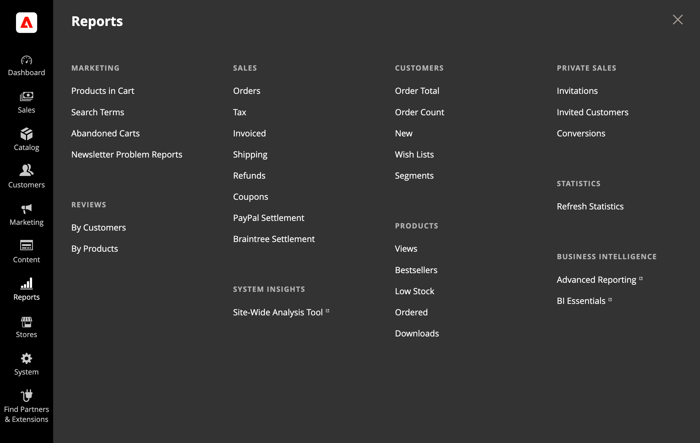

# [!UICONTROL Reports] メニュー

Adobe Commerceでは、マーケティング活動、販売製品、お客様の行動に関する情報を得るための様々なレポートを提供しています。 レポートメニューから、販売、製品、顧客、プロモーションに関する現在の情報に簡単にアクセスできます。

{width="600"}

## 次を表示： [!UICONTROL Reports] メニュー

次の日： _管理者_ サイドバー、選択 **[!UICONTROL Reports]**.

## メニューオプション

### [!UICONTROL Marketing]

次の項目を選択： [マーケティングレポート](marketing-reports.md)（買い物かご内の製品、検索用語、放棄された買い物かご、ニュースレターの問題レポートを含む）。

### [!UICONTROL Reviews]

製品の選択 [レポートのレビュー](review-reports.md) には、顧客別および製品別が含まれます。

### [!UICONTROL Sales]

選択範囲： [営業レポート](sales-reports.md) PayPal とBraintreeの注文、税、請求済み、送料、返金、クーポン、決済レポートが含まれます。

### [!UICONTROL System Insights]

(Adobe Commerceのみ ) [[!DNL Site-Wide Analysis Tool]](https://experienceleague.adobe.com/docs/commerce-operations/tools/site-wide-analysis-tool/access.html) は、クラウドインフラストラクチャにAdobe Commerceをインストールする際の、リアルタイムのパフォーマンス監視、レポート、および推奨事項に関するシステムインサイトを提供しま24/7。

### [!UICONTROL Customers]

(Adobe Commerceのみ ) [顧客レポート](customer-reports.md) 注文合計、注文アカウント、新規、ウィッシュリスト、セグメントが含まれます。

### [!UICONTROL Products]

選択範囲： [製品レポート](product-reports.md) 表示回数、ベストセラー数、低在庫数、注文数、ダウンロード数が含まれます。

### [!UICONTROL Private Sales]

(Adobe Commerceのみ ) レポートの選択 [プライベートセールスとイベント](private-sales-reports.md) には、招待、招待顧客、コンバージョンが含まれます。

### [!UICONTROL Statistics]

[統計](sales-reports.md#refresh-statistics) は、統計データを計算して保存することで、レポート生成時のパフォーマンスへの影響を低減するツールです。 レポートが生成されるたびに統計を再計算するのではなく、統計を更新するまで保存された統計が使用されます。

### [!DNL Commerce Intelligence]

統合済み [[!DNL Commerce Intelligence]](business-intelligence.md) ツールは、戦略的なビジネス上の意思決定に必要なインサイトを提供します。
