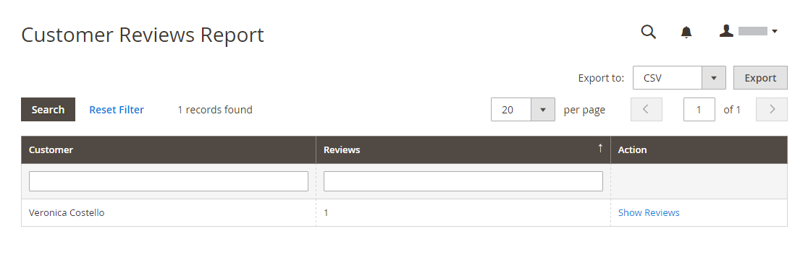

# レポートを確認

組み込みを使用している場合 [!DNL Commerce] レビュー、レビューレポートは、製品レビューに関する情報を顧客別および製品別に提供します。

## [!UICONTROL Customer Reviews Report]

この [!UICONTROL Customer Reviews Report] 製品レビューを送信したすべての顧客のリストが表示されます。 レポートには、各顧客が送信したレビューの数、およびレビューのリストへのリンクが含まれます。

日 _Admin_ サイドバー、に移動 **[!UICONTROL Reports]** > _[!UICONTROL Reviews]_>**[!UICONTROL By Customers]**.

{width="600"}

## [!UICONTROL Product Reviews Report]

この [!UICONTROL Product Reviews Report] お客様によってレビューされたすべての製品をリストします。 レポートには、レビューの数と平均評価、最後にレビューされた製品、各製品のレビューのリストへのリンクが含まれます。

日 _Admin_ サイドバー、に移動 **[!UICONTROL Reports]** > _[!UICONTROL Reviews]_>**[!UICONTROL By Products]**.

{width="600"}
