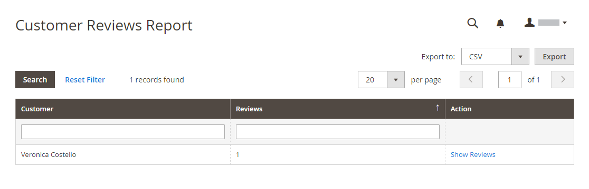
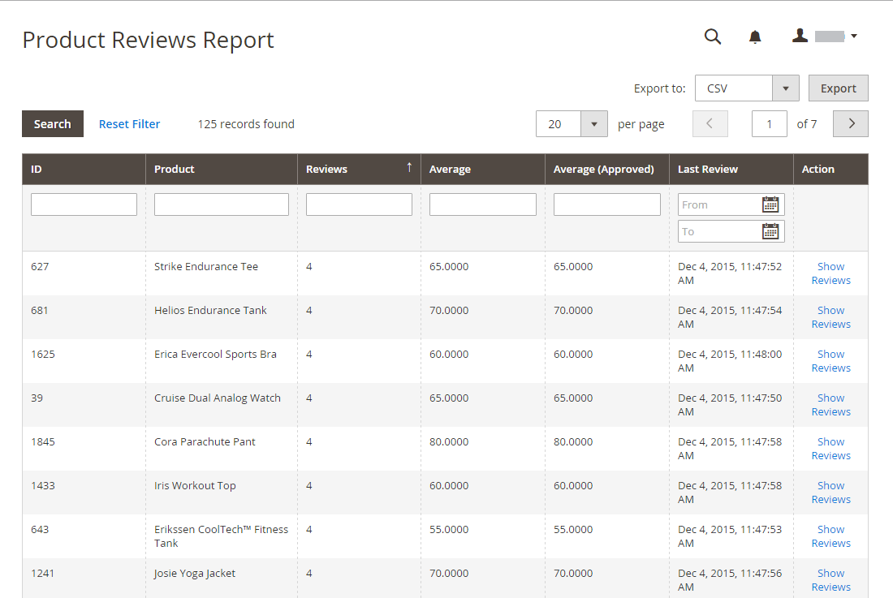

# レポートを見る

組み込みの[!DNL Commerce] レビューを使用している場合、レビューレポートには、お客様および製品別の製品レビューに関する情報が提供されます。

## [!UICONTROL Customer Reviews Report]

[!UICONTROL Customer Reviews Report]には、製品レビューを送信したすべての顧客のリストが表示されます。 このレポートには、各顧客が送信したレビューの数と、レビューのリストへのリンクが含まれます。

_管理者_ サイドバーで、**[!UICONTROL Reports]** > _[!UICONTROL Reviews]_>**[!UICONTROL By Customers]**&#x200B;に移動します。

{width="600"}

## [!UICONTROL Product Reviews Report]

[!UICONTROL Product Reviews Report]には、顧客によってレビューされたすべての製品が一覧表示されます。 レポートには、レビュー数と平均評価、最後にレビューされた製品、各製品のレビューのリストへのリンクが含まれます。

_管理者_ サイドバーで、**[!UICONTROL Reports]** > _[!UICONTROL Reviews]_>**[!UICONTROL By Products]**&#x200B;に移動します。

{width="600"}
