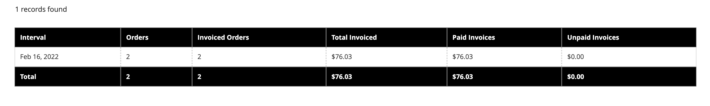
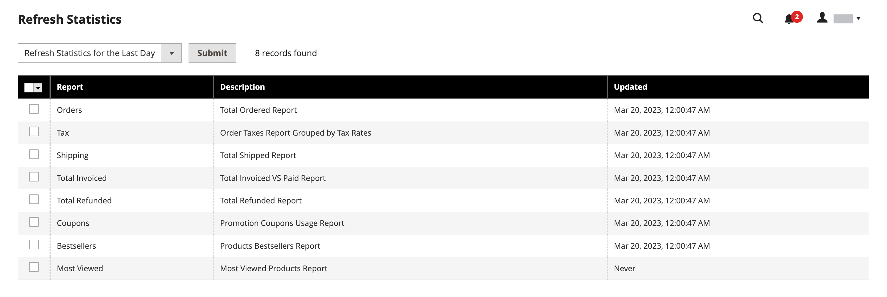

# 売上レポート

販売レポートの選択には、注文、税金、請求済み、配送、返金、クーポン、PayPal決済が含まれます。

## レポートフィルター

web サイト全体または1つの店舗の売上レポートを生成できます。 セールスレポートは、時間間隔、日付、ステータスでフィルタリングできます。

{width="600"}

販売レポートをフィルタリングするには、次のオプションを設定します。

| オプション | 説明 |
|--- |--- |
| [!UICONTROL Date Used] | レポートに使用するデータを設定します。 |
| [!UICONTROL Period] | データが使用される期間：日/月/年。 |
| [!UICONTROL From/To] | 開始日と終了日で検索データを定義するために使用します。 |
| [!UICONTROL Order Status] | 注文ステータスを示します |
| [!UICONTROL Empty Rows] | レポートに空白行を追加するかどうかを示します。 |

## [!UICONTROL Orders Report]

[!UICONTROL Orders Report]には、注文およびキャンセルされた注文数が含まれており、売上合計、請求金額、返金済み、徴収税、配送料、割引が含まれています。

1. _管理者_ サイドバーで、**[!UICONTROL Reports]** > _[!UICONTROL Sales]_>**[!UICONTROL Orders]**&#x200B;に移動します。

1. 「**[!UICONTROL Filter]**」セクションで、レポートの入力に使用するレポート期間のオプションと注文状況を選択します。

1. **[!UICONTROL Show Report]**&#x200B;をクリックします。

{width="600"}

## [!UICONTROL Tax Report]

[!UICONTROL Tax Report]には、適用された税ルール、税率、注文数、および請求金額が含まれます。

1. _管理者_ サイドバーで、**[!UICONTROL Reports]** > _[!UICONTROL Sales]_>**[!UICONTROL Tax]**&#x200B;に移動します。

1. 「**[!UICONTROL Filter]**」セクションで、レポートの入力に使用するレポート期間のオプションと注文状況を選択します。

1. **[!UICONTROL Show Report]**&#x200B;をクリックします。

{width="600"}

## [!UICONTROL Invoice Report]

[!UICONTROL Invoice Report]には、期間中の注文数と請求書の数、請求金額、支払金額、未払い金額が含まれます。

1. _管理者_ サイドバーで、**[!UICONTROL Reports]** > _[!UICONTROL Sales]_>**[!UICONTROL Invoiced]**&#x200B;に移動します。

1. 「**[!UICONTROL Filter]**」セクションで、レポートの入力に使用するレポート期間のオプションと注文状況を選択します。

1. **[!UICONTROL Show Report]**&#x200B;をクリックします。

{width="600"}

## [!UICONTROL Shipping Report]

[!UICONTROL Shipping Report]には、使用した配送業者または配送方法の注文数が含まれます。これには、総売上高と総配送料の金額が含まれます。

1. _管理者_ サイドバーで、**[!UICONTROL Reports]** > _[!UICONTROL Sales]_>**[!UICONTROL Shipping]**&#x200B;に移動します。

1. 「**[!UICONTROL Filter]**」セクションで、レポートの入力に使用するレポート期間のオプションと注文状況を選択します。

1. **[!UICONTROL Show Report]**&#x200B;をクリックします。

{width="600"}

## [!UICONTROL Refunds Report]

[!UICONTROL Refunds Report]には、返金済み注文数と、オンラインおよびオフラインでの返金合計金額が含まれます。

1. _管理者_ サイドバーで、**[!UICONTROL Reports]** > _[!UICONTROL Sales]_>**[!UICONTROL Refunds]**&#x200B;に移動します。

1. 「**[!UICONTROL Filter]**」セクションで、レポートの入力に使用するレポート期間のオプションと注文状況を選択します。

1. **[!UICONTROL Show Report]**&#x200B;をクリックします。

{width="600"}

## [!UICONTROL Coupons Report]

[!UICONTROL Coupons Report]には、指定された時間間隔で使用された各クーポンコード、関連する価格ルール、使用回数、およびセールと割引の合計と小計が含まれています。

1. _管理者_ サイドバーで、**[!UICONTROL Reports]** > _[!UICONTROL Sales]_>**[!UICONTROL Coupons]**&#x200B;に移動します。

1. 「**[!UICONTROL Filter]**」セクションで、レポートの入力に使用するレポート期間のオプションと注文状況を選択します。

1. **[!UICONTROL Show Report]**&#x200B;をクリックします。

[!UICONTROL Coupons Report]を使用してプロモーションキャンペーンのデータを収集する方法について詳しくは、_マーチャンダイジングおよびプロモーションガイド_&#x200B;の[&#x200B; クーポンレポート &#x200B;](../merchandising-promotions/price-rules-cart-coupon.md#coupons-report)を参照してください。

<!---  need coupon data  -->

## [!UICONTROL PayPal Settlement Reports]

[PayPal決済レポート ] ページには、デビットカード取引、開始日と終了日、総額、関連手数料などのイベントのタイプが含まれています。 レポートは、PayPalの最新データで自動的に更新できます。 日付範囲、加盟店アカウント、トランザクション ID、請求書ID、PayPal参照IDのフィルターオプションがあります。

_管理者_ サイドバーで、**[!UICONTROL Reports]** > _[!UICONTROL Sales]_>**[!UICONTROL PayPal Settlement]**&#x200B;に移動します。

{width="600"}

[!UICONTROL PayPal Settlement Reports]を使用して、資金決済に影響する各PayPal トランザクションに関する情報を取得する方法について詳しくは、_ストアおよび購入エクスペリエンスガイド_&#x200B;の[PayPal決済レポート &#x200B;](../stores-purchase/paypal-settlement-reports.md)を参照してください。

## [!UICONTROL Braintree Settlement Report]

[Braintree](../stores-purchase/braintree.md)決済レポートは、作成日、金額、ステータス、トランザクションタイプ、支払いタイプ、トランザクション ID、注文ID、PayPal支払いID、タイプ、加盟店アカウント ID、または決済バッチ IDに従ってフィルタリングできます。 レポートには、トランザクション ID、注文ID、PayPal支払いID、タイプ、作成日、金額、決済コード、ステータス、決済応答テキスト、払い戻しID、加盟店アカウント ID、決済バッチ ID、通貨が含まれます。

_管理者_ サイドバーで、**[!UICONTROL Reports]** > _[!UICONTROL Sales]_>**[!UICONTROL Braintree Settlement]**&#x200B;に移動します。

<!---  need a Braintree connection to update report screen -->

## レポートの書き出し

1. レポートをエクスポートするには、ファイルの種類を選択してください：`Excel XML`または`CSV`

1. **[!UICONTROL Export]**&#x200B;をクリックします。

## 統計を更新

[!BADGE PaaSのみ]{type=Informative url="https://experienceleague.adobe.com/en/docs/commerce/user-guides/product-solutions" tooltip="Adobe Commerce on Cloud プロジェクト（Adobeで管理されるPaaS インフラストラクチャ）とオンプレミス プロジェクトにのみ適用されます。"}

売上レポートの生成によるパフォーマンスへの影響を軽減するために、[!DNL Commerce]は各レポートに必要な統計情報を計算して保存します。 レポートが生成されるたびに統計を再計算するのではなく、統計を更新しない限り、保存された統計が使用されます。 最新のデータを含めるには、セールスレポートを生成する前に、レポート統計を更新する必要があります。

{width="700"}

1. _管理者_ サイドバーで、**[!UICONTROL Reports]** > _[!UICONTROL Statistics]_>**[!UICONTROL Refresh Statistics]**&#x200B;に移動します。

1. リストで、更新する各レポートのチェックボックスを選択します。

1. **[!UICONTROL Actions]** コントロールを次のいずれかに設定します。

   - `Refresh Lifetime Statistics`
   - `Refresh Statistics for the Last Day`

1. **[!UICONTROL Submit]**&#x200B;をクリックします。
