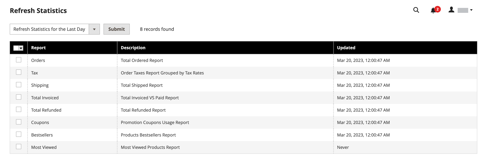

# 販売レポート

販売レポートの選択には、注文、税金、請求済、出荷、払い戻し、クーポン、および PayPal 決済が含まれます。

## レポートフィルター

Web サイト全体または 1 つのストアに関する販売レポートを生成できます。 売上レポートは、時間間隔、日付、ステータスでフィルタリングできます。

{width="600"}

売上レポートをフィルタするには、次のオプションを設定します。

| オプション | 説明 |
|--- |--- |
| [!UICONTROL Date Used] | レポートに使用するデータを設定します。 |
| [!UICONTROL Period] | データが使用される期間：日/月/年。 |
| [!UICONTROL From/To] | 開始日と終了日で検索データを定義するために使用します。 |
| [!UICONTROL Order Status] | 注文ステータスを示します |
| [!UICONTROL Empty Rows] | レポートに空白行を追加するかどうかを示します。 |

## [!UICONTROL Orders Report]

この [!UICONTROL Orders Report] 注文およびキャンセルされた数と、売上高、請求額、払い戻し額、徴収税、発送料、割引の合計が含まれます。

1. 日 _Admin_ サイドバー、に移動 **[!UICONTROL Reports]** > _[!UICONTROL Sales]_>**[!UICONTROL Orders]**.

1. が含まれる **[!UICONTROL Filter]** セクションで、レポートの入力に使用するレポート期間オプションと注文ステータスを選択します。

1. クリック **[!UICONTROL Show Report]**.

{width="600"}

## [!UICONTROL Tax Report]

この [!UICONTROL Tax Report] 適用された税務処理基準、税率、注文数、および課税額を含みます。

1. 日 _Admin_ サイドバー、に移動 **[!UICONTROL Reports]** > _[!UICONTROL Sales]_>**[!UICONTROL Tax]**.

1. が含まれる **[!UICONTROL Filter]** セクションで、レポートの入力に使用するレポート期間オプションと注文ステータスを選択します。

1. クリック **[!UICONTROL Show Report]**.

{width="600"}

## [!UICONTROL Invoice Report]

この [!UICONTROL Invoice Report] 期間中の注文と請求書の数と、請求額、支払額、未払額を含みます。

1. 日 _Admin_ サイドバー、に移動 **[!UICONTROL Reports]** > _[!UICONTROL Sales]_>**[!UICONTROL Invoiced]**.

1. が含まれる **[!UICONTROL Filter]** セクションで、レポートの入力に使用するレポート期間オプションと注文ステータスを選択します。

1. クリック **[!UICONTROL Show Report]**.

{width="600"}

## [!UICONTROL Shipping Report]

この [!UICONTROL Shipping Report] 使用した配送業者または配送方法に関する注文の数（合計販売額および合計出荷額を含む）を含みます。

1. 日 _Admin_ サイドバー、に移動 **[!UICONTROL Reports]** > _[!UICONTROL Sales]_>**[!UICONTROL Shipping]**.

1. が含まれる **[!UICONTROL Filter]** セクションで、レポートの入力に使用するレポート期間オプションと注文ステータスを選択します。

1. クリック **[!UICONTROL Show Report]**.

{width="600"}

## [!UICONTROL Refunds Report]

この [!UICONTROL Refunds Report] 返金された注文の数、オンラインおよびオフラインでの返金の合計金額が含まれます。

1. 日 _Admin_ サイドバー、に移動 **[!UICONTROL Reports]** > _[!UICONTROL Sales]_>**[!UICONTROL Refunds]**.

1. が含まれる **[!UICONTROL Filter]** セクションで、レポートの入力に使用するレポート期間オプションと注文ステータスを選択します。

1. クリック **[!UICONTROL Show Report]**.

{width="600"}

## [!UICONTROL Coupons Report]

この [!UICONTROL Coupons Report] 指定した期間に使用された各クーポンコード、関連する価格ルール、使用回数を、売上と割引の合計と小計と共に含めます。

1. 日 _Admin_ サイドバー、に移動 **[!UICONTROL Reports]** > _[!UICONTROL Sales]_>**[!UICONTROL Coupons]**.

1. が含まれる **[!UICONTROL Filter]** セクションで、レポートの入力に使用するレポート期間オプションと注文ステータスを選択します。

1. クリック **[!UICONTROL Show Report]**.

の使用の詳細 [!UICONTROL Coupons Report] プロモーションキャンペーンのデータを収集するには、を参照してください。 [クーポンレポート](../merchandising-promotions/price-rules-cart-coupon.md#coupons-report) が含まれる _マーチャンダイジングおよびプロモーションガイド_.

<!---  need coupon data  -->

## [!UICONTROL PayPal Settlement Reports]

この [PayPal 決済レポート] ページには、デビット カード トランザクション、開始日と終了日、総額、関連する手数料など、イベントのタイプが含まれます。 レポートは、PayPal の最新データで自動的に更新されます。 日付範囲、マーチャントアカウント、トランザクション ID、請求書 ID または PayPal 参照 ID に対してフィルタリングオプションがあります。

日 _Admin_ サイドバー、に移動 **[!UICONTROL Reports]** > _[!UICONTROL Sales]_>**[!UICONTROL PayPal Settlement]**.

{width="600"}

の使用の詳細 [!UICONTROL PayPal Settlement Reports] 資金決済に影響を与える各 PayPal 取引に関する情報を取得するには、以下を参照してください [PayPal 決済レポート](../stores-purchase/paypal-settlement-reports.md) が含まれる _店舗および購入エクスペリエンスガイド_.

## [!UICONTROL Braintree Settlement Report]

この [Braintree](../stores-purchase/braintree.md) 決済報告書は、作成日、金額、ステータス、取引タイプ、支払タイプ、取引 ID、注文 ID、PayPal 支払 ID、タイプ、業者口座 ID、または決済バッチ ID に従ってフィルタリングできます。 レポートには、トランザクション ID、注文 ID、PayPal 支払 ID、タイプ、作成日、金額、決済コード、ステータス、決済応答テキスト、償還 ID、マーチャントアカウント ID、決済バッチ ID および通貨が含まれています。

日 _Admin_ サイドバー、に移動 **[!UICONTROL Reports]** > _[!UICONTROL Sales]_>**[!UICONTROL Braintree Settlement]**.

<!---  need a Braintree connection to update report screen -->

## レポートを書き出し

1. レポートを書き出すには、ファイルタイプを選択します。 `Excel XML` または `CSV`

1. クリック **[!UICONTROL Export]**.

## 統計を更新

販売レポートの生成によるパフォーマンスへの影響を軽減するには、 [!DNL Commerce] 各レポートに必要な統計を計算して保存します。 統計を更新しない限り、レポートが生成されるたびに統計を再計算するのではなく、保存された統計が使用されます。 最新のデータを含めるには、販売レポートを生成する前に、レポート統計を更新する必要があります。

{width="700"}

1. 日 _Admin_ サイドバー、に移動 **[!UICONTROL Reports]** > _[!UICONTROL Statistics]_>**[!UICONTROL Refresh Statistics]**.

1. リストで、更新する各レポートのチェックボックスを選択します。

1. を **[!UICONTROL Actions]** 次のいずれかに制御します。

   - `Refresh Lifetime Statistics`
   - `Refresh Statistics for the Last Day`

1. クリック **[!UICONTROL Submit]**.
