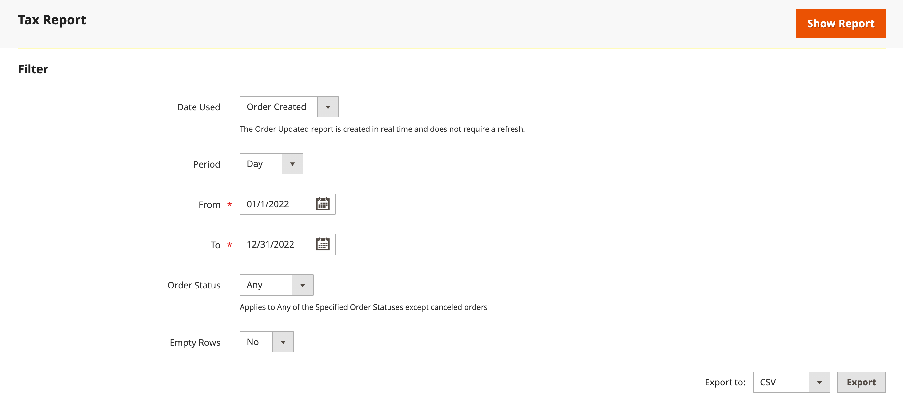

# 販売レポート

販売レポートの選択には、注文、税金、請求済、出荷、払い戻し、クーポン、および PayPal 決済が含まれます。

## レポートフィルター

Web サイト全体または 1 つのストアに関する販売レポートを生成できます。 売上レポートは、時間間隔、日付、ステータスでフィルタリングできます。

{width="600"}

売上レポートをフィルタするには、次のオプションを設定します。

| オプション | 説明 |
|--- |--- |
| [!UICONTROL Date Used] | レポートに使用するデータを設定します。 |
| [!UICONTROL Period] | データが使用される期間：日/月/年。 |
| [!UICONTROL From/To] | 開始日と終了日で検索データを定義するために使用します。 |
| [!UICONTROL Order Status] | 注文ステータスを示します |
| [!UICONTROL Empty Rows] | レポートに空白行を追加するかどうかを示します。 |

## [!UICONTROL Orders Report]

[!UICONTROL Orders Report] には、発注およびキャンセルされた注文の数と、売上、請求額、払い戻し額、徴収税額、発送料、割引の合計が含まれます。

1. _管理者_ サイドバーで、**[!UICONTROL Reports]**/_[!UICONTROL Sales]_/**[!UICONTROL Orders]**に移動します。

1. **[!UICONTROL Filter]** セクションでは、レポートの入力に使用するレポート期間オプションと注文ステータスを選択します。

1. 「**[!UICONTROL Show Report]**」をクリックします。

{width="600"}

## [!UICONTROL Tax Report]

[!UICONTROL Tax Report] には、適用される税務処理基準、税率、注文数、請求額が含まれます。

1. _管理者_ サイドバーで、**[!UICONTROL Reports]**/_[!UICONTROL Sales]_/**[!UICONTROL Tax]**に移動します。

1. **[!UICONTROL Filter]** セクションでは、レポートの入力に使用するレポート期間オプションと注文ステータスを選択します。

1. 「**[!UICONTROL Show Report]**」をクリックします。

{width="600"}

## [!UICONTROL Invoice Report]

[!UICONTROL Invoice Report] には、期間内の注文と請求書の数、および請求額、支払額、未払額が含まれます。

1. _管理者_ サイドバーで、**[!UICONTROL Reports]**/_[!UICONTROL Sales]_/**[!UICONTROL Invoiced]**に移動します。

1. **[!UICONTROL Filter]** セクションでは、レポートの入力に使用するレポート期間オプションと注文ステータスを選択します。

1. 「**[!UICONTROL Show Report]**」をクリックします。

{width="600"}

## [!UICONTROL Shipping Report]

[!UICONTROL Shipping Report] には、使用した配送業者または配送方法に関する注文の数（合計販売額や合計出荷額など）が含まれます。

1. _管理者_ サイドバーで、**[!UICONTROL Reports]**/_[!UICONTROL Sales]_/**[!UICONTROL Shipping]**に移動します。

1. **[!UICONTROL Filter]** セクションでは、レポートの入力に使用するレポート期間オプションと注文ステータスを選択します。

1. 「**[!UICONTROL Show Report]**」をクリックします。

{width="600"}

## [!UICONTROL Refunds Report]

[!UICONTROL Refunds Report] には、返金された注文の数、オンラインおよびオフラインでの返金の合計金額が含まれます。

1. _管理者_ サイドバーで、**[!UICONTROL Reports]**/_[!UICONTROL Sales]_/**[!UICONTROL Refunds]**に移動します。

1. **[!UICONTROL Filter]** セクションでは、レポートの入力に使用するレポート期間オプションと注文ステータスを選択します。

1. 「**[!UICONTROL Show Report]**」をクリックします。

{width="600"}

## [!UICONTROL Coupons Report]

[!UICONTROL Coupons Report] には、指定した期間に使用された各クーポンコード、関連する価格ルール、使用回数が含まれ、売上高と割引の合計と小計が含まれます。

1. _管理者_ サイドバーで、**[!UICONTROL Reports]**/_[!UICONTROL Sales]_/**[!UICONTROL Coupons]**に移動します。

1. **[!UICONTROL Filter]** セクションでは、レポートの入力に使用するレポート期間オプションと注文ステータスを選択します。

1. 「**[!UICONTROL Show Report]**」をクリックします。

[!UICONTROL Coupons Report] を使用したプロモーションキャンペーンのデータ収集について詳しくは、『 [ マーチャンダイジングおよびプロモーションガイド ](../merchandising-promotions/price-rules-cart-coupon.md#coupons-report) の _クーポンレポート_ を参照してください。

<!---  need coupon data  -->

## [!UICONTROL PayPal Settlement Reports]

[PayPal 決済レポート ] ページには、デビットカード取引、開始日と終了日、総額、関連する手数料など、イベントのタイプが含まれています。 レポートは、PayPal の最新データで自動的に更新されます。 日付範囲、マーチャントアカウント、トランザクション ID、請求書 ID または PayPal 参照 ID に対してフィルタリングオプションがあります。

_管理者_ サイドバーで、**[!UICONTROL Reports]**/_[!UICONTROL Sales]_/**[!UICONTROL PayPal Settlement]**に移動します。

{width="600"}

[!UICONTROL PayPal Settlement Reports] を使用して、資金決済に影響を与える各 PayPal 取引に関する情報を取得する方法については、『 [ ストアと購入エクスペリエンスガイド _』の ](../stores-purchase/paypal-settlement-reports.md)PayPal 決済レポート_ を参照してください。

## [!UICONTROL Braintree Settlement Report]

[Braintree](../stores-purchase/braintree.md) 精算レポートは、作成日、金額、ステータス、取引タイプ、支払タイプ、取引 ID、注文 ID、PayPal 支払 ID、タイプ、業者口座 ID、または精算バッチ ID に従ってフィルタリングできます。 レポートには、トランザクション ID、注文 ID、PayPal 支払 ID、タイプ、作成日、金額、決済コード、ステータス、決済応答テキスト、償還 ID、マーチャントアカウント ID、決済バッチ ID および通貨が含まれています。

_管理者_ サイドバーで、**[!UICONTROL Reports]**/_[!UICONTROL Sales]_/**[!UICONTROL Braintree Settlement]**に移動します。

<!---  need a Braintree connection to update report screen -->

## レポートを書き出し

1. レポートをエクスポートするには、ファイルの種類（`Excel XML` または `CSV`）を選択します

1. 「**[!UICONTROL Export]**」をクリックします。

## 統計を更新

販売レポートの生成によるパフォーマンスへの影響を軽減するため、[!DNL Commerce] では、各レポートに必要な統計を計算して保存します。 統計を更新しない限り、レポートが生成されるたびに統計を再計算するのではなく、保存された統計が使用されます。 最新のデータを含めるには、販売レポートを生成する前に、レポート統計を更新する必要があります。

{width="700"}

1. _管理者_ サイドバーで、**[!UICONTROL Reports]**/_[!UICONTROL Statistics]_/**[!UICONTROL Refresh Statistics]**に移動します。

1. リストで、更新する各レポートのチェックボックスを選択します。

1. **[!UICONTROL Actions]** コントロールを次のいずれかに設定します。

   - `Refresh Lifetime Statistics`
   - `Refresh Statistics for the Last Day`

1. 「**[!UICONTROL Submit]**」をクリックします。
