# ストアの詳細

ストアの基本情報には、ストア名と住所、電話番号、および電子メールメッセージ、請求書、顧客に送信されたその他のコミュニケーションに表示される電子メールアドレスが含まれます。

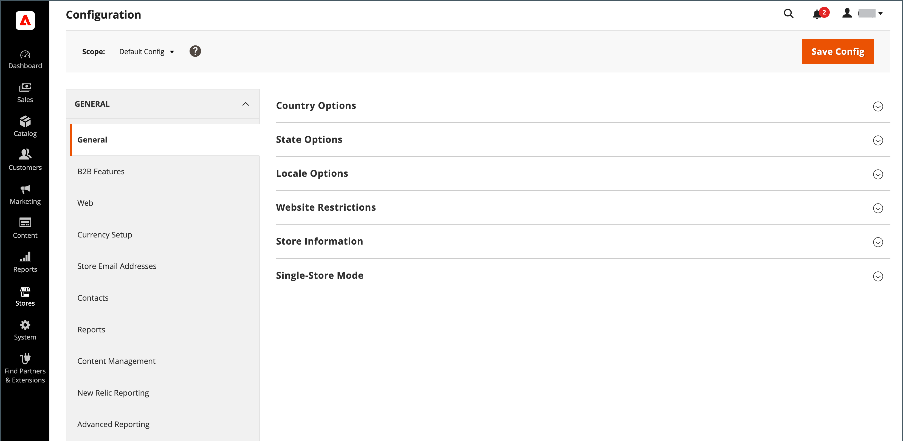{width="900" zoomable="yes"}

## [!UICONTROL Store Information]

_[!UICONTROL Store Information]_&#x200B;セクションには、販売文書やその他のコミュニケーションに表示される基本情報が表示されます。

1. _管理者_ サイドバーで、**[!UICONTROL Stores]** > _[!UICONTROL Settings]_>**[!UICONTROL Configuration]**&#x200B;に移動します。

1. 左側のナビゲーションパネルの「**[!UICONTROL General]**」で、「**[!UICONTROL General]**」を選択します。

1. **[!UICONTROL Store Information]** セクションのを展開します。

   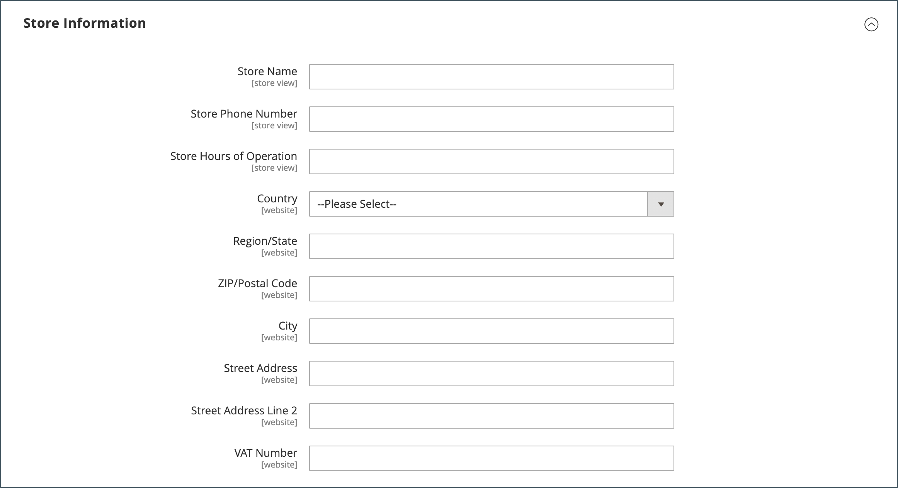{width="700"}

1. ストアの詳細に応じてオプションを設定します。

   - すべての通信で使用する&#x200B;**[!UICONTROL Store Name]**&#x200B;を入力します。

   - 表示する形式の&#x200B;**[!UICONTROL Store Phone Number]**&#x200B;を入力します。

   - **[!UICONTROL Store Hours of Operation]**&#x200B;の場合、ストアの営業時間を入力します。 例：`Mon - Fri, 9-5, Sat 9-noon PST`。

   - ビジネスが存在する&#x200B;**[!UICONTROL Country]**&#x200B;を選択します。

   - 国の&#x200B;**[!UICONTROL Region/State]**&#x200B;を選択します。

   - **[!UICONTROL Store Address]**&#x200B;を入力します。 アドレスが長い場合は、**ストアのアドレス行2**&#x200B;でアドレスを続行します。

   - 該当する場合は、ストアの&#x200B;**[!UICONTROL VAT Number]**&#x200B;を入力します。

     番号を確認するには、**[!UICONTROL Validate VAT Number]** ボタンをクリックします。 詳しくは、[VAT ID検証](../stores-purchase/vat.md#vat-id-validation)を参照してください。

1. 完了したら、**[!UICONTROL Save Config]**&#x200B;をクリックします。

ストア情報の設定オプションについて詳しくは、[_設定リファレンスガイド_](../configuration-reference/general/general.md#store-information)&#x200B;を参照してください。

## [!UICONTROL Locale Options]

ロケールは、ストア全体で使用される設定の多くを決定します。 そのうちのいくつかは次のとおりです。

- 言語
- 国
- 税率
- 通貨
- 価格
- 数値形式

ロケール設定は、各店舗で使用されるタイムゾーンと言語を決定し、エリア内の作業週の日数を特定します。

1. _管理者_ サイドバーで、**[!UICONTROL Stores]** > _[!UICONTROL Settings]_>**[!UICONTROL Configuration]**&#x200B;に移動します。

1. **[!UICONTROL General]**&#x200B;の下の左側のナビゲーションパネルで、**[!UICONTROL General]**&#x200B;を選択します。

1. **[!UICONTROL Locale Options]** セクションのを展開します。

   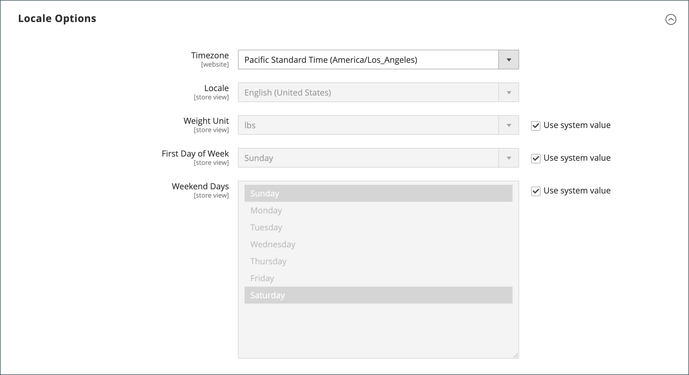{width="700"}

1. リストから&#x200B;**[!UICONTROL Timezone]**&#x200B;を選択します。

1. ストア言語に&#x200B;**[!UICONTROL Locale]**&#x200B;を設定します。

1. **[!UICONTROL Weight Unit]**&#x200B;を、ロケールからの出荷に通常使用される測定単位に設定します。

1. **[!UICONTROL First Day of the Week]**&#x200B;を、お住まいの地域で週の最初の日と見なされる日に設定します。

1. **[!UICONTROL Weekend Days]** リストで、お住まいの地域の週末に当たる日を選択します。

   複数日を選択するには、Ctrl キー（PC）またはCommand キー（Mac）を押しながら各項目をクリックします。

1. 完了したら、**[!UICONTROL Save Config]**&#x200B;をクリックします。

ロケール設定オプションについて詳しくは、[設定リファレンスガイド &#x200B;](../configuration-reference/general/general.md#locale-options)を参照してください。

## [!UICONTROL State Options]

多くの国では、州、州、地域が郵送先住所の必須の部分です。 この情報は、送料や請求情報、税率の計算などに使用されます。 州が必須ではない国の場合、フィールドはアドレスから完全に省略するか、オプションのフィールドとして含めることができます。

標準アドレス形式は国によって異なるため、請求書、梱包明細、および配送ラベルのアドレスの書式設定に使用するテンプレートを編集することもできます。

1. _管理者_ サイドバーで、**[!UICONTROL Stores]** > _[!UICONTROL Settings]_>**[!UICONTROL Configuration]**&#x200B;に移動します。

1. 左側のナビゲーションパネルの「**[!UICONTROL General]**」で、「**[!UICONTROL General]**」を選択します。

1. **[!UICONTROL State Options]** セクションのを展開します。

   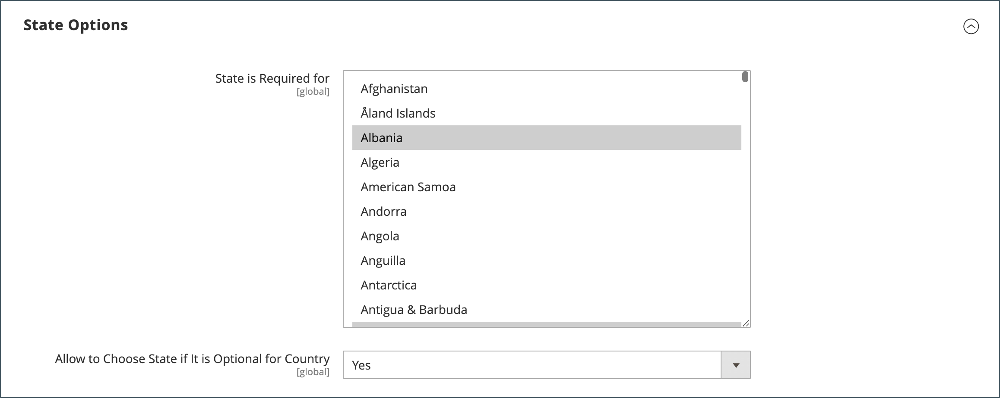{width="700"}

1. **[!UICONTROL State is required for]** リストを使用して、地域/州が必須エントリである国を選択します。

1. **[!UICONTROL Allow to Choose State if it is Optional for Country]**&#x200B;を次のいずれかに設定します：

   `Yes` – 状態フィールドが必須ではない国では、状態フィールドをオプションのエントリとして含めます。

   `No` – 状態フィールドが不要な国では、状態フィールドは省略されます。

1. 完了したら、**[!UICONTROL Save Config]**&#x200B;をクリックします。

状態設定オプションについて詳しくは、[設定リファレンスガイド &#x200B;](../configuration-reference/general/general.md#state-options)を参照してください。

## [!UICONTROL Country Options]

国オプションとは、ビジネスが所在する国と支払いを受け入れる国を特定します。

### ストアの国オプションを設定する

1. _管理者_ サイドバーで、**[!UICONTROL Stores]** > _[!UICONTROL Settings]_>**[!UICONTROL Configuration]**&#x200B;に移動します。

1. **[!UICONTROL General]**&#x200B;の下の左側のナビゲーションパネルで、**[!UICONTROL General]**&#x200B;を選択します。

1. **[!UICONTROL Country Options]** セクションのを展開します。

   >[!NOTE]
   >
   >必要に応じて、変更する各設定の&#x200B;**[!UICONTROL Use system value]** チェックボックスをオフにします。

   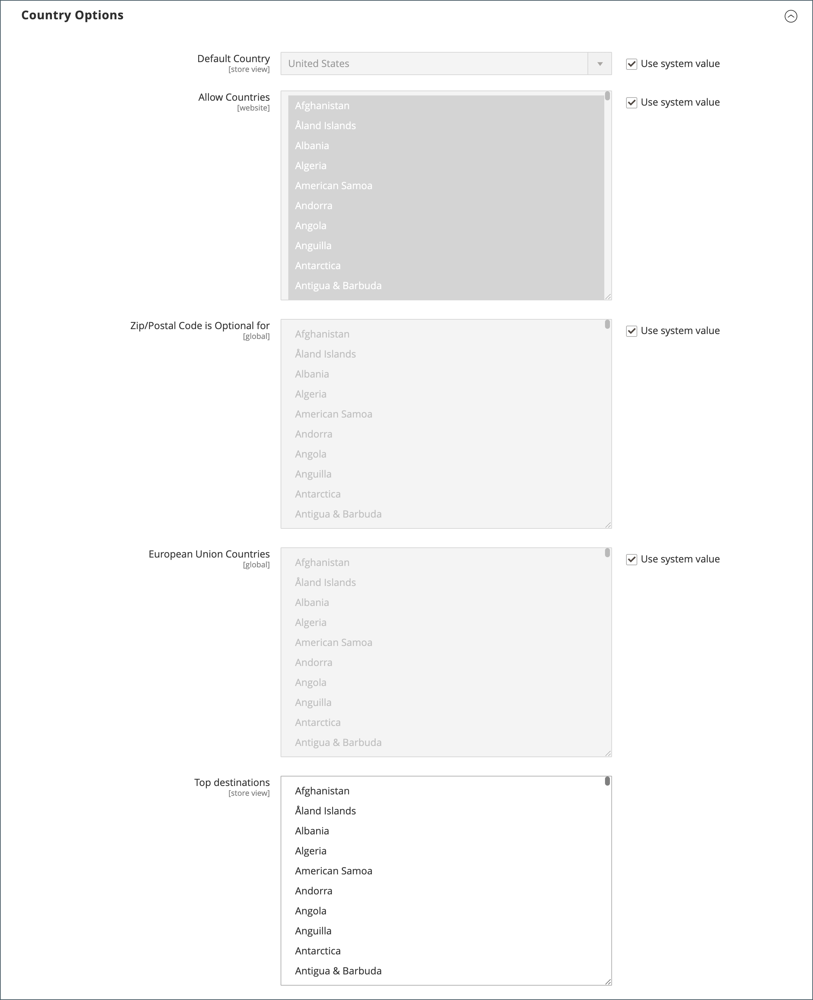{width="700"}

1. ビジネスが存在する&#x200B;**[!UICONTROL Default Country]**&#x200B;を選択します。

1. **[!UICONTROL Allow Countries]** リストで、注文を受け入れる国を選択します。

   デフォルトでは、リスト内のすべての国が選択されています。 複数の国を選択するには、Ctrl キー（PC）またはCommand キー（Mac）を押しながら各項目をクリックします。

1. **[!UICONTROL Zip/Postal Code is Optional for]** リストを使用して、住所の一部として郵便番号を含める必要のないビジネスを行う国を選択します。

1. **[!UICONTROL European Union Countries]** リストで、ビジネスを行うEU内の各国を選択します。

   デフォルトでは、すべてのEU諸国が選択されています。 必要な国を選択するには、Ctrl キー（PC）またはCommand キー（Mac）を押しながら各項目をクリックします。

1. **[!UICONTROL Top Destinations]** リストで、販売対象の主要国を選択します。

1. 完了したら、**[!UICONTROL Save Config]**&#x200B;をクリックします。

### 特定の配信方法の国オプションの設定

また、利用可能な[配送方法](../stores-purchase/delivery.md) （UPS、FedExなど）ごとに、特定の国への配送を設定することもできます。

1. _管理者_ サイドバーで、**[!UICONTROL Stores]** > _[!UICONTROL Settings]_>**[!UICONTROL Configuration]**&#x200B;に移動します。

1. 左側のナビゲーションパネルで、**[!UICONTROL Sales]**&#x200B;を展開し、**[!UICONTROL Delivery Methods]**&#x200B;を選択します。

1. 特定の国を適用する配送業者を選択します。

1. **[!UICONTROL Ship to Applicable Countries]**&#x200B;の場合、「**[!UICONTROL Use system value]**」チェックボックスの選択を解除し、「**[!UICONTROL Specific Countries]**」オプションを選択します。

1. **[!UICONTROL Top Destinations]** リストで、配送の対象となる主な国を選択します。

   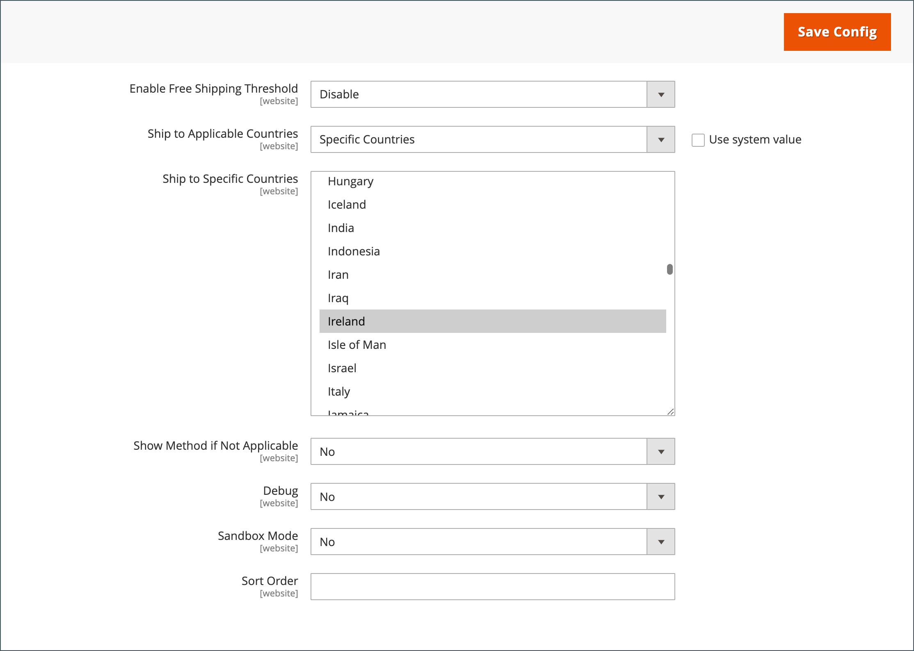{width="700"}

1. 完了したら、**[!UICONTROL Save Config]**&#x200B;をクリックします。

### リソースのトラブルシューティング

国別の設定の問題のトラブルシューティングについては、次の[!DNL Commerce] サポート サポート サポート サポート技術情報の記事を参照してください。

- [国の追加方法](https://experienceleague.adobe.com/docs/commerce-knowledge-base/kb/how-to/how-to-add-a-new-country-to-magento-2.html)

## [!UICONTROL Merchant Location]

[!BADGE PaaSのみ]{type=Informative url="https://experienceleague.adobe.com/ja/docs/commerce/user-guides/product-solutions" tooltip="Adobe Commerce on Cloud プロジェクト（Adobeで管理されるPaaS インフラストラクチャ）とオンプレミス プロジェクトにのみ適用されます。"}

加盟店の場所の設定は、[支払い方法](../stores-purchase/payments.md)の設定に使用されます。 この設定に値がない場合は、[既定の国](#uicontrol-country-options)設定が使用されます。

1. _管理者_ サイドバーで、**[!UICONTROL Stores]** > _[!UICONTROL Settings]_>**[!UICONTROL Configuration]**&#x200B;に移動します。

1. 左側のナビゲーションパネルで、**[!UICONTROL Sales]**&#x200B;を展開し、**[!UICONTROL Payment Methods]**&#x200B;を選択します。

1. **マーチャントの場所** セクションのを展開し、**[!UICONTROL Merchant Country]**&#x200B;を選択します。

   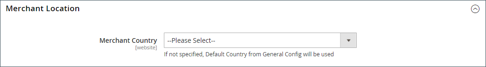{width="600"}

1. 完了したら、**[!UICONTROL Save Config]**&#x200B;をクリックします。

支払い方法の設定オプションについて詳しくは、[設定リファレンスガイド &#x200B;](../configuration-reference/sales/payment-methods.md)を参照してください。

## 通貨

通貨の設定 – 基本[通貨](../stores-purchase/currency-configuration.md)と、支払いに使用できる追加通貨を定義します。 また、通貨レートを自動的に更新するために使用されるインポート接続とスケジュールを確立します。

通貨記号 – 商品価格や注文や請求書などの販売文書に表示される[通貨記号](../stores-purchase/currency-configuration.md#step-5-customize-currency-symbols-optional)を定義します。 [!DNL Commerce]は、世界中の200か国以上の通貨をサポートしています。

通貨レートの更新 – 通貨レートは、手動で[更新するか、必要に応じて、または事前に定義されたスケジュールに従ってストアにインポートできます。](../stores-purchase/currency-update.md)

通貨選択 – 複数の通貨が使用可能な場合、[通貨選択](../stores-purchase/currency.md)はストアのヘッダーで使用できます。

## [!UICONTROL Store Email Addresses]

ストアやビューごとに異なる機能や部門を表すために、最大5つの異なるメールアドレスを設定できます。 次の定義済みメール IDに加えて、ニーズに応じて設定できるカスタム IDがいくつかあります。

- 一般連絡先
- 営業担当者
- カスタマーサポート

各IDと関連するメールアドレスは、特定の自動メールメッセージに関連付けることができ、ストアから送信されるメールメッセージの送信者として表示されます。

### 手順1：ドメインのメールアドレスを設定する

ストアのメールアドレスを設定する前に、それぞれにドメインの有効なメールアドレスとして設定する必要があります。 必要な各メールアドレスを作成するには、サーバー管理者またはメールホスティングプロバイダーの指示に従います。

### 手順2：生成されたリンクのベース URLの設定

[!BADGE SaaSのみ]{type=Positive url="https://experienceleague.adobe.com/ja/docs/commerce/user-guides/product-solutions" tooltip="Adobe Commerce as a Cloud Service プロジェクト（Adobeで管理されるSaaS インフラストラクチャ）にのみ適用されます。"}

顧客がパスワードをリセットするのに役立つリンクなど、一部の顧客向けメールにはストアへのリンクが含まれています。 ストアフロントへのリンクが機能することを確認するには、ストアフロントへのベース URLを定義する必要があります。

1. _管理者_ サイドバーで、**[!UICONTROL Stores]** > _[!UICONTROL Settings]_>**[!UICONTROL Configuration]**&#x200B;に移動します。

1. 左側のナビゲーションパネルの「**[!UICONTROL General]**」で、「**[!UICONTROL Store Email Addresses]**」を選択します。

1. **[!UICONTROL Storefront Base URL]** フィールド **[!UICONTROL General]** セクションに、`https://www.example.com/`など、ストアのルート URLを入力します。 URLはスラッシュで終わる必要があります。

   {width="600"}

### 手順3：ストアのメールアドレスを設定する

[!BADGE SaaSのみ]{type=Positive url="https://experienceleague.adobe.com/ja/docs/commerce/user-guides/product-solutions" tooltip="Adobe Commerce as a Cloud ServiceおよびAdobe Commerce Optimizer プロジェクト（Adobeが管理するSaaS インフラストラクチャ）にのみ適用されます。"}送信者のメールアドレスは、インスタンスのプロビジョニング時に設定されます。 これらのアドレスを変更する必要がある場合は、サポートチケットを作成します。

1. _管理者_ サイドバーで、**[!UICONTROL Stores]** > _[!UICONTROL Settings]_>**[!UICONTROL Configuration]**&#x200B;に移動します。

1. 左側のナビゲーションパネルの「**[!UICONTROL General]**」で、「**[!UICONTROL Store Email Addresses]**」を選択します。

1. **[!UICONTROL General Contact]** セクションのを展開し、次の操作を行います。

   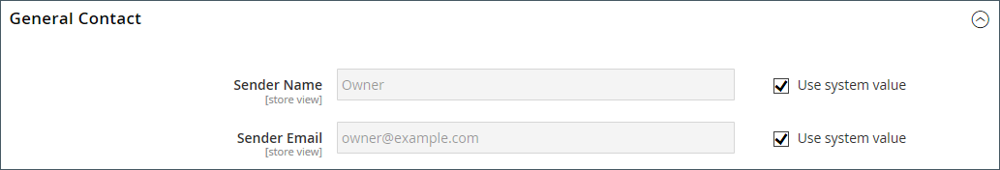{width="600"}

   - 「**[!UICONTROL Sender Name]**」に、一般連絡先IDに関連付けられている人物の名前を入力して、電子メールメッセージの送信者として表示します。

   - **[!UICONTROL Sender Email]**&#x200B;に、関連付けられている電子メールアドレスを入力します。

1. 使用するストアメールアドレスごとに、このプロセスを繰り返します。

1. 完了したら、**[!UICONTROL Save Config]**&#x200B;をクリックします。

### 手順4：営業メール設定の更新

カスタムメールアドレスを使用する場合は、関連するメールメッセージの設定を更新して、正しいIDが送信者として表示されるようにします。

1. 左側のナビゲーションパネルで、**[!UICONTROL Sales]**&#x200B;を展開し、**[!UICONTROL Sales Emails]**&#x200B;を選択します。

   このページには、次のそれぞれに対する個別のセクションがあります。

   - 注文と注文のコメント
   - 請求書と請求書のコメント
   - 出荷と出荷のコメント
   - クレジットメモとクレジットメモのコメント
   - RMA、RMA認証、RMA管理者コメント、およびRMA カスタマーコメント  （Adobe Commerceのみ）

1. **[!UICONTROL Order]**&#x200B;から始めて、各メッセージのセクションを展開し、正しい送信者が選択されていることを確認します。

   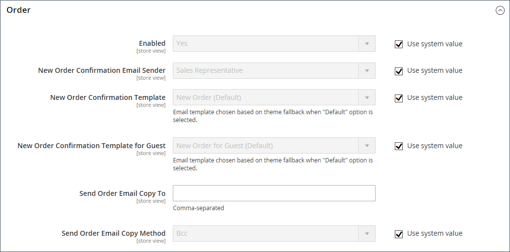{width="600"}

1. 完了したら、**[!UICONTROL Save Config]**&#x200B;をクリックします。

セールスメールの設定オプションについて詳しくは、[_設定リファレンスガイド_](../configuration-reference/sales/sales-emails.md)&#x200B;を参照してください。

## お問い合わせフォーム

ストアのフッターにある&#x200B;_お問い合わせ_ リンクは、お客様が連絡を取り合う簡単な方法です。 顧客はフォームに記入して、ストアにメッセージを送信できます。 標準の[!DNL Commerce] インストールでは、デフォルトの&#x200B;_お問い合わせ_ フォームが表示されます。 フォームを送信すると、お礼のメッセージが表示されます

デフォルトの問い合わせフォームは、CMS ページではなくコードから直接レンダリングされることを理解することが重要です。

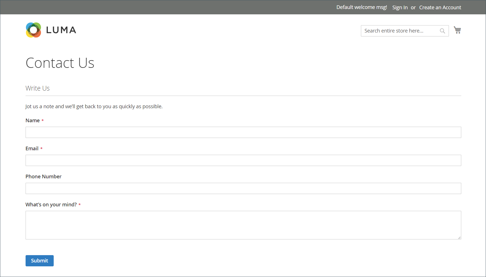{width="700"}

ストアフッターには、ストア全体で利用できる問い合わせページへのリンクが含まれています。

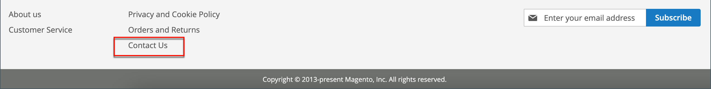{width="700"}

Luma サンプルデータには、お問い合わせページに関する追加情報が含まれており、ストアのページをカスタマイズする方法を示しています。

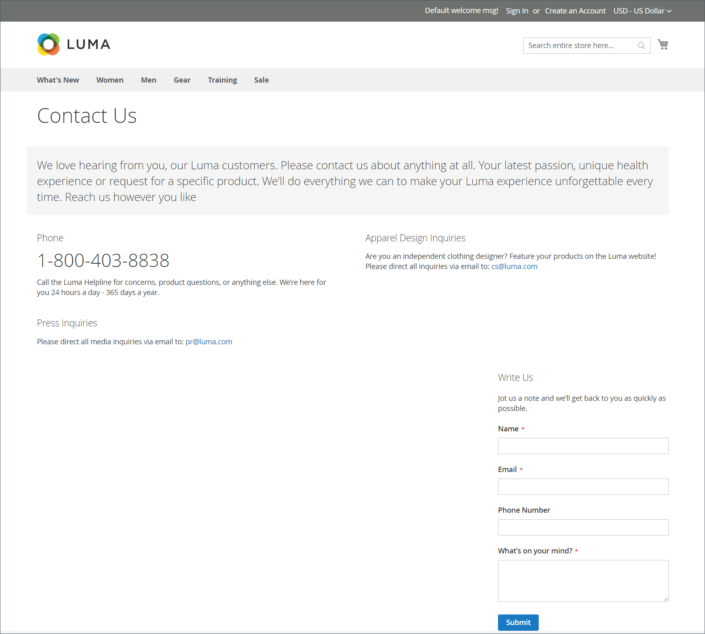{width="700"}

### 問い合わせフォームの設定

1. _管理者_ サイドバーで、**[!UICONTROL Stores]** > _[!UICONTROL Settings]_>**[!UICONTROL Configuration]**&#x200B;に移動します。

1. **[!UICONTROL General]**&#x200B;の下の左側のナビゲーションパネルで、**[!UICONTROL Contacts]**&#x200B;を選択します。

1. **[!UICONTROL Contact Us]** セクションのを展開し、**[!UICONTROL Enable Contact Us]**&#x200B;を`Yes`に設定します。

   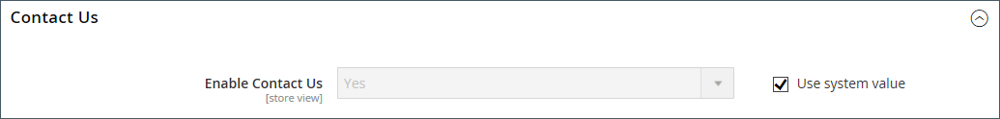{width="600"}

1. **[!UICONTROL Email Options]** セクションのを展開し、電子メールの連絡先オプションを設定します。

   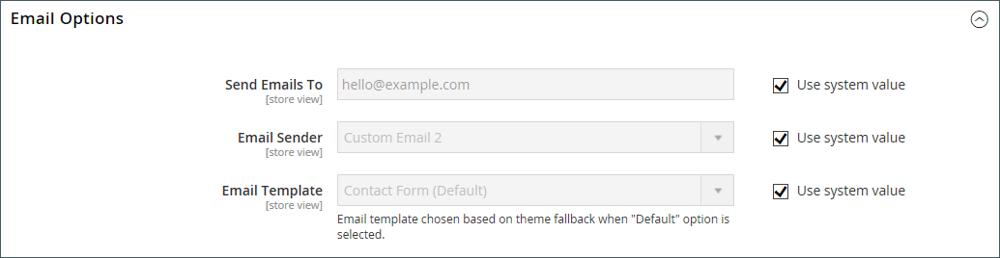{width="600"}

   - **[!UICONTROL Send Emails to]**&#x200B;の場合は、お問い合わせフォームのメッセージが送信されるメールアドレスを入力してください。

   - お問い合わせフォームからメッセージの送信者として表示されるストア IDに&#x200B;**[!UICONTROL Email Sender]**&#x200B;を設定します。 例：カスタムメール 2。

   - お問い合わせフォームから送信されたメッセージに使用されるテンプレートに&#x200B;**[!UICONTROL Email Template]**&#x200B;を設定します。

1. 競合する場合は、**[!UICONTROL Save Config]**&#x200B;をクリックします。

### コンテンツのカスタマイズ

_お問い合わせ_ フォームのコンテンツは、店舗およびカスタマーサービスポリシーのニーズに合わせてカスタマイズできます。

### 方法1：サンプルデータの使用

Luma サンプルデータには、ストアに合わせてカスタマイズできる&#x200B;_お問い合わせ情報_ ブロックが含まれています。 `contact-us-info` [&#x200B; ブロック &#x200B;](../content-design/blocks.md)は、簡単に変更して、お問い合わせページに独自のコンテンツを追加できます。

1. _管理者_ サイドバーで、**[!UICONTROL Content]** > _[!UICONTROL Elements]_>**[!UICONTROL Blocks]**&#x200B;に移動します。

1. リスト内の&#x200B;**[!UICONTROL Contact Us Info]** ブロックを見つけ、**[!UICONTROL Edit]** モードで開きます。

   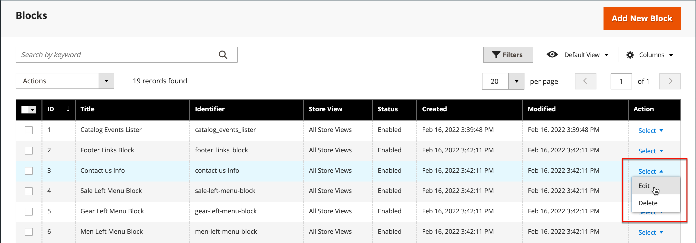{width="700"}

1. ブロックページの下部にある「**[!UICONTROL Edit with Page Builder]**」をクリックします。

   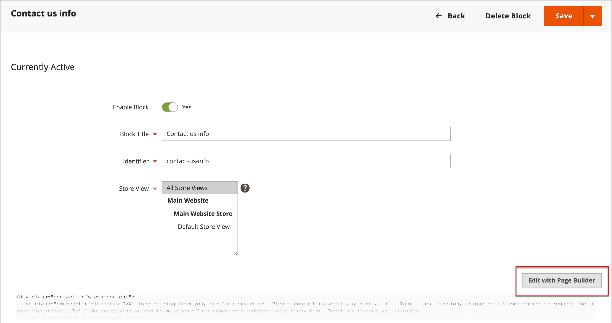{width="700"}

   >[!NOTE]
   >
   >[[!DNL Page Builder] 無効](../page-builder/setup.md#disable-dnl-page-builder)の場合、エディター[&#x200B; ツールバー](../content-design/editor.md)を使用してテキストを書式設定し、[画像](../content-design/editor-insert-image.md)および[&#x200B; リンク &#x200B;](../content-design/editor-insert-link.md)を追加できます。

1. HTML コンテナにカーソルを合わせてツールボックスを表示し、_設定_ （）アイコンを選択します。

1. ストアの連絡先情報に従ってHTML コードを編集し、**[!UICONTROL Save]**&#x200B;をクリックします。

   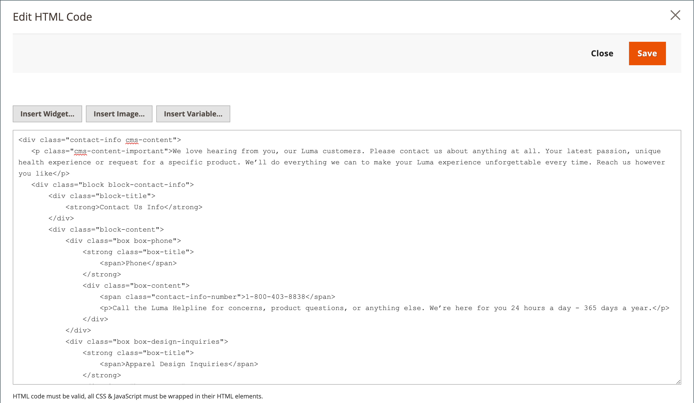{width="700"}

1. [!DNL Page Builder] ステージを終了し、**[!UICONTROL Save Block]**&#x200B;をクリックします。

### 方法2：サンプルデータなし

>[!IMPORTANT]
>
>2.4.0 リリース以降、CMS ブロックまたはCMS ページ内で問い合わせフォームを呼び出せなくなりました。 問い合わせフォームのカスタマイズは、layout xmlまたはカスタムテーマテンプレートを使用して行う必要があります。

デフォルトでは、買い物客はストアフロントページのフッターにある&#x200B;_問い合わせリンク_&#x200B;を使用して、問い合わせフォームにアクセスします。 問い合わせページのカスタマイズについて詳しくは、[&#x200B; フロントエンド開発者ガイド &#x200B;](https://developer.adobe.com/commerce/frontend-core/guide/themes/)を参照してください。
