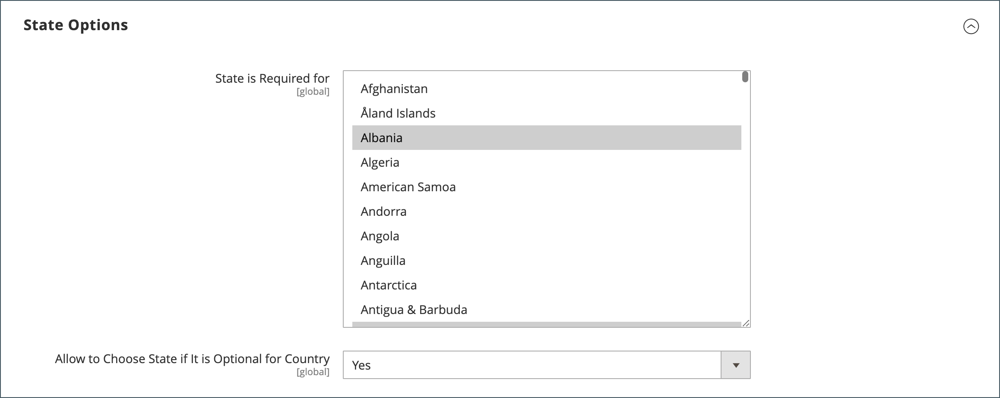
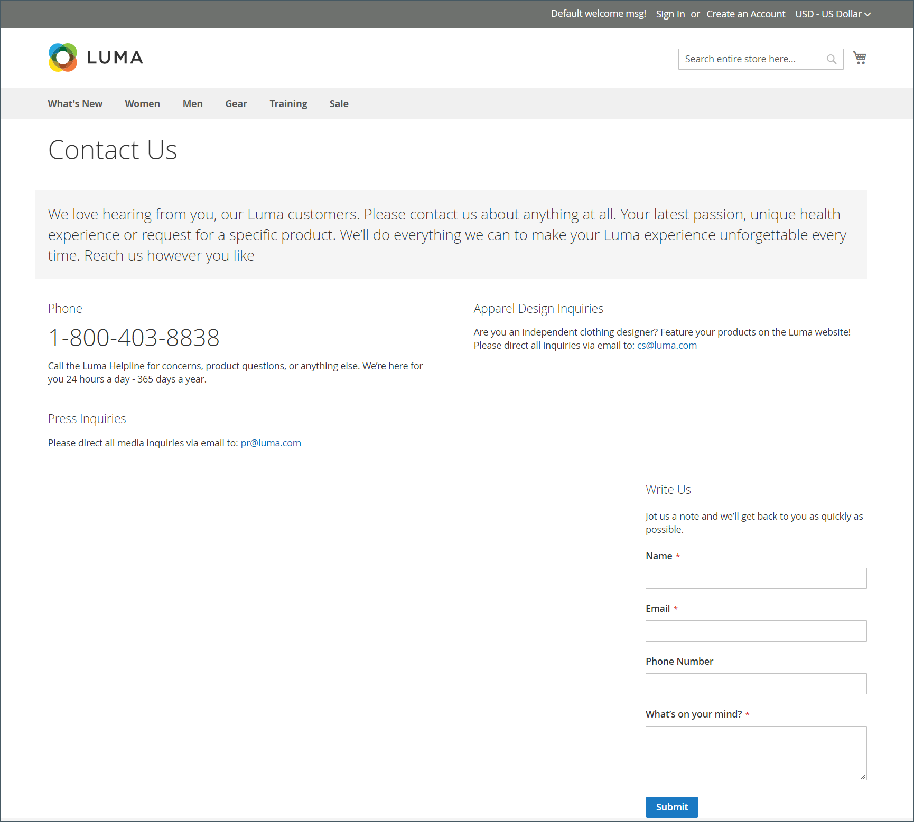

# ストアの詳細

ストアの基本情報には、ストアの名前と住所、電話番号、メールアドレスが含まれます。メールアドレスは、メールメッセージ、請求書、その他の顧客に送信されるお知らせに表示されます。

{width="900" zoomable="yes"}

## [!UICONTROL Store Information]

_[!UICONTROL Store Information]_&#x200B;のセクションでは、販売ドキュメントやその他のコミュニケーションに表示される基本情報を提供します。

1. _管理者_ サイドバーで、**[!UICONTROL Stores]**/_[!UICONTROL Settings]_/**[!UICONTROL Configuration]**&#x200B;に移動します。

1. 左側のナビゲーションパネルの「**[!UICONTROL General]**」で、「**[!UICONTROL General]**」を選択します。

1. 「」を展開し、「**[!UICONTROL Store Information]**」セクションを展開します。

   {width="700"}

1. ストアの詳細に従ってオプションを設定します。

   - すべての通信で使用する **[!UICONTROL Store Name]** を入力します。

   - 表示する形式で **[!UICONTROL Store Phone Number]** を入力します。

   - **[!UICONTROL Store Hours of Operation]**：店舗の営業時間を入力してください。 例：`Mon - Fri, 9-5, Sat 9-noon PST`。

   - ビジネスがある **[!UICONTROL Country]** を選択します。

   - 国を含む **[!UICONTROL Region/State]** を選択します。

   - **[!UICONTROL Store Address]** を入力します。 アドレスが長い場合は、**ストアアドレス 2 行目** に記載されているアドレスを続行します。

   - 該当する場合は、ストアの **[!UICONTROL VAT Number]** を入力します。

     番号を確認するには、「**[!UICONTROL Validate VAT Number]**」ボタンをクリックします。 詳しくは、[VAT ID 検証 ](../stores-purchase/vat.md#vat-id-validation) を参照してください。

1. 完了したら、「**[!UICONTROL Save Config]**」をクリックします。

ストア情報の設定オプションについて詳しくは、[_設定リファレンスガイド_](../configuration-reference/general/general.md#store-information) を参照してください。

## [!UICONTROL Locale Options]

ロケールは、ストア全体で使用される多くの設定を決定します。 その一部を次に示します。

- 言語
- 国
- 税率
- 通貨
- 価格
- 数値フォーマット

ロケール設定は、各ストアに使用されるタイムゾーンと言語を決定し、そのエリアの営業週の曜日を識別します。

1. _管理者_ サイドバーで、**[!UICONTROL Stores]**/_[!UICONTROL Settings]_/**[!UICONTROL Configuration]**&#x200B;に移動します。

1. 左側のナビゲーションパネルの **[!UICONTROL General]** の下で、「**[!UICONTROL General]**」を選択します。

1. 「」を展開し、「**[!UICONTROL Locale Options]**」セクションを展開します。

   {width="700"}

1. リストから **[!UICONTROL Timezone]** を選択します。

1. **[!UICONTROL Locale]** をストアの言語に設定します。

1. 通常、ロケールからの出荷に使用される測定単位に **[!UICONTROL Weight Unit]** を設定します。

1. **[!UICONTROL First Day of the Week]** を、お住まいの地域で週の最初の曜日と見なされる日に設定します。

1. [**[!UICONTROL Weekend Days]**] ボックスの一覧で、週末に当たる地域の曜日を選択します。

   複数日を選択するには、Ctrl キー（PC）または Command キー（Mac）を押しながら、各項目をクリックします。

1. 完了したら、「**[!UICONTROL Save Config]**」をクリックします。

ロケール設定オプションについて詳しくは、[ 設定リファレンスガイド ](../configuration-reference/general/general.md#locale-options) を参照してください。

## [!UICONTROL State Options]

多くの国では、都道府県または地域が郵送先住所の必須の部分です。 この情報は、配送および請求情報、税率の計算などに使用されます。 都道府県を指定する必要がない国の場合は、このフィールドをアドレスから完全に省略するか、オプションのフィールドとして含めることができます。

標準の住所形式は国によって異なるので、請求書、梱包明細、出荷ラベルの住所の書式設定に使用するテンプレートを編集することもできます。

1. _管理者_ サイドバーで、**[!UICONTROL Stores]**/_[!UICONTROL Settings]_/**[!UICONTROL Configuration]**&#x200B;に移動します。

1. 左側のナビゲーションパネルの「**[!UICONTROL General]**」で、「**[!UICONTROL General]**」を選択します。

1. 「」を展開し、「**[!UICONTROL State Options]**」セクションを展開します。

   {width="700"}

1. **[!UICONTROL State is required for]** リストを使用して、地域/都道府県が必須エントリである国を選択します。

1. **[!UICONTROL Allow to Choose State if it is Optional for Country]** を次のいずれかに設定します。

   `Yes` – 都道府県フィールドが必須でない国では、オプションのエントリとして都道府県フィールドを含めます。

   `No` – 都道府県フィールドが必須でない国では、都道府県フィールドを省略します。

1. 完了したら、「**[!UICONTROL Save Config]**」をクリックします。

ステート設定オプションについて詳しくは、[ 設定リファレンスガイド ](../configuration-reference/general/general.md#state-options) を参照してください。

## [!UICONTROL Country Options]

国オプションは、ビジネスが所在する国と、支払いを受け入れる国を識別します。

### ストアの国オプションの設定

1. _管理者_ サイドバーで、**[!UICONTROL Stores]**/_[!UICONTROL Settings]_/**[!UICONTROL Configuration]**&#x200B;に移動します。

1. 左側のナビゲーションパネルの **[!UICONTROL General]** の下で、「**[!UICONTROL General]**」を選択します。

1. 「」を展開し、「**[!UICONTROL Country Options]**」セクションを展開します。

   >[!NOTE]
   >
   >必要に応じて、変更する設定ごとに「**[!UICONTROL Use system value]**」チェックボックスをオフにします。

   {width="700"}

1. ビジネスが所在する **[!UICONTROL Default Country]** を選択します。

1. **[!UICONTROL Allow Countries]** リストで、注文を受け入れる国を選択します。

   デフォルトでは、リスト内のすべての国が選択されます。 複数の国を選択するには、Ctrl キー（PC）または Command キー（Mac）を押しながら、各項目をクリックします。

1. **[!UICONTROL Zip/Postal Code is Optional for]** リストを使用して、住所の一部に郵便番号を含める必要がないビジネスを行う国を選択します。

1. **[!UICONTROL European Union Countries]** リストで、ビジネスを行う EU 内の国を選択します。

   デフォルトでは、すべての EU 諸国が選択されています。 必要な国を選択するには、Ctrl キー（PC）または Command キー（Mac）を押しながら、各項目をクリックします。

1. **[!UICONTROL Top Destinations]** リストで、販売のターゲットとする主要国を選択します。

1. 完了したら、「**[!UICONTROL Save Config]**」をクリックします。

### 特定の配信方法の国オプションの設定

また、利用可能な [ 配送方法 ](../stores-purchase/delivery.md) （UPS、FedEx など）ごとに、特定の国への配送を設定することもできます。

1. _管理者_ サイドバーで、**[!UICONTROL Stores]**/_[!UICONTROL Settings]_/**[!UICONTROL Configuration]**&#x200B;に移動します。

1. 左側のナビゲーションパネルで **[!UICONTROL Sales]** を展開し、「**[!UICONTROL Delivery Methods]**」を選択します。

1. 特定の国を適用する配送業者を選択します。

1. **[!UICONTROL Ship to Applicable Countries]** の場合は、「**[!UICONTROL Use system value]**」チェックボックスの選択を解除し、「**[!UICONTROL Specific Countries]**」オプションを選択します。

1. **[!UICONTROL Top Destinations]** リストで、配送のターゲットとする主要国を選択します。

   {width="700"}

1. 完了したら、「**[!UICONTROL Save Config]**」をクリックします。

### リソースのトラブルシューティング

国の設定に関する問題のトラブルシューティングについては、[!DNL Commerce] サポートナレッジベースの次の記事を参照してください。

- [ 国を追加する方法 ](https://experienceleague.adobe.com/docs/commerce-knowledge-base/kb/how-to/how-to-add-a-new-country-to-magento-2.html)

## [!UICONTROL Merchant Location]

「マーチャントの場所」設定は、[ 支払い方法 ](../stores-purchase/payments.md) の設定に使用します。 この設定に値がない場合は、[ デフォルトの国 ](#uicontrol-country-options) 設定が使用されます。

1. _管理者_ サイドバーで、**[!UICONTROL Stores]**/_[!UICONTROL Settings]_/**[!UICONTROL Configuration]**&#x200B;に移動します。

1. 左側のナビゲーションパネルで **[!UICONTROL Sales]** を展開し、「**[!UICONTROL Payment Methods]**」を選択します。

1. 「 「**マーチャントの場所**」セクションを展開し、**[!UICONTROL Merchant Country]** を選択します。

   {width="600"}

1. 完了したら、「**[!UICONTROL Save Config]**」をクリックします。

支払い方法の設定オプションについて詳しくは、[ 設定リファレンスガイド ](../configuration-reference/sales/payment-methods.md) を参照してください。

## 通貨

通貨設定 – 基本 [ 通貨 ](../stores-purchase/currency-configuration.md) および支払として許可される追加の通貨を定義します。 また、通貨レートを自動的に更新するために使用されるインポート接続とスケジュールを確立します。

通貨記号 – 商品価格および販売文書（注文や請求書など）に表示される [ 通貨記号 ](../stores-purchase/currency-configuration.md#step-5-customize-currency-symbols-optional) を定義します。 [!DNL Commerce] は世界 200 カ国以上の通貨をサポートしています。

通貨レートの更新 – 通貨レートは、必要に応じて [ 更新 ](../stores-purchase/currency-update.md) 手動で、または事前に定義されたスケジュールに従ってストアに読み込むことができます。

通貨選択 – 複数の通貨を使用できる場合は、ストアのヘッダーで [ 通貨選択 ](../stores-purchase/currency.md) を使用できます。

## [!UICONTROL Store Email Addresses]

各ストアまたは表示の個別の機能または部門を表す最大 5 つの異なるメールアドレスを設定できます。 次の事前定義済みのメール ID に加えて、必要に応じて設定できるカスタム ID がいくつかあります。

- 一般連絡先
- 営業担当者
- カスタマーサポート

各 ID とそれに関連するメールアドレスは、特定の自動メールメッセージに関連付けることができ、ストアから送信されるメールメッセージの送信者として表示されます。

### 手順 1：ドメインのメールアドレスの設定

ストアのメールアドレスを設定する前に、各をドメインの有効なメールアドレスとして設定する必要があります。 必要な各メールアドレスを作成するには、サーバー管理者またはメールホスティングプロバイダーの手順に従います。

### 手順 2：ストアのメールアドレスの設定

1. _管理者_ サイドバーで、**[!UICONTROL Stores]**/_[!UICONTROL Settings]_/**[!UICONTROL Configuration]**&#x200B;に移動します。

1. 左側のナビゲーションパネルの「**[!UICONTROL General]**」で、「**[!UICONTROL Store Email Addresses]**」を選択します。

1. **[!UICONTROL General Contact]** のセクションの  を展開し、以下を実行します。

   {width="600"}

   - **[!UICONTROL Sender Name]**：一般的な連絡先 ID に関連付けられている人物の名前を入力し、メールメッセージの送信者として表示します。

   - **[!UICONTROL Sender Email]**：関連するメールアドレスを入力します。

1. 使用する予定の各ストアメールアドレスに対して、このプロセスを繰り返します。

1. 完了したら、「**[!UICONTROL Save Config]**」をクリックします。

### 手順 3：営業メール設定の更新

カスタムメールアドレスを使用する場合は、関連するメールメッセージの設定を更新して、正しい ID が送信者として表示されるようにします。

1. 左側のナビゲーションパネルで **[!UICONTROL Sales]** を展開し、「**[!UICONTROL Sales Emails]**」を選択します。

   このページには、次の各項目に対する個別のセクションがあります。

   - 注文および注文のコメント
   - 請求書および請求書注釈
   - 出荷および出荷注釈
   - クレジット・メモとクレジット・メモの注釈
   - RMA、RMA 認証、RMA 管理者コメントおよび RMA 顧客コメント  （Adobe Commerceのみ）

1. **[!UICONTROL Order]** から始めて、各メッセージの「」セクションを展開し、正しい送信者が選択されていることを確認します。

   {width="600"}

1. 完了したら、「**[!UICONTROL Save Config]**」をクリックします。

販売メール設定オプションについて詳しくは、[_設定リファレンスガイド_](../configuration-reference/sales/sales-emails.md) を参照してください。

## お問い合わせフォーム

お店のフッターにある _お問い合わせ_ リンクは、お客様が連絡を取り合うための簡単な方法です。 顧客はフォームに入力して、メッセージをストアに送信できます。 標準の [!DNL Commerce] インストールでは、デフォルトの _お問い合わせ_ フォームが表示されます。 フォームを送信すると、ありがとうメッセージが表示されます

デフォルトのお問い合わせフォームは、CMS ページではなくコードから直接レンダリングされることを理解しておくことが重要です。

{width="700"}

ストアフッターには、ストア全体で利用できるお問い合わせページへのリンクが含まれています。

{width="700"}

Luma のサンプルデータには、ストアに合わせてページをカスタマイズする方法を示す、お問い合わせページに関する追加情報が含まれています。

{width="700"}

### お問い合わせフォームの設定

1. _管理者_ サイドバーで、**[!UICONTROL Stores]**/_[!UICONTROL Settings]_/**[!UICONTROL Configuration]**&#x200B;に移動します。

1. 左側のナビゲーションパネルの **[!UICONTROL General]** の下で、「**[!UICONTROL Contacts]**」を選択します。

1. 「 「**[!UICONTROL Contact Us]**」セクションを展開し、「**[!UICONTROL Enable Contact Us]**」を「`Yes`」に設定します。

   {width="600"}

1. **[!UICONTROL Email Options]** のセクションの  を展開し、メール連絡先オプションを設定します。

   {width="600"}

   - **[!UICONTROL Send Emails to]**：お問い合わせフォームからのメッセージが送信されるメールアドレスを入力します。

   - お問い合わせフォームからメッセージの送信者として表示されるストア ID に **[!UICONTROL Email Sender]** を設定します。 例：カスタムメール 2.

   - お問い合わせフォームから送信されるメッセージに使用するテンプレートに **[!UICONTROL Email Template]** を設定します。

1. 競合する場合は、[**[!UICONTROL Save Config]**] をクリックします。

### コンテンツのカスタマイズ

お客様のストアおよびカスタマーサービスポリシーのニーズに合わせて、_お問い合わせ_ フォームのコンテンツをカスタマイズできます。

### 方法 1：サンプルデータの使用

Luma サンプルデータには、ストア用にカスタマイズできる _お問い合わせ情報_ ブロックが含まれています。 `contact-us-info` [ ブロック ](../content-design/blocks.md) は簡単に変更でき、お問い合わせページに独自のコンテンツを追加できます。

1. _管理者_ サイドバーで、**[!UICONTROL Content]**/_[!UICONTROL Elements]_/**[!UICONTROL Blocks]**&#x200B;に移動します。

1. リストで **[!UICONTROL Contact Us Info]** ブロックを見つけ、**[!UICONTROL Edit]** モードで開きます。

   {width="700"}

1. ブロックページの下部にある「**[!UICONTROL Edit with Page Builder]**」をクリックします。

   {width="700"}

   >[!NOTE]
   >
   >[[!DNL Page Builder]  無効 ](../page-builder/setup.md#disable-dnl-page-builder) になっている場合は、エディター [ ツールバー ](../content-design/editor.md) を使用してテキストの書式を設定し、[ 画像 ](../content-design/editor-insert-image.md) および [ リンク ](../content-design/editor-insert-link.md) を追加できます。

1. HTMLコンテナにカーソルを合わせてツールボックスを表示し、_設定_ （）アイコンを選択します。

1. 店舗の連絡先情報を入力したに従ってHTMLコードを編集し、「**[!UICONTROL Save]**」をクリックします。

   {width="700"}

1. [!DNL Page Builder] ステージを終了し、「**[!UICONTROL Save Block]**」をクリックします。

### 方法 2：サンプルデータなし

>[!IMPORTANT]
>
>2.4.0 リリース以降、CMS ブロックまたはCMS ページ内で連絡先フォームを呼び出すことができなくなりました。 お問い合わせフォームをカスタマイズする際は、レイアウト xml またはカスタムテーマテンプレートを使用してください。

デフォルトでは、買い物客は、ストアフロントページのフッターにある _連絡先リンク_ を使用して、連絡先フォームにアクセスします。 連絡先ページのカスタマイズについて詳しくは、[ フロントエンド開発者ガイド ][theme-guide] を参照してください。

[theme-guide]: https://developer.adobe.com/commerce/frontend-core/guide/themes/
