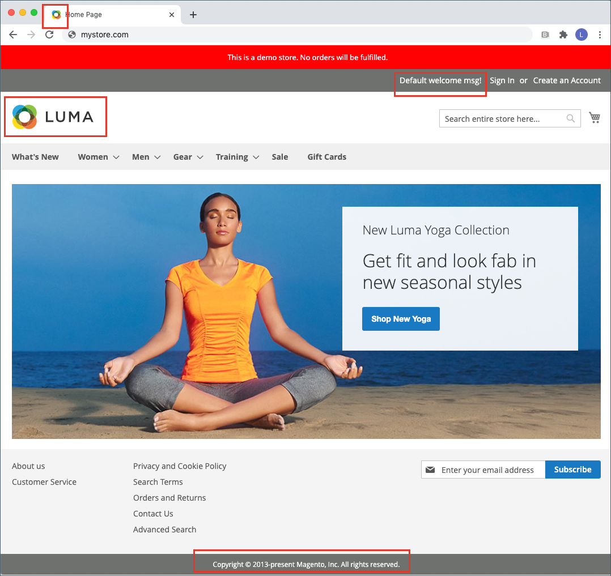
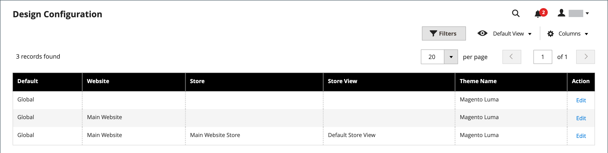
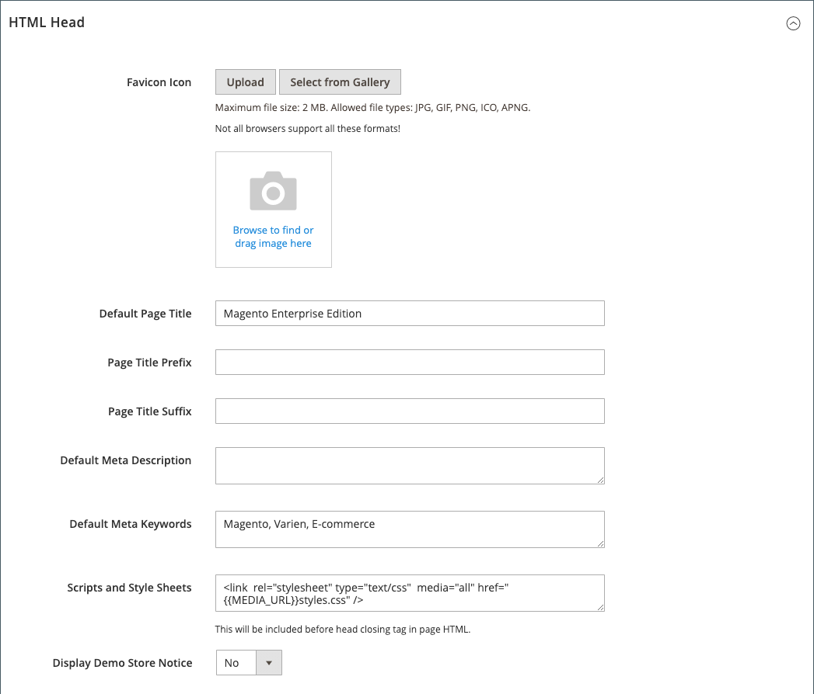
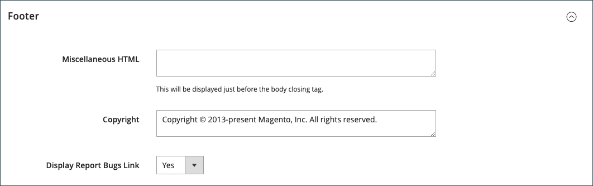

# ストアフロントのブランディング

最初にやりたいことの1つは、ヘッダーのロゴ ](#upload-your-logo)を[変更し、ブラウザー用に[ ファビコン ](#add-a-favicon)をアップロードすることです。 次に、[ようこそメッセージ ](#change-the-welcome-message)を追加し、[ フッターで著作権通知](#change-the-copyright-notice)を更新する必要があります。 これらのタスクは、いくつかのシンプルなデザイン要素であり、すぐに対応できます。 ストアの開発中は、[ ストアのデモ通知](#set-the-store-demo-notice)をオンにして、開始の準備ができたら削除できます。

{width="600" zoomable="yes"}

## ロゴをアップロード

ヘッダー内のロゴのサイズと場所は、ストアテーマによって決まります。 ロゴは、GIF、PNG、JPG（JPEG）のいずれかのファイル形式で保存し、ストアの管理者からアップロードできます。

ヘッダー](./assets/storefront-header-logo.png){width="600"}の![ ロゴ

ロゴ画像は、サーバー上の次の場所にあります。 `logo.svg`という名前の画像ファイルは、デフォルトのテーマロゴとして使用されます。

フルパス - `app/design/frontend/[vendor]/[theme]/web/images/logo.svg`

相対パス - `images/logo.svg`

テーマで使用されているロゴやその他の画像のサイズがわからない場合は、ブラウザーでページを開き、画像を右クリックして要素を調べます。

>[!NOTE]
>
>ヘッダーのロゴに加えて、ロゴは[ メールテンプレート ](../systems/email-templates.md#prepare-your-email-logo)および[PDF請求書](../stores-purchase/sales-documents.md)とその他の販売文書にも表示されます。 メールテンプレートや請求書に使用されるロゴのサイズ要件は異なるため、別途アップロードする必要があります。

サポートされているロゴファイル形式：

| ファイル形式 | 説明 |
|--- |--- |
| PNG | （Portable Network Graphics）GIFフォーマットに代わるこの新しい選択肢は、最大1,600万色（24 ビット）をサポートします。 可逆圧縮形式では、鮮明なテキストを含む高品質のビットマップ画像が生成されますが、一部の形式よりもファイルサイズが大きくなります。 PNG形式は透明レイヤーをサポートしており、オンラインでの表示とストリーミング用に設計されています。 |
| GIF | （Graphics Interchange Format）広くサポートされている古いビットマップ形式で、256色（8 ビット）に制限されています。 GIFでは、シンプルなアニメーションと透明レイヤーをサポートしています。 |
| JPG（JPEG） | （Joint Photographic Expert Group）ほとんどのデジタルカメラで使用される圧縮ビットマップ形式。 非可逆圧縮は、データの損失を引き起こし、テキストのぼやけた斑点として目立つことがあります。 |

{style="table-layout:auto"}

1. _管理者_ サイドバーで、**[!UICONTROL Content]** > _[!UICONTROL Design]_>**[!UICONTROL Configuration]**に移動します。

   {width="700"}

1. 設定するストアビューを見つけ、_[!UICONTROL Action]_列の&#x200B;**[!UICONTROL Edit]**をクリックします。

1. **[!UICONTROL Header]** セクションのを展開します。

   {width="600"}

1. 新しいロゴをアップロードするには、**[!UICONTROL Upload]**&#x200B;をクリックし、システムからファイルを選択します。

1. **[!UICONTROL Logo Image Width]**&#x200B;と&#x200B;**[!UICONTROL Logo Image Height]**&#x200B;をピクセル単位で入力します。

1. **[!UICONTROL Logo Image Alt]**&#x200B;の場合、誰かが画像の上にカーソルを置いたときに表示するテキストを入力します。

1. 完了したら、**[!UICONTROL Save Configuration]**&#x200B;をクリックします。

## ファビコンを追加

_Favicon_&#x200B;は&#x200B;_お気に入りアイコン_&#x200B;の略で、各ブラウザーページのタブにある小さなアイコンを指します。 ブラウザーによっては、ファビコンはURLの直前のアドレスバーにも表示されます。

ファビコンのサイズは、一般的に16 x 16 ピクセルまたは32 x 32 ピクセルです。 [!DNL Commerce]は、ICO、PNG、APNG、GIF、JPG（JPEG）のファイル形式を受け入れますが、すべてのブラウザーがこれらの形式をサポートしているわけではありません。 ファビコンに使用する最も広くサポートされているファイル形式はICOです。 他の種類の画像ファイルを使用することもできますが、この形式は、すべてのブラウザーでサポートされていない場合があります。 ICO画像を生成したり、その形式に画像を変換したりするために使用できる無料ツールは、オンラインで利用できる多くあります。

ブラウザータブの{width="600"}

[!DNL Commerce]は、次のファイル形式をfaviconとしてサポートしています。

| ファイル形式 | 説明 |
|--- |--- |
| ICO | この画像ファイル形式は、小さいサイズのコンピューターのアイコン画像を対象に設計されています。 主にMicrosoft® Windows OSで使用されるICO フォーマットは、最大256 x 256 ピクセルの画像と、8 ビットの透明度を持つ1,600万色（24 ビット）の画像を含むことができます。 |
| PNG | （Portable Network Graphics）GIFフォーマットに代わるこの新しい選択肢は、最大1,600万色（24 ビット）をサポートします。 可逆圧縮形式では、鮮明なテキストを含む高品質のビットマップ画像が生成されますが、一部の形式よりもファイルサイズが大きくなります。 PNG形式は透明レイヤーをサポートしており、オンラインでの表示とストリーミング用に設計されています。 |
| APNG | （Animated Portable Network Graphics）単純なアニメーションをサポートするPNGに似たファイル形式。 |
| GIF | （Graphics Interchange Format）広くサポートされている古いビットマップ形式で、256色（8 ビット）に制限されています。 GIFでは、シンプルなアニメーションと透明レイヤーをサポートしています。 |
| JPG（JPEG） | （Joint Photographic Expert Group）ほとんどのデジタルカメラで使用される圧縮ビットマップ形式。 非可逆圧縮は、データの損失を引き起こし、テキストのぼやけた斑点として目立つことがあります。 |

{style="table-layout:auto"}

### 手順1：ファビコンの作成

1. 任意の画像エディターを使用して、ロゴの16 x 16または32 x 32のグラフィック画像を作成します。

1. （オプション）使用可能なオンラインツールのいずれかを使用して、ファイルを.ico形式に変換し、ファイルをコンピューターに保存します。

### ステップ 2：お気に入りをストアにアップロードする

1. _管理者_ サイドバーで、**[!UICONTROL Content]** > _[!UICONTROL Design]_>**[!UICONTROL Configuration]**に移動します。

1. グリッドで、設定するストアビューを見つけ、_[!UICONTROL Action]_列の&#x200B;**[!UICONTROL Edit]**をクリックします。

1. _[!UICONTROL Other Settings]_で、**[!UICONTROL HTML Head]**セクションのを展開します。

   {width="600"}

1. 現在のファビコンを削除する場合は、画像の左下隅にある&#x200B;_削除_ （）アイコンをクリックします。

1. **[!UICONTROL Upload]**&#x200B;をクリックし、準備したfavicon ファイルを開きます。

   {width="400"}

1. 完了したら、**[!UICONTROL Save Configuration]**&#x200B;をクリックします。

### 手順3：キャッシュを更新する

1. キャッシュの更新を求めるメッセージが表示されたら、ワークスペースの上部にあるメッセージの&#x200B;**[!UICONTROL Cache Management]** リンクをクリックします。

1. リストで、`Invalidated`とマークされている&#x200B;**[!UICONTROL Page Cache]** チェックボックスを選択します。

1. **[!UICONTROL Actions]**&#x200B;を`Refresh`に設定し、**[!UICONTROL Submit]**&#x200B;をクリックします。

1. 新しいファビコンを表示するには、ストアフロントに戻り、ブラウザーを更新します。

## ウェルカムメッセージの変更

ヘッダーのウェルカムメッセージが展開され、ログインしている顧客の名前が含まれます。 ストアを起動する前に、各ストアビューのデフォルトの&#x200B;_ようこそ_ テキストを変更してください。

{width="600"}

1. _管理者_ サイドバーで、**[!UICONTROL Content]** > _[!UICONTROL Design]_>**[!UICONTROL Configuration]**に移動します。

1. グリッドで、設定するストアビューを見つけ、_[!UICONTROL Action]_列の&#x200B;**[!UICONTROL Edit]**をクリックします。

1. _[!UICONTROL Other Settings]_で、**[!UICONTROL Header]**セクションのを展開します。

1. **[!UICONTROL Welcome Text]**&#x200B;の場合、店舗のヘッダーに表示するウェルカムメッセージのテキストを入力します。

   {width="600"}

1. 完了したら、**[!UICONTROL Save Configuration]**&#x200B;をクリックします。

1. ページキャッシュの更新を求めるメッセージが表示されたら、ワークスペースの上部にある&#x200B;**[!UICONTROL Cache Management]** リンクをクリックし、指示に従ってキャッシュを更新します。

## 著作権表示の変更

ストアでは、各ページのフッターに著作権通知が表示されます。 ベストプラクティスとして、著作権通知には今年度を含め、サイト上のコンテンツの法的な所有者としてあなたの会社を特定する必要があります。

{width="600"}

次の例に示すように、`&copy;`文字コードを使用して著作権記号を挿入します。

- ロングフォーマットの例

  `Copyright &copy; 2013-present Luma, Inc. All rights reserved.`

- 短い形式の例

  `&copy; 2021 Luma, Inc. All rights reserved.`

**_著作権通知を更新するには:_**

1. _管理者_ サイドバーで、**[!UICONTROL Content]** > _[!UICONTROL Design]_>**[!UICONTROL Configuration]**に移動します。

1. グリッドで、設定するストアビューを見つけ、_[!UICONTROL Action]_列の&#x200B;**[!UICONTROL Edit]**をクリックします。

1. _その他の設定_&#x200B;で、 「**[!UICONTROL Footer]**」セクションを展開します。

   {width="600"}

1. **[!UICONTROL Copyright]**&#x200B;には、各ページのフッターに表示する著作権通知を入力します。

   `&copy;`文字コードを使用して著作権記号を挿入します。

1. 完了したら、**[!UICONTROL Save Configuration]**&#x200B;をクリックします。

## ストアのデモ通知を設定する

オンラインストアがオンラインであっても、まだ建設中の場合は、ページの上部にストアデモ通知を表示して、そのストアがまだ営業していないことを知らせることができます。 _運用開始_&#x200B;の準備ができたら、メッセージを削除するだけです。 ウィンドウに表示されている記号を&#x200B;_閉じる_&#x200B;から&#x200B;_開く_&#x200B;に切り替えるのと同じです。 デモ通知の形式は、ストアのテーマによって決まります。

{width="600"}

1. _管理者_ サイドバーで、**[!UICONTROL Content]** > _[!UICONTROL Design]_>**[!UICONTROL Configuration]**に移動します。

1. グリッドで、設定するストアビューを見つけ、_[!UICONTROL Action]_列の&#x200B;**[!UICONTROL Edit]**をクリックします。

1. _[!UICONTROL Other Settings]_で、**[!UICONTROL HTML Head]**セクションのを展開します。

   {width="600"}

1. 一番下までスクロールして、**[!UICONTROL Display Demo Store Notice]**&#x200B;を好みに合わせて設定します。

1. 完了したら、**[!UICONTROL Save Configuration]**&#x200B;をクリックします。

1. キャッシュの更新を求めるメッセージが表示された場合は、システムメッセージの「**[!UICONTROL Cache Management]**」をクリックし、指示に従ってキャッシュを更新します。
