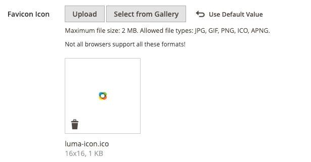

# ストアフロントのブランディング

最初にやりたいことの 1 つは、ヘッダーの [ ロゴを変更 ](#upload-your-logo) し、ブラウザーの [ お気に入りをアップロード ](#add-a-favicon) することです。 次に、フッターで [ ようこそメッセージを追加 ](#change-the-welcome-message) および [ 著作権表示を更新 ](#change-the-copyright-notice) する必要があります。 これらのタスクは、すぐに対処できるシンプルなデザイン要素です。 ストアが開発中に、[ ストアのデモ通知をオンにする ](#set-the-store-demo-notice) と、ローンチの準備が整ったら削除できます。

{width="600" zoomable="yes"}

## ロゴをアップロード

ヘッダー内のロゴのサイズと場所は、ストアテーマによって決まります。 ロゴは、GIF、PNG、JPG（JPEG）のいずれかのファイルタイプとして保存し、ストアの管理者からアップロードできます。

{width="600"}

ロゴ画像はサーバー上の次の場所にあります。 `logo.svg` という名前の画像ファイルはすべて、デフォルトのテーマロゴとして使用されます。

フルパス - `app/design/frontend/[vendor]/[theme]/web/images/logo.svg`

相対パス - `images/logo.svg`

テーマで使用されるロゴやその他の画像のサイズがわからない場合は、ブラウザーでページを開き、画像を右クリックして、要素を調べます。

>[!NOTE]
>
>ヘッダーのロゴに加えて、ロゴが [E メール テンプレート ](../systems/email-templates.md#prepare-your-email-logo)、[PDFの請求書 ](../stores-purchase/sales-documents.md) およびその他の営業文書にも表示されます。 メールテンプレートと請求書に使用されるロゴは、サイズの要件が異なり、別々にアップロードする必要があります。

サポートされるロゴファイル形式：

| ファイル形式 | 説明 |
|--- |--- |
| PNG | （Portable Network Graphics） GIFフォーマットに代わるこの新しいフォーマットは、最大 1600 万色（24 ビット）をサポートします。 可逆圧縮形式では、テキストは鮮明になるが、一部の形式よりもファイルサイズが大きい、高品質のビットマップ画像が生成されます。 PNG 形式は、透明レイヤーをサポートし、オンライン表示とストリーミング用に設計されています。 |
| GIF | （Graphics Interchange Format）広くサポートされている古いビットマップ形式で、256 色（8 ビット）に制限されています。 GIFフォーマットは、単純なアニメーションと透明レイヤーをサポートしています。 |
| JPG （JPEG） | （Joint Photographic Expert Group）ほとんどのデジタルカメラで使用される圧縮ビットマップ形式。 非可逆圧縮によってデータがやや失われますが、テキストのぼやけた点として目立つ場合があります。 |

{style="table-layout:auto"}

1. _管理者_ サイドバーで、**[!UICONTROL Content]**/_[!UICONTROL Design]_/**[!UICONTROL Configuration]**&#x200B;に移動します。

   {width="700"}

1. 設定するストア表示を見つけ、_[!UICONTROL Action]_&#x200B;列の&#x200B;**[!UICONTROL Edit]**&#x200B;をクリックします。

1. 「」を展開し、「**[!UICONTROL Header]**」セクションを展開します。

   {width="600"}

1. 新しいロゴをアップロードするには、「**[!UICONTROL Upload]**」をクリックし、システムからファイルを選択します。

1. **[!UICONTROL Logo Image Width]** と **[!UICONTROL Logo Image Height]** をピクセル単位で入力します。

1. **[!UICONTROL Logo Image Alt]**：画像にマウスオーバーしたときに表示されるテキストを入力します。

1. 完了したら、「**[!UICONTROL Save Configuration]**」をクリックします。

## お気に入りの追加

_favicon_ は、_お気に入りアイコン_ の略で、各ブラウザーページのタブにある小さなアイコンを指します。 ブラウザーによっては、favicon がアドレスバーの URL の直前にも表示されます。

favicon は通常、16 x 16 ピクセルまたは 32 x 32 ピクセルのサイズです。 [!DNL Commerce] では ICO、PNG、APNG、GIF、JPG（JPEG）の各ファイルタイプを使用できますが、これらのフォーマットをサポートしていないブラウザーもあります。 favicon で最も広くサポートされているファイル形式は ICO です。 他の画像ファイルタイプを使用することもできますが、一部のブラウザーではその形式がサポートされていない場合があります。 ICO 画像を生成したり、画像をその形式に変換したりできる無料のツールがオンラインで多数用意されています。

{width="600"}

[!DNL Commerce] は、favicon として次のファイル形式をサポートしています。

| ファイル形式 | 説明 |
|--- |--- |
| ICO | この画像ファイル形式は、小さいサイズのコンピューターアイコン画像用に設計されています。 主にMicrosoft® Windows OS で使用される ICO フォーマットは、最大 256 x 256 ピクセルと 8 ビットの透明度を持つ 1600 万色（24 ビット）の画像を含めることができます。 |
| PNG | （Portable Network Graphics） GIFフォーマットに代わるこの新しいフォーマットは、最大 1600 万色（24 ビット）をサポートします。 可逆圧縮形式では、テキストは鮮明になるが、一部の形式よりもファイルサイズが大きい、高品質のビットマップ画像が生成されます。 PNG 形式は、透明レイヤーをサポートし、オンライン表示とストリーミング用に設計されています。 |
| APNG | （Animated Portable Network Graphics）単純なアニメーションをサポートする PNG に似たファイル形式。 |
| GIF | （Graphics Interchange Format）広くサポートされている古いビットマップ形式で、256 色（8 ビット）に制限されています。 GIFフォーマットは、単純なアニメーションと透明レイヤーをサポートしています。 |
| JPG （JPEG） | （Joint Photographic Expert Group）ほとんどのデジタルカメラで使用される圧縮ビットマップ形式。 非可逆圧縮によってデータがやや失われますが、テキストのぼやけた点として目立つ場合があります。 |

{style="table-layout:auto"}

### 手順 1:favicon の作成

1. 任意の画像エディターを使用して、ロゴの 16 x 16 または 32 x 32 のグラフィック画像を作成します。

1. （オプション）使用可能なオンラインツールのいずれかを使用して、ファイルを.ico 形式に変換し、コンピューターに保存します。

### 手順 2:favicon をストアにアップロードする

1. _管理者_ サイドバーで、**[!UICONTROL Content]**/_[!UICONTROL Design]_/**[!UICONTROL Configuration]**&#x200B;に移動します。

1. グリッドで、設定するストア表示を見つけ、_[!UICONTROL Action]_&#x200B;列の&#x200B;**[!UICONTROL Edit]**&#x200B;をクリックします。

1. 「_[!UICONTROL Other Settings]_」の下の「展開セレクター ![ 「**[!UICONTROL HTML Head]**」セクション ](../assets/icon-display-expand.png) を展開します。

   {width="600"}

1. 現在の favicon を削除する場合は、画像の左下隅にある _削除_ （）アイコンをクリックします。

1. 「**[!UICONTROL Upload]**」をクリックし、準備した favicon ファイルを開きます。

   {width="400"}

1. 完了したら、「**[!UICONTROL Save Configuration]**」をクリックします。

### 手順 3：キャッシュを更新

1. キャッシュを更新するように求めるプロンプトが表示されたら、ワークスペース上部のメッセージに含まれている **[!UICONTROL Cache Management]** リンクをクリックします。

1. リストで、`Invalidated` とマークされた「**[!UICONTROL Page Cache]**」チェックボックスを選択します。

1. **[!UICONTROL Actions]** を `Refresh` に設定し、「**[!UICONTROL Submit]**」をクリックします。

1. 新しいお気に入りを表示するには、ストアフロントに戻ってブラウザーを更新します。

## ようこそメッセージの変更

ヘッダーのウェルカムメッセージが展開され、ログインした顧客の名前が表示されます。 ストアを起動する前に、各ストア表示のデフォルトの _ようこそ_ テキストを必ず変更してください。

{width="600"}

1. _管理者_ サイドバーで、**[!UICONTROL Content]**/_[!UICONTROL Design]_/**[!UICONTROL Configuration]**&#x200B;に移動します。

1. グリッドで、設定するストア表示を見つけ、_[!UICONTROL Action]_&#x200B;列の&#x200B;**[!UICONTROL Edit]**&#x200B;をクリックします。

1. 「_[!UICONTROL Other Settings]_」の下の「展開セレクター ![ 「**[!UICONTROL Header]**」セクション ](../assets/icon-display-expand.png) を展開します。

1. **[!UICONTROL Welcome Text]**：ストアのヘッダーに表示するようこそメッセージのテキストを入力します。

   {width="600"}

1. 完了したら、「**[!UICONTROL Save Configuration]**」をクリックします。

1. ページキャッシュを更新するように求めるプロンプトが表示されたら、ワークスペースの上部にある **[!UICONTROL Cache Management]** リンクをクリックし、指示に従ってキャッシュを更新します。

## 著作権表示の変更

ストアの各ページのフッターには著作権表示が表示されます。 ベストプラクティスとして、著作権表示には現在の年を含め、自社をサイト上のコンテンツの法的所有者として識別する必要があります。

{width="600"}

次の例に示すように、`&copy;` 文字コードを使用して著作権記号を挿入します。

- 長い形式の例

  `Copyright &copy; 2013-present Luma, Inc. All rights reserved.`

- 短い形式の例

  `&copy; 2021 Luma, Inc. All rights reserved.`

**_著作権表示を更新するには：_**

1. _管理者_ サイドバーで、**[!UICONTROL Content]**/_[!UICONTROL Design]_/**[!UICONTROL Configuration]**&#x200B;に移動します。

1. グリッドで、設定するストア表示を見つけ、_[!UICONTROL Action]_&#x200B;列の&#x200B;**[!UICONTROL Edit]**&#x200B;をクリックします。

1. _その他の設定_ の下で、「拡張セレクター **[!UICONTROL Footer]** セクション。

   {width="600"}

1. **[!UICONTROL Copyright]**：各ページのフッターに表示する著作権表示を入力します。

   著作権記号を挿入するには、`&copy;` の文字コードを使用します。

1. 完了したら、「**[!UICONTROL Save Configuration]**」をクリックします。

## デモ用ストア通知の設定

店舗がオンラインでも建設中の場合は、ページの上部に店舗デモ通知を表示して、店舗がまだ営業していないことを知らせることができます。 運用開始 _の準備が整ったら_ メッセージを削除するだけです。 これは、ウィンドウにぶら下がっている記号を _閉じる_ から _開く_ に反転させることに似ています。 デモ通知の形式は、ストアのテーマによって決まります。

{width="600"}

1. _管理者_ サイドバーで、**[!UICONTROL Content]**/_[!UICONTROL Design]_/**[!UICONTROL Configuration]**&#x200B;に移動します。

1. グリッドで、設定するストア表示を見つけ、_[!UICONTROL Action]_&#x200B;列の&#x200B;**[!UICONTROL Edit]**&#x200B;をクリックします。

1. 「_[!UICONTROL Other Settings]_」の下の「展開セレクター ![ 「**[!UICONTROL HTML Head]**」セクション ](../assets/icon-display-expand.png) を展開します。

   {width="600"}

1. 下までスクロールし、**[!UICONTROL Display Demo Store Notice]** を好みに設定します。

1. 完了したら、「**[!UICONTROL Save Configuration]**」をクリックします。

1. キャッシュを更新するように求めるメッセージが表示されたら、システム メッセージの **[!UICONTROL Cache Management]** をクリックし、指示に従ってキャッシュを更新します。
