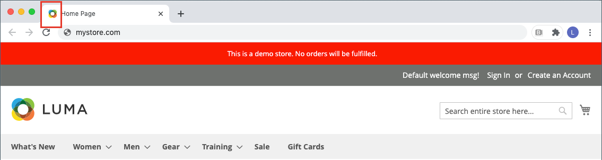
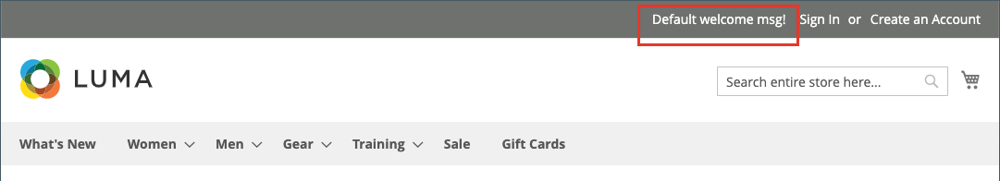

# ストアフロントのブランディング

最初にしたいことの 1 つは、 [ロゴを変更する](#upload-your-logo) ヘッダーおよび [favicon をアップロード](#add-a-favicon) ブラウザーの 次に、 [お知らせメッセージを追加](#change-the-welcome-message) および [著作権情報を更新する](#change-the-copyright-notice) を使用します。 これらのタスクは、すぐに対処できるいくつかのシンプルなデザイン要素です。 ストアの開発中は、 [店のデモ通知をオンにする](#set-the-store-demo-notice)を削除し、起動する準備が整ったら削除します。

{width="600" zoomable="yes"}

## ロゴをアップロード

ヘッダー内のロゴのサイズと場所は、ストアのテーマによって決まります。 ロゴは、GIF、PNG、JPG(JPEG) のいずれかのファイルタイプとして保存し、ストアの管理者からアップロードできます。

{width="600"}

ロゴイメージは、サーバー上の次の場所に存在します。 名前を持つ画像ファイル `logo.svg` は、デフォルトのテーマロゴとして使用されます。

フルパス — `app/design/frontend/[vendor]/[theme]/web/images/logo.svg`

相対パス —  `images/logo.svg`

テーマで使用されるロゴや他の画像のサイズがわからない場合は、ブラウザーでページを開き、画像を右クリックして要素を検査します。

>[!NOTE]
>
>ヘッダーにロゴが表示される以外に、ロゴもに表示されます。 [電子メールテンプレート](../systems/email-templates.md#prepare-your-email-logo) および [PDF請求書](../stores-purchase/sales-documents.md) その他のセールスドキュメント 電子メールテンプレートと請求書に使用されるロゴには、異なるサイズ要件があり、個別にアップロードする必要があります。

サポートされるロゴファイル形式：

| ファイル形式 | 説明 |
|--- |--- |
| PNG | (Portable Network Graphics) この新しいGIF形式の代わりに、最大 1,600 万色（24 ビット）をサポートします。 ロスレス圧縮形式は、テキストが鮮明で高品質のビットマップ画像を生成しますが、一部の形式よりもファイルサイズが大きくなります。 PNG 形式は、透明なレイヤーをサポートし、オンライン表示およびストリーミング用に設計されています。 |
| GIF | (Graphics Interchange Format)256 色（8 ビット）に制限される、広くサポートされている古いビットマップ形式。 このGIF形式では、単純なアニメーションと透明なレイヤをサポートしています。 |
| JPG(JPEG) | (Joint Photographic Expert Group) ほとんどのデジタルカメラで使用される圧縮ビットマップ形式。 非可逆圧縮は、データの損失を引き起こします。これは、テキストのぼやけたスポットとして見られる場合があります。 |

{style="table-layout:auto"}

1. 次の日： _管理者_ サイドバー、移動 **[!UICONTROL Content]** > _[!UICONTROL Design]_>**[!UICONTROL Configuration]**.

   {width="700"}

1. 設定するストア表示を見つけ、 **[!UICONTROL Edit]** （内） _[!UICONTROL Action]_列。

1. 展開  の **[!UICONTROL Header]** 」セクションに入力します。

   {width="600"}

1. 新しいロゴをアップロードするには、 **[!UICONTROL Upload]** お使いのシステムからファイルを選択します。

1. 次を入力します。 **[!UICONTROL Logo Image Width]** および **[!UICONTROL Logo Image Height]** ピクセル単位で指定します。

1. の場合 **[!UICONTROL Logo Image Alt]**」をクリックし、画像にカーソルを合わせたときに表示するテキストを入力します。

1. 完了したら、「 **[!UICONTROL Save Configuration]**.

## お気に入りに追加

_Favicon_ は、 _お気に入りのアイコン_ とは、各ブラウザーページの「 」タブにある小さなアイコンを指します。 ブラウザーに応じて、favicon もアドレスバー（URL の直前）に表示されます。

favicon は通常、16 x 16 ピクセルまたは 32 x 32 ピクセルのサイズです。 [!DNL Commerce] は、ICO、PNG、APNG、GIF、JPG(JPEG) の各ファイルタイプを受け入れますが、一部のブラウザーではこれらの形式をサポートしていません。 favicon に使用する、最も広くサポートされているファイル形式は ICO です。 他の種類のイメージファイルを使用することもできますが、この形式が一部のブラウザーでサポートされているとは限りません。 ICO イメージを生成したり、その形式にイメージを変換したりするのに使用できる無料のツールは、オンラインで多数用意されています。

{width="600"}

[!DNL Commerce] では、次のファイル形式を favicon としてサポートしています。

| ファイル形式 | 説明 |
|--- |--- |
| ICO | この画像ファイル形式は、小さいサイズのコンピューターのアイコン画像用に設計されています。 ICO 形式は、Microsoft® Windows OS で主に使用され、最大 256 x 256 ピクセル、1600 万色（24 ビット）の画像を含み、透明度が 8 ビットになります。 |
| PNG | (Portable Network Graphics) この新しいGIF形式の代わりに、最大 1,600 万色（24 ビット）をサポートします。 ロスレス圧縮形式は、テキストが鮮明で高品質のビットマップ画像を生成しますが、一部の形式よりもファイルサイズが大きくなります。 PNG 形式は、透明なレイヤーをサポートし、オンライン表示およびストリーミング用に設計されています。 |
| APNG | (Animated Portable Network Graphics)PNG に似た、単純なアニメーションをサポートするファイル形式です。 |
| GIF | (Graphics Interchange Format)256 色（8 ビット）に制限される、広くサポートされている古いビットマップ形式。 このGIF形式では、単純なアニメーションと透明なレイヤをサポートしています。 |
| JPG(JPEG) | (Joint Photographic Expert Group) ほとんどのデジタルカメラで使用される圧縮ビットマップ形式。 非可逆圧縮は、データの損失を引き起こします。これは、テキストのぼやけたスポットとして見られる場合があります。 |

{style="table-layout:auto"}

### 手順 1：お気に入りアイコンを作成する

1. 任意の画像エディターを使用して、ロゴの 16 x 16 または 32 x 32 グラフィック画像を作成します。

1. （オプション）利用可能なオンラインツールの 1 つを使用して、ファイルを.ico 形式に変換し、そのファイルをコンピュータに保存します。

### 手順 2: favicon をストアにアップロードする

1. 次の日： _管理者_ サイドバー、移動 **[!UICONTROL Content]** > _[!UICONTROL Design]_>**[!UICONTROL Configuration]**.

1. グリッドで、設定するストア表示を探し、 **[!UICONTROL Edit]** （内） _[!UICONTROL Action]_列。

1. の下 _[!UICONTROL Other Settings]_、展開  の&#x200B;**[!UICONTROL HTML Head]**」セクションに入力します。

   {width="600"}

1. 現在のお気に入りを削除する場合は、 _削除_ () アイコンをクリックします。

1. クリック **[!UICONTROL Upload]** をクリックし、用意した favicon ファイルを開きます。

   {width="400"}

1. 完了したら、「 **[!UICONTROL Save Configuration]**.

### 手順 3：キャッシュの更新

1. キャッシュを更新するよう求められたら、 **[!UICONTROL Cache Management]** リンクを使用して、メッセージの上部に表示されます。

1. リストで、 **[!UICONTROL Page Cache]** マーク付きのチェックボックス `Invalidated`.

1. 設定 **[!UICONTROL Actions]** から `Refresh` をクリックします。 **[!UICONTROL Submit]**.

1. 新しい favicon を表示するには、ストアフロントに戻って、ブラウザーを更新します。

## お知らせメッセージを変更する

ヘッダー内のようこそメッセージが展開され、ログインした顧客の名前が表示されます。 ストアを起動する前に、必ずデフォルトの _ようこそ_ 各ストア表示のテキスト。

{width="600"}

1. 次の日： _管理者_ サイドバー、移動 **[!UICONTROL Content]** > _[!UICONTROL Design]_>**[!UICONTROL Configuration]**.

1. グリッドで、設定するストア表示を探し、 **[!UICONTROL Edit]** （内） _[!UICONTROL Action]_列。

1. の下 _[!UICONTROL Other Settings]_、展開  の&#x200B;**[!UICONTROL Header]**」セクションに入力します。

1. の場合 **[!UICONTROL Welcome Text]**&#x200B;ストアのヘッダーに表示するようこそメッセージのテキストを入力します。

   {width="600"}

1. 完了したら、「 **[!UICONTROL Save Configuration]**.

1. ページキャッシュを更新するように求められたら、 **[!UICONTROL Cache Management]** リンクをクリックし、指示に従ってキャッシュを更新します。

## 著作権情報の変更

ストアでは、各ページのフッターに著作権情報が表示されます。 ベストプラクティスとして、著作権情報には現在の年を含め、貴社をサイト上のコンテンツの法的所有者として特定する必要があります。

{width="600"}

The `&copy;` 次の例に示すように、文字コードは著作権記号の挿入に使用されます。

- 長い形式の例

  `Copyright &copy; 2013-present Luma, Inc. All rights reserved.`

- 短い形式の例

  `&copy; 2021 Luma, Inc. All rights reserved.`

**_著作権情報を更新するには：_**

1. 次の日： _管理者_ サイドバー、移動 **[!UICONTROL Content]** > _[!UICONTROL Design]_>**[!UICONTROL Configuration]**.

1. グリッドで、設定するストア表示を探し、 **[!UICONTROL Edit]** （内） _[!UICONTROL Action]_列。

1. の下 _その他の設定_、展開 の **[!UICONTROL Footer]** 」セクションに入力します。

   {width="600"}

1. の場合 **[!UICONTROL Copyright]**」をクリックし、各ページのフッターに表示する著作権情報を入力します。

   以下を使用します。 `&copy;` 著作権記号を挿入する文字コード。

1. 完了したら、「 **[!UICONTROL Save Configuration]**.

## ストアのデモ通知を設定

ストアがオンラインで、まだ構築中の場合は、ページの上部にストアのデモ通知を表示して、ストアがまだ開いていないことを知らせることができます。 次の準備が整ったら、 _生きて行く_、単にメッセージを削除します。 これは、窓にぶら下がっている記号を _閉じる_ から _開く_. デモ通知の形式は、ストアのテーマによって決まります。

{width="600"}

1. 次の日： _管理者_ サイドバー、移動 **[!UICONTROL Content]** > _[!UICONTROL Design]_>**[!UICONTROL Configuration]**.

1. グリッドで、設定するストア表示を探し、 **[!UICONTROL Edit]** （内） _[!UICONTROL Action]_列。

1. の下 _[!UICONTROL Other Settings]_、展開  の&#x200B;**[!UICONTROL HTML Head]**」セクションに入力します。

   {width="600"}

1. 下にスクロールして下に移動し、 **[!UICONTROL Display Demo Store Notice]** を選択します。

1. 完了したら、「 **[!UICONTROL Save Configuration]**.

1. キャッシュを更新するよう求められた場合は、 **[!UICONTROL Cache Management]** を選択し、指示に従ってキャッシュを更新します。
