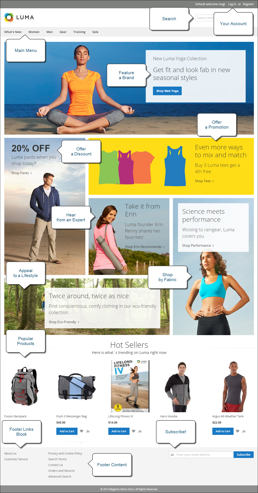
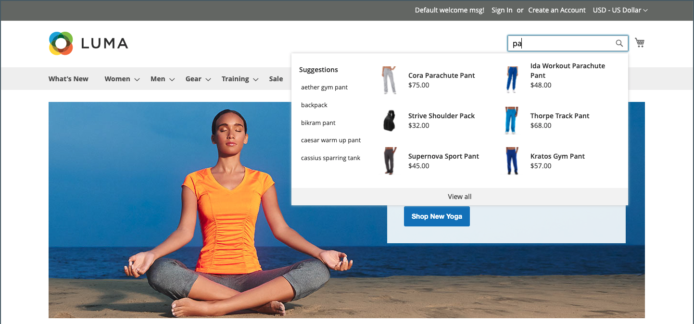
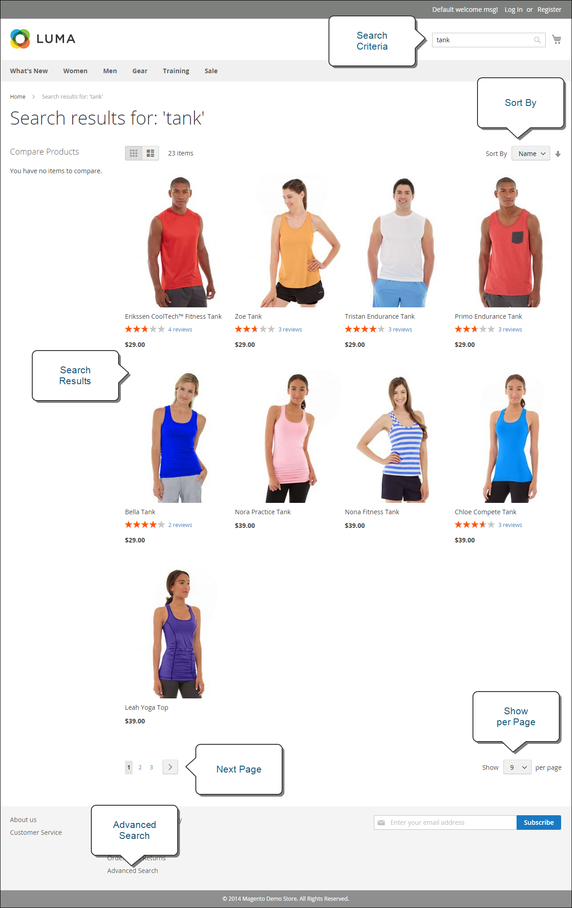
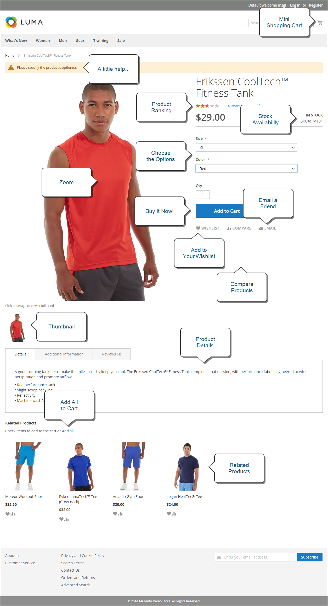
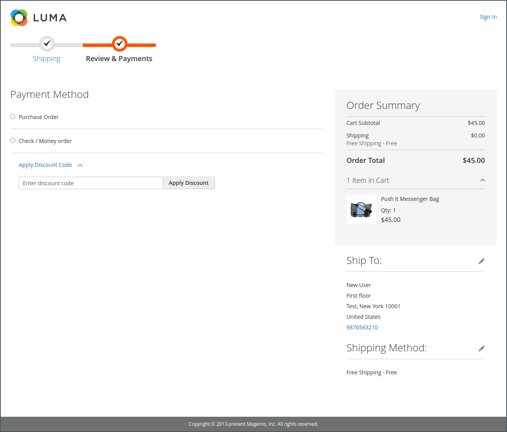

# ストアフロントとは？

Adobe CommerceまたはMagento Open Sourceの実装内では、ストアフロントはストアの外部に対して公開される部分です。 顧客が買い物や購入で使用するコンテンツや機能コンポーネントを提供します。

顧客が購入に至るまでの経路は、_購入までの経路_&#x200B;と呼ばれることもあり、ストアフロントには、顧客がこの経路を完了するためのコンポーネントが含まれています。 ここでは、戦略的な価値を提供する基本的なページタイプを解説します。ここでは、顧客が実店舗で買い物をするときに訪問する場所を解説します。 戦略を見直す際には、カスタマージャーニーの各段階で利用できるさまざまなストア機能を検討します。

## Commerce ストアフロント

Edge Delivery Services **を搭載した** Commerce ストアフロントの導入により、Adobeは、最先端のテクノロジーを活用して優れたスピードとユーザーエクスペリエンスを実現する、高性能で拡張性の高い、信頼性の高いストアフロントを提供します。

- **パフォーマンスの向上**: Edge Delivery Servicesでストアフロントをホスティングすることで、読み込み時間を短縮し、サイトパフォーマンスを向上させ、コンバージョン率を高め、SEO ランキングを向上させることができます。

- **スケーラビリティ**：このアーキテクチャは、パフォーマンスを低下させることなく、トラフィックの増加や製品カタログの増加を処理するためのシームレスな拡張をサポートします。

- **柔軟性**: ストアフロントは高度にカスタマイズ可能で、企業は独自のニーズに合わせてショッピング体験をカスタマイズできます。

- **ユーザーエクスペリエンスの向上**：高度なキャッシュ、リアルタイム更新、パーソナライズされたコンテンツ配信などの機能により、よりスムーズで魅力的なショッピング体験を実現できます。

### 主な機能

Edge Delivery Servicesを搭載したCommerce Storefrontには、マーチャントと開発者の両方にメリットをもたらす主な機能がいくつかあります。 これらの機能により、企業は魅力的なショッピング体験を構築しながら、ニーズに応じてストアフロントをカスタマイズし、拡張できる柔軟性を維持できます。

Commerce Storefrontの設定と最適化について詳しくは、[Adobe Commerce Storefront ドキュメント &#x200B;](https://experienceleague.adobe.com/ja/docs/commerce)を参照してください。

>[!BEGINTABS]

>[!TAB  マーチャント ]

Edge Delivery Servicesを搭載したCommerce Storefrontは、直観的なドキュメントベースのオーサリング体験を提供し、マーチャントはコンテンツを容易に制作、管理できます。 Microsoft WordやGoogle Docsなどの使い慣れたツールを使用して、バージョン管理やチームメンバーとの共同作業を維持しながら、リッチコンテンツを制作できます。

- **コンテンツ制作の簡素化**: Microsoft WordやGoogle Docsなどの使い慣れたドキュメントベースのオーサリングツールを使用して、コンテンツを制作、編集できます。
- **リアルタイムプレビュー**：公開前に、ライブプレビュー機能で即座に変更を確認できます。
- **バージョン管理**: コンテンツの変更を追跡し、以前のバージョンに簡単にロールバックできます。
- **共同作業ワークフロー**：複数のチームメンバーが、組み込みのレビュープロセスと同時にコンテンツに取り組むことができます。
- **コンテンツの再利用**：複数のページをまたいで再利用できるコンテンツブロックを作成して、一貫性を維持します。

>[!TAB 開発者]

ヘッドレス実装により、開発者はフロントエンドのプレゼンテーション層をバックエンドのコマース機能から切り離すことができ、Commerceの堅牢なバックエンドサービスを活用しながら、最新のテクノロジーで構築された柔軟なカスタムストアフロントを実現できます。

- **API ファースト アーキテクチャ**:Commerce バックエンド サービスを活用しながら、モダンなフレームワークを使用してカスタム フロントエンド エクスペリエンスを構築します。
- **コンポーザブルコンポーネント**：異なるページレイアウトに組み立てることができる、モジュール化された再利用可能なコンポーネントを作成してデプロイします。
- **拡張可能なプラットフォーム**: コアコードを変更することなく、APIとwebhookを通じてカスタム機能を追加します。
- **最新の開発ツール**：業界標準の開発ツールとワークフローを使用して、より迅速な実装と展開を実現します。

>[!ENDTABS]

>[!NOTE]
>
>Commerce ストアフロントには多くの利点がありますが、Adobeは引き続き元のLuma ベースのストアフロントをサポートしています。 現在Lumaを使用している企業は、中断することなく運営を継続でき、独自のペースで新しいストアフロントに移行するオプションがあります。 このページの残りのセクションは、Lumaの例に基づいています。

## ホームページ

多くの人は、サイトに滞在したり、他の場所に移動したりするまでに、わずか数秒でページを作成します。 印象を与えるのは長くありません。 ある研究によれば、人々は特に他の人々の写真も好きである。 どのようなデザインを選んでも、ホームページ上のあらゆる要素を活用することで、訪問者をセールスプロセスの次のステップに進めることができます。 つまり、顧客の注意を、ある顧客接点から次の顧客接点へと向かわせることが重要です。

{width="700"}

## カタログページ

カタログページリストは通常、小さな商品画像と簡単な説明で構成され、リストまたはグリッドとしてフォーマットできます。 ブロック、動画、キーワードの豊富な説明を追加したり、プロモーションやシーズンの特別なデザインを作成したりできます。 例えば、ライフスタイルやブランドに関するコンテンツを制作します。さまざまなカテゴリーから収集した商品を厳選して集め、

通常、最初の商品説明には、詳細な説明に値する十分な情報が含まれています。 欲しいものが分かっている人は、商品をカートに入れて購入できます。 アカウントにログインして買い物をする顧客は、パーソナライズされたショッピング体験を享受できます。

{width="700"}

## 検索結果

検索連動型広告を利用する人は、ナビゲーションだけで広告を配信する人に比べて、購入する可能性が2倍近く高くなっています。 これらの買い物客は&#x200B;_事前承認_&#x200B;であると見なすことができます。

### [!DNL Live Search]

Adobe Commerce用の[[!DNL Live Search]](https://experienceleague.adobe.com/ja/docs/commerce/live-search/overview)を使用すると、お使いのストアは、高速で非常に関連性の高い直感的な検索体験を提供し、Adobe Commerceでも追加料金なしで利用できます。

{width="700"}

### 標準カタログ検索

[標準カタログ検索](../catalog/search.md)では、ストアの右上隅に検索ボックス、フッターに高度な検索へのリンクが表示されます。 買い物客が送信した検索語はすべて保存されるため、顧客が何を求めているのかを正確に把握できます。 候補を提示したり、類義語や一般的な誤字を入力したりすることができます。 次に、検索語が入力されたときに特定のページを表示します。

{width="700"}

## 製品ページ

製品ページは多くの作業を進めています。 商品ページで最初に目に留まるのは、高解像度のズームとサムネールギャラリーを備えたメイン画像です。 価格と在庫状況に加えて、詳細と関連製品のリストを含むタブ付きセクションがあります。

{width="700"}

## 買い物かご

カートには、割引クーポン、配送予定日、税金を含む注文合計が表示されます。 これらの機能により、信頼バッジやシールを表示するのに最適な場所です。 また、カートページを1つの最終的なオファーの機会として使用することもできます。 例えば、特定の商品がカートに入っているときにインパルス購入オプションとして表示されるクロスセル商品を設定できます。

{width="700"}

## チェックアウトページ

チェックアウトプロセスは、次のふたつのステップで構成されています。

1. 発送情報

   チェックアウトプロセスの最初のステップは、お客様が配送先情報を完了し、配送方法を選択することです。お客様がアカウントを持っている場合、配送先住所は自動的に入力されますが、必要に応じて変更できます。
ゲストのお客様が以前に登録されたメールアドレスを入力すると、ストア設定の[!UICONTROL Enable Guest Checkout Login] フィールドが`Yes`に設定されている場合、サインインプロンプトが表示されます（_設定リファレンスガイド_&#x200B;の[[!UICONTROL Checkout Options]](../configuration-reference/sales/checkout.md#checkout-options)を参照）。 ただし、この設定では、未認証のユーザーに顧客情報を公開する可能性があります。

   {width="700"}

1. お支払い情報の確認

   チェックアウトプロセスの2番目のステップは、顧客が支払い方法を選択し、オプションで割引コードを適用することです。

   >[!NOTE]
   >
   >[!DNL Commerce]では複数のクーポンコードを設定できますが、お客様がカートに適用できるクーポンコードは1つのみです。 （詳しくは、[&#x200B; クーポンコード &#x200B;](../merchandising-promotions/price-rules-cart-coupon.md#coupon-codes)を参照してください）。

   {width="700"}

ページ上部の進行状況バーは、チェックアウトプロセスの各ステップに続き、_注文概要_&#x200B;には、この時点まで入力された情報が表示されます。

>[!NOTE]
>
>2段階チェックアウトの例外は、仮想および/またはダウンロード可能な製品に適用されます。 ショッピングカートにこれらの種類の商品しかない場合、出荷情報は必要ないため、チェックアウトは自動的に1 ステップの手順に変換されます。
