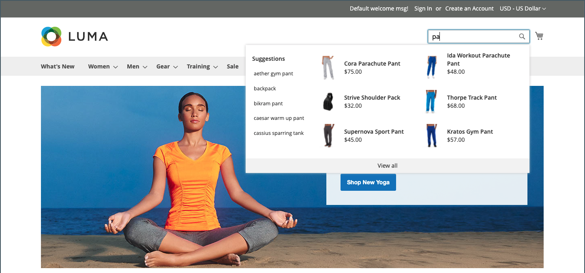

# ストアフロントとは？

Adobe CommerceまたはMagento Open Sourceの実装内では、ストアフロントは、ストアの外部に面した公開部分です。 顧客が購入に使用するコンテンツと機能コンポーネントを提供します。

顧客がセールに至るまでのパスは、 _購入パス_&#x200B;を選択すると、ストアフロントにこのパスを完了するためのコンポーネントが含まれます。 以下の節では、戦略的な価値を提供する基本的なページタイプ（ストアでの買い物の際に顧客が通常訪問する場所）の概要を説明します。 レビューする際には、カスタマージャーニーの各段階で使用できる様々なストア機能を検討します。

## ホームページ

ほとんどの人は、滞在や他の場所への移動を決定する前に、ページに数秒しか費やさないことを知っていましたか？ 印象を与えるのはそんなに長くない。 研究は、人々が特に他の人々の写真も愛することを示しています。 どのデザインを選択しても、ホームページ上のすべての情報は、訪問者を販売プロセスの次のステップに向けて移動させる必要があります。 このアイデアは、関心のあるポイントから次のポイントへとまとまりのあるフローで彼らの注意を導くことです。

{width="700"}

## カタログページ

カタログページのリストには、通常、小さな製品画像と簡単な説明が含まれ、リストまたはグリッドとして書式設定できます。 ブロック、ビデオ、キーワードに富んだ説明を追加したり、プロモーションやシーズン用に特別なデザインを作成したりできます。 特別なカテゴリを作成して、様々なカテゴリの製品を厳選したコレクションであるライフスタイルやブランドを特集することもできます。

最初の製品説明では、通常、買い物客が詳しく見るのに十分な情報を提供します。 自分が何を求めているかを知っているユーザーは、製品を買い物かごに追加して出発できます。 アカウントにログインして買い物をされるお客様は、パーソナライズされたショッピングエクスペリエンスをお楽しみいただけます。

{width="700"}

## 検索結果

検索を使用するユーザーは、ナビゲーションだけに依存するユーザーと比べて、購入する可能性がほぼ 2 倍であることをご存知ですか？ これらの買い物客を次のように考えることもできます _事前認定済み_.

### [!DNL Live Search]

（を使用） [[!DNL Live Search]](https://experienceleague.adobe.com/docs/commerce-merchant-services/live-search/overview.html) Adobe Commerceの場合、ストアは迅速で非常に関連性が高く直感的な検索エクスペリエンスを提供し、Adobe Commerceでも追加料金なしで利用できます。

{width="700"}

### 標準カタログ検索

（を使用） [標準カタログ検索](../catalog/search.md)を選択すると、ストアの右上隅に「検索」ボックスが表示され、フッターに「詳細検索」へのリンクが表示されます。 買い物客が送信したすべての検索用語が保存されるので、買い物客が探しているものを正確に確認できます。 候補を提示したり、同義語やよくあるスペルミスを入力したりできます。 検索語句を入力すると、特定のページが表示されます。

{width="700"}

## 製品ページ

商品ページは盛りだくさんです！ 商品ページでまず目をひくのが、高解像度のズームとサムネールギャラリーを備えたメイン画像です。 価格と在庫に加えて、詳細情報と関連製品のリストを含むタブ付きセクションがあります。

{width="700"}

## ショッピングカート

カートは、注文の合計を決定できる場所、割引クーポン、推定送料、税金、信頼バッジとシールを表示するのに最適な場所です。 また、最後の 1 つのアイテムを提供する理想的な機会でもあります。 クロスセルとして、特定の商品がカートに表示されるたびに、特定の商品を選択して衝動購入として提供できます。

{width="700"}

## チェックアウトページ

チェックアウトプロセスは、次の 2 つの手順で構成されます。

1. 配送先情報

   チェックアウトプロセスの最初の手順は、顧客が配送先住所情報を入力し、配送方法を選択することです。 顧客がアカウントを持っている場合、配送先住所は自動的に入力されますが、必要に応じて変更できます。
以前に登録されたと認識されるメールアドレスをゲスト顧客が入力すると、次の場合にログインプロンプトが表示されます [!UICONTROL Enable Guest Checkout Login] ストア設定のフィールドはに設定されます。 `Yes` （を参照） [[!UICONTROL Checkout Options]](../configuration-reference/sales/checkout.md#checkout-options) が含まれる _設定リファレンスガイド_）に設定します。 ただし、この設定では、顧客情報が未認証のユーザーに公開される可能性があります。

   {width="700"}

1. レビューおよび支払い情報

   チェックアウトプロセスの 2 番目の手順は、顧客が支払い方法を選択し、オプションで割引コードを適用することです。

   >[!NOTE]
   >
   >ただし [!DNL Commerce] 複数のクーポンコードを設定できます。お客様は、1 つのクーポンコードのみを買い物かごに適用できます。 （ [クーポンコード](../merchandising-promotions/price-rules-cart-coupon.md#coupon-codes) を参照してください）。

   {width="700"}

ページの上部にあるプログレスバーは、チェックアウトプロセスの各ステップと、 _注文概要_ この時点までに入力された情報を表示します。

>[!NOTE]
>
>2 段階チェックアウトの例外は、仮想製品やダウンロード可能な製品に適用されます。 買い物かごにこれらのタイプの商品しかない場合、配送情報は不要なので、チェックアウトは自動的にワンステップの手順に変換されます。
