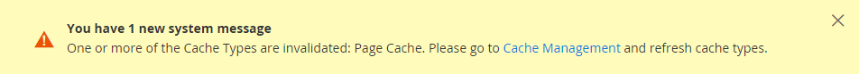

# サイト、保存、表示範囲

Adobe CommerceとMagento Open Sourceをインストールするたびに、web サイト、ストア、ストアビューの[階層](../stores-purchase/stores.md)が表示されます。 _スコープ_&#x200B;という用語は、製品、属性、カテゴリなどのデータベースエンティティが階層内のどの部分でコンテンツ要素または構成設定が適用されるかを決定します。 web サイト、ストア、およびストアビューには、1対多の親子関係があります。 1回のインストールで複数のweb サイトを持つことができ、各web サイトには複数のストアとストアビューを持つことができます。

>[!NOTE]
>
>詳しくは、[!DNL Commerce]開発者ドキュメントの[複数のweb サイトまたはストア &#x200B;](https://experienceleague.adobe.com/docs/commerce-operations/configuration-guide/multi-sites/ms-overview.html?lang=ja)を参照してください。

## web サイト

インストールは、デフォルトで&#x200B;_メイン Web サイト_&#x200B;と呼ばれる1つの[web サイト &#x200B;](../stores-purchase/stores.md#add-websites)から始まります。 また、1つのインストール用に複数のweb サイトを設定し、それぞれに独自のIP アドレスとドメインを設定することもできます。

## 店舗

1つのweb サイトに複数の[&#x200B; ストア &#x200B;](../stores-purchase/stores.md#add-stores)を含めることができ、それぞれにメインメニューが用意されています。 ストアは商品カタログを共有しますが、商品とデザインの選択肢が異なる場合があります。 同じweb サイトのすべてのストアで、管理者とチェックアウトが共有されます。

## ストアビュー

顧客が利用できる各ストアは、特定の&#x200B;_[ビュー](../stores-purchase/store-views.md)_&#x200B;に従って表示されます。 当初、ストアには単一のデフォルト表示があります。 追加のストアビューは、様々な言語をサポートするために、または他の目的のために追加できます。 顧客は、ヘッダーの言語選択ツールを使用して、ストアビューを変更できます。

web サイト、ストア、ストアビューを使用する場合は、次の点に注意してください。

- Commerceのインスタンスにはカスケーディングモデルがあります。グローバル→ web サイト→ストア→ストアビューです。
- 各web サイトには、最低でも1つのデフォルトストアビューとストアビューがあります。
- 各ストアビューには、異なるベース URLを設定できます。
- web サイトの主な機能は、トップレベルの機能設定です。
- ストアの主な機能は、ルートカテゴリ設定です。
- ストアビューの主な機能は、翻訳情報と通貨記号の設定です。

## 範囲の設定

Adobe CommerceまたはMagento Open Sourceのインストール環境にweb サイト、ストア、またはビューの階層がある場合は、コンテクストまたは構成設定の&#x200B;_スコープ_&#x200B;を設定できます。 多くのデータベースエンティティのコンテキストには、ストア階層での使用方法を決定するために特定のスコープを割り当てることもできます。 詳しくは、[製品範囲](../catalog/introduction.md#product-scope)および[価格範囲](../catalog/catalog-price-scope.md)を参照してください。

郵便番号などの一部の設定設定では、システム全体で同じ値が使用されるため、グローバルスコープがあります。 [web サイト &#x200B;](../stores-purchase/stores.md#add-websites)の範囲は、すべてのストアとそのビューを含め、階層のそのレベルより下のストアに適用されます。 [&#x200B; ストアビュー](../stores-purchase/store-views.md)の範囲を持つアイテムは、各ストアビューに対して異なる設定できます。これは、通常、複数の言語をサポートするために使用されます。 構成設定のデフォルト値を上書きするには、[&#x200B; スコープの設定](../configuration-reference/scope-change.md#set-the-scope)を参照してください。

ストアが[単一ストアモード &#x200B;](#single-store-mode)で実行されていない限り、各構成設定の範囲は、フィールドラベルの下の小さなテキストで表示されます。 インストールに複数のweb サイト、ストア、またはビューが含まれる場合は、設定が適用される[&#x200B; ストアビュー](../stores-purchase/store-views.md)を選択してから変更を行います。

{width="550"}

| 範囲 | 説明 |
|--- |--- |
| [!UICONTROL Global] | インストール全体で使用可能なシステム全体の設定とリソース。 |
| [!UICONTROL Website] | 現在のweb サイトに限定される設定とリソース。 各web サイトにはデフォルトのストアがあります。 |
| [!UICONTROL Store] | 現在のストアに限定される設定とリソース。 各ストアには、デフォルトのルートカテゴリ（メインメニュー）とデフォルトのストアビューがあります。 |
| [!UICONTROL Store View] | 現在のストアビューに限定された設定とリソース。 |

{style="table-layout:auto"}

## シングルストアモード

Commerceのインストールでストアビューとストアビューが1つしかない場合は、すべてのストアビューオプションとスコープ指標をオフにすることで、表示を簡単に表示できます。 後で[&#x200B; ストアビューを追加](../stores-purchase/store-views.md)した場合、単一ストアモードは上書きされます。

{width="550"}

1. _管理者_ サイドバーで、**[!UICONTROL Stores]** > _[!UICONTROL Settings]_>**[!UICONTROL Configuration]**&#x200B;に移動します。

1. **[!UICONTROL General]**&#x200B;で、ページの一番下までスクロールして、**[!UICONTROL Single-Store Mode]** セクションを展開します。

1. **[!UICONTROL Enable Single-Store Mode]**&#x200B;を`Yes`に設定します。

   {width="400"}

1. **[!UICONTROL Save Config]**&#x200B;をクリックします。

1. キャッシュの更新を求めるメッセージが表示されたら、次の操作を行います。

   - ページの上部にあるシステムメッセージの&#x200B;**[!UICONTROL Cache Management]** リンクをクリックします。

     {width="600" zoomable="yes"}

   - 「**[!UICONTROL Page Cache]**」チェックボックスを選択します。

   - **[!UICONTROL Actions]**&#x200B;を`Refresh`に設定し、**[!UICONTROL Submit]**&#x200B;をクリックします
