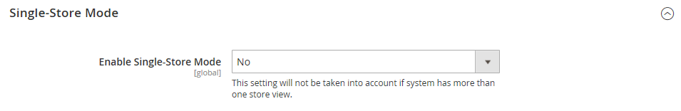

# サイト、ストア、ビューの範囲

Adobe CommerceとMagento Open Sourceのすべてのインストールには、 [階層](../stores-purchase/stores.md) （web サイト、ストア、ストアビューのリスト）。 用語 _範囲_ 製品、属性、カテゴリなどのデータベースエンティティ、コンテンツ要素、設定などを適用する階層内の場所を決定します。 Web サイト、ストア、ストアビューには、1 対多の親子関係があります。 1 つのインストールに複数の web サイトを含めることができ、各 web サイトに複数のストアやストア表示を含めることができます。

>[!NOTE]
>
>詳しくは、 [複数の web サイトまたはストア](https://experienceleague.adobe.com/docs/commerce-operations/configuration-guide/multi-sites/ms-overview.html) が含まれる [!DNL Commerce] 開発者向けドキュメント。

## Web サイト

インストールは 1 つの [web サイト](../stores-purchase/stores.md#add-websites)と呼ばれます。 _メイン Web サイト_ デフォルトでは。 また、1 つのインストールに対して、独自の IP アドレスとドメインを持つ複数の web サイトを設定することもできます。

## ストア

1 つの Web サイトに複数の Web サイトを含めることができます [ストア](../stores-purchase/stores.md#add-stores)、それぞれ独自のメインメニューを持つ。 店舗は商品カタログを共有しますが、異なる商品とデザインを選択できます。 同じ web サイト下のすべてのストアで、管理とチェックアウトが共有されます。

## ビューを保存

顧客が利用できる各ストアは、特定のストアに従って表示されます _[表示](../stores-purchase/store-views.md)_. 最初は、ストアには単一のデフォルト表示があります。 別の言語をサポートするために、またはその他の目的のために、追加のストアビューを追加できます。 ユーザーは、ヘッダーの言語選択を使用して、ストア表示を変更できます。

Web サイト、ストア、ストアビューを使用する場合は、次の点に注意してください。

- Commerce インスタンスにはカスケードモデルがあります。グローバル → web サイト → ストア→ストアビュー。
- 各 web サイトには、デフォルトのストアとストア表示が少なくとも 1 つあります。
- 各ストア表示には、異なるベース URL を含めることができます。
- Web サイトの主な機能は、トップレベルの機能設定です。
- ストアの主な機能は、ルートカテゴリ設定です。
- ストア表示の主な機能は、翻訳情報と通貨記号の設定です。

## 範囲設定

Adobe CommerceまたはMagento Open Sourceのインストールに web サイト、ストアまたはビューの階層がある場合は、 _範囲_ （設定）。 また、多くのデータベースエンティティのコンテキストに特定の範囲を割り当てて、ストア階層での使用方法を決定することもできます。 詳しくは、 [製品の範囲](../catalog/introduction.md#product-scope) および [価格範囲](../catalog/catalog-price-scope.md).

郵便番号などの一部の設定は、システム全体で同じ値が使用されるので、グローバル範囲を持ちます。 この [web サイト](../stores-purchase/stores.md#add-websites) 範囲は、階層内のそのレベルより下のすべてのストア（すべてのストアとそのビューを含む）に適用されます。 スコープがの任意の項目 [ストア表示](../stores-purchase/store-views.md) はストア表示ごとに異なる設定を行うことができます。通常、この設定は複数の言語をサポートするために使用されます。 構成設定のデフォルト値を上書きするには、次を参照してください： [範囲を設定](../configuration-reference/scope-change.md#set-the-scope).

ストアが次の場所で実行されていない場合 [シングルストアモード](#single-store-mode)各設定の範囲は、フィールドラベルの下に小さなテキストで表示されます。 インストールに複数の web サイト、ストアまたはビューが含まれている場合は、 [ストア表示](../stores-purchase/store-views.md) 変更を加える前に設定が適用される場所。

{width="550"}

| 範囲 | 説明 |
|--- |--- |
| [!UICONTROL Global] | インストール全体で利用できるシステム全体の設定とリソース。 |
| [!UICONTROL Website] | 現在の web サイトに限定された設定とリソース。 各 web サイトにはデフォルトのストアがあります。 |
| [!UICONTROL Store] | 現在のストアに限定された設定とリソース。 各ストアには、デフォルトのルートカテゴリ（メインメニュー）とデフォルトのストア表示があります。 |
| [!UICONTROL Store View] | 現在のストア表示に制限されている設定とリソース。 |

{style="table-layout:auto"}

## シングルストアモード

Commerceのインストールにストアとストアの表示が 1 つしかない場合は、すべてのストア表示オプションとスコープインジケーターをオフにすることで、表示を簡単にすることができます。 次の場合は、シングルストアモードが上書きされます [さらにストア表示を追加](../stores-purchase/store-views.md) 後で。

{width="550"}

1. 日 _Admin_ サイドバー、に移動 **[!UICONTROL Stores]** > _[!UICONTROL Settings]_>**[!UICONTROL Configuration]**.

1. 次の下 **[!UICONTROL General]**&#x200B;ページの一番下までスクロールし、を展開します **[!UICONTROL Single-Store Mode]** セクション。

1. を設定 **[!UICONTROL Enable Single-Store Mode]** 対象： `Yes`.

   {width="400"}

1. クリック **[!UICONTROL Save Config]**.

1. キャッシュを更新するように求められたら、次の操作を行います。

   - 「」をクリックします **[!UICONTROL Cache Management]** ページ上部のシステムメッセージのリンク。

     {width="600" zoomable="yes"}

   - 「」を選択します **[!UICONTROL Page Cache]** チェックボックス。

   - （を使用） **[!UICONTROL Actions]** をに設定 `Refresh`を選択し、 **[!UICONTROL Submit]**
