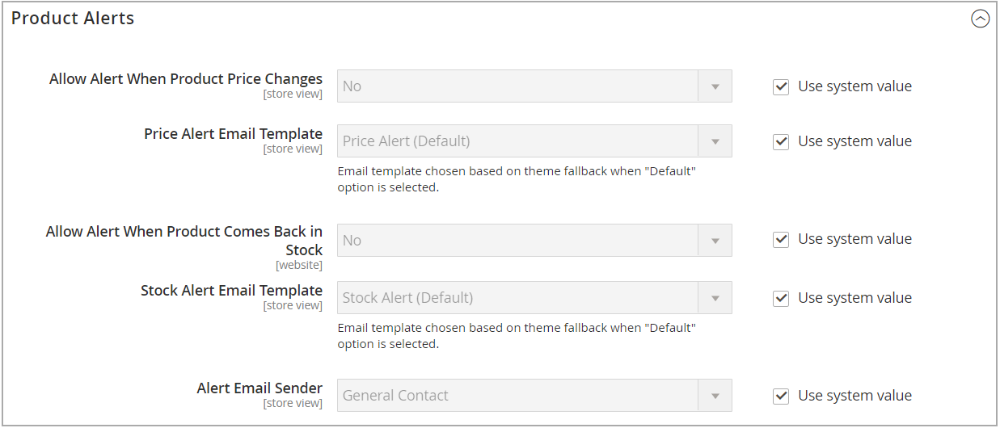

# 製品アラート

顧客は、価格変更アラートと在庫内アラートの 2 種類のアラートをメールで購読できます。 アラートのタイプごとに、顧客が購読できるかどうかを判断し、使用するメールテンプレートを選択し、メールの送信者を識別できます。

{width="600" zoomable="yes"}

## 価格変更アラート

価格変更アラートが有効になっている場合、すべての製品ページに _価格低下時に通知_ リンクが表示されます。 お客様は、リンクをクリックして、製品に関連するアラートを登録できます。 ゲストは、ストアでアカウントを開くように求められます。 価格が変更されたり、商品が特別になったりするたびに、アラートを購読したすべてのユーザーにメールアラートが届きます。

## 在庫中アラート

在庫アラートは、在庫切れのすべての製品に対して「_この製品が入荷したら通知する_ というリンクを作成します。 お客様は、リンクをクリックしてアラートを購読できます。 商品が再入荷すると、顧客は商品が使用可能であることを知らせるメール通知を受け取ります。 アラートを設定した製品には、製品情報パネルに _製品アラート_ タブがあり、アラートを購読した顧客がリストされます。

{width="600" zoomable="yes"}

## 製品アラートの設定

1. _管理者_ サイドバーで、**[!UICONTROL Stores]**/_[!UICONTROL Settings]_/**[!UICONTROL Configuration]**に移動します。

1. 左側のパネルで「**[!UICONTROL Catalog]**」を展開し、その下の「**[!UICONTROL Catalog]**」を選択します。

1. 「_[!UICONTROL Product Alerts]_」セクションをクリックして展開し、次の操作を実行します。

   {width="600" zoomable="yes"}

   - 顧客に価格変更アラートを提供するには、「**[!UICONTROL Allow Alert When Product Price Changes]**」を「`Yes`」に設定します。

   - 価格アラート通知に使用するテンプレートに **[!UICONTROL Price Alert Email Template]** を設定します。

   - 在庫切れの製品が再び使用可能になったときにアラートを送信するには、**[!UICONTROL Allow Alert When Product Comes Back in Stock]** を `Yes` に設定します。

     >[!NOTE]
     >
     >「_この製品が在庫になったら通知する_」メッセージは、「**[!UICONTROL Display Out of Stock Products]**」が「`Yes`」に設定されている（[!UICONTROL Catalog]/[!UICONTROL Inventory] の設定）場合にのみ表示されます。

   - 製品ストックアラートに使用するテンプレートに **[!UICONTROL Stock Alert Email Template]** を設定します。

   - メールアラートの送信者として表示する [ ストアの連絡先 ](../getting-started/store-details.md#store-email-addresses){target="_blank"} を **[!UICONTROL Alert Email Sender]** に設定します。 [ メールアドレスの保存 ](../configuration-reference/general/store-email-addresses.md){target="_blank"} について詳しくは、コアユーザーガイドを参照してください。

1. 完了したら、「**[!UICONTROL Save Config]**」をクリックします。

## 製品アラートのメールテンプレートを設定

次に、価格アラートのメールテンプレートを設定、追加、変更します。 追加のテンプレートを作成した後で、価格アラートの設定を編集することができます。

メールメッセージの使用について詳しくは、『 [ 管理システムガイド _の ](../systems/email-template-custom.md#message-templates) メッセージテンプレート_ を参照してください。

1. _管理者_ サイドバーで、**[!UICONTROL Marketing]**/_[!UICONTROL Communications]_/**[!UICONTROL Email Templates]**に移動します。

1. 「**[!UICONTROL Add New Template]**」をクリックします。

1. _既定のテンプレートの読み込み_ の下で、カスタマイズする **[!UICONTROL Template]** を選択します。

   テーマに含まれるアラートテンプレートを選択することもできます。 または、_[!UICONTROL Magento_PriceAlert]_の下で `Price Alert` または `Stock Alert` のテンプレートを選択できます。

1. 「**[!UICONTROL Load Template]**」をクリックします。

1. **[!UICONTROL Template Name]** を入力します。

   この名前は、「価格アラート _設定で選択_ きます。

1. 既存のコンテンツを読み上げ、必要に応じて次の変更を行います。

   | フィールド | 説明 |
   | ----- | ----- |
   | [!UICONTROL Template Subject] | このテキストは、メールの件名に表示されます。 |
   | [!UICONTROL Template Content] | このテキストは、送信されたメールのコンテンツ全体に表示されます。 |

1. データから生成された情報 [!DNL Commerce] 追加するには、「**[!UICONTROL Insert Variable]**」オプションを使用して、使用可能な変数のリストを使用します。

1. 「**[!UICONTROL Save Template]**」をクリックします。

## 製品アラートの実行設定

これらの設定を使用すると、アラートの送信 [!DNL Commerce] 必要とする変更をチェックする頻度を選択できます。 また、アラートの送信に失敗した場合に送信されるメールの受信者、送信者、テンプレートを選択することもできます。

{width="600" zoomable="yes"}

1. _管理者_ サイドバーで、**[!UICONTROL Stores]**/_[!UICONTROL Settings]_/**[!UICONTROL Configuration]**に移動します。

1. 左側のパネルで「**[!UICONTROL Catalog]**」を展開し、その下の「**[!UICONTROL Catalog]**」を選択します。

1. 「」を展開し、「**[!UICONTROL Product Alerts Run Settings]**」セクションを展開します。

1. 製品アラートの送信頻度を決定するには、**[!UICONTROL Frequency]** を次のいずれかに設定します。

   - `Daily`
   - `Weekly`
   - `Monthly`

1. 製品アラートが送信される時刻を決定するには、**[!UICONTROL Start Time]** を時、分、秒に設定します。

   >[!NOTE]
   >
   >製品アラートは、「product_alert」コンシューマーから送信されます。

1. **[!UICONTROL Error Email Recipient]**: エラーが発生した場合の連絡相手のメールアドレスを入力します。

1. **[!UICONTROL Error Email Sender]** には、エラー通知の送信者として表示されるストア ID を選択します。

1. エラー通知に使用するトランザクションメールテンプレートに **[!UICONTROL Error Email Template]** を設定します。

1. 完了したら、「**[!UICONTROL Save Config]**」をクリックします。
