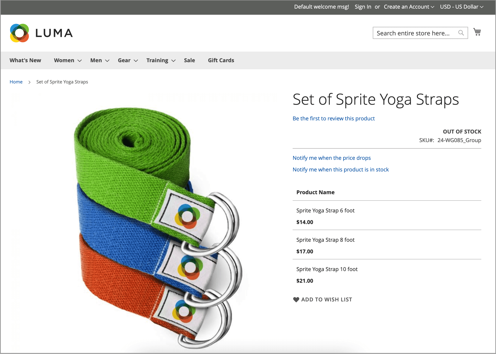
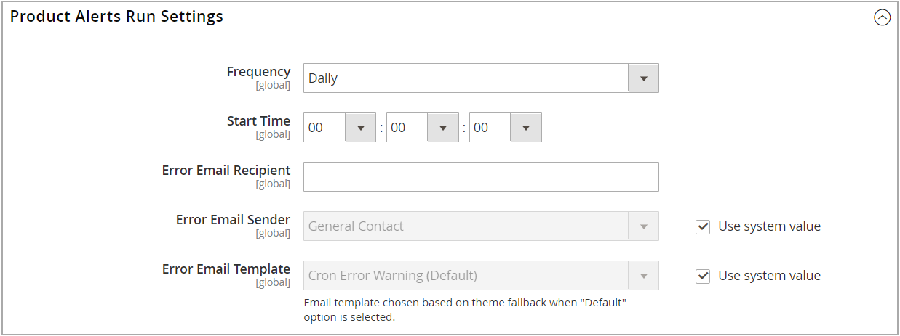

# 製品アラート

顧客は、価格変更アラートと在庫状況アラートの2種類のアラートをメールで購読できます。 アラートのタイプごとに、顧客が購読できるかどうかを判断し、使用するメールテンプレートを選択し、メールの送信者を特定できます。

{width="600" zoomable="yes"}

## 価格変更アラート

価格変更アラートが有効になっている場合は、すべての製品ページに&#x200B;_価格低下を通知_ リンクが表示されます。 顧客はリンクをクリックして、製品に関連するアラートを購読できます。 お客様は、お客様のストアでアカウントを開くように求められます。 価格が変更されたり、特別な商品が発売されたりすると、アラートを購読した人全員にメールアラートが届きます。

## In-Stock アラート

在庫アラートは、在庫切れの商品ごとに&#x200B;_この商品の在庫状況を知らせる_&#x200B;というリンクを作成します。 顧客はリンクをクリックして、アラートを購読できます。 商品の在庫が戻ると、顧客には商品が入手可能であることを知らせるメール通知が送られます。 アラートを含む製品には、製品情報パネルに「_製品アラート_」タブがあり、アラートを購読した顧客が一覧表示されます。

{width="600" zoomable="yes"}

## 商品アラートの設定

1. _管理者_ サイドバーで、**[!UICONTROL Stores]** > _[!UICONTROL Settings]_>**[!UICONTROL Configuration]**に移動します。

1. 左側のパネルで「**[!UICONTROL Catalog]**」を展開し、下の「**[!UICONTROL Catalog]**」を選択します。

1. クリックして&#x200B;_[!UICONTROL Product Alerts]_セクションを展開し、次の操作を行います。

   {width="600" zoomable="yes"}

   - 価格変更アラートを顧客に提供するには、**[!UICONTROL Allow Alert When Product Price Changes]**&#x200B;を`Yes`に設定します。

   - 価格アラート通知に使用するテンプレートに&#x200B;**[!UICONTROL Price Alert Email Template]**&#x200B;を設定します。

   - 在庫切れの商品が再度利用可能になったときにアラートを提供するには、**[!UICONTROL Allow Alert When Product Comes Back in Stock]**&#x200B;を`Yes`に設定します。

     >[!NOTE]
     >
     >この商品が在庫にあるときに&#x200B;_通知を送信する_ メッセージは、**[!UICONTROL Display Out of Stock Products]**&#x200B;が`Yes`に設定されている場合（[!UICONTROL Catalog] > [!UICONTROL Inventory]の設定）にのみ表示されます。

   - 商品の在庫アラートに使用するテンプレートに&#x200B;**[!UICONTROL Stock Alert Email Template]**&#x200B;を設定します。

   - **[!UICONTROL Alert Email Sender]**&#x200B;を、電子メールアラートの送信者として表示する[ ストア連絡先](../getting-started/store-details.md#store-email-addresses){target="_blank"}に設定します。 [ メールアドレスの保存](../configuration-reference/general/store-email-addresses.md){target="_blank"}について詳しくは、コアユーザーガイドを参照してください。

1. 完了したら、**[!UICONTROL Save Config]**&#x200B;をクリックします。

## 製品アラートのメールテンプレートの設定

次に、価格アラートのメールテンプレートを設定、追加、または変更します。 テンプレートを追加した後で、価格アラート設定を編集することができます。

メールメッセージの使用について詳しくは、_管理者システムガイド_&#x200B;の「[ メッセージテンプレート ](../systems/email-template-custom.md#message-templates)」を参照してください。

1. _管理者_ サイドバーで、**[!UICONTROL Marketing]** > _[!UICONTROL Communications]_>**[!UICONTROL Email Templates]**に移動します。

1. **[!UICONTROL Add New Template]**&#x200B;をクリックします。

1. _既定のテンプレートを読み込む_&#x200B;で、カスタマイズする&#x200B;**[!UICONTROL Template]**&#x200B;を選択します。

   テーマに含まれるアラートテンプレートを選択できます。 または、_[!UICONTROL Magento_PriceAlert]_の下にある`Price Alert`または`Stock Alert`個のテンプレートを選択できます。

1. **[!UICONTROL Load Template]**&#x200B;をクリックします。

1. **[!UICONTROL Template Name]**&#x200B;を入力します。

   この名前は、_価格アラート_&#x200B;設定で選択できます。

1. 既存のコンテンツを確認し、必要に応じて次の変更を加えます。

   | フィールド | 説明 |
   | ----- | ----- |
   | [!UICONTROL Template Subject] | このテキストは、電子メールの件名に表示されます。 |
   | [!UICONTROL Template Content] | このテキストは、送信された電子メールの完全な内容に表示されます。 |

1. [!DNL Commerce] データから生成された情報を追加するには、**[!UICONTROL Insert Variable]** オプションを使用して、使用可能な変数のリストを使用します。

1. **[!UICONTROL Save Template]**&#x200B;をクリックします。

## 製品アラート実行設定

これらの設定を使用すると、[!DNL Commerce]がアラートの送信を必要とする変更をチェックする頻度を選択できます。 アラートの送信に失敗した場合に送信されるメールの受信者、送信者、テンプレートを選択することもできます。

{width="600" zoomable="yes"}

1. _管理者_ サイドバーで、**[!UICONTROL Stores]** > _[!UICONTROL Settings]_>**[!UICONTROL Configuration]**に移動します。

1. 左側のパネルで「**[!UICONTROL Catalog]**」を展開し、下の「**[!UICONTROL Catalog]**」を選択します。

1. **[!UICONTROL Product Alerts Run Settings]** セクションのを展開します。

1. 製品アラートが送信される頻度を決定するには、**[!UICONTROL Frequency]**&#x200B;を次のいずれかに設定します。

   - `Daily`
   - `Weekly`
   - `Monthly`

1. 商品アラートが送信される時間帯を決定するには、**[!UICONTROL Start Time]**&#x200B;を時間、分、秒に設定します。

   >[!NOTE]
   >
   >製品アラートは、「product_alert」消費者によって送信されます。

1. **[!UICONTROL Error Email Recipient]**&#x200B;に、エラーが発生した場合に連絡を取る担当者の電子メールを入力します。

1. **[!UICONTROL Error Email Sender]**&#x200B;で、エラー通知の送信者として表示されるストア IDを選択します。

1. エラー通知に使用するトランザクションメールテンプレートに&#x200B;**[!UICONTROL Error Email Template]**&#x200B;を設定します。

1. 完了したら、**[!UICONTROL Save Config]**&#x200B;をクリックします。
