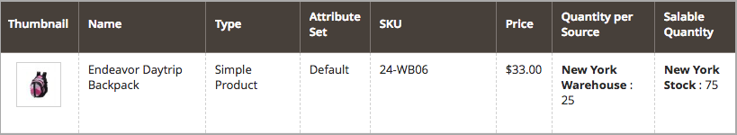

# [!DNL Inventory Management]件のバックオーダーを設定

取り寄せ注文では、数量がゼロに達した後、または事実上在庫がなくなった後も、商品を販売し続けることができます。 顧客からの注文がバックオーダーの場合、資金は承認され、すぐに回収されます。注文の処理状況は変更されず、在庫が確保されるまで出荷は保留されます。

ストアと販売に応じて、次のレベルでバックオーダーを有効または無効にすることができます。

- **[!UICONTROL Global]** - サイトレベルでのカタログ内のすべての製品

- **[!UICONTROL Product]** - サイト、ソース、および在庫の設定を上書きする特定の製品

## バックオーダー設定について

バックオーダーを最適にサポートするために、特定のしきい値と設定を設定することを強くお勧めします。

### 在庫切れしきい値

このしきい値にマイナスの値を使用すると、真に在庫切れと見なされる前にバックオーダーできる商品の最大数量を設定できます。 この金額が販売可能数量に加算されます。 製品レベルで設定された値は、グローバルレベルで設定された値よりも優先されます。

販売可能数量の計算式は`(Quantity - (Out-of-Stock Threshold))`です。

次に例を示します。

- 数量：25
- 以下の数量の通知：10
- Xのみ左しきい値：5
- 在庫切れしきい値：-50

この製品の販売可能数量は`75 (25 - (-50))`です。

{width="600" zoomable="yes"}

{width="600" zoomable="yes"}

顧客が25種類の商品を購入すると、新規注文が取り寄せ注文として入力されます。 製品の販売可能数量が5 （70個の商品が販売されました）に減少すると、_製品_ ページにストアフロントにメッセージ `Only 5 left`が表示されます。 販売可能数量が`0`に達すると、その商品はストアフロントに`Out of Stock`として表示されます。

>[!NOTE]
>
>顧客が&#x200B;_[!UICONTROL backorder qty]_を使用して注文すると、[!DNL Inventory Management]は販売可能な数量から数量を自動的に減算します。 注文が発送されず、キャンセルされた場合、その数量は集計されたバーチャル販売可能数量に戻ります。 キャンセルされた&#x200B;**_注文数量は、どのソース_**にも割り当てられませんが、販売可能な商品の合計数（_[!UICONTROL Salable Quantity]_&#x200B;列、商品グリッド）に返されます。

<!--
### Notify for Quantity Below JIRA MDVA-8099 MDVA-33783

The _Notify for Quantity Below_ configuration option is configurable at the global, source, and product levels. When it is enabled, the system sends an email notification when the product quantity reaches a level at or below the configured value. For this example, a notification is triggered when the product has a quantity of 10 or less. When backorders are enabled, _Notify for Quantity Below_ is determined by the Salable Quantity (`Salable Quantity = Quantity - (Out-of-Stock Threshold)`). 
-->

### ストックステータス

取り寄せ注文を有効にする場合、製品のステータスを`In Stock`に設定する必要があります。 この値は、_製品_ ページから設定できます。 マルチソースマーチャントの場合、`In Stock`としてマークされたソースが少なくとも1つ必要です。 _製品_ ページからステータスにアクセスして設定し、_ソース_ グリッドを割り当てました。

## バックオーダーをグローバルに設定

これらのステップにより、サイトレベルでのあらゆる製品の取り寄せ注文が可能になります。

1. _管理者_ サイドバーで、**[!UICONTROL Stores]** > _[!UICONTROL Settings]_>**[!UICONTROL Configuration]**に移動します。

1. **[!UICONTROL Store View]**&#x200B;を`Default Config`に設定します。

1. 左側のパネルで、**[!UICONTROL Catalog]**&#x200B;を展開し、**[!UICONTROL Inventory]**&#x200B;を選択します。

1.  **[!UICONTROL Product Stock Options]**&#x200B;を展開します。

1. **[!UICONTROL Backorders]**&#x200B;の場合、「**[!UICONTROL Use system value]**」チェックボックスの選択を解除し、オプションを選択します。

   | オプション | 説明 |
   | -- | -- |
   | `No Backorders` | 在庫切れの際に取り寄せ注文を受け付けないようにする。 |
   | `Allow Qty Below 0` | 数量がゼロを下回ったときに取り寄せ注文を受け付ける。 |
   | `Allow Qty Below 0 and Notify Customer` | 数量がゼロを下回ったときに取り寄せ注文を受け付け、注文を引き続き行うことができることを顧客に通知する。 |

1. **[!UICONTROL Out-of-Stock Threshold]**&#x200B;の場合、「**[!UICONTROL Use system value]**」チェックボックスの選択を解除し、別の金額を入力します。

   | 値 | 説明 |
   | -- | -- |
   | 正の金額 | バックオーダーが無効になっている場合は、正の値を入力します。 |
   | ゼロ | バックオーダーが有効になっている場合、`0`と入力すると、バックオーダーを無限に設定できます。 |
   | マイナス金額 | Backordersを有効にすると、負の値を入力することをお勧めします。 金額が販売可能数量に追加されます。 例えば、`-50`と入力して、この金額までの注文を許可します。 |

1. **[!UICONTROL Save Config]**&#x200B;をクリックします。

## 製品の取り寄せ注文の設定

製品レベルの設定は、グローバル設定を上書きします。 商品レベルでバックオーダーを設定して、グローバルストアレベルまたはソースレベルの設定を上書きすることができます。 たとえば、バックオーダーをグローバルでサポートしているとします。 製品設定を使用すると、他の製品やソースに影響を与えることなく、バックオーダーを無効にしたり、在庫切れのしきい値を変更したりできます。

1. _管理者_ サイドバーで、**[!UICONTROL Catalog]** > **[!UICONTROL Products]**&#x200B;に移動します。

1. **[!UICONTROL Edit]** モードで製品を開き、ページを下にスクロールして&#x200B;_[!UICONTROL Sources]_領域に移動します。

   [!DNL Inventory Management]なしで設定された製品の場合、タブは表示されません。 `Advanced Inventory` ボタンが&#x200B;_[!UICONTROL Quantity]_フィールドの下に表示されます。

1. **[!UICONTROL Advanced Inventory]**&#x200B;をクリックします。

   このアクションは、製品固有の設定のページを表示します。 `global`としてリストされている設定はすべて、ストアの現在のグローバル設定を表示します。

1. **[!UICONTROL Backorders]**&#x200B;の場合、「**[!UICONTROL Use Config Setting]**」チェックボックスの選択を解除し、オプションを選択します。

   | オプション | 説明 |
   | -- | -- |
   | `No Backorders` | 在庫切れの際に取り寄せ注文を受け付けないようにする。 |
   | `Allow Qty Below 0` | 数量がゼロを下回ったときに取り寄せ注文を受け付ける。 |
   | `Allow Qty Below 0 and Notify Customer` | 数量がゼロを下回ったときに取り寄せ注文を受け付け、注文を引き続き行うことができることを顧客に通知する。 |

1. **[!UICONTROL Out-of-Stock Threshold]**&#x200B;の場合、「**[!UICONTROL Use Config Setting]**」チェックボックスの選択を解除し、金額を入力します。

   | 値 | 説明 |
   | -- | -- |
   | 正の金額 | バックオーダーが無効になっている場合は、正の値を入力します。 |
   | ゼロ | バックオーダーが有効になっている場合、`0`と入力すると、バックオーダーを無限に設定できます。 |
   | マイナス金額 | Backordersを有効にすると、負の値を入力することをお勧めします。 金額が販売可能数量に追加されます。 例えば、`-50`と入力して、その金額までの注文を許可します。 |

   {width="600" zoomable="yes"}

1. 「**[!UICONTROL Done]**」をクリックし、「**[!UICONTROL Save]**」をクリックします。
