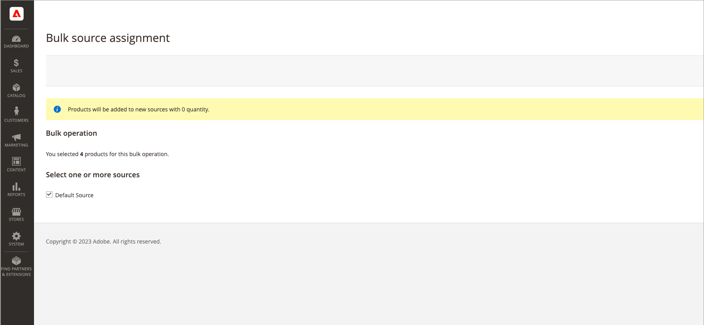

# ソースの一括割り当てと割り当て解除

_ソースの割り当て_ ツールを使用して、1つ以上のソースを製品に追加します。 このツールは、デフォルトの在庫またはカスタム在庫にカスタムソースを作成して割り当て、新しい場所と在庫を準備する際に役立ちます。

新しいカスタムソースを追加した後、管理者を通じて、または[&#x200B; インポート機能](inventory-import-export.md)を使用して、製品ごとに[在庫量](quantities-assign-per-product.md)または複数の製品に対して追加できます。

## ソースと数量の割り当て

1. _管理者_ サイドバーで、**[!UICONTROL Catalog]** > **[!UICONTROL Products]**&#x200B;に移動します。

1. ソースを変更する製品を選択します。

   参照または検索して商品を見つけ、それらのチェックボックスを選択します。

1. 上部の&#x200B;**[!UICONTROL Actions]** メニューをクリックし、**[!UICONTROL Assign Inventory Source]**&#x200B;を選択します。

1. 確認ダイアログで「**[!UICONTROL OK]**」をクリックします。

1. 製品に追加するすべてのソースについて、チェックボックスを選択します。

1. **[!UICONTROL Assign Sources]**&#x200B;をクリックします。

   {width="600" zoomable="yes"}

在庫量が0の商品にソースが追加されます。 ソースごとに[在庫量](quantities-assign-per-product.md)を追加できます。

## ソースと数量の割り当て解除

製品からソースの割り当てを解除する場合、その製品がその場所に在庫がないことを示します。 このプロセスは、現在製品に割り当てられているソースのすべての在庫データを完全に消去します。 既存の在庫を新しい場所に移動する場合は、「_在庫を転送_」オプションの使用を検討してください。

{{$include /help/_includes/unassign-source.md}}

ソースを削除する前に、これらの製品のすべての注文と出荷を完了することを強くお勧めします。

1. _管理者_ サイドバーで、**[!UICONTROL Catalog]** > **[!UICONTROL Products]**&#x200B;に移動します。

1. ソースを変更する製品を選択します。

   参照または検索して商品を見つけ、それらのチェックボックスを選択します。

1. 上部の&#x200B;**[!UICONTROL Actions]** メニューをクリックし、**[!UICONTROL Unassign Inventory Source]**&#x200B;を選択します。

1. 確認ダイアログで「**[!UICONTROL OK]**」をクリックします。

1. 製品から削除するソースを選択します。

   このページには、割り当てを解除すると、製品からすべての特定のソースおよび数量データが削除されるというアラートが表示されます。

1. **[!UICONTROL Unassign Sources]**&#x200B;をクリックします。

   {width="600" zoomable="yes"}

<!-- Last updated from includes: 2022-08-30 15:36:09 -->
