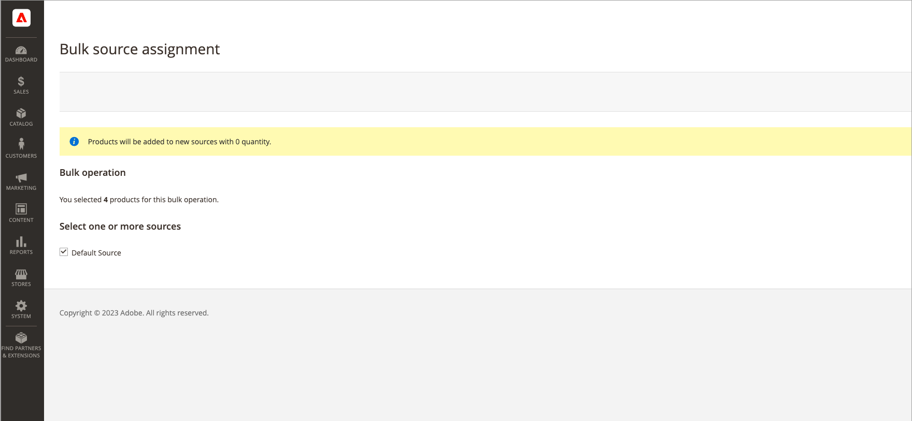

# ソースの一括割り当てと未割り当て

_ソースを割り当て_ ツールを使用して、1 つ以上のソースを製品に追加します。 このツールは、カスタムソースを作成してデフォルト在庫またはカスタム在庫に割り当て、新しい場所と在庫を準備する際に役立ちます。

新しいカスタムソースを追加した後、管理者を通じて、または [ 読み込み機能 ](quantities-assign-per-product.md) を使用して、[ 製品あたりの在庫数量 ](inventory-import-export.md) または複数の製品の数量を追加できます。

## ソースと数量の割り当て

1. _管理者_ サイドバーで、**[!UICONTROL Catalog]**/**[!UICONTROL Products]** に移動します。

1. ソースを変更する製品を選択します。

   参照または検索して製品を見つけ、それらのチェックボックスを選択します。

1. 上部の「**[!UICONTROL Actions]**」メニューをクリックし、「**[!UICONTROL Assign Inventory Source]**」を選択します。

1. 確認ダイアログで「**[!UICONTROL OK]**」をクリックします。

1. 製品に追加するすべてのソースについて、チェックボックスをオンにします。

1. 「**[!UICONTROL Assign Sources]**」をクリックします。

   {width="600" zoomable="yes"}

ソースは、在庫数量が 0 の製品に追加されます。 ソースごとに [ 在庫数量 ](quantities-assign-per-product.md) を追加できます。

## ソースと数量の割り当て解除

製品からソースの割り当てを解除すると、その製品がその場所でストックされなくなったことを示します。 このプロセスでは、製品に現在割り当てられているソースのすべての在庫データが完全に消去されます。 既存の在庫を新しい場所に移動する場合は、「在庫の転送 _オプションの使用を検討し_ す。

{{$include /help/_includes/unassign-source.md}}

ソースを削除する前に、これらの製品のすべての注文と出荷を完了することを強くお勧めします。

1. _管理者_ サイドバーで、**[!UICONTROL Catalog]**/**[!UICONTROL Products]** に移動します。

1. ソースを変更する製品を選択します。

   参照または検索して製品を見つけ、それらのチェックボックスを選択します。

1. 上部の「**[!UICONTROL Actions]**」メニューをクリックし、「**[!UICONTROL Unassign Inventory Source]**」を選択します。

1. 確認ダイアログで「**[!UICONTROL OK]**」をクリックします。

1. 製品から削除するソースを選択します。

   割り当て解除によってプロダクトから特定のソースおよび数量データがすべて削除されることを示すアラートがページに表示されます。

1. 「**[!UICONTROL Unassign Sources]**」をクリックします。

   {width="600" zoomable="yes"}
