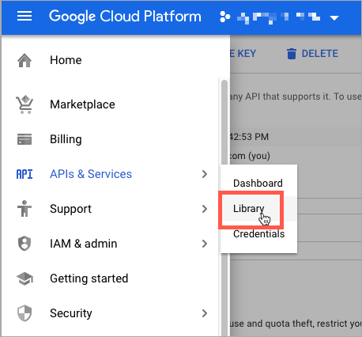

# 距離優先アルゴリズムを設定する

「距離優先度アルゴリズム」では、出荷先住所の所在地とソース事業所を比較して、出荷を行う最も近いソースを決定します。 距離は、データベースデータや運転、歩行、自転車の方向を使用して、ある場所から別の場所へ移動する物理的な距離や時間によって決定できます。 使用方法 [ソース選択アルゴリズム](selection-reservations.md) をクリックして、配送先住所に最も近い送信元をレコメンデーションします。

>[!NOTE]
>
>Distance Priority Algorithm を使用している場合は、住所全体と GPS 座標を入力します。 [ソース](sources-add.md) をお勧めします。

出荷履行に最も近いソースを見つけるための距離と時間を計算するには、次の 2 つのオプションがあります。

- **Google MAP**  — 用途 [Google Maps Platform][1] 配送先住所と発送元の場所の間の距離と時間を計算するサービス。 このオプションでは、ソースの緯度と経度（GPS 座標）が使用され、計算モードに応じて番地が使用される場合があります。 Google API キーは、 [ジオコーディング API][2] および [距離マトリックス API][3] 有効になっている場合と、Google経由で料金が発生する場合があります。

- **オフライン計算**  — 郵便番号と GPS 座標を使用して、配送先住所に最も近い発送元を決定し、ダウンロードおよび読み込まれたジオコードデータを使用して距離を計算します。 このオプションを設定するには、開発者の支援が必要になる場合があります。開発者は、コマンドラインの手順を使用してジオコードを最初にダウンロードし、読み込む必要があります。

>[!NOTE]
>
>複数の国を持つマルチストア Web サイトの場合は、 [デフォルトの税金宛先](../stores-purchase/tax-class.md#default-tax-destination){target="_blank"} それぞれの国の

## Google Maps を使用

使い始めるのにGoogleアカウントは必要ありません。 このプロセスには、必要に応じて、Googleアカウントとプロジェクトの作成が含まれます。 このオプションを設定してアルゴリズムを使用するには、Googleアカウントに追加された請求アカウントと支払い方法が必要です。
ただし、オフライン計算と比較して、Google MAP の距離ベースのアルゴリズムは、より高度で正確におこなうことをお勧めします。

### 手順 1:Google API キーの作成

キーは [Google Maps Platform][1] そして、 [ジオコーディング API][2] および [距離マトリックス API][3] 有効。 詳しくは、 [距離優先アルゴリズムの設定](distance-priority-algorithm.md).

1. 訪問 [Google Maps Platform][1] をクリックします。 **[!UICONTROL Get Started]**.

1. プラットフォームを有効にするには、「 」を選択します。 **[!UICONTROL Maps, Routes, and Places]** をクリックします。 **[!UICONTROL Continue]**.

   {width="350" zoomable="yes"}

1. Googleアカウントでログインするか、アカウントを作成します。

1. プロジェクトを設定する：

   - プロジェクトを選択するか、新しいプロジェクト名を入力します。

   - 利用条件に同意する場合は、 `Yes`.

   - クリック **[!UICONTROL Next]**.

1. 請求アカウントを入力するか、作成します。 後で請求アカウントをスキップして追加することができます。

   このサービスを使用するには、請求アカウントが必要です。

1. Google Cloud Platform オプションを開いて設定するには、 **[!UICONTROL Console]**.

   - プロジェクトを開きます。

   - メニューを展開し、をクリックします。 **[!UICONTROL APIs & Services]** > **[!UICONTROL Library]**.

     {width="350" zoomable="yes"}

   - を検索 [ジオコーディング API][2] および [距離マトリックス API][3]. 各サービスを選択して有効にします。

1. メニューを展開し、をクリックします。 **[!UICONTROL APIs & Services]** > **[!UICONTROL Credentials]**、 Google API キーをコピーします。

   {width="350" zoomable="yes"}

### 手順 2:Google MAP プロバイダーの設定

1. 次の日： _管理者_ サイドバー、移動 **[!UICONTROL Stores]** > _[!UICONTROL Settings]_>**[!UICONTROL Configuration]**.

1. 左側のパネルで、を展開します。 **[!UICONTROL Catalog]** を選択します。 **[!UICONTROL Inventory]**.

1. 展開  の _[!UICONTROL Distance Provider for Distance Based SSA]_セクションとセット&#x200B;**[!UICONTROL Provider]**から `Google MAP`.

   {width="350" zoomable="yes"}

1. 展開  の _[!UICONTROL Google Distance Provider]_を参照し、次の設定を行います。

   - の場合 **[!UICONTROL Google API Key]**&#x200B;に設定し、Googleアカウントからコピーしたキーを入力します。

   - の場合 **[!UICONTROL Computation mode]**、設定を選択します。

     >[!NOTE]
     >
     >出荷にこのアルゴリズムを使用する場合、出荷の選択した計算モード（駆動、自転車、歩行）にルートとデータが戻らない場合、SSA はデフォルトで「ソース優先度」を使用します。 の設定 [在庫ごとのソースの優先順位](stocks-prioritize-sources.md) をお勧めします。

     | オプション | 説明 |
     | ----- | ----- |
     | `Driving` | （デフォルト）道路網を使用して標準の運転指示を要求します。 |
     | `Walking` | 歩行者の道と歩道（利用可能な場合）を使用して歩く道を要求します。 |
     | `Bicycling` | 自転車の道と好みの道（利用可能な場合）を使用して自転車の道をリクエストします。 The [距離マトリックスサービス][4] は、米国と一部のカナダの都市でのみ利用できます。 |

   - の場合 **[!UICONTROL Value]**&#x200B;で、値のタイプを選択します。

     | オプション | 説明 |
     | ----- | ----- |
     | `Distance` | （デフォルト）指標（キロメートル単位、メートル単位）またはインチ単位（マイル単位、フィート単位）のポイント間の距離を返します。 |
     | `Time to Destination` | ソースの場所から配送先住所への移動に必要な時間を時間と分単位で返します。 |

   {width="350" zoomable="yes"}

1. 完了したら、「 **[!UICONTROL Save Config]**.

## オフライン計算を使用

オフライン計算では、国コードを使用して、配送先住所とソース住所の間の距離を決定します。 このオプションを設定するには、開発者からの支援が必要になる場合があります。 を使用します。 [!DNL Inventory Management] データのダウンロードとインポートを行う CLI コマンド [geonames.org][5].

>[!NOTE]
>
>読み込んだジオコード [geonames.org][5] カナダやアイルランドなど、一部の国に対して制限があります。 参照： [地域名郵便番号ファイル][6] を参照してください。

### 手順 1：ジオコードのダウンロードと読み込み

地理コードの国をダウンロードし、出荷先に読み込み、ソースの場所をに設定するための完全なコマンドライン設定。 この手順では、コマンドラインタスクに関するヘルプに開発者からの支援が必要になる場合があります。 参照： [ジオコードを読み込む](cli.md#import-geocodes).

これらのコマンドは、ジオコードをさらに追加する場合に実行します。

### 手順 2：計算を設定する

1. 次の日： _管理者_ サイドバー、移動 **[!UICONTROL Stores]** > _[!UICONTROL Settings]_>**[!UICONTROL Configuration]**.

1. 左側のパネルで、を展開します。 **[!UICONTROL Catalog]** を選択します。 **[!UICONTROL Inventory]**.

1. 展開  の _[!UICONTROL Distance Provider for Distance Based SSA]_」セクションに入力します。

1. 選択を解除すると、 **[!UICONTROL Use system value]** チェックボックスとセット **[!UICONTROL Provider]** から `Offline Calculation`.

   {width="350" zoomable="yes"}

1. 完了したら、「 **[!UICONTROL Save Config]**.

[1]: https://cloud.google.com/maps-platform/
[2]: https://developers.google.com/maps/documentation/geocoding/start
[3]: https://developers.google.com/maps/documentation/distance-matrix/start
[4]: https://developers.google.com/maps/documentation/javascript/distancematrix#travel_modes
[5]: https://www.geonames.org/
[6]: https://download.geonames.org/export/zip/readme.txt
