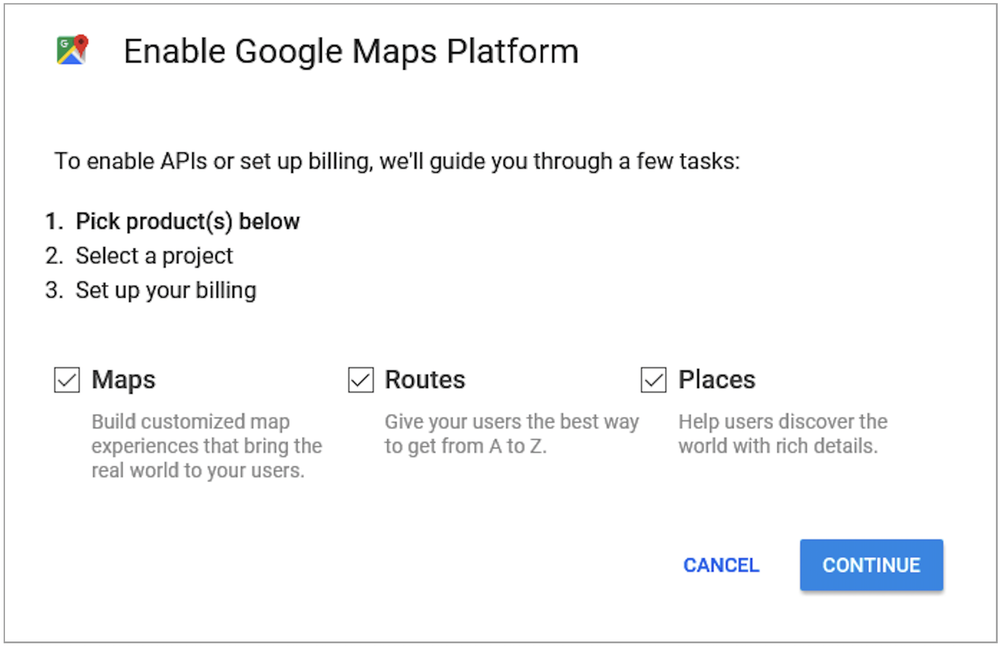
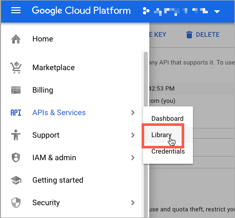
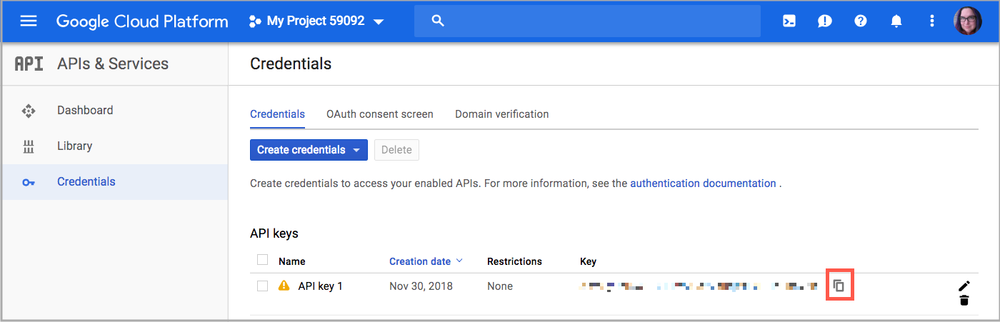
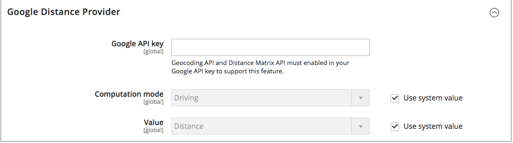

# 距離優先アルゴリズムの設定

距離優先アルゴリズムは、配送先住所の場所と発送元の場所を比較して、出荷を処理する最も近い発送元を決定します。 距離は、データベースデータを使用するか、運転、歩行、または自転車の方向を使用して、ある場所から別の場所へ移動するのに費やされた物理的な距離または時間によって決定され得る。 この[Source Selection Algorithm](selection-reservations.md)を使用して、配送先住所に最も近いソースをレコメンドします。

>[!NOTE]
>
>距離優先アルゴリズムを使用している場合は、[&#x200B; ソース &#x200B;](sources-add.md)の完全な住所とGPS座標を入力することをお勧めします。

距離と時間を計算して、出荷フルフィルメントに最も近いソースを見つけるには、次の2つのオプションがあります。

- **Google MAP** - [Google Maps Platform](https://cloud.google.com/maps-platform/) サービスを使用して、配送先住所と送信元の場所の間の距離と時間を計算します。 このオプションは、ソースの緯度と経度（GPS座標）を使用し、計算モードに応じてストリートアドレスを使用できます。 [&#x200B; ジオコーディング API](https://developers.google.com/maps/documentation/geocoding/start)および[Distance Matrix API](https://developers.google.com/maps/documentation/distance-matrix/start)が有効になっている場合は、Google API キーが必要です。Googleを通じて料金が発生する場合があります。

- **オフライン計算** - zip/post コードとGPS座標を使用して、ダウンロードおよびインポートされたジオコードデータを使用して距離を計算し、配送先住所に最も近いソースを特定します。 このオプションを設定するには、最初にコマンドライン手順を使用してジオコードをダウンロードおよびインポートするために、開発者支援が必要になる場合があります。

>[!NOTE]
>
>複数の国を持つマルチストア web サイトの場合は、各国用に[&#x200B; デフォルトの税宛先](../stores-purchase/tax-class.md#default-tax-destination){target="_blank"}を設定します。

## Google マップの使用

Google アカウントは必要ありません。必要に応じて、このプロセスにはGoogle アカウントとプロジェクトの作成が含まれます。このオプションを使用するには、Google アカウントに請求先アカウントと支払い方法を追加して、設定を完了し、アルゴリズムを使用する必要があります。
ただし、Google MAP距離ベースのアルゴリズムは、オフライン計算と比較してより高度で正確なものをお勧めします。

### 手順1:Google API キーの作成

キーは[Google Maps Platform](https://cloud.google.com/maps-platform/)からのもので、[&#x200B; ジオコーディング API](https://developers.google.com/maps/documentation/geocoding/start)と[Distance Matrix API](https://developers.google.com/maps/documentation/distance-matrix/start)を有効にする必要があります。 詳しくは、[距離優先アルゴリズムの設定](distance-priority-algorithm.md)を参照してください。

1. [Google Maps Platform](https://cloud.google.com/maps-platform/)にアクセスし、**[!UICONTROL Get Started]**&#x200B;をクリックします。

1. プラットフォームを有効にするには、**[!UICONTROL Maps, Routes, and Places]**&#x200B;を選択し、**[!UICONTROL Continue]**&#x200B;をクリックします。

   キー{width="350" zoomable="yes"}のGoogle Maps Platform

1. Google アカウントでログインするか、アカウントを作成します。

1. プロジェクトの設定：

   - プロジェクトを選択するか、新しいプロジェクト名を入力します。

   - 条件に同意するには、`Yes`を選択します。

   - **[!UICONTROL Next]**&#x200B;をクリックします。

1. 請求先アカウントを入力するか、請求先アカウントを作成します。 後で請求アカウントをスキップして追加できます。

   このサービスを利用するには請求先アカウントが必要です。

1. Google Cloud Platform オプションを開いて設定するには、**[!UICONTROL Console]**&#x200B;をクリックします。

   - プロジェクトを開きます。

   - メニューを展開し、**[!UICONTROL APIs & Services]** > **[!UICONTROL Library]**&#x200B;をクリックします。

     {width="350" zoomable="yes"}

   - [&#x200B; ジオコーディング API](https://developers.google.com/maps/documentation/geocoding/start)と[距離行列API](https://developers.google.com/maps/documentation/distance-matrix/start)を検索します。 各サービスを選択して有効にします。

1. メニューを展開し、**[!UICONTROL APIs & Services]** > **[!UICONTROL Credentials]**&#x200B;をクリックして、Google API キーをコピーします。

   {width="350" zoomable="yes"}

### 手順2:Google MAP プロバイダーの設定

1. _管理者_ サイドバーで、**[!UICONTROL Stores]** > _[!UICONTROL Settings]_>**[!UICONTROL Configuration]**&#x200B;に移動します。

1. 左側のパネルで、**[!UICONTROL Catalog]**&#x200B;を展開し、**[!UICONTROL Inventory]**&#x200B;を選択します。

1. _[!UICONTROL Distance Provider for Distance Based SSA]_&#x200B;セクションのを展開し、**[!UICONTROL Provider]**&#x200B;を`Google MAP`に設定します。

   {width="350" zoomable="yes"}

1. _[!UICONTROL Google Distance Provider]_&#x200B;セクションのを展開し、設定を構成します。

   - **[!UICONTROL Google API Key]**&#x200B;に、Google アカウントからコピーしたキーを入力します。

   - **[!UICONTROL Computation mode]**&#x200B;で、設定を選択します。

     >[!NOTE]
     >
     >このアルゴリズムを出荷用に使用する場合、出荷用に選択した計算モード（運転、自転車、またはウォーキング）にルートとデータが戻らない場合、SSAはデフォルトでSource優先度を使用します。 在庫ごとのソースの[優先度](stocks-prioritize-sources.md)を設定することをお勧めします。

     | オプション | 説明 |
     | ----- | ----- |
     | `Driving` | （デフォルト）道路ネットワークを使用して標準的な運転方向を要求します。 |
     | `Walking` | 歩道や歩道を使用して歩く道案内をリクエストします（利用可能な場合）。 |
     | `Bicycling` | 自転車道と好みの通りを使用して自転車道をリクエストします（利用可能な場合）。 [距離行列サービス &#x200B;](https://developers.google.com/maps/documentation/javascript/distancematrix#travel_modes)は、米国および一部のカナダの都市でのみ利用できます。 |

   - **[!UICONTROL Value]**&#x200B;に対して、値タイプを選択します：

     | オプション | 説明 |
     | ----- | ----- |
     | `Distance` | （デフォルト）指標（キロメートルとメートル）またはインペリアル（マイルとフィート）のポイント間の距離を返します。 |
     | `Time to Destination` | ソースの場所から配送先住所への移動に必要な時間を時間および分で返します。 |

   {width="350" zoomable="yes"}

1. 完了したら、**[!UICONTROL Save Config]**&#x200B;をクリックします。

## オフライン計算の使用

オフライン計算では、国コードを使用して、配送先と発信元の住所の間の距離を決定します。 このオプションを設定するには、開発者支援が必要な場合があります。 [!DNL Inventory Management] CLI コマンドを使用して、[geonames.org](https://www.geonames.org/)からデータをダウンロードおよびインポートします。

>[!NOTE]
>
>[geonames.org](https://www.geonames.org/)から読み込んだジオコードには、カナダやアイルランドなどの一部の国では制限があります。 詳しくは、[GeoNames郵便コードファイル &#x200B;](https://download.geonames.org/export/zip/readme.txt)を参照してください。

### 手順1：ジオコードのダウンロードと読み込み

コマンドライン設定を完了して、ジオコード国をダウンロードおよび読み込み、発送先および発信元の場所を指定します。 この手順では、コマンドラインタスクに関するヘルプを提供するために、開発者のサポートが必要になる場合があります。 [&#x200B; ジオコードの読み込み](cli.md#import-geocodes)を参照してください。

ジオコードを追加する場合は、いつでも次のコマンドを実行します。

### 手順2：計算の設定

1. _管理者_ サイドバーで、**[!UICONTROL Stores]** > _[!UICONTROL Settings]_>**[!UICONTROL Configuration]**&#x200B;に移動します。

1. 左側のパネルで、**[!UICONTROL Catalog]**&#x200B;を展開し、**[!UICONTROL Inventory]**&#x200B;を選択します。

1. _[!UICONTROL Distance Provider for Distance Based SSA]_&#x200B;セクションのを展開します。

1. **[!UICONTROL Use system value]** チェックボックスの選択を解除し、**[!UICONTROL Provider]**&#x200B;を`Offline Calculation`に設定します。

   {width="350" zoomable="yes"}

1. 完了したら、**[!UICONTROL Save Config]**&#x200B;をクリックします。
