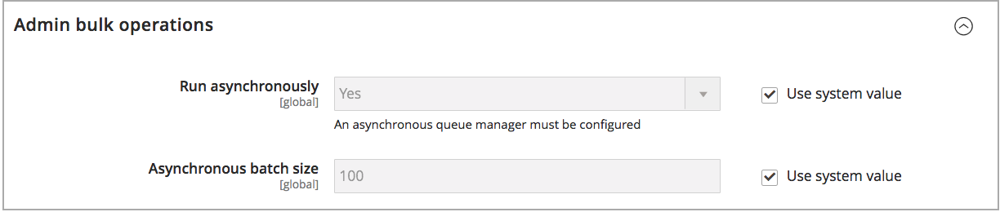

# [!DNL Inventory Management] グローバル オプションの設定

web サイトの製品と在庫のデフォルト設定オプションを設定します。 これらの設定の一部は、[製品オプションの設定](product-options.md)を通じて、製品ごとに上書きできます。 距離の優先度の設定を行うには、[距離の優先度アルゴリズムの設定](distance-priority-algorithm.md)を参照してください。

## グローバルに商品と在庫オプションを設定する

1. _管理者_ サイドバーで、**[!UICONTROL Stores]** > _[!UICONTROL Settings]_>**[!UICONTROL Configuration]**に移動します。

1. 左側のパネルで、**[!UICONTROL Catalog]**&#x200B;を展開し、**[!UICONTROL Inventory]**&#x200B;を選択します。

1. **[!UICONTROL Stock Options]** セクションのを展開し、オプションを設定します。

   {width="600" zoomable="yes"}

   - 注文時に手元にある数量を調整するには、**[!UICONTROL Decrease Stock When Order is Placed]**&#x200B;を`Yes`に設定します。

   - 注文がキャンセルされた場合に在庫に商品を返品するには、**[!UICONTROL Set Items' Status to be in Stock When Order in Cancelled]** ～ `Yes`。

   - 在庫のない商品をカタログに引き続き表示するには、**[!UICONTROL Display Out of Stock Products]**&#x200B;を`Yes`に設定します。

   - [価格アラート ](alert-setup.md)が有効になっている場合、商品の再入荷時に通知を受け取るように登録できます。

   - 製品ページに最後の在庫残りの金額を表示する開始を設定するには、**[!UICONTROL Only X left Threshold]**&#x200B;の金額を入力します。

     在庫量がしきい値に達すると、メッセージが表示され始めます。 例えば、`3`に設定すると、在庫の数量が3に達したときにメッセージ `Only 3 left`が表示されます。 メッセージは、在庫量がゼロに達するまで、在庫量を反映するように調整されます。

   - 商品ページに「在庫中」または「在庫切れ」メッセージを表示するには、**[!UICONTROL Display Products Availability In Stock on Storefront]**&#x200B;を`Yes`に設定します。

   - 商品をカートに読み込む際に在庫を確認するには、**[!UICONTROL Enable Inventory Check On Cart Load]**&#x200B;を`Yes`に設定します。 このオプションを無効にすると、在庫確認はスキップされます。 このオプションを無効にすると、特にショッピングカートに商品が多い場合は、チェックアウトが高速化されます。 ただし、事前検証をスキップすると、チェックアウトプロセスの後半で「在庫切れ」エラーが表示される可能性があります。

   - 在庫とカタログの一貫性を保つには、**[!UICONTROL Synchronize with Catalog]**&#x200B;を`Yes`に設定します。 このオプションを有効にすると、カタログの変更（製品の削除、製品SKUの変更、製品タイプの変更など）に応じて在庫データが調整されます。

1. **[!UICONTROL Product Stock Options]** セクションのを展開し、オプションを設定します。

   - カタログの[在庫管理](enable.md)を有効にするには、**[!UICONTROL Manage Stock]**&#x200B;を`Yes`に設定します。

     {width="600" zoomable="yes"}

   - **[!UICONTROL Backorders]**&#x200B;を次のいずれかに設定します：

     | オプション | 説明 |
     | ----- | ----- |
     | `No Backorders` | 商品が在庫切れの場合、[取り寄せ](backorders.md)は受け付けません。 |
     | `Allow Qty Below 0` | 数量がゼロを下回った場合、取り寄せ注文は受け付けられます。 |
     | `Allow Qty Below 0 and Notify Customer` | 数量がゼロを下回ると取り寄せ注文が受理され、注文を発注できることを顧客に通知します。 |

   - **[!UICONTROL Maximum Qty Allowed in Shopping Cart]**&#x200B;を入力します。

   - **[!UICONTROL Out-of-Stock Threshold]**&#x200B;の金額を入力：

     | 値 | 説明 |
     | ----- |-----|
     | 正の金額 | バックオーダーが無効になっている場合は、正の金額を入力します。 |
     | ゼロ | バックオーダーが有効になっている場合、`0`と入力すると、バックオーダーを無限に設定できます。 |
     | マイナス金額 | バックオーダーが有効になっている場合は、マイナスの金額を入力することをお勧めします。 金額が販売可能数量に追加されます。 例えば、`-50`と入力して、この金額までの注文を許可します。 |

   - 選択したグループと金額の&#x200B;**[!UICONTROL Minimum Qty Allowed in Shopping Cart]**&#x200B;を入力します。

   - **[!UICONTROL Notify for Quantity Below]**&#x200B;の場合、商品が在庫切れであることをトリガーする在庫レベルを入力します。

   - 製品の数量の増分をアクティブにするには、**[!UICONTROL Enable Qty Increments]**&#x200B;を`Yes`に設定します。 次に、**[!UICONTROL Qty Increments]**&#x200B;に、要件を満たすために購入する必要がある品目の数を入力します。

     たとえば、6単位で販売される商品は、`6`、`12`、`18`などの数量で購入できます。

   - [!DNL Inventory Management]の場合、**[!UICONTROL Automatically Return Credit Memo Item to Stock]**&#x200B;は`No`に設定されています。 クレジットメモを送信する際に、を入力し、ソースに在庫を返品することを選択します。

1. **[!UICONTROL Admin bulk operations]** セクションのを展開し、オプションを設定します。

   {width="600" zoomable="yes"}

   - 一括製品アクションの一括操作を非同期で実行するように&#x200B;**[!UICONTROL Run asynchronously]**&#x200B;を設定します

     これらの操作には、一括[ ソースの割り当てと割り当て解除](bulk-assignment.md)、および[ インベントリをソースに転送](inventory-transfer.md)することが含まれます。 非同期バッチサイズまでのバルクアクションを収集し、それらのアクションを実行します。 このオプションはデフォルトでは無効です。 有効にする前に、一括アクションを使用してパフォーマンスを確認することをお勧めします。

     >[!NOTE]
     >
     >_非同期キューマネージャー_&#x200B;を設定およびサポートするには、コマンドラインを使用してコマンドを発行する必要があります。 このステップには開発者のサポートが必要な場合があります。 _設定ガイド_&#x200B;の「[開始メッセージキューコンシューマー](https://experienceleague.adobe.com/docs/commerce-operations/configuration-guide/cli/start-message-queues.html)」を参照してください。

   - 有効な場合は、**[!UICONTROL Asynchronous batch size]**&#x200B;を設定します。 デフォルトのバッチサイズは100です。 一括処理がこの量に達すると、システムはそれをトリガーします。

1. 完了したら、**[!UICONTROL Save Config]**&#x200B;をクリックします。
