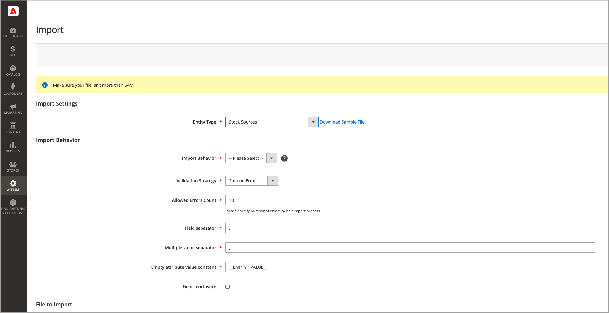

# 在庫の読み込みと書き出し

多数の製品が含まれるカタログの場合は、を拡張したネイティブの読み込みおよび書き出し機能を使用します [!DNL Inventory Management] ソースと数量を SKU 別に更新するオプション。 これらのオプションを使用すると、新規ソースを追加し、すべてまたは特定のソースの在庫数量を更新できます。 例えば、フランス、英国または米国のソースの製品情報に影響を与えずに、ドイツのソースの製品を書き出すことができます。

- [!DNL Commerce] アップグレード時に、製品にデフォルトソースを自動的に割り当てます [!DNL Commerce] または新製品の読み込み。 カスタムソースが割り当てられている製品を読み込む場合、デフォルトソースは数量 0 で追加されます。 ソースと数量を更新するには、次のインポート手順を使用します。

- 単一ソースマーチャントは、読み込みを使用して製品の数量のみを更新します。 既存の製品と追加された製品はすべて、デフォルトソースに割り当てられます。

- マルチソースマーチャントは、インポートを使用して、SKU ごとに 1 行に複数のソースと数量を追加します。

更新を読み込むには、まず特定またはすべてのソースの CSV ファイルを書き出します。 CSV ファイルを編集し、ソースと数量ごとに SKU ごとに行を追加します。 ソースを追加して在庫数を追加する場合は、ソースのコードが必要です。 インポート/エクスポート機能を使用して在庫を追加または更新することはできません。

## CSV ファイルコンテンツ

書き出しインポートファイルには、ソースに応じて次の情報が含まれます。

- `source_code` - ソースのコード [!DNL Commerce]. ソースと SKU ごとに行があります。
- `sku`  – での製品の SKU [!DNL Commerce]. 正しく更新するには、SKU がストアの製品と一致する必要があります [!DNL Inventory Management] データ。
- `status`  – 在庫切れの場合は 0。 在庫がある場合は 1。 このソースから在庫を購入するには、この値を 1 にする必要があります。
- `quantity`  – この SKU とソースで使用可能な在庫の合計金額。

CSV ファイルを使用して、複数の製品と割り当てられたソースをすばやく更新し、アプリケーションインターフェイスから 1 つずつインベントリ記録に不正確な情報を更新して修正します。 基本ファイルの場合は、最初にエクスポートし、必要に応じて更新します。

{width="600" zoomable="yes"}

## すべてのソースの製品データのエクスポート

1. 日 _Admin_ サイドバー、に移動 **[!UICONTROL System]** > _[!UICONTROL Data Transfer]_>**[!UICONTROL Export]**.

1. の場合 **[!UICONTROL Entity Type]**、を選択 `Stock Sources`.

   書き出しでは、SKU を持つ製品のデータのみが抽出されます。

1. クリック **[!UICONTROL Continue]**.

   ファイルが生成され、開いて編集するためにダウンロードされます。

在庫金額と製品データを更新した後、ファイルをにインポートします [!DNL Commerce].

{width="350" zoomable="yes"}

## 特定のソースの製品データのエクスポート

1. 日 _Admin_ サイドバー、に移動 **[!UICONTROL System]** > _[!UICONTROL Data Transfer]_>**[!UICONTROL Export]**.

1. の場合 **[!UICONTROL Entity Type]**、を選択 `Stock Sources`.

   書き出しでは、SKU を持つ製品のデータのみが抽出されます。

1. の使用 **[!UICONTROL Entity Attributes]** 特定のソース用にエクスポートされた製品をフィルタリングします。

   の場合 `source_code`ソースのコードをフィルターフィールドに入力します。

1. クリック **[!UICONTROL Continue]**.

   ファイルが生成され、開いて編集するためにダウンロードされます。

在庫金額と製品データを更新した後、ファイルをにインポートします [!DNL Commerce].

## 製品データの読み込み

1. 日 _Admin_ サイドバー、に移動 **[!UICONTROL System]** > _[!UICONTROL Data Transfer]_>**[!UICONTROL Import]**.

1. の場合 **[!UICONTROL Entity Type]**、を選択 `Stock Sources`.

   書き出しでは、SKU を持つ製品のデータのみが抽出されます。

1. の設定を選択 **[!UICONTROL Import Behavior]**.

1. インポートする.csv ファイルを選択します。

1. クリック **[!UICONTROL Check Data]** 読み込みを完了します。

{width="600" zoomable="yes"}
