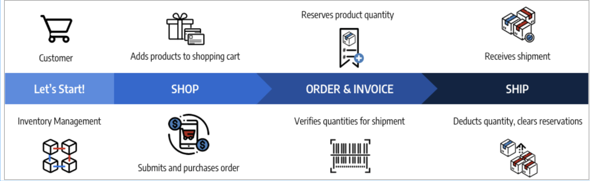

# 注文状況と予約

[!DNL Inventory Management]は、注文ごとの部分的および完全な請求、支払い、配送、キャンセルをサポートしています。 処理、請求書、出荷、および返金の可能性がある注文を管理すると、[!DNL Commerce]は在庫（または販売チャネル）の販売可能数量とソースごとの手持在庫数量を更新するために、予約を自動的に入力または変更します。 予約に積極的にアクセスしたり入力したりする必要はありません。 注文のフルフィルメント、キャンセル、返金を行うアクションを完了すると、それが実行されます。

これらの引当金は常に販売可能な数量を調整し、数量を増減するために正または負の数量を調整します。 これにより、手元にある在庫と販売可能な数量を更新し、最新の製品在庫状況を把握できます。

注文と出荷の詳細については、[注文と出荷の管理](shipments.md)を参照してください。

## 注文管理オプション

在庫状況や顧客のリクエストに応じて、部分的な支払いやキャンセル、複数のソースからの部分的な出荷、取り寄せ注文の場合、または返品した商品を返金するためのクレジットメモを使用して、注文を更新できます。

### 発送数

注文を請求した後、注文全体を処理するまで、部分的または完全な出荷を送信します。 各出荷は、ソースごとの製品数量から金額を差し引いて、予約を変換します。 予約報酬は、在庫の販売可能な数量を更新するために入力します。 部分的な出荷を送信する場合、各出荷は、その金額を製品数量と予約から差し引きます。 未出荷の製品の予約は発送されるまで残ります。これにより、販売可能な金額が最新になり、製品の在庫を管理し、複数のソースの出荷と取り寄せ注文をサポートできます。

### キャンセル済み注文

顧客が出荷前（部分的または全面的）に注文をキャンセルした場合、在庫量を販売可能な数量に戻すために新しい予約が入力されます。 予約は実質的に互いにキャンセルされ、任意のソースから数量を差し引くことはありません。 他の顧客は、関連する在庫や販売チャネルを通じて、これらの製品量を積極的に購入できます。

### 返金済み注文

お客様から返金をリクエストされた場合は、製品の一部または全額をクレジットメモとして発行します。 返品された商品を受け取ったら、クレジットメモを入力して資金を提供し、商品金額を更新します。 「在庫に戻る」オプションを選択すると、[!DNL Commerce]は、注文と予約報酬を出荷した製品とソースに数量を追加して、関連する在庫の販売可能数量を更新します。

## 注文タイプ

シンプルな注文はショッピングカートから始まり、支払いを続け、満足のいく配送で終わります。 これらの注文では、[!DNL Inventory Management]は、買い物かごやチェックアウトの空き状況（または販売可能な数量）に対して予約を簡単に処理し、出荷時に手元の在庫から差し引きます。

{width="600" zoomable="yes"}

より複雑な注文では、部分的なキャンセル、部分的な配送、返金が発生する場合があります。 このような場合、キャンセルや返金のための数量を追加したり、注文や発送の際の数量を減らしたりするために、予約が利用可能な在庫に影響を与えます。

{width="600" zoomable="yes"}

在庫状況に基づいて、在庫状況の予約と在庫の変更が行われます。

## ステータスと予約

次の表は、在庫を管理するために[!DNL Commerce]が入力した予約変更を含む注文とクレジットメモのステータスを詳細に示しています。

| 注文ステータス | 説明 | 販売可能数量の引当 |
|--|--|--|
| [!UICONTROL Open] | 新規および最近送信された、処理なし | 予約は、在庫の注文時に保存されます。 |
| [!UICONTROL Canceled] | 支払い前に部分的または完全にキャンセル | 予約報酬を入力して、一部数量または全数量を在庫販売可能数量に戻します。 |
| [!UICONTROL On Hold] | 決済および発送が処理または請求されていません | 予約が有効になります。 |
| [!UICONTROL Suspected Fraud] | 不正行為のため処理されません | 承認またはレビュー中の場合、予約は引き続き有効です。 拒否した場合、販売者が承認または解約を決定するまで予約は有効です。  キャンセルされた場合、予約報酬が入力され、全数量が在庫販売可能な数量に戻されます。 |
| [!UICONTROL Pending] | 支払い待ち | 予約は引き続きおこなわれます。 |
| [!UICONTROL Processing] | 決済処理、未受信 | 予約は引き続きおこなわれます。 |
| [!UICONTROL Pending Payment] | 決済が受け取られていません | 予約は引き続きおこなわれます。 |
| [!UICONTROL Payment Review] | 決済と完了の審査を受けています | 予約は引き続きおこなわれます。 |
| [!UICONTROL Complete] | 有料版と全額発送 | 一部または全額請求された場合、予約金額は、選択したソースの製品数量から差し引かれます。 予約報酬が入力され、販売可能な合計数量が更新されます。 |
| [!UICONTROL Closed] | 返金またはアーカイブ | アーカイブされている場合、数量は変更されません。 一部払い戻しまたは全額払い戻しの場合、予約報酬が入力され、ソースごとの製品数量および在庫ごとの販売可能数量を追加するように変換されます。 |

| クレジットメモのステータス | 説明 | 販売可能数量の引当 |
|--|--|--|
| [!UICONTROL Open] | 払い戻し期限は未完了です | 予約の変更はありません。 |
| [!UICONTROL Refunded] | 完了済み、返品済み | 一部または全額払い戻された場合、予約報酬が入力され、ソースごとの製品数量と在庫ごとの販売可能数量を追加するように変換されます。 |

## 複雑な順序の例

ブレイク・サンダースは、家族の休暇と楽しみのために自転車と服を注文します。 彼らは、米国、カナダ、ヨーロッパにまたがる在庫とソースを備えたバイキングアドベンチャーストアでいくつかの素晴らしい販売を見ています。

彼らは小さな子供のために2つの素晴らしい公園の自転車、ティーンエイジャーのためのBMX自転車、自分自身のための素敵なマウンテンバイク、そして彼らの配偶者のための最新のドイツのクロスカントリーバイクを買います。 かわいいシャツが売られていたので、家族全員で似合うシャツを買いました。 以下の休暇購入のリスト、一致するSKU、および在庫販売可能な数量に対して入力された予約を参照してください。

{width="600" zoomable="yes"}

彼らは彼らが見つけたものを彼らの家族に示しますが、いくつかの変更を加えます。 支払いが完了する前に、彼らは33-BikeFun SKUのうち2つをキャンセルします（子供たちは彼らを好きではありませんでした）。 支払いが保留中のため部分的にキャンセルされるため、クレジットメモは必要ありません。 更新するには、[!DNL Commerce]さんがカナダの販売可能な数量の在庫に追加されます。 注文は支払われ、すべての製品が出荷され、休暇の時間に到着します。 [!DNL Commerce]は、出荷された製品の出荷ウェアハウスの販売可能数量とソース数量を更新します。

しかし、このシャツは夫の方には合わなかった。 Blakeは払い戻しを要求し、シャツを返送します。 クレジットメモの作成により、54 BikeLifeのシャツ 1枚がカナダの在庫と配送の倉庫に追加されます。

- **商品の発送** – 商品を購入して発送した場合、[!DNL Commerce]は在庫を更新します。 予約補償は、発送元から手元の在庫量の控除に変換されます。 在庫の使用可能な販売可能数量が更新されます。

- **キャンセルされた商品** – 在庫をキャンセルすると、[!DNL Commerce]はその商品の予約を削除します。 予約報酬は在庫レベルに入力され、2枚のシャツの部分的なキャンセルのために販売可能な数量を追加します。 これは、ソースレベルでの在庫量には影響しません。

- **クレジットメモ/返金済み商品** – 在庫を返品する場合は、数量に追加する必要があります。 クレジットメモを発行する場合は、在庫に戻ることを選択できます。 [!DNL Commerce]は、商品の発送元に在庫数量を追加します。 予約報酬は、残りの予約をクリアするために入力します。 販売可能数量は、更新された数量に対して再計算されます。

{width="600" zoomable="yes"}
